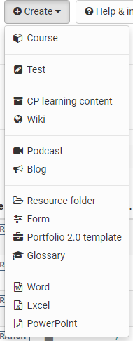

# Authoring

The authoring section provides authors with all necessary tools and little
helpers for creating, editing and importing courses and other learning
resources.

When you open the author section, your personal learning resources Favorites
are displayed by default. Furthermore, it is possible to quickly switch to the
display of one's own courses ("My courses"), one's own learning resources ("My
entries") as well as to the search and to the deleted learning resources.

Standardmässig sind folgende Filter aktiviert:

In the " **Favorites** " filter tab, you will find all learning resources that
you have marked as favorites yourself.

In the filter tab " **My courses** " you will find all courses that you have
created or for which you are entered as owner (co-author).

In the filter tab " **My entries** " you will find all learning resources that
you have created or for which you are registered as owner (co-author).

In the filter tab " **Search form** " you can search for specific learning
resources. Here you can find all learning resources to which you have access.
You can search for a specific title or use the filters to narrow down your
results.

In the filter tab " **Deleted** " you have access to your deleted learning
resources for which you are entered as owner (co-author). From here they can
be restored or permanently deleted by the administrator.

For more details on how to use the filter options, click
[here](../basic_concepts/Table_Concept.md).

If you can't find a course or learning resource (anymore), then check the
settings in the life cycle. Maybe the wrong selection was made here.

### Creating your own filters for the display:

Further filtering of the display is also possible. Completely new filter
queries, which are needed frequently, can also be generated and saved. For
further filtering, click on the small down arrow and the filter options such
as the learning resources "type" or, technical course type, the life cycle,
etc. are displayed and certain options can be selected.

### Configure columns

Via the cogwheel you can select in a more differentiated way, which
information will be displayed in the respective table. For example, in the
column "Ref" you can see whether or how often a learning resource has been
referenced in OLAT courses and you can jump directly to the corresponding
course.

  

##   OpenOlat learning resources create and import

In the author section, the following learning resources can be
created. 

Furthermore, learning resources and additional files can be imported,
as well as URLs.

Each learning resource can be further configured in the "Settings" area of the
administration. For example, metadata can be stored here and it can be defined
who has access to the learning resource.

In the following chapters you will find explanations about the individual
[OpenOlat learning resources](../learningresources/index.md), which
actions you can perform in the author section, and information about the [infopage](../learningresources/Set_up_info_page.md) of a learning resource.

