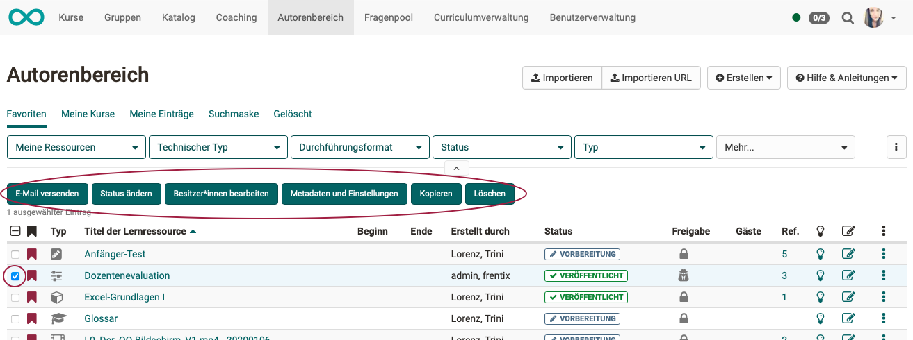
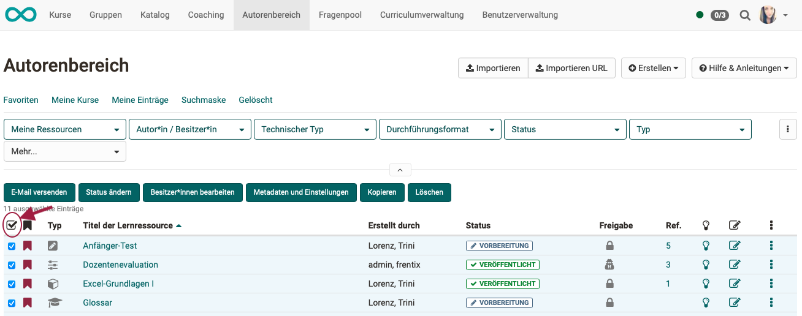

#  Autorenbereich - Sammelaktionen

Sobald in der 1. Spalte der Tabelle eine Lernressource ausgewählt wurde, erscheinen über der Tabelle zusätzliche Buttons (1-6). Mit ihnen lassen sich Aktionen für die ausgewählten Ressourcen durchführen, also für mehrere Lernressourcen gemeinsam (Bulk Actions). 
Diese Buttons sind nicht sichtbar, wenn nicht mindestens 1 Lernressource selektiert ist.

Bei Klick auf die 3 Punkte am Ende einer Tabellenzeile (10) werden Optionen nur für diese einzelne Lernressource dieser Zeile angezeigt. 

{ class="shadow lightbox" }

!!! tip "Tipp"

    Wenn Sie die **Checkbox in der Titelzeile der Tabelle** wählen, werden alle Lernressourcen auf einmal selektiert. { class="shadow lightbox" }

---

### 1. E-Mail versenden

Wählen Sie die gewünschten Lernressourcen aus und klicken Sie auf "E-Mail versenden". Es öffnet sich ein Dialog. Sie können nun definieren, an wen die E-Mail verschickt werden soll. Mögliche Empfänger sind **alle Kursbesitzer, alle Kursbetreuer und alle Teilnehmenden**.

Fügen Sie einen Betreff und die gewünschte Nachricht hinzu. Bei Bedarf kann noch ein Anhang und eine Kopie für den Absender ergänzt werden.

!!! info "Hinweis"

    Sie können die E-Mail an alle Kurse schicken, die Ihnen angezeigt werden. Dazu gehören auch Kurse, welche für **alle Autoren** sichtbar sind. Sie müssen also nicht zwingend Mitglied des Kurses sein, um diese Funktion zu nutzen.

### 2. Status ändern

Wählen Sie den Veröffentlichungsstatus aus, der für alle ausgewählten Lernressourcen gelten soll und klicken Sie auf "Ändern".    

### 3. Besitzer bearbeiten

Hier werden Ihnen alle **Besitzer der ausgewählten Lernressourcen** angezeigt. Sie können diese gleichzeitig aus mehreren Kursen entfernen oder auch neue Besitzer den ausgewählten Lernressourcen hinzufügen. Eine E-Mailbenachrichtigungsoption schliesst die Bearbeitung ab.

### 4. Metadaten und Einstellungen

Hier können mittels Sammelaktion (Bulk Action) verschiedene **Metadaten** für die ausgewählten Lernressourcen **vereinheitlicht** werden. Z.B. wenn mehrere Kurse zu einer Weiterbildungsreihe gehören. Bei Klick öffnet sich ein Wizard.

Es kann für alle markierten Lernressourcen 

* der angezeigte Name unter "Durchführung mit" eingetragen werden. 
* das Durchführungsformat z.B. "Prüfungskurs" ausgewählt werden.
* Sprache und Zeitaufwand definiert werden. 
* sowie eine passende Lizenz für die Lernressourcen gewählt werden.
* ein passender Fachbereich und die gewünschte Organisation für die Lernressourcen gewählt werden.
* zusätzliche Rechte für alle anderen Autoren vergeben werden.
* sowie ein einheitlicher Durchführungszeitraum und Ort angegeben werden.

Bei Kursen besteht darüber hinaus auch die Möglichkeit, eine einheitliche Auswahl für die Tools der Toolbar zu treffen. 

### 5. Kopieren

Mit dem **Button "Kopieren" über der Tabelle** können Sie **mehrere Lernressourcen** kopieren.  
Durch Anklicken von "Kopieren" im **Menü, das unter den 3 Punkten am Ende einer Zeile erscheint**, kopieren Sie eine **einzelne Lernressource**. (Die Lernressource dieser Tabellenzeile.)

Wählen Sie eine oder mehrere Lernressourcen aus um sie zu kopieren. Beispielsweise zur Wiederverwendung für ein neues Semester oder um eine Sicherheitskopie zu erstellen. 

Kopierte Lernressourcen befinden sich anschliessend im Tab "Meine Einträge". Der Zusatz ("Kopie") wird dem Titel hinzufügt. Der Titel kann aber anschliessend nach Wunsch geändert werden.

### 6. Löschen

Eine Lernressource kann nur von den Besitzern der Lernressource gelöscht werden.

Mit dem **Button über der Tabelle** können Sie schnell **mehrere Lernressourcen auf einmal** löschen. 
Wollen Sie nur eine **einzelne Lernressource** löschen, können Sie auch auf die **3 Punkte am Ende der betreffenden Tabellenzeile** klicken und dann auf die Option "Löschen".

Sie müssen diese Aktion zur Sicherheit noch einmal im Menü bestätigen. Die Besitzer der Lernressource werden per E-Mail benachrichtigt. Nach dem Löschen erscheinen die Lernressourcen nicht mehr unter "Meine Einträge", sondern werden in den Tab "Gelöscht" (Papierkorb-Funktion) verschoben. Dort sind sie nur noch für die jeweiligen Besitzer sichtbar. Durch die Besitzer können gelöschte Lernressourcen auch wieder hergestellt werden. 

Die OpenOlat Administratoren können gelöschte Lernressourcen ebenfalls wiederherstellen und auch final löschen.

### 7. Lernressource öffnen/bearbeiten

Ein Klick auf den **Titel** einer Lernressource öffnet die entsprechende Ressource.

### 8. Infoseite öffnen

Durch Klick auf das **Symbol der Glühbirne** { width=30px class="lightbox" } wird die Infoseite **angezeigt**.

Klicken Sie dagegen **im Menü unter den 3 Punkten** auf "Infoseite bearbeiten", gelangen Sie in den Bereich "Einstellungen" und können die Informationen, die auf der Infoseite erscheinen, **bearbeiten**.

Mehr dazu finden Sie auf der Seite "[Infoseite einrichten](../learningresources/Set_up_info_page.de.md)".
 
### 9. Editieren

Bei **editierbaren** Lernressourcen wie Kurs, Glossar, Test, ContentPackage, Blog und Podcast öffnet der Klick auf "Editieren" bzw. das Icon den entsprechenden Editor.

### 10. Weitere Optionen für einzelne Lernressourcen

Ein Klick auf die **3-Punkte** am Ende einer Tabellenzeile öffnet ein Menü mit mehreren Optionen. 

Aktionen im Menü unter den 3 Punkten beziehen sich immer auf die **einzelne Lernressource** dieser Zeile. Mit den Buttons über der Tabelle (1-6) können Sie dagegen Aktionen für **mehrere Lernressourcen** ausführen. 

### 11. Mitgliederverwaltung

Hier können Sie Mitglieder einer Lernressource organisieren. Mehr Informationen dazu finden Sie im Kapitel [Mitgliederverwaltung](../learningresources/Members_management.de.md).

### 12. Inhalt exportieren

Hiermit exportieren Sie Ihre Lernressourcen als ZIP-Datei. Z.B. als Backup oder für den Import in einem anderen System.

### 13. Freigabe externer OER-Katalog

Wenn ein Kurs bzw. eine Lernressource durch Suchmaschinen gefunden werden soll, können Sie diese Option aufrufen. 
Eine ausführliche Anleitung zum Thema finden Sie [hier](../../manual_how-to/oai_pmh/oai_pmh.de.md).

### 14. In Lernpfad-Kurs konvertieren

Handelt es sich in der Tabellenzeile um einen herkömmlichen Kurs, wird zusätzlich die Option "In Lernpfad-Kurs konvertieren" angezeigt. Ein neuer, konvertierter [Lernpfad-Kurs](../learningresources/Learning_path_course.de.md) wird als Kopie erstellt, die Ursprungsversion bleibt als herkömmlicher Kurs erhalten.  

### 15. Kopieren mit Wizard 

Handelt es sich in der Tabellenzeile um einen Lernpfad-Kurs, wird zusätzlich die Option "Kopieren mit Wizard" angezeigt.
