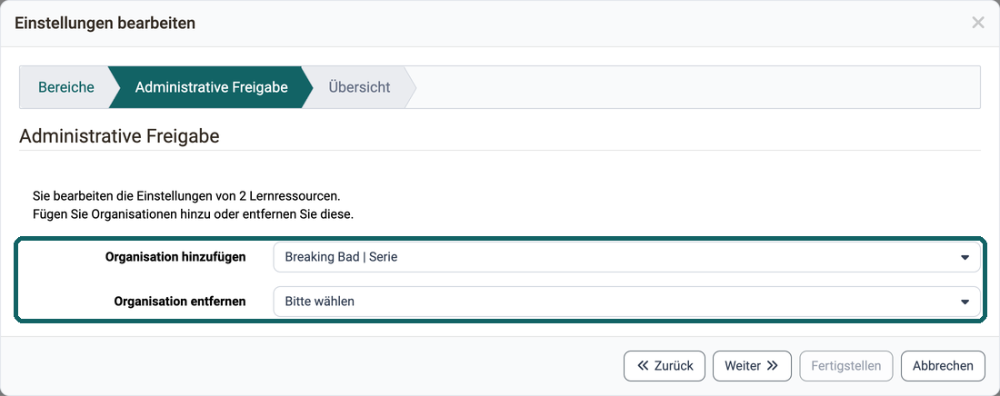

# Autorenbereich - Sammelaktionen {: #authoring_bulk_actions}

Sobald in der 1. Spalte der Tabelle eine Lernressource ausgewählt wurde, erscheinen über der Tabelle zusätzliche Buttons (1-6). Mit ihnen lassen sich Aktionen für die ausgewählten Ressourcen durchführen, also für mehrere Lernressourcen gemeinsam (Bulk Actions). 
Diese Buttons sind nicht sichtbar, wenn nicht mindestens eine Lernressource selektiert ist.

Bei Klick auf die 3 Punkte am Ende einer Tabellenzeile (10) werden Optionen nur für diese einzelne Lernressource dieser Zeile angezeigt. 

{ class="shadow lightbox" }

!!! tip "Tipp"

    Wenn Sie die **Checkbox in der Titelzeile der Tabelle** wählen, werden alle Lernressourcen auf einmal selektiert. { class="shadow lightbox" }

---

### 1. E-Mail versenden [:octicons-tag-16:{ title="ab Release 11.5 (OO-2674)" }](https://track.frentix.com/issue/OO-2674){:target="_blank"}

Wählen Sie die gewünschten Lernressourcen aus und klicken Sie auf "E-Mail versenden". Es öffnet sich ein Dialog. Sie können nun definieren, an wen die E-Mail verschickt werden soll. Mögliche Empfänger:innen sind **alle Kursbesitzer:innen, alle Kursbetreuer:innen und alle Teilnehmenden**.

Fügen Sie einen Betreff und die gewünschte Nachricht hinzu. Bei Bedarf kann noch ein Anhang und eine Kopie für den Absender ergänzt werden.

!!! info "Wichtig"

    Sie können die E-Mail an alle Kurse schicken, die Ihnen angezeigt werden. Dazu gehören auch Kurse, welche für **alle Autor:innen** sichtbar sind. Sie müssen also nicht zwingend Mitglied des Kurses sein, um diese Funktion zu nutzen.

### 2. Status ändern [:octicons-tag-16:{ title="ab Release 17.1 (OO-5011)" }](https://track.frentix.com/issue/OO-5011){:target="_blank"}

Wählen Sie den Publikationsstatus aus, der für alle ausgewählten Lernressourcen gelten soll und klicken Sie auf "Ändern".

### 3. Besitzer bearbeiten [:octicons-tag-16:{ title="ab Release 15.4 (OO-5025)" }](https://track.frentix.com/issue/OO-5025){:target="_blank"}

Hier werden Ihnen alle **Besitzer:innen der ausgewählten Lernressourcen** angezeigt. Sie können diese gleichzeitig aus mehreren Kursen entfernen oder auch neue Besitzer:innen den ausgewählten Lernressourcen hinzufügen. Eine E-Mailbenachrichtigungsoption schliesst die Bearbeitung ab.

### 4. Metadaten und Einstellungen [:octicons-tag-16:{ title="ab Release 17.2 (OO-6441)" }](https://track.frentix.com/issue/OO-6441){:target="_blank"}

Gehören mehrere Lernressourcen zusammen, etwa die Kurse einer Weiterbildungsreihe, **vereinheitlichen** Sie ihre **Metadaten** und Einstellungen in einem Durchgang, statt jede Lernressource einzeln zu bearbeiten. Nach Klick auf "Metadaten und Einstellungen" öffnet sich der Assistent (Wizard) "Einstellungen bearbeiten". Er ändert nur die ausgewählten Lernressourcen, bei denen Sie Besitzer:in, Lernressourcenverwalter:in oder Administrator:in sind.

Im ersten Schritt "Bereiche" wählen Sie aus, was Sie bearbeiten wollen. Der Assistent führt danach nur durch die gewählten Bereiche und schliesst mit dem Schritt "Übersicht", der die geplanten Änderungen auflistet. In "Metadaten", "Autorenrechte", "Durchführung" und "Toolbar" übernimmt OpenOlat nur die Felder, bei denen Sie das Kontrollkästchen "Ändern" markieren. Lassen Sie in "Metadaten" oder "Durchführung" ein markiertes Feld leer, werden die bestehenden Daten gelöscht.

Die Bereiche in der Reihenfolge des Assistenten:

* "Metadaten": "Autor:innen / Durchführung mit", "Durchführungsformat" (nur bei Kursen, z.B. "Prüfungskurs"), "Hauptsprache", "Zeitaufwand", "Lizenz" (bei eingeschalteten Lizenzen) und "Freigabe OER-Kataloge und Suchmaschinen" (bei eingeschaltetem Modul OAI-PMH).
* "Fachbereiche": Fachbereiche hinzufügen oder entfernen. Bei eingeschaltetem Katalog heisst der Bereich "Fachbereiche / Katalog".
* "Administrative Freigabe": Organisationen hinzufügen oder entfernen, siehe [Bereich "Administrative Freigabe"](#bulk_administrative_access).
* "Autorenrechte": die Rechte "Referenzieren", "Kopieren" und "Exportieren" für alle anderen Autor:innen hinzufügen oder entfernen.
* "Durchführung": "Durchführungszeitraum" und "Durchführungsort" einheitlich setzen.
* "Toolbar": Werkzeuge der Toolbar ein- oder ausschalten.

"Durchführung" und "Toolbar" bietet der Assistent nur an, wenn mindestens ein Kurs ausgewählt ist, und übernimmt die Änderungen nur bei Kursen.

#### Bereich "Administrative Freigabe" {: #bulk_administrative_access}

Sollen mehrere Lernressourcen einer anderen Organisation zugeordnet werden, etwa nach einer Umstrukturierung, passen Sie ihre Administrative Freigabe hier für alle gleichzeitig an. Was die Administrative Freigabe bewirkt, beschreibt die Seite [Kurseinstellungen - Tab Freigabe](../learningresources/Course_Settings_Share.de.md#section_share). Den Bereich gibt es nur, wenn das Modul Organisationen eingeschaltet ist.

{ class="shadow lightbox" }

Der Bereich hat zwei Felder:

* "Organisation hinzufügen" bietet die Organisationen an, in denen Sie Autor:in, Lernressourcenverwalter:in oder Administrator:in sind.
* "Organisation entfernen" bietet die Organisationen an, denen die ausgewählten Lernressourcen zugeordnet sind.

Eine Lernressource bleibt immer mindestens einer Organisation zugeordnet. OpenOlat entfernt eine Organisation deshalb nur, wenn der Lernressource danach noch eine ihrer bisherigen Organisationen bleibt. Wählen Sie nur Organisationen zum Entfernen aus und bliebe eine Lernressource danach ohne Organisation, zeigt der Bereich den Hinweis "Einige Organisationen können nicht aus den Lernressourcen entfernt werden, da sie die einzige Organisation der Lernressource sind."

Eine Organisation, die Sie im selben Durchlauf hinzufügen, zählt dabei nicht mit. Wählen Sie die neue Organisation zum Hinzufügen und die bisherige zum Entfernen, fügt OpenOlat die neue hinzu und behält die bisherige, ohne einen Hinweis anzuzeigen. Um Lernressourcen in eine andere Organisation zu verschieben, führen Sie den Assistenten deshalb zweimal aus:

1. Wählen Sie im ersten Durchlauf unter "Organisation hinzufügen" die neue Organisation und schliessen Sie den Assistenten ab.
2. Wählen Sie im zweiten Durchlauf unter "Organisation entfernen" die bisherige Organisation.

Administrator:innen ordnen Kurse zudem in der System-Administration im Tab "Lernressourcen" einer Organisation zu, beschrieben unter [Modul Organisationen](../../manual_admin/administration/Modules_Organisations.de.md#edit_learning_resources).

### 5. Kopieren

Mit dem **Button "Kopieren" über der Tabelle** können Sie **mehrere Lernressourcen** kopieren.  
Durch Anklicken von "Kopieren" im **Menü, das unter den 3 Punkten am Ende einer Zeile erscheint**, kopieren Sie eine **einzelne Lernressource**. (Die Lernressource dieser Tabellenzeile.)

Wählen Sie eine oder mehrere Lernressourcen aus um sie zu kopieren. Beispielsweise zur Wiederverwendung für ein neues Semester oder um eine Sicherheitskopie zu erstellen. 

Kopierte Lernressourcen befinden sich anschliessend im Tab "Meine Einträge". Der Zusatz ("Kopie") wird dem Titel hinzugefügt. Der Titel kann aber anschliessend nach Wunsch geändert werden.

### 6. Löschen

Eine Lernressource kann nur von den Besitzer:innen der Lernressource sowie Lernressourcenverwalter:innen und Administrator:innen gelöscht werden.

Mit dem **Button über der Tabelle** können Sie schnell **mehrere Lernressourcen auf einmal** löschen. 
Wollen Sie nur eine **einzelne Lernressource** löschen, können Sie auch auf die **3 Punkte am Ende der betreffenden Tabellenzeile** klicken und dann auf die Option "Löschen".

Sie müssen diese Aktion zur Sicherheit noch einmal im Menü bestätigen. Die Besitzer:innen der Lernressource werden, sofern konfiguriert, per E-Mail benachrichtigt.

Nach dem Löschen erscheinen die Lernressourcen nur noch im [Tab "**Gelöscht**"](../area_modules/Authoring.de.md#authoring-deleted) (Papierkorb-Funktion) für die jeweiligen Besitzer:innen sowie Lernressourcenverwalter:innen und Administrator:innen.

Als Besitzer:in können Sie gelöschte Lernressourcen wiederherstellen. Das dauerhafte Löschen der Lernressourcen ist nur durch Administrator:innen oder Lernressourcenverwalter:innen möglich.

### 7. Lernressource öffnen/bearbeiten

Ein Klick auf den **Titel** einer Lernressource öffnet die entsprechende Ressource.

### 8. Infoseite öffnen

Durch Klick auf das **Symbol der Glühbirne** { width=30px class="lightbox" } wird die Infoseite **angezeigt**.

Klicken Sie dagegen **im Menü unter den 3 Punkten** auf "Infoseite bearbeiten", gelangen Sie in den Bereich "Einstellungen" und können die Informationen, die auf der Infoseite erscheinen, **bearbeiten**.

Mehr dazu finden Sie auf der Seite "[Infoseite einrichten](../learningresources/Course_Settings_Info.de.md#configure_info)".

### 9. Editieren

Bei **editierbaren** Lernressourcen wie Kurs, Glossar, Test, CP-Lerninhalt, Blog und Podcast öffnet der Klick auf "Editieren" bzw. das Icon den entsprechenden Editor.

### 10. Weitere Optionen für einzelne Lernressourcen

Ein Klick auf die **3-Punkte** am Ende einer Tabellenzeile öffnet ein Menü mit mehreren Optionen. 

Aktionen im Menü unter den 3 Punkten beziehen sich immer auf die **einzelne Lernressource** dieser Zeile. Mit den Buttons über der Tabelle (1-6) können Sie dagegen Aktionen für **mehrere Lernressourcen** ausführen. 

### 11. Mitgliederverwaltung

Hier können Sie Mitglieder einer Lernressource organisieren. Mehr Informationen dazu finden Sie im Kapitel [Mitgliederverwaltung](../learningresources/Members_management.de.md).

### 12. Inhalt exportieren

Hiermit exportieren Sie Ihre Lernressourcen als ZIP-Datei. Z.B. als Backup oder für den Import in einem anderen System.

### 13. Freigabe externer OER-Katalog [:octicons-tag-16:{ title="ab Release 17.2 (OO-6583)" }](https://track.frentix.com/issue/OO-6583){:target="_blank"}

Wenn ein Kurs bzw. eine Lernressource durch Suchmaschinen gefunden werden soll, können Sie diese Option aufrufen. 
Eine ausführliche Anleitung zum Thema finden Sie [hier](../../manual_how-to/oai_pmh/oai_pmh.de.md).

### 14. In Lernpfad-Kurs konvertieren

Handelt es sich in der Tabellenzeile um einen herkömmlichen Kurs, wird zusätzlich die Option "In Lernpfad-Kurs konvertieren" angezeigt. Ein neuer, konvertierter [Lernpfad-Kurs](../learningresources/Learning_path_course.de.md) wird als Kopie erstellt, die Ursprungsversion bleibt als herkömmlicher Kurs erhalten.

### 15. Kopieren mit Wizard [:octicons-tag-16:{ title="ab Release 16.0 (OO-4416)" }](https://track.frentix.com/issue/OO-4416){:target="_blank"}

Handelt es sich in der Tabellenzeile um einen Lernpfad-Kurs, wird zusätzlich die Option "Kopieren mit Wizard" angezeigt.

[Zum Seitenanfang ^](#authoring_bulk_actions)

---

## Weiterführende Informationen {: #further_information}

**Auf dieser Seite erwähnt** 
[Kurseinstellungen - Tab Freigabe >](../learningresources/Course_Settings_Share.de.md) 
[Modul Organisationen >](../../manual_admin/administration/Modules_Organisations.de.md) 
[Autorenbereich - Übersicht >](Authoring.de.md) 
[Kurseinstellungen - Tab Info >](../learningresources/Course_Settings_Info.de.md) 
[Mitgliederverwaltung >](../learningresources/Members_management.de.md) 
[Wie kann ich meine Kurse durch Suchmaschinen finden lassen? >](../../manual_how-to/oai_pmh/oai_pmh.de.md) 
[Lernpfadkurs - Überblick >](../../manual_user/learningresources/Learning_path_course.de.md)

**Weiterführend** 
[Kurs erstellen >](../../manual_user/learningresources/Creating_Course.de.md) 
[Wie erstelle ich meinen ersten OpenOlat-Kurs? >](../../manual_how-to/my_first_course/my_first_course.de.md) 
[Kursbausteine im Kurseditor >](../../manual_user/learningresources/General_Configuration_of_Course_Elements.de.md)

[Zum Seitenanfang ^](#authoring_bulk_actions)
