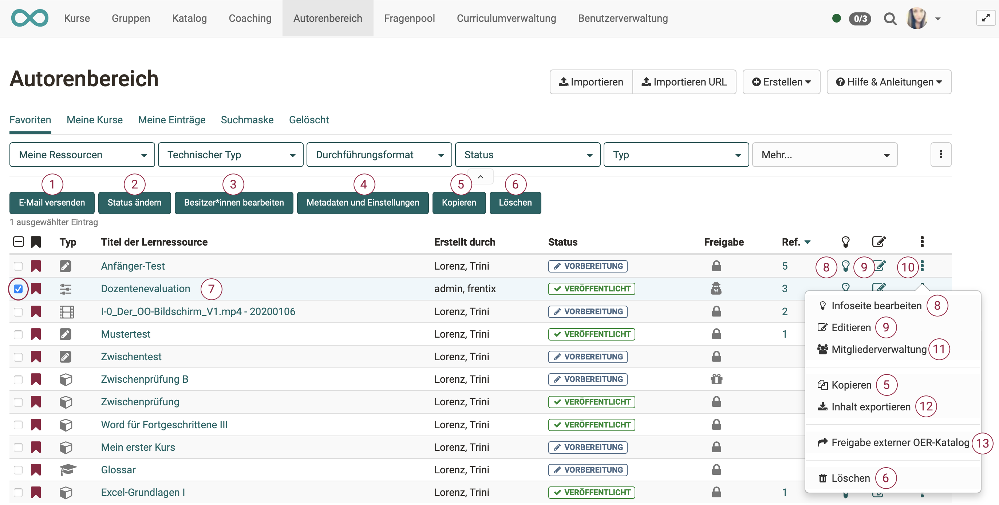

{ class="shadow lightbox" }

#  Autorenbereich - Aktionen

Sobald in der 1. Spalte der Tabelle eine Lernressource ausgewählt wurde, erscheinen über der Tabelle zusätzliche Buttons. Mit ihnen lassen sich Aktionen für die ausgewählten Ressourcen durchführen. 
(Die Buttons sind nicht sichtbar, wenn nicht mindestens 1 Lernressource selektiert ist.) 

!!! tip "Tipp"

    Wenn Sie die **Checkbox in der Titelzeile der Tabelle** wählen, werden alle Lernressourcen auf einmal selektiert. 

---

### Menüs und weitere Einstellungen aufrufen

Über die Menüpunkte neben Ihren Lernressourcen können Sie viele Funktionen direkt aufrufen. Hierzu zählen:

  * Ein Klick auf den **Titel** einer Lernressource öffnet die entsprechende Ressource.
  * Die **Infoseite** öffnen Sie über . 
  * Bei **editierbaren** Lernressourcen wie Kurse, Glossare, Tests, PCs, Blogs und Podcasts öffnet das Bearbeitungsicon „Editieren“ den entsprechenden Editor.
  * Die **3-Punkte** führen schnell zu grundlegenden Menüs die im Folgenden kurz angerissen werden:

#### Infoseite bearbeiten

Damit gelangen Sie in den Bereich "Einstellungen" und können die
Informationen, die auf der Infoseite erscheinen, ändern. Mehr Informationen
dazu finden Sie auf der Seite "[Infoseite einrichten](Set_up_info_page.de.md)".

#### Katalogeinträge

Damit können Sie neue Katalogeinträge erstellen und bereits bestehende
Einträge bearbeiten. Mehr Informationen dazu finden Sie im Kapitel
„Kurseinstellungen“ unter dem Punkt [Tab Katalog](../course_create/Course_Settings.de.md)

#### Mitgliederverwaltung

Hier können Sie Mitglieder einer Lernressource organisieren. Mehr
Informationen dazu finden Sie im Kapitel [Mitgliederverwaltung](../course_operation/Members_management.de.md)

#### Kopieren

Damit können Sie die Lernressource kopieren um sie beispielsweise für ein
neues Semester wieder zu verwenden oder eine Sicherheitskopie zu erstellen.

#### Inhalt exportieren

Exportieren Sie hiermit Ihre Lernressourcen als ZIP-Datei z.B. als Backup oder
für den Export in ein anderes System.

#### Löschen

Eine Lernressource kann nur von den Besitzern der Lernressource gelöscht werden.

Herkömmliche Kurse verfügen noch über das Menü "In Lernpfad konvertieren" um einen
herkömmlichen Kurs in einen Kurs vom Typ [Lernpfad](../course_create/Learning_path_course.de.md)
umzuwandeln und somit eine Kopie des Ursprungskurses zu erstellen. Lernpfad-Kurse verfügen dagegen über das zusätzliche Menü "Kopieren mit Wizard".

## Weitere Aktionen

Wählt man eine oder mehrere der angezeigten Lernressourcen aus der Tabelle aus erscheinen weitere Optionen. 

### 1. E-Mail versenden

Wählen Sie die gewünschten Lernressourcen aus und klicken Sie auf "E-Mail versenden". Es öffnet sich ein
Dialog. Sie können nun definieren, an wen die E-Mail verschickt werden soll.
Mögliche Empfänger sind alle Kursbesitzer, alle Kursbetreuer und alle Teilnehmenden. Fügen Die einen Betreff und die gewünschte Nachricht hinzu. Bei Bedarf kann noch ein Anhang und eine Kopie für den Absender ergänzt werden.

!!! info "Hinweis"

    Sie können die E-Mail an alle Kurse schicken, die Ihnen angezeigt werden. Dazu gehören auch Kurse, welche für alle Autoren sichtbar sind. Sie müssen also nicht zwingend Mitglied des Kurses sein, um diese Funktion zu nutzen.

### 2. Status ändern
Wählen Sie den Veröffentlichungsstatus aus der für alle ausgewählten Lernressourcen gelten soll und klicken Sie auf "Ändern".    

### 3. Besitzer bearbeiten

Hier werden Ihnen alle Besitzer der ausgewählten Lernressourcen angezeigt und Sie können diese gleichzeitig aus mehreren Kursen entfernen oder auch neue
Besitzer den ausgewählten Lernressourcen hinzufügen. Eine
E-Mailbenachrichtigungsoption schliesst die Bearbeitung ab.

### 4. Metadaten und Einstellungen

Hier können mittel Sammelaktion verschiedene Metadaten für die ausgewählten Lernressourcen vereinheitlich werden, z.B. wenn mehrere Kurse zu einer Weiterbildungsreihe gehören. Bei Klick öffnet sich ein Wizard.

So kann für alle markierten Lernressourcen der angezeigte Name unter "Durchführung mit" eingetragen, das Durchführungsformat z.B. "Prüfungskurs" ausgewählt, Sprache und Zeitaufwand definiert sowie eine passende Lizenz für die Lernressourcen gewählt werden.

Weiter können ein passender Fachbereich und die gewünschte Organisation für die Lernressourcen gewählt, zusätzliche Rechte für alle anderen Autoren vergeben sowie ein einheitlicher Durchführungszeitraum und Ort angegeben werden.

Bei Kursen besteht darüber hinaus auch die Möglichkeit eine einheitliche Auswahl für die Tools der Toolbar zu treffen. 

### 5. Kopieren

Wählen Sie eine oder mehrere Lernressourcen aus um sie zu kopieren. Kopierte Lernressourcen befinden sich anschliessend im Tab "Meine Einträge". Der Zusatz "(Kopie)" wird dem Titel hinzufügt. Der Titel kann aber anschliessend nach Wunsch geändert werden.

### 6. Löschen

Hier können Sie schnell mehrere Lernressourcen auf einmal löschen. Sie müssen diese Aktion zur Sicherheit noch einmal im Menü bestätigen. Die Besitzer der Lernressource werden per E-Mail benachrichtigt. Nach dem Löschen erscheinen die Lernressourcen nicht mehr unter "Meine Einträge", sondern werden in den Tab "Gelöscht" (Papierkorb Funktion) verschoben und sind dort nur für die jeweiligen Besitzer sichtbar. Die Besitzer der gelöschten Lernressource können
gelöschte Lernressourcen wiederherstellen. 

Die OpenOlat Administratoren können
gelöschte Lernressourcen ebenfalls wiederherstellen und auch final
löschen.
