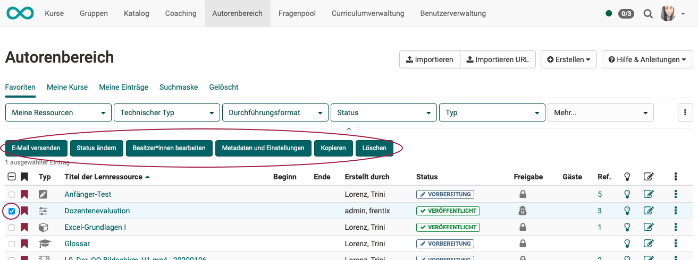
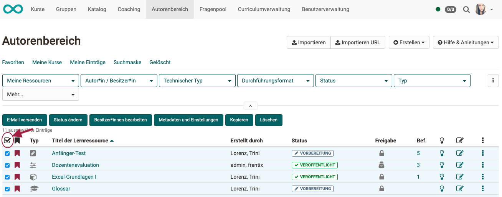

# Authoring - Bulk Actions {: #authoring_bulk_actions}

As soon as a learning resource has been selected in the first column of the table, additional buttons (1-6) appear above the table. They can be used to carry out actions for the selected resources, i.e. for several learning resources together (Bulk Actions). 
For these buttons to be visible, at least one learning resource must be selected.

Clicking on the 3 dots at the end of a table row (10) displays options, which are only for this specific learning resource of this row.

{ class="shadow lightbox" }

!!! tip "Tip"

    If you select the **checkbox in the title bar of the table**, all learning resources will be selected at once. { class="shadow lightbox" }

---

### 1. Send email [:octicons-tag-16:{ title="from Release 11.5 (OO-2674)" }](https://track.frentix.com/issue/OO-2674){:target="_blank"}

Select the desired learning resources and click on "Send email". A dialog opens. You can now define to whom the email should be sent. Possible recipients are **all course owners, all course coaches and all participants**.

Add a subject and the desired message. If necessary, an attachment and a copy for the sender can be added.

!!! info "Important"

    You can send the email to all courses that are displayed to you. This also includes courses which are visible to **all authors**. You do not have to be a member of the course to use this function.

### 2. Change status [:octicons-tag-16:{ title="from Release 17.1 (OO-5011)" }](https://track.frentix.com/issue/OO-5011){:target="_blank"}

Select the publication status that should apply to all selected learning resources and click on "Change".

### 3. Modify owners [:octicons-tag-16:{ title="from Release 15.4 (OO-5025)" }](https://track.frentix.com/issue/OO-5025){:target="_blank"}

All **owners of the selected learning resources** are displayed here. You can remove them from several courses at the same time or add new owners to the selected learning resources. An email notification option completes the editing.

### 4. Metadata and settings [:octicons-tag-16:{ title="from Release 17.2 (OO-6441)" }](https://track.frentix.com/issue/OO-6441){:target="_blank"}

If several learning resources belong together, for example the courses of a continuing education series, you **standardize** their **metadata** and settings in one pass instead of editing each learning resource individually. After clicking "Metadata and settings", the wizard "Change settings" opens. It only changes the selected learning resources for which you are owner, learning resource manager or administrator.

In the first step "Sections", you select what you want to edit. The wizard then only guides you through the selected sections and ends with the step "Overview", which lists the planned changes. In "Metadata", "Authors rights", "Execution" and "Toolbar", OpenOlat only applies the fields for which you tick the checkbox "Change". If you leave a ticked field empty in "Metadata" or "Execution", the existing data is deleted.

The sections in the order of the wizard:

* "Metadata": "Authors / taught by", "Implementation format" (only for courses, e.g. "Exam course"), "Main language", "Expenditure of work", "License" (when licenses are enabled) and "Release OER catalogues and search engines" (when the OAI-PMH module is enabled).
* "Subjects": add or remove subjects. When the catalog is enabled, the section is called "Subjects / Catalog".
* "Administrative access": add or remove organisations, see [Section "Administrative access"](#bulk_administrative_access).
* "Authors rights": add or remove the rights "Reference", "Copy" and "Download" for all other authors.
* "Execution": set "Execution period" and "Location" uniformly.
* "Toolbar": switch tools of the toolbar on or off.

The wizard only offers "Execution" and "Toolbar" if at least one course is selected, and only applies the changes to courses.

#### Section "Administrative access" {: #bulk_administrative_access}

If several learning resources are to be assigned to another organisation, for example after a restructuring, you adjust their Administrative access here for all of them at once. What the Administrative access does is described on the page [Course settings - Tab Share](../learningresources/Course_Settings_Share.md#section_share). The section is only available if the Organisations module is enabled.

{ class="shadow lightbox" }

The section has two fields:

* "Add organisation" offers the organisations in which you are author, learning resource manager or administrator.
* "Remove organisation" offers the organisations to which the selected learning resources are assigned.

A learning resource always remains assigned to at least one organisation. OpenOlat therefore only removes an organisation if the learning resource still keeps one of its previous organisations afterwards. If you only select organisations to remove and a learning resource would be left without an organisation, the section shows the notice "Some organisations cannot be removed from learning resources because they are the only organisation of the learning resource."

An organisation that you add in the same run does not count here. If you select the new organisation to add and the previous one to remove, OpenOlat adds the new one and keeps the previous one, without showing a notice. To move learning resources to another organisation, therefore run the wizard twice:

1. In the first run, select the new organisation under "Add organisation" and complete the wizard.
2. In the second run, select the previous organisation under "Remove organisation".

Administrators can also assign courses to an organisation in the system administration in the "Learning resources" tab, described under [Module Organisations](../../manual_admin/administration/Modules_Organisations.md#edit_learning_resources).

### 5. Copy

With the **"Copy" button above the table** you can copy **several learning resources**. 
By clicking on "Copy" in the **menu that appears under the 3 dots at the end of a row**, you copy a **single learning resource**. (The learning resource of this table row.)

Select one or more learning resources to copy them. For example, to reuse them for a new semester or to create a backup copy.

Copied learning resources can then be found in the tab "My entries". The addition ("copy") is added to the title. However, the title can subsequently be changed as desired.

### 6. Delete

A learning resource can only be deleted by the owners of the learning resource, learning resource managers, and administrators.

With the **button above the table** you can quickly delete **several learning resources at once**. 
If you only want to delete a **single learning resource**, you can also click on the **3 dots at the end of the respective table row** and then on the option "Delete".

You must confirm this action again in the menu for the sake of safety. The owners of the learning resource will be notified by email, if configured.

After deletion, the learning resources will only appear in the ["**Deleted**" tab](../area_modules/Authoring.md#authoring-deleted) (trash function) for the respective owners, learning resource managers, and administrators.

As the owner, you can restore deleted learning resources. Only administrators or learning resource managers can permanently delete learning resources.

### 7. Open/edit learning resource

Clicking on the **title** of a learning resource opens the corresponding resource.

### 8. Open info page

By clicking on the **light bulb symbol** { width=30px class="lightbox" } the info page will be **displayed**.

If, on the other hand, you **click on "Change info page" in the menu under the 3 dots**, you will reach the "Settings" area and can **edit** the information that appears on the info page.

You can find more about this topic on the page "[Set up info page](../learningresources/Course_Settings_Info.md#configure_info)".

### 9. Edit

For **editable** learning resources such as course, glossary, test, CP learning content, blog and podcast, clicking on "Edit" or the icon opens the corresponding editor.

### 10. Further options for individual learning resources

Clicking on the **3-dots** at the end of a table row opens a menu with several options.

Actions in the menu under the 3 dots always refer to the **single learning resource** of this row. With the buttons above the table (1-6), on the other hand, you can carry out actions for **several learning resources**.

### 11. Members management

Here you can organize members of a learning resource. You can find more information on this in the chapter [Members management](../learningresources/Members_management.md).

### 12. Export content

This allows you to export your learning resources as a ZIP file, e.g. as a backup or for import into another system.

### 13. Release of external OER catalogue [:octicons-tag-16:{ title="from Release 17.2 (OO-6583)" }](https://track.frentix.com/issue/OO-6583){:target="_blank"}

If a course or learning resource is to be found by search engines, you can call up this option. 
You can find a detailed guide to the topic [here](../../manual_how-to/oai_pmh/oai_pmh.md).

### 14. Convert to learning path course

If the table row is a conventional course, the option "Convert to learning path course" is also displayed. A new, converted [Learning path course](../learningresources/Learning_path_course.md) will be created as a copy. The original version will be preserved as a conventional course.

### 15. Copy with wizard [:octicons-tag-16:{ title="from Release 16.0 (OO-4416)" }](https://track.frentix.com/issue/OO-4416){:target="_blank"}

If the table row is a learning path course, the option "Copy with wizard" is also displayed.

[To the top of the page ^](#authoring_bulk_actions)

---

## Further information {: #further_information}

**Mentioned on this page** 
[Course settings - Tab Share >](../learningresources/Course_Settings_Share.md) 
[Module Organisations >](../../manual_admin/administration/Modules_Organisations.md) 
[Authoring - Overview >](Authoring.md) 
[Course settings - Tab Info >](../learningresources/Course_Settings_Info.md) 
[Members management >](../learningresources/Members_management.md) 
[How can I have my courses found by search engines? >](../../manual_how-to/oai_pmh/oai_pmh.md) 
[Learning path course - Overview >](../../manual_user/learningresources/Learning_path_course.md)

**Further reading** 
[Creating Courses >](../../manual_user/learningresources/Creating_Course.md) 
[How do I create my first OpenOlat course? >](../../manual_how-to/my_first_course/my_first_course.md) 
[Course elements in the Course editor >](../../manual_user/learningresources/General_Configuration_of_Course_Elements.md)

[To the top of the page ^](#authoring_bulk_actions)
