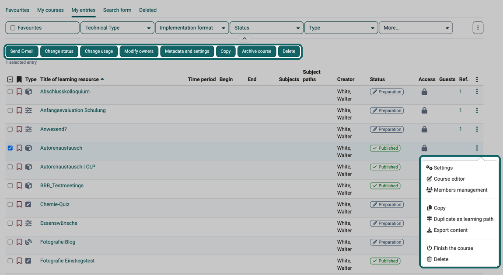
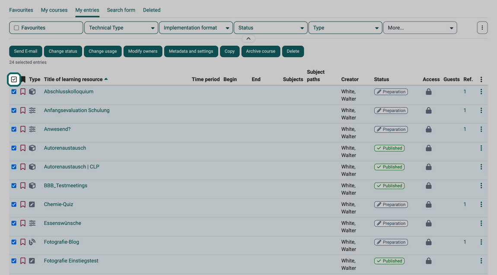
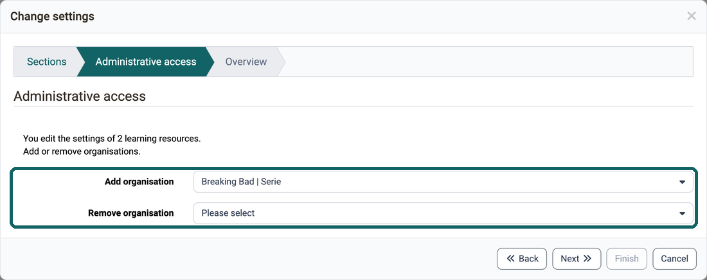

# Authoring - Bulk Actions {: #authoring_bulk_actions}

As soon as you select a learning resource in the first column of the table, additional buttons appear above the table, from "Send E-mail" to "Delete". With them, you carry out actions for the selected learning resources together, i.e. for several learning resources at once (Bulk Actions). 
These buttons are not visible unless at least one learning resource is selected. The buttons for bulk actions and the menu under the 3 dots are visible to authors, learning resource managers and administrators.

Clicking on the 3 dots at the end of a table row opens a menu with actions only for the learning resource of this row.

{ class="shadow lightbox" title="Tab My entries in Authoring · 2026.09.28" }

!!! tip "Tip"

    If you select the **checkbox in the title bar of the table**, all learning resources will be selected at once. If the table spreads over several pages, the checkbox opens a menu: "Select page's rows" selects the learning resources of the displayed page, "Select all ... rows" all learning resources of the table.

    { class="shadow lightbox" title="Tab My entries in Authoring · 2026.09.28" }

---

### Send E-mail [:octicons-tag-16:{ title="from Release 11.5 (OO-2674)" }](https://track.frentix.com/issue/OO-2674){:target="_blank"} {: #send_mail}

Select the desired learning resources and click on "Send E-mail". A dialog opens. You can now define to whom the email should be sent. Possible recipients are **all course owners, all course coaches and all participants**.

Add a subject and the desired message. If necessary, an attachment and a copy for the sender can be added.

!!! info "Important"

    You can send the email to all courses that are displayed to you. This also includes courses which are visible to **all authors**. You do not have to be a member of the course to use this function.

### Change status [:octicons-tag-16:{ title="from Release 17.1 (OO-5011)" }](https://track.frentix.com/issue/OO-5011){:target="_blank"} {: #change_status}

Select the publication status that should apply to all selected learning resources and click on "Change".

### Modify owners [:octicons-tag-16:{ title="from Release 15.4 (OO-5025)" }](https://track.frentix.com/issue/OO-5025){:target="_blank"} {: #modify_owners}

All **owners of the selected learning resources** are displayed here. You can remove them from several courses at the same time or add new owners to the selected learning resources. An email notification option completes the editing.

### Metadata and settings [:octicons-tag-16:{ title="from Release 17.2 (OO-6441)" }](https://track.frentix.com/issue/OO-6441){:target="_blank"} {: #metadata_settings}

If several learning resources belong together, for example the courses of a continuing education series, you **standardize** their **metadata** and settings in one pass instead of editing each learning resource individually. After clicking "Metadata and settings", the wizard "Change settings" opens. It only changes the selected learning resources for which you are owner, learning resource manager or administrator.

In the first step "Sections", you select what you want to edit. The wizard then only guides you through the selected sections and ends with the step "Overview", which lists the planned changes. In "Metadata", "Authors rights", "Execution" and "Toolbar", OpenOlat only applies the fields for which you tick the checkbox "Change". If you leave a ticked field empty in "Metadata" or "Execution", the existing data is deleted.

The sections in the order of the wizard:

* "Metadata": "Authors / taught by", "Implementation format" (only for courses, e.g. "Exam course"), "Main language", "Expenditure of work", "License" (when licenses are enabled) and "Release OER catalogues and search engines" (when the OAI-PMH module is enabled).
* "Subjects": add or remove subjects. When the catalog is enabled, the section is called "Subjects / Catalog".
* "Administrative access": add or remove organisations, see [Section "Administrative access"](#bulk_administrative_access).
* "Authors rights": add or remove the rights "Reference", "Copy" and "Download" for all other authors.
* "Execution": set "Execution period" and "Location" uniformly.
* "Toolbar": switch tools of the toolbar on or off.

The wizard only offers "Execution" and "Toolbar" if at least one course is selected, and only applies the changes to courses.

#### Section "Administrative access" {: #bulk_administrative_access}

If several learning resources are to be assigned to another organisation, for example after a restructuring, you adjust their Administrative access here for all of them at once. What the Administrative access does is described on the page [Course settings - Tab Share](../learningresources/Course_Settings_Share.md#section_share). The section is only available if the Organisations module is enabled.

{ class="shadow lightbox" title="Step Administrative access in the wizard Change settings" }

The section has two fields:

* "Add organisation" offers the organisations in which you are author, learning resource manager or administrator.
* "Remove organisation" offers the organisations to which the selected learning resources are assigned.

A learning resource always remains assigned to at least one organisation. OpenOlat therefore only removes an organisation if the learning resource still keeps one of its previous organisations afterwards. If you only select organisations to remove and a learning resource would be left without an organisation, the section shows the notice "Some organisations cannot be removed from learning resources because they are the only organisation of the learning resource."

An organisation that you add in the same run does not count here. If you select the new organisation to add and the previous one to remove, OpenOlat adds the new one and keeps the previous one, without showing a notice. To move learning resources to another organisation, therefore run the wizard twice:

1. In the first run, select the new organisation under "Add organisation" and complete the wizard.
2. In the second run, select the previous organisation under "Remove organisation".

Administrators can also assign courses to an organisation in the system administration in the "Learning resources" tab, described under [Module Organisations](../../manual_admin/administration/Modules_Organisations.md#edit_learning_resources).

### Copy {: #copy}

With the **"Copy" button above the table** you can copy **several learning resources**. 
By clicking on "Copy" in the **menu that appears under the 3 dots at the end of a row**, you copy a **single learning resource**. (The learning resource of this table row.)

Select one or more learning resources to copy them. For example, to reuse them for a new semester or to create a backup copy.

Copied learning resources can then be found in the tab "My entries". The addition ("copy") is added to the title. However, the title can subsequently be changed as desired.

### Delete {: #delete}

A learning resource can only be deleted by the owners of the learning resource, learning resource managers, and administrators.

With the **button above the table** you can quickly delete **several learning resources at once**. 
If you only want to delete a **single learning resource**, you can also click on the **3 dots at the end of the respective table row** and then on the option "Delete".

You must confirm this action again in the menu for the sake of safety. The owners of the learning resource will be notified by email, if configured.

After deletion, the learning resources will only appear in the ["**Deleted**" tab](../area_modules/Authoring.md#authoring-deleted) (trash function) for the respective owners, learning resource managers, and administrators.

As the owner, you can restore deleted learning resources. Only administrators or learning resource managers can permanently delete learning resources.

### Open learning resource {: #open_resource}

Clicking on the **title** of a learning resource opens the corresponding resource.

### Settings [:octicons-tag-16:{ title="from Release 21.1 (OO-9780)" }](https://track.frentix.com/issue/OO-9780){:target="_blank"} {: #settings}

If you want to change the details of a learning resource, open its settings directly from the table. To do so, click on "Settings" in the menu under the 3 dots. OpenOlat opens the settings of the learning resource in the tab "Metadata". You edit the information that appears on the info page, such as description, objectives and requirements, in the tab "Info".

You open the info page itself in the learning resource via the link "Info page" in the toolbar.

You can find more about this topic on the page "[Set up info page](../learningresources/Course_Settings_Info.md#configure_info)".

### Open editor {: #open_editor}

To edit the content of a learning resource, open its editor directly from the table. The entry in the menu under the 3 dots names the editor: for a course "Course editor", for a test "Test editor", for a form "Form editor" and for a video "Video editor". For all other learning resources, such as CP learning content, wiki, blog, podcast or glossary, the entry is called "Edit content".

You only see the entry for learning resources that can be edited and that are neither in the status "Finished" nor in the trash.

The pencil symbol in the column "Edit content" opens the same editor. You show this column yourself if needed, see [Configure columns](Authoring.md#configure_columns). The tooltip of the symbol names the editor.

### Further options for individual learning resources {: #row_menu}

Clicking on the **3 dots** at the end of a table row opens a menu with several options.

Actions in the menu under the 3 dots always refer to the **single learning resource** of this row. With the buttons above the table, on the other hand, you carry out actions for **several learning resources**.

The entries "Settings", the entry for the editor and "Members management" only appear if you are owner of the learning resource, learning resource manager or administrator.

### Members management {: #members_management}

Here you organise the members of a learning resource. You can find more information on this in the chapter [Members management](../learningresources/Members_management.md).

### Export content {: #export_content}

This allows you to export your learning resources as a ZIP file, for example as a backup or for import into another system.

### Duplicate as learning path {: #duplicate_as_learning_path}

If the table row is a conventional course, the menu also shows the option "Duplicate as learning path". A new, converted [Learning path course](../learningresources/Learning_path_course.md) is created as a copy, the original version is preserved as a conventional course.

### Copy with wizard [:octicons-tag-16:{ title="from Release 16.0 (OO-4416)" }](https://track.frentix.com/issue/OO-4416){:target="_blank"} {: #copy_with_wizard}

If the table row is a learning path course, the menu also shows the option "Copy with wizard".

[To the top of the page ^](#authoring_bulk_actions)

---

## Further information {: #further_information}

**Mentioned on this page** 
[Course settings - Tab Share >](../learningresources/Course_Settings_Share.md) 
[Module Organisations >](../../manual_admin/administration/Modules_Organisations.md) 
[Authoring - Overview >](Authoring.md) 
[Course Settings - Tab Info >](../learningresources/Course_Settings_Info.md) 
[Members management >](../learningresources/Members_management.md) 
[Learning path course - Overview >](../../manual_user/learningresources/Learning_path_course.md)

**Further reading** 
[Creating Courses >](../../manual_user/learningresources/Creating_Course.md) 
[How do I create my first OpenOlat course? >](../../manual_how-to/my_first_course/my_first_course.md) 
[Course elements in the Course editor >](../../manual_user/learningresources/General_Configuration_of_Course_Elements.md) 
[How can I have my courses found by search engines? >](../../manual_how-to/oai_pmh/oai_pmh.md)

[To the top of the page ^](#authoring_bulk_actions)
