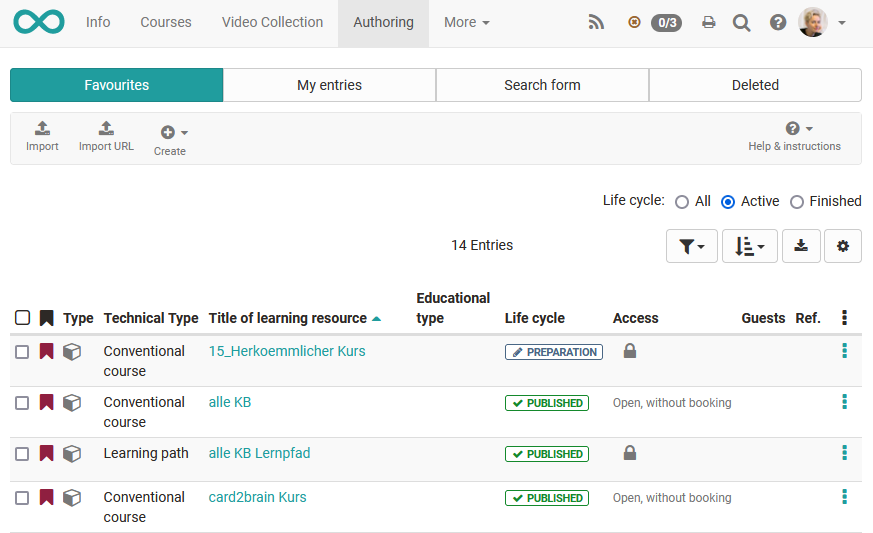
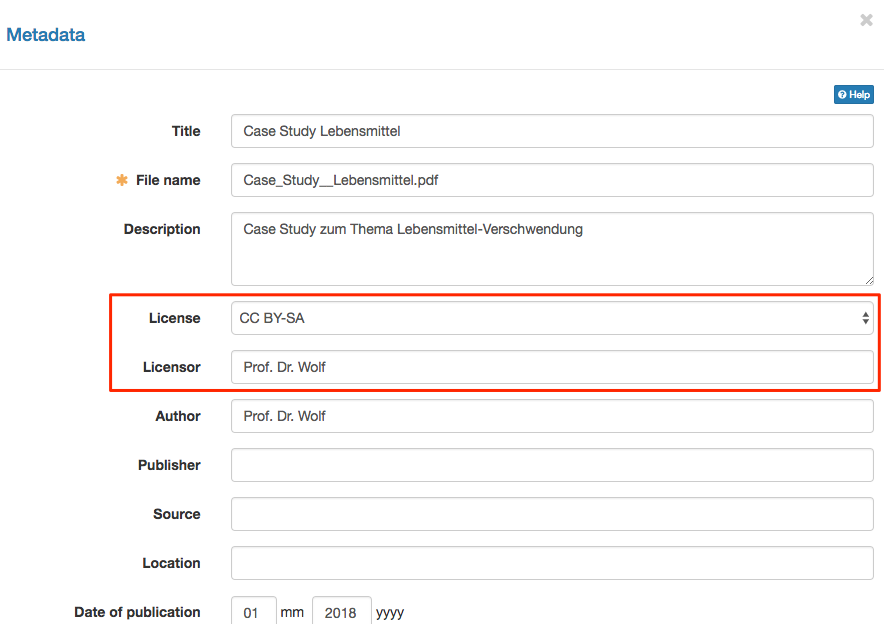

#  Actions in the 'Authoring' section

The author area is the central area for OpenOlat authors. Under "My entries" OpenOlat authors can see all the learning resources they own and can also create or import them. 

The following explains which general settings can be made in the authoring area. 

## Predefined filters of the authoring area

The authoring area contains certain predefined filters. These include:

* Favorites
* My courses
* My entries
* Deleted

as well as a search mask.

Under "My entries" OpenOlat authors can see all learning resources they own. Under "My Courses" all traditional courses and all learning path courses you are the owner of are displayed. "My Courses" is therefore a subset of "My Entries. 

The "Favorites" tab is a subgroup of "My Entries. It shows all learning resources of an author which are bookmarked. The "Deleted"
tab displays your "Trash" with all your learning resources that you have
deleted.

###  Create learning resources

OpenOlat authors can create new courses and additional [learning resources](Various_Types_of_Learning_Resources.md). How to use various editors will be further explained in the
chapters 

* [„Creating Courses"](../learningresources/Creating_Course.md), 
* [„Creating CP Learning Content"](../resource_cp/index.md), 
* [„Creating wikis"](../learningresources/Wiki.md), 
* [„Creating Podcasts"](../learningresources/Podcast.md), 
* [„Creating Blogs"](../learningresources/Blog.md), 
* ["Creating Portfolio Tasks",](../area_modules/index.md),
* ["Creating Tests" ](../learningresources/Test.md) and
* ["Creating Forms and Questionnaires" ](../learningresources/Form.md).

!!! tip

    If you build your courses systematically and if you want to use your learning
    resources in several courses, you should better created the learning resources
    in the authoring.

###  Import {: #import}

Learning resources generated outside of OpenOlat can be imported if they have
a format that is compatible. Suitable formats have been commented on in the
section ["Various Types of Learning Resources"](Various_Types_of_Learning_Resources.md). Using the "Import URL"
link, you can also set links to external videos, e.g. YouTube, and create them
as OpenOlat learning resource videos.

If you want to import a course e.g. from another OpenOlat instance, you will
be asked whether you also want to import the learning resources referenced by
the course (e.g. a wiki or a test). Select the corresponding checkbox if you
also want to import the referenced learning resources. Publish the imported
course afterwards to make it visible to you and other OpenOlat users.

At the end of the import, the "Settings" menu appears and further
configurations are possible, e.g. a definition of the license.

 **Licenses**

When uploading learning resources such as pictures, text, audio and video
files within the authoring section a license and a licensor can be assigned in
the metadata.

In the corresponding overview in the authoring section all assigned licenses
will be shown in the column «license». By clicking on a license, detailed
license information will be displayed.

## Configure table view

Use the cogwheel to select which columns and associated
information should be displayed to you. Particularly informative are e.g.
the status, the referencing (Ref.), the creation date or for courses
the technical course type to distinguish conventional courses from learning path courses.
courses.  

Beside the selection of columns you can also define the sorting method
e.g. sorted according to the referencing or the status or the
creation date and download the whole table.

###  Calling up menus and other settings

You can call many functions directly from the table view of your learning
resources. These include

  * A click on the **title** of a learning resource opens the corresponding resource.
  * The **info page** can be opened via. For **editable** learning resources such as courses, glossaries, tests, questionnaires, PCs, blogs and podcasts, the "Edit" icon opens the corresponding editor.
  * The 3-dots quickly leads to basic menus that are briefly outlined in the following:

#### Change infopage

Opens the form for changing the content of the info page. You can find more
information on the page "[Change infopage](../learningresources/Course_Settings.md#CourseSettings-d14e1774)".

#### Catalogue entries

Create new catalogue entries or edit existing entries. For further information
please refer to the chapter "Course Settings", section "[Catalog entries](../learningresources/Course_Settings.md#CourseSettings-d14e1825)".

#### Members management

Opens the members management of the respective learning resource. You can find
more information on the page [Members management](../learningresources/Members_management.md).

#### Copy

Copy learning resources for re-use in a new semester or create a safety copy.

#### Export Content

Export your learning resource as ZIP file for example as back-up or for the
export in another system.

#### Delete

A learning resource can only be deleted by its owner.

Conventional courses still get the menu "Convert to learning path" to convert a
course into a course of the type [learning_path](../learningresources/Learning_path_course.md)
and thus create a copy of the original course.

## Further actions

If you select one or more of the displayed learning resources from the table, further options appear. 

### Send E-mail

With this feature e-mails can be sent to members of several courses and
learning resources at the same time. Chose the desired learning resources by
selecting the checkboxes on the left. A wizard opens. Now it can be defined to whom the e-mail should be sent. Possible recipients are course owners, course coaches and participants. 

!!! hint

    You can send e-mails to all courses visible to you in the authoring. These are for example courses which are visible for all
    authors. This means you do not need to be a member of this certain course to
    use this feature.

### Change status
Select the publication status that should apply to all selected learning resources and click on "Change".

### Modify owners

Here you will see the owners of the selected learning resources and you can
remove them from several courses at once or add new owners to the selected
learning resources. An email notification option completes the editing.

### Metadata and settings

Various metadata for the selected learning resources can be standardised here with bulk actions, e.g. if several courses belong to a continuing education series.

For all marked learning resources, the displayed name can be entered under "Delivery with", the delivery format, e.g. "Examination course", can be selected, language and time required can be defined and a suitable licence for the learning resources can be selected.

Furthermore, a suitable subject area and the desired organisation for the learning resources can be selected, additional rights for all other authors can be assigned and a uniform implementation period and location can be specified.

For courses, it is also possible to make a uniform selection for the tools in the toolbar.

### Copy

All learning resources can be copied. Copied learning resources will be found
in the tab "My entries" after. The supplement "(Copy)" is added to the title.
The title can be changed as desired.

### Delete

Learning resources can also be deleted together. Then the learning resources
are not deleted definitely. They can be found in the tab "Deleted" and are
there only visible for the corresponding owner. The owner of the deleted
learning resources can restore the deleted learning resources. The OpenOlat

system administrator can restore deleted learning resources as well and can
also delete them definitely.

  

