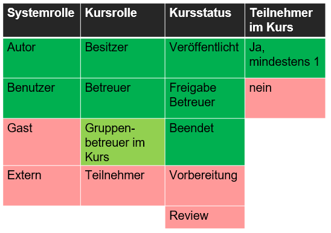
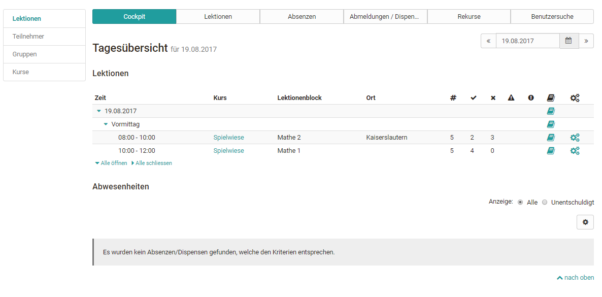
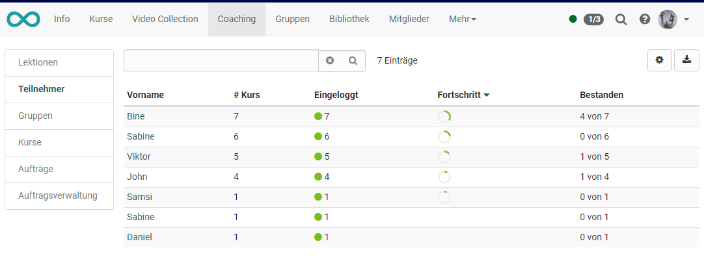
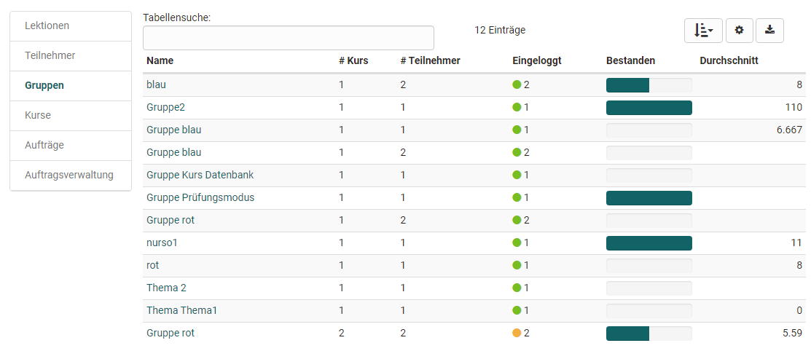
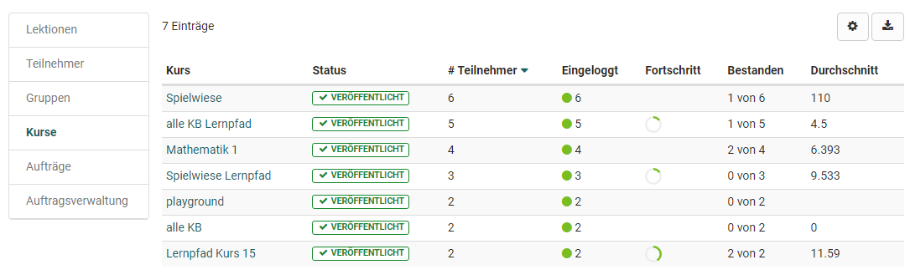
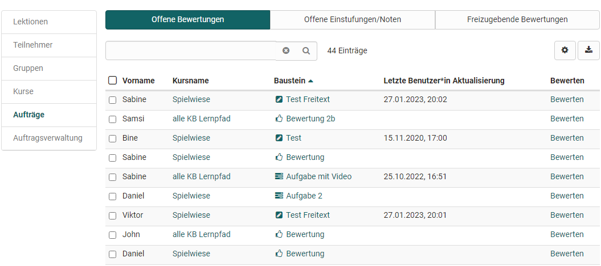
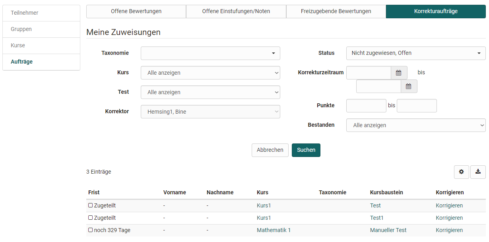
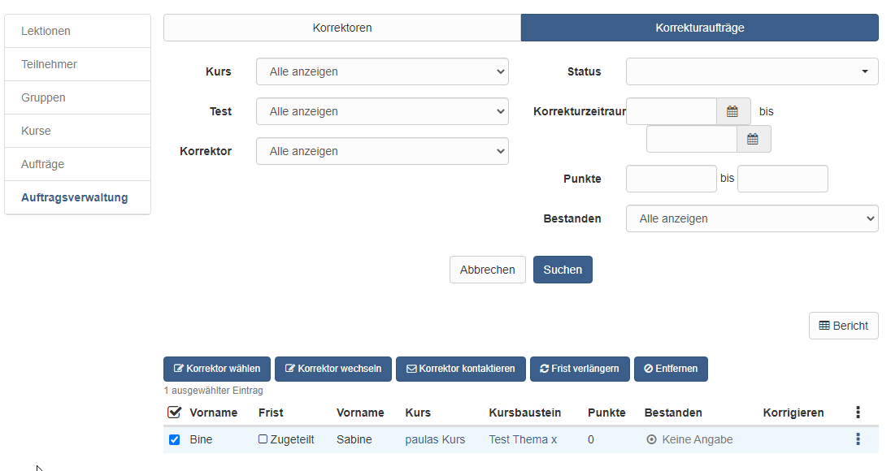

# Coaching

Das Coaching Tool dient der kursübergreifenden Organisation und Verwaltung von Kursen, Teilnehmenden und Gruppen sowie der kursübergreifenden Korrektur von Assessmentbausteinen, dem kursübergreifenden Absenzenmanagement und dem externen Korrektoren-Flow von OpenOlat Tests.

Mit dem Coaching-Tool haben Kurs-Besitzer, Kurs- und Gruppenbetreuer die Möglichkeit, alle ihnen zugewiesen Kurs- oder Gruppenteilnehmenden auf einen Blick zu sehen und zu verwalten. 

Benutzen Sie das Coaching Menü, um die Lernstatistiken von einzelnen Benutzern, Gruppen oder Kursen zu betrachten sowie schnell auf unterschiedlichen Wegen zum Bewertungswerkzeug für Teilnehmende zu gelangen. 

**Wer sieht das Coaching Menü?**

Ob das Coaching Tool angezeigt wird hängt von mehreren Faktoren ab:
* Systemrolle
* Kursrolle
* Kursstatus
* Teilnehmende in Kurs bzw. Gruppe

!!! info "Hinweis"

    Der Reiter "Coaching" erscheint nur wenn das Werkzeug vom OpenOlat Administrator auch aktiviert wurde und mindestens aus jeder Anforderungsspalte der Tabelle eine Option zutrifft (grüne Markierung)

Im Folgenden werden die Menüs des Coaching Tools näher erläutert.

## Menü Lektionen

Wird das [Absenzmanagement](../course_operation/Lectures_and_absences.de.md) von OpenOlat genutzt, erscheint im Coaching-Modul der Bereich „Lektionen“.

{ class="shadow lightbox" }

### Tab Cockpit

Im Cockpit kann ein bestimmter Termin ausgewählt und die zugehörigen Lektionen und Abwesenheiten im Überblick angezeigt werden. Über die angezeigte Übersicht und Klick auf den jeweiligen Kurs hat der Lehrende Zugriff auf weitere Informationen und kann auch die Absenzerfassung abschliessen.

### Tab Lektionen

Hier kann ein Zeitfenster ausgewählt und nach Stichworten gesucht werden. Es wird eine Übersicht der Lektionenblöcke für diese Zeitspanne angezeigt. Weitere Informationen zum Thema „Lektionen“ finden Sie
[hier](../course_operation/Lectures_-_Teacher_view.de.md).

### Tab Absenzen

Hier kann nach Benutzern, Dozenten, Kurstiteln und Lektionenblöcken gesucht werden und die Absenzen bestimmter Personen für ein gewähltes Zeitfenster angezeigt werden. Eine Sortierung der Spalten kann je nach Bedarf z.B. nach Kursen, Datum, entschuldigt, Namen usw. erfolgen.

### Tab Meldungen

Hier kann nach Benutzern, Dozenten, Kurstiteln, Lektionenblöcken und der Art der Meldung gesucht werden.

Ähnlich wie im Tab Absenzen können hier Abmeldungen und Dispensen nach bestimmten Kriterien angezeigt und auch neue Dispensen erfasst werden.

### Tab Rekurse (?)

Hier kann nach abgelehntem, angenommenem oder pendentem Status für einen bestimmten Zeitraum gesucht werden.

### Tab Personensuche

 Es kann nach einzelnen Personen sowie nach Personen bestimmter Kurse oder nach dem Curriculum gesucht werden.

## Menü Teilnehmer

Der Menüpunkt „Teilnehmer“ enthält eine Übersicht, inklusive des aktuellen Status über alle Teilnehmenden aus allen Kursen des jeweiligen Betreuers, die im Coaching Tool angezeigt werden. 

{ class="shadow lightbox" }

Diese Tabelle verschafft Ihnen einen Überblick, in wie vielen von Ihnen betreuten Kursen ein Benutzer Mitglied ist, wie viele er davon schon besucht oder bestanden hat usw.

In der Spalte "Eingeloggt" gibt eine farbliche Kodierung sowie die Zahl einen raschen Überblick ob sich Teilnehmende bereits in all ihre
Kurse eingeloggt haben (= grün) oder ob sie sich bisher nur in einen Teil der Kurse (=orange) oder noch gar nicht (=rot) eingeloggt haben.

Ein Klick auf den Namen einer Person führt zur Übersicht aller Kurse dieses Teilnehmers. So erhält der Lehrende Zugriff auf die Assessmentbereiche eines Kurses der Person inklusive des Zugriffes auf den jeweiligen Leistungsnachweis, das Bewertungswerkzeug des Kurses sowie die jeweiligen Lektionen.

## Menü Gruppen

Der Menüpunkt Gruppen öffnet eine tabellarische Übersicht aller vom Lehrenden betreuten Gruppen der Kurse, die sich im Coaching Tool befinden. Im Gegensatz zur Teilnehmer- und Kursübersicht erscheinen in der Gruppenübersicht nur die OpenOlat-Benutzer, die in einer der kursbezogene Gruppen eingetragen sind. 

{ class="shadow lightbox" }

Sie sehen auf einen Blick, in wie vielen Kursen die jeweilige Gruppe eingebunden ist, ob sich alle Gruppenmitglieder schon mindestes einmal in die Gruppe eingeloggt haben und wie viele Teilnehmende die Gruppe insgesamt hat. Weiterhin erhalten Sie Informationen darüber, wie viele Gruppenmitglieder den dazugehörigen Kurs bereits bestanden haben, sofern ein Bestehen im Kurs konfiguriert wurde. 

Ein Klick auf einen Gruppennamen öffnet die Liste der Gruppenmitglieder mit weiteren Informationen zum Punktestand, Zertifikat usw.. Wenn Sie dann auf einen Benutzernamen klicken, öffnet sich wiederum die benutzerspezifische Übersicht und Sie erhalten Zugriff auf das Bewertungswerkzeug der Person für den zugehörigen Kurs und haben Zugriff auf die Lektionen und den jeweiligen Leistungsnachweis, sofern aktiviert. Auf diesem Weg können sie also auch Gruppenmitglieder bewerten. 

## Menü Kurse

Im Menü Kurse sehen Sie eine tabellarische Übersicht aller von Ihnen betreuten Kurse, die veröffentlicht, beendet oder zumindest für Betreuer zugänglich sind und auch die weiteren oben in der Tabelle genannten Anforderungen erfüllen.

{ class="shadow lightbox" }

In diesem Bereich erhält man auch schnell einen Überblick über die Teilnehmerzahl der einzelnen Kurse, den Fortschritt der gesamten Kursteilnehmenden sowie das Ausmass des Logins der Kursteilnehmenden. 

Ein grüner Punkt symbolisiert, dass sich alle Kursteilnehmer mindestens einmal eingeloggt haben. Ein oranger Punkt zeigt an, dass ein Teil der Kursteilnehmenden den Kurs schon mal aufgerufen hat. Ein roter Punkt zeigt an, dass sich bisher noch keine Teilnehmenden in den Kurs eingeloggt haben.

Ein weiterer Klick auf einen Kursnamen führt zu einer Übersicht der von Ihnen betreuten Kursteilnehmenden dieses Kurses und man erkennt rasch den Kursfortschritt der Teilnehmenden. Anschliessend kann wieder zum Bewertungswerkzeug eines Kursteilnehmers navigiert, sowie die Leistungsübersicht oder das Absenzenmanagement angezeigt werden.

## Menü Aufträge

### Tab Offene Bewertungen

{ class="shadow lightbox" }

Hier haben Sie Zugriff auf alle Kursbausteine, die noch zu bewerten sind. Diese können entsprechend der Spalten sortiert und dann einzeln ausgewählt und bewertet werden. Mit Klick auf den Link "Bewerten" gelangt man in das entsprechende Bewertungsformular. 

### Tab Offene Einstufungen/Noten
Hier finden Sie alle Kursbausteine, die zwar schon bewertet wurden, bei denen aber  die manuelle Zuordnung zu einer Notenskala bzw. einem Bewertungssystem noch nicht abgeschlossen wurde. 

Der Tab ist nur relevant, wenn mindestens einem  Kursbaustein auch eine Bewertungsskala zur manuellen Freigabe zugewiesen wurde.

### Tab Freizugebende Bewertungen

Hier finden Sie alle Bewertungen, die noch nicht für den User sichtbar sind und noch freigegeben werden müssen. In diesem Tab ist es auch möglich alle Kursbausteine auszuwählen und dann alle auf einen Schlag freizugeben. 

### Tab Korrekturaufträge

Dieser Tab erscheint nur wenn man als Korrektor für einen Test eingetragen wurde. Man sieht eine Übersicht der zu Tests in den verschiedenen Kursen, die man noch manuell prüfen und korrigieren muss. Je nach Einstellung in der Lernressource Test erfolgt die Bewertung anonym oder nicht

{ class="shadow lightbox" }

Über den Link „Korrigieren“ gelangt der Korrektor direkt zum zu korrigierenden Test und kann hier manuelle Bewertungen vornehmen und auch automatische Bewertungen, wenn notwendig, überschreiben. Sinnvoll ist es auch einen entsprechenden Kommentar zu hinterlassen. 

## Auftragsverwaltung

Dieses Menü bezieht sich auf den Korrektur-Workflow für die manuelle Bewertung von OpenOlat Tests. In der Lernressource Test kann der Korrektur-Workflow aktiviert und einem Test Personen als Korrektoren zugeordnet werden. Sofern Sie mindestens Besitzer eines Tests sind bei dem diese Option aktiviert wurde, sehen Sie im Coaching Tool die Auftragsverwaltung und können die einzelnen Korrektoren und ihre Aktivtäten verwalten. 

### Tab Korrektoren

Hier erhalten Sie einen Überblick über alle Ihre Korrektoren und deren Bewertungsstand und können die Korrektoren auch nach verschiedenen Kriterien z.B. für bestimmte Kurse, konkrete Tests oder noch offene Bewertungen filtern. 

Über die entsprechende Spaltenauswahl kann man sich anzeigen lassen, wie viele Tests ein Korrektor insgesamt bewerten soll, wie viele er schon erledigt hat, wie viele offen sind und welche überfällig sind und welche Korrekturzeit vorgesehen ist. Ferner können auch weitere Korrektoren einem Test hinzugefügt oder bestehende Zuordnungen deaktiviert werden. 

Ein Hinzufügen von Korrektoren ist ebenfalls direkt bei der jeweiligen
[Test](../tests/Test_settings.de.md) Lernressource möglich.

### Tab Korrekturaufträge

Lernressourcenverwalter oder Kursbesitzer erhalten im Menü "Korrekturaufträge" eine Übersicht mit allen Korrektoren und deren Korrekturaufträge inklusive der Anzeige, wie viele Aufträge noch offen bzw. überfällig sind. 

{ class="shadow lightbox" }

## Benutzerbeziehungen

Mit der Benutzer-zu-Benutzerbeziehung in OpenOlat können in der Administration bzw. in der Benutzerverwaltung kursübergreifende Betreuungsfunktionen für beispielsweise Mentoren, Lernbegleiter und Vorgesetzte eingerichtet werden. Ist dies der Fall, können Betreuende im Coaching Tool einfach und übersichtlich auf die zu betreuenden Personen zugreifen und Bewertungen vornehmen.

Für jede Benutzer-zu-Benutzerbeziehung können spezifische Rechte definiert und somit der Zugriff auf explizit freigegebene Inhalte der Betreuten erteilt werden, wie z.B. Kursliste, Kalender, Absenzenübersicht, Leistungsnachweise und Zertifikate. Analog wird auch die Rolle "Linienvorgesetzter" im Coachingtool abgebildet. Hier kann ebenfalls auf definierte Inhalte von Benutzern der eigenen Organisationseinheit zugegriffen werden.
