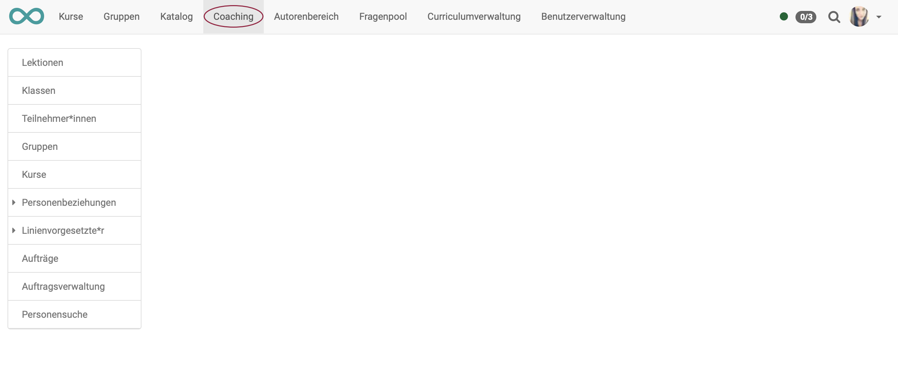

# Coaching - Übersicht

## Wozu dient das Coaching Tool?

Letztlich werden Sie sich immer wieder Leistungsdaten oder den Bearbeitungsstand einzelner Lernender ansehen. Die Wege dorthin können aber unterschiedlich sein.

Das Coaching Tool dient der **kursübergreifenden** Organisation und Verwaltung von Kursen, Teilnehmenden und Gruppen, sowie der **kursübergreifenden** Korrektur von Assessmentbausteinen, dem **kursübergreifenden** Absenzenmanagement und dem externen Korrektoren-Flow von OpenOlat Tests.

Mit dem Coaching-Tool haben Kursbesitzer, Kursbettreuer und Gruppenbetreuer die Möglichkeit, alle ihnen zugewiesen Kurs- oder Gruppenteilnehmenden auf einen Blick zu sehen und zu verwalten. Sie gelangen von diesen Übersichten dann schnell auf unterschiedlichen Wegen zum Bewertungswerkzeug für einzelne Teilnehmende.

## Wer kann das Coaching Tool benutzen?

!!! info "Hinweis"

    Die Menüoption "Coaching" kann grundsätzlich nur erscheinen, wenn das Werkzeug vom OpenOlat Administrator auch aktiviert wurde.

Ob das Coaching Tool im Hauptmenü dann angezeigt wird, hängt von weiteren Faktoren ab:

* Systemrolle
* Kursrolle
* Kursstatus
* Teilnehmende in Kurs bzw. Gruppe

Aus jeder Spalte muss mindestens eine grün markierte Eigenschaft zutreffen:

{ class="shadow lightbox" }

## Die Werkzeuge

{ class="shadow lightbox" }

!!! info "Hinweis"

    Das Menü der linken Seite wird in den seltensten Fällen alle hier gezeigten Menüoptionen enthalten. Je nach aktivierten Modulen wird eine andere Zusammensetzung angezeigt. Hier im Handbuch soll zur Erklärung die maximale Auswahl gezeigt werden.

