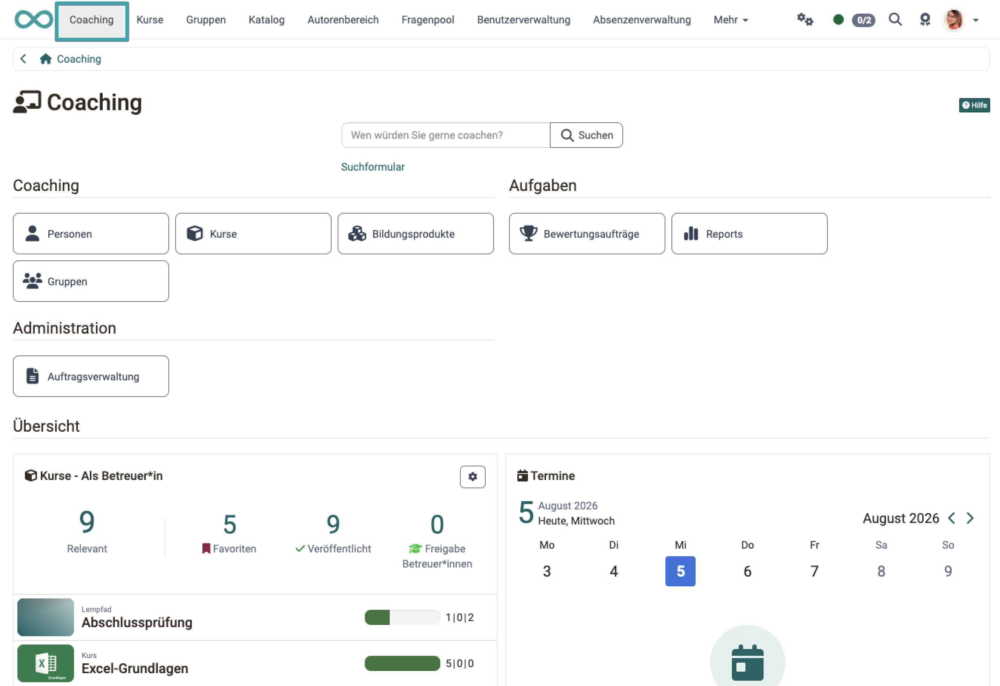
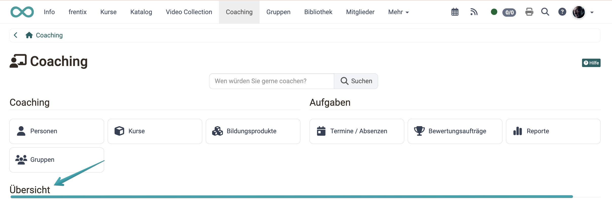
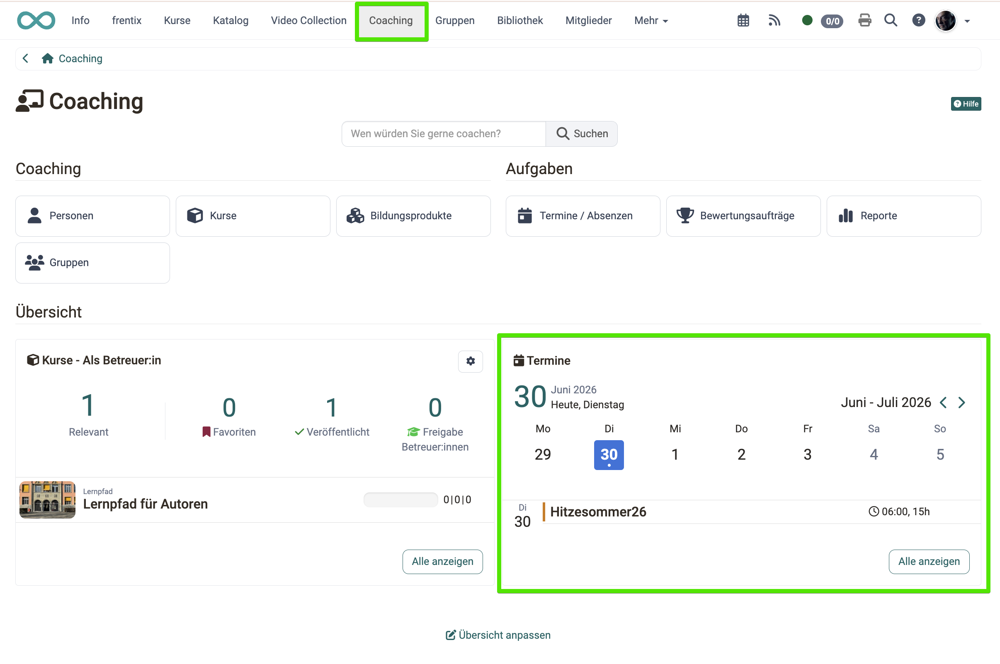
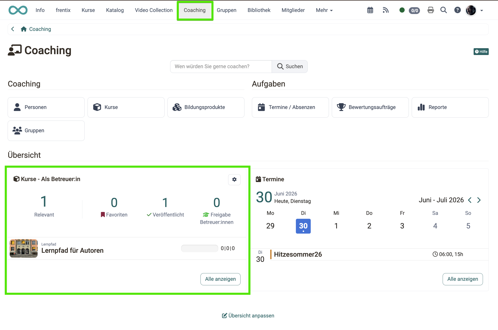

# Coaching - Übersicht {: #coaching}

## Steckbrief

Name | Coaching Tool
---------|----------
Verfügbar seit | Release 10.0 (2014)

## Wozu dient das Coaching Tool? {: #purpose}

Das Coaching Tool dient der **kursübergreifenden** Organisation und Verwaltung von Kursen, Teilnehmenden und Gruppen, sowie der Korrektur von Assessmentbausteinen, dem Absenzenmanagement und dem externen Korrektoren-Flow von OpenOlat Tests.

Mit dem Coaching Tool haben Kursbesitzer:innen, Kursbetreuer:innen, Gruppenbetreuer:innen, Ausbildungsverantwortliche und andere Berechtigte die Möglichkeit, alle ihnen zugewiesenen Kurs- oder Gruppenteilnehmenden auf einen Blick zu sehen und zu verwalten. Sie gelangen von diesen Übersichten dann schnell auf unterschiedlichen Wegen zum Bewertungswerkzeug für einzelne Teilnehmende.
{ class="shadow lightbox" }

---

## Die Werkzeuge [:octicons-tag-16:{ title="ab Release 20.0 (OO-8374)" }](https://track.frentix.com/issue/OO-8374) {: #tools}

Den Zugang zu den Daten der betreuten Personen und die Werkzeuge finden Sie unter den Buttons

* Personen
* Kurse
* Gruppen
* Termine / Absenzen
* Bewertungsaufträge
* Reports
* Auftragsverwaltung

!!! note "Hinweis"

    Ihr Menü wird oft nicht alle hier gezeigten Optionen enthalten. Je nach aktivierten Modulen und Rollen wird eine andere Zusammensetzung angezeigt. Hier im Handbuch soll zur Erklärung die maximale Auswahl gezeigt werden.

[Zum Seitenanfang ^](#coaching)

---

## Wann ist das Coaching Tool verfügbar? [:octicons-tag-16:{ title="ab Release 21.0.1 (OO-9661)" }](https://track.frentix.com/issue/OO-9661) {: #availability}

Das Coaching Tool ist fester Bestandteil von OpenOlat und kann nicht deaktiviert werden.

Ob die Menüoption "Coaching" im Hauptmenü für Sie angezeigt wird, hängt von folgenden Faktoren ab:

* **Systemrolle**: Gäste und Externe können kein Coaching vornehmen.
* Die **Kursrolle** muss Betreuer:in oder Besitzer:in sein. Teilnehmende können kein Coaching vornehmen.
* Der **Kursstatus** muss "Veröffentlicht", "Freigabe Betreuer:innen" oder "Beendet" sein.
* Ob es **Teilnehmende** (mind. 1 Person) in einem Kurs bzw. einer Gruppe hat.

[Zum Seitenanfang ^](#coaching)

---

## Wer verwendet das Coaching Tool typischerweise? {: #users}

Das Coaching Tool wird verwendet von

* Betreuer:innen, die Teilnehmende mehrerer Kurse betreuen
* Ausbildungsverantwortlichen
* Linienvorgesetzten
* Personen mit definierten Person-zu-Person-Beziehungen, z.B. Mentor - Mentee

Daneben haben auch administrative Rollen Zugriff.

[Zum Seitenanfang ^](#coaching)

---

## Die Fokus-Elemente {: #focus_elements}

Im Coaching Tool wird Ihnen oft eine Liste mit den von Ihnen betreuten Personen angezeigt.
Sind Sie z.B. nur in einem Kurs direkt Betreuer:in, aber daneben Ausbildungsverantwortliche:r, dann können Sie auf Grund dieser Rolle auch auf alle anderen Teilnehmenden zugreifen.

Mit den Fokus-Elementen über der Liste können Sie eine Ihrer Rollen wählen. Damit erhalten Sie eine Vorauswahl. In der Liste befinden sich dann nur noch von Ihnen betreute Personen, die Sie in dieser Rolle betreuen.

{ class="shadow lightbox" }

[Zum Seitenanfang ^](#coaching)

---

## Widgets {: #widgets}

### Übersicht [:octicons-tag-16:{ title="ab Release 20.3 (OO-9305)" }](https://track.frentix.com/issue/OO-9305) {: #widget_overview}

Ein Trennbereich mit der Bezeichnung **"Übersicht"** grenzt den nachfolgend beschriebenen Widget-Bereich optisch von den darüberliegenden Buttons/Launchern ab.
{ class="shadow lightbox" }

---

### Das Termine-Widget [:octicons-tag-16:{ title="ab Release 20.3 (OO-8865)" }](https://track.frentix.com/issue/OO-8865) {: #widget_events}

Das Widget **Termine** erscheint als Kachel auf der Coaching-Übersicht und zeigt die anstehenden Termine ab dem heutigen Tag bis zum Ende der aktuellen Woche auf einen Blick.

Angezeigt werden nur Termine, in denen Sie selbst als Dozent:in eingetragen sind, und nur aus Kursen mit eigener Terminkonfiguration. Termine aus Bildungsprodukten erscheinen hier nicht.

!!! info "Wichtig"

    Das gleichnamige Widget **Termine** im Course Planner zeigt andere Termine: dort erscheinen Termine aus Bildungsprodukten, für die Sie als Administrator:in, Absenzenverwalter:in, Besitzer:in oder Betreuer:in zuständig sind. Siehe [Course Planner: Dashboard](Course_Planner_Dashboard.de.md#widget_events).

Das Widget erscheint nur, wenn das Modul **Termin- und Absenzenverwaltung** systemweit aktiv ist.

#### Kopfbereich und Tagesanzeige

Der Kopfbereich des Widgets zeigt das aktuelle Datum mit Monat, Jahr und der Beschriftung **Heute, \<Wochentag\>**. Der heutige Tag ist hervorgehoben. Das Wochenende wird optisch zurückgenommen (gedämpft dargestellt).

#### Wochennavigation

Mit den Schaltflächen `<` und `>` navigieren Sie wochenweise durch die Termine. Eine Woche läuft immer von Montag bis Sonntag. Initial wird die aktuelle Woche ab dem heutigen Tag angezeigt.

Ein Punkt unter der Tagesziffer markiert die Tage, an denen Termine stattfinden. Die Tagesspalte bleibt beim Scrollen stehen, auch wenn die Woche viele Termine enthält. [:octicons-tag-16:{ title="ab Release 21.0 (OO-9515)" }](https://track.frentix.com/issue/OO-9515)

#### Terminliste

Pro Termin werden folgende Informationen angezeigt:

- Wochentag und Datum
- Status-Indikator
- Kennzeichen und Titel
- Ort (mit Ortssymbol)
- Zeit und Dauer (mit Uhrsymbol)

!!! note "Hinweis"
    In der schmalen (mobilen) Ansicht entfällt die Ortsspalte. Es wird nur die Uhrzeit angezeigt.

{ class="shadow lightbox" }

#### Leerer Zustand

Sind in der angezeigten Woche keine Termine vorhanden, erscheint der Hinweis **Keine Termine bis Ende der Woche**. Über die Schaltflächen **Vorheriger Termin** und **Nächster Termin** springen Sie zum nächstgelegenen Termin in der Vergangenheit oder Zukunft.

!!! info "Wichtig"
    Das Widget fehlt ganz, wenn Sie auf keinem einzigen Termin als Dozent:in eingetragen und kein Master Coach sind. Liegt in der angezeigten Woche kein Termin, erscheint dagegen der Leerzustand.

#### Zur Vollansicht

Über den Button **Alle anzeigen** [:octicons-tag-16:{ title="ab Release 20.3 (OO-9244)" }](https://track.frentix.com/issue/OO-9244) gelangen Sie in das Werkzeug **Termine / Absenzen**.

!!! note "Hinweis"
    Das Widget ist eine Schnellübersicht der aktuellen Woche. Das vollständige Werkzeug **Termine / Absenzen** bietet zusätzlich die Tabs Cockpit, Absenzen, Meldungen, Rekurse und Personensuche.

[Zum Seitenanfang ^](#coaching)

---

### Das Kurs-Widget [:octicons-tag-16:{ title="ab Release 20.2 (OO-8863)" }](https://track.frentix.com/issue/OO-8863) {: #widget_courses}

Das Widget **Kurse - Als Betreuer:in** zeigt die von Ihnen betreuten Kurse.

{ class="shadow lightbox" }

Über den definierten Filter **"Relevant"** (standardmässig ausgewählt) oder eine der weiteren Filtervarianten erhalten Sie eine entsprechende Vorauswahl [:octicons-tag-16:{ title="ab Release 20.3 (OO-9195)" }](https://track.frentix.com/issue/OO-9195):

* **Favoriten** (standardmässig ausgewählt)
* **Alle** (nicht standardmässig ausgewählt)
* **Relevant** (standardmässig ausgewählt, Hauptkennzahl)
* **Veröffentlicht** (standardmässig ausgewählt)
* **Freigabe Betreuer:innen** (standardmässig ausgewählt)
* **Beendet** (nicht standardmässig ausgewählt)

Über den Button **Alle anzeigen** gelangen Sie zur vollständigen Kursliste im Werkzeug **Kurse**.

[Zum Seitenanfang ^](#coaching)

---

### Übersicht anpassen [:octicons-tag-16:{ title="ab Release 20.3 (OO-9273)" }](https://track.frentix.com/issue/OO-9273) {: #overview_customize}

Unterhalb der Widgets steht der Button **"Übersicht anpassen"**. Damit ordnen Sie die Kacheln neu an, blenden sie aus und holen sie zurück. Die Bedienung ist auf allen Übersichtsseiten gleich und dort einmal beschrieben: [Übersichtsseiten und Widgets >](../basic_concepts/Dashboard_Concept.de.md#customize)

[Zum Seitenanfang ^](#coaching)

---

## Weiterführende Informationen {: #further_information}

[Coaching: Personensuche >](../area_modules/Coaching_User_Search.de.md) 
[Coaching: Personen >](../area_modules/Coaching_People.de.md) 
[Coaching: Kurse >](../area_modules/Coaching_Courses.de.md) 
[Coaching: Bildungsprodukte >](../area_modules/Coaching_Educational_Products.de.md) 
[Coaching: Termine / Absenzen >](../area_modules/Coaching_Events_Absences.de.md) 
[Coaching: Bewertungsaufträge >](../area_modules/Coaching_Assessment_Orders.de.md) 
[Coaching: Reports >](../area_modules/Coaching_Reports.de.md) 
[Coaching: Gruppen >](../area_modules/Coaching_Groups.de.md) 
[Coaching: Auftragsverwaltung >](../area_modules/Coaching_Order_Management.de.md) 
[Course Planner: Dashboard >](../area_modules/Course_Planner_Dashboard.de.md) 
[Übersichtsseiten und Widgets >](../basic_concepts/Dashboard_Concept.de.md)

[Zum Seitenanfang ^](#coaching)
