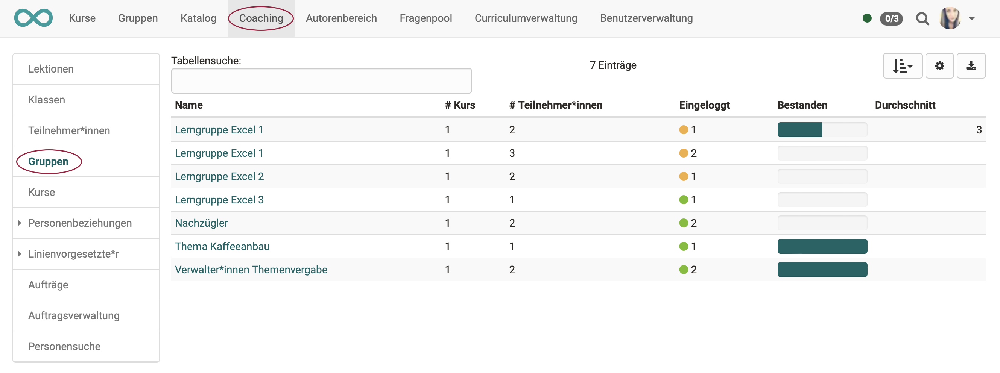
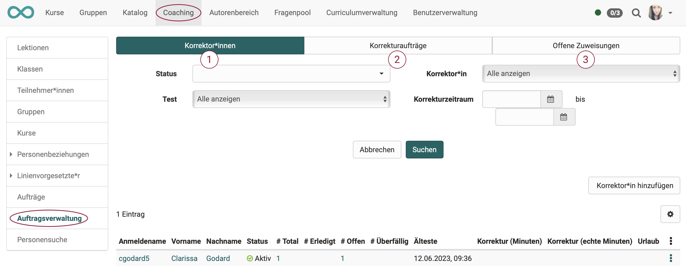

{ class="shadow lightbox" }

# Coaching - Übersicht

## Wozu dient das Coaching Tool?

Letztlich werden Sie sich immer wieder Leistungsdaten oder den Bearbeitungsstand einzelner Lernender ansehen. Die Wege dorthin können aber unterschiedlich sein.

Das Coaching Tool dient der **kursübergreifenden** Organisation und Verwaltung von Kursen, Teilnehmenden und Gruppen, sowie der **kursübergreifenden** Korrektur von Assessmentbausteinen, dem **kursübergreifenden** Absenzenmanagement und dem externen Korrektoren-Flow von OpenOlat Tests.

Mit dem Coaching-Tool haben Kursbesitzer, Kursbettreuer und Gruppenbetreuer die Möglichkeit, alle ihnen zugewiesen Kurs- oder Gruppenteilnehmenden auf einen Blick zu sehen und zu verwalten. Sie gelangen von diesen Übersichten dann schnell auf unterschiedlichen Wegen zum Bewertungswerkzeug für einzelne Teilnehmende.

## Wer kann das Coaching Tool benutzen?

!!! info "Hinweis"

    Die Menüoption "Coaching" kann grundsätzlich nur erscheinen, wenn das Werkzeug vom OpenOlat Administrator auch aktiviert wurde.

Ob das Coaching Tool im Hauptmenü dann angezeigt wird, hängt von weiteren Faktoren ab:

* Systemrolle
* Kursrolle
* Kursstatus
* Teilnehmende in Kurs bzw. Gruppe

Aus jeder Spalte muss mindestens eine grün markierte Eigenschaft zutreffen:

{ class="shadow lightbox" }

## Die Werkzeuge

{ class="shadow lightbox" }

!!! info "Hinweis"

    Das Menü der linken Seite wird in den seltensten Fällen alle hier gezeigten Menüoptionen A bis J enthalten.
    Je nach aktivierten Modulen wird eine andere Zusammensetzung angezeigt. Hier im Handbuch soll zur Erklärung die maximale Auswahl gezeigt werden.

---    

## A. Lektionen

!!! info "Hinweis"

    Dieses Werkzeug wird im Coaching Tool nur angezeigt, wenn vom Administrator das Modul Lektionen aktiviert wurde.

    Ausserdem muss mindestens 1 Lektionenblock vorhanden sein. (In mindestens einem Kurs muss unter den Einstellungen > Tab "Durchführung" > Abschnitt "Konfiguration Lektionen- und Absenzenmanagment im Kurs" das Lektionenmanagement eingeschaltet sein.

    Sind diese Voraussetzungen erfüllt, wird der zusätzliche Menüpunkt "Lektionen" im Coachingtool angezeigt.

    Siehe auch [Absenzmanagement](../course_operation/Lectures_and_absences.de.md)

{ class="shadow lightbox" }

### 1. Tab Cockpit

Du findest im Tab „Cockpit“ eine Tagesübersicht, während im Tab „Lektionen“ alle deine Lektionenblöcke angezeigt werden. Auch die bereits abgeschlossenen.

Im Cockpit kann ein bestimmter Termin ausgewählt und die zugehörigen Lektionen und Abwesenheiten im Überblick angezeigt werden. Über die angezeigte Übersicht und Klick auf den jeweiligen Kurs hat der Lehrende Zugriff auf weitere Informationen und kann auch die Absenzerfassung abschliessen.

### 2. Tab Lektionen

Hier kann ein Zeitfenster ausgewählt und nach Stichworten gesucht werden. Es wird eine Übersicht der Lektionenblöcke für diese Zeitspanne angezeigt. Weitere Informationen zum Thema „Lektionen“ finden Sie
[hier](../course_operation/Lectures_-_Teacher_view.de.md).

### 3. Tab Absenzen

Hier kann nach Benutzern, Dozenten, Kurstiteln und Lektionenblöcken gesucht werden. Es können die Absenzen bestimmter Personen für ein gewähltes Zeitfenster angezeigt werden. Je nach Bedarf können die Spalten sortiert werden. (Z.B. nach Kursen, Datum, entschuldigt, Namen, usw.)

### 4. Tab Meldungen

Hier kann nach Benutzern, Dozenten, Kurstiteln, Lektionenblöcken und der Art der Meldung gesucht werden.

Ähnlich wie im Tab Absenzen können hier Abmeldungen und Dispensen nach bestimmten Kriterien angezeigt und auch neue Dispensen erfasst werden.

### 5. Tab Rekurse

Hier kann nach abgelehntem, angenommenem oder pendentem Status für einen bestimmten Zeitraum gesucht werden.

### 6. Tab Personensuche

Hier finden Sie die Standardsuche nach Personen.

---

## B. Klassen

!!! info "Hinweis"

    Dieses Werkzeug wird im Coaching Tool nur angezeigt, wenn vom Administrator das Modul Curriculum aktiviert wurde.

{ class="shadow lightbox" }

Im Curriculum besteht die Möglichkeit, einer Person die Rolle der Klassenlehrerin bzw. des Klassenlehrers zuzuweisen. Für jedes Curriculumelement kann dies eine andere Person sein.

Im Coachingtool werden dann Ihre Klassen angezeigt.

---

## C. Teilnehmer:innen

{ class="shadow lightbox" }

### 1. WEN zeigt die Liste?

Der Menüpunkt "Teilnehmer:innen" zeigt die Liste **aller von Ihnen betreuten** Teilnehmer:innen.

  * Jeder Coach (Betreuer:in) sieht nur die von ihr/ihm betreuten Teilnehmer:innen.
  * Es werden die Teilnehmer:innen aus **allen** betreuten Kursen angezeigt. (im Unterschied zum Bewertungswerkzeug des Kurses. Dort werden nur Teilnehmer:innen des aktuellen Kurses angezeigt.)

### 2. WAS zeigt die Liste?  

Sie können die angezeigten Spalten selbst festlegen, indem Sie rechts oben auf das Zahnrad-Icon klicken. Typischerweise sehen Sie

* Name, Vorname  Ein Klick auf den Namen einer Person führt zur Übersicht aller Kurse dieses Teilnehmers. So erhält die/der Lehrende Zugriff auf die Assessmentbereiche eines Kurses der Person inklusive des Zugriffes auf den jeweiligen Leistungsnachweis, das Bewertungswerkzeug des Kurses sowie die jeweiligen Lektionen.
* Eingeloggt 
In der Spalte "Eingeloggt" gibt eine farbliche Kodierung und eine Zahl einen raschen Überblick, ob sich Teilnehmende bereits in all ihre Kurse eingeloggt haben (= grün) oder ob sie sich bisher nur in einen Teil der Kurse (=orange) oder noch gar nicht (=rot) eingeloggt haben.
* In wie vielen der von Ihnen betreuten Kurse ist ein/e Benutzer:in Mitglied?
* Wie viele davon sind schon besucht oder bestanden?
* usw.

---

## D. Gruppen

{ class="shadow lightbox" }

### 1. WEN zeigt die Liste?
Der Menüpunkt "Gruppen" zeigt die Liste aller von Ihnen betreuten Gruppen, jedoch nur Gruppen aus Kursen, die sich im Coaching Tool befinden.

Im Unterschied zur Teilnehmer- und Kursübersicht (A und C) erscheinen in der Gruppenübersicht (B) nur die OpenOlat-Benutzer, die in einer der kursbezogene Gruppen eingetragen sind.

### 2. WAS zeigt die Liste?  

Sie sehen auf einen Blick,

* in wie vielen Kursen die jeweilige Gruppe eingebunden ist,
* ob sich alle Gruppenmitglieder schon mindestes einmal in die Gruppe eingeloggt haben,
* wie viele Teilnehmende die Gruppe insgesamt hat,
* und wie viele Gruppenmitglieder den dazugehörigen Kurs bereits bestanden haben. (Sofern ein Bestehen im Kurs konfiguriert wurde.)

Ein Klick auf einen Gruppennamen öffnet die Liste der Gruppenmitglieder mit weiteren Informationen zum Punktestand, Zertifikat usw. 
Wenn Sie dann auf einen Benutzernamen klicken, öffnet sich wiederum die benutzerspezifische Übersicht:

* Sie erhalten Zugriff auf das Bewertungswerkzeug der Person für den zugehörigen Kurs
* und Sie haben Zugriff auf die Lektionen und den jeweiligen Leistungsnachweis, sofern aktiviert.

Auf diesem Weg können Sie also auch Gruppenmitglieder bewerten.

---

## E. Kurse

{ class="shadow lightbox" }

### 1. WELCHE Kurse zeigt die Liste?

Im Menü Kurse sehen Sie eine tabellarische Übersicht

* aller von Ihnen betreuten Kurse,
* die veröffentlicht, beendet oder zumindest für Betreuer zugänglich sind
* und auch die weiteren oben in der Tabelle genannten Anforderungen erfüllen.

### 2. WAS zeigt die Liste?

Sie sehen auf einen Blick,

* die Teilnehmerzahl der einzelnen Kurse,
* den Fortschritt der Kursteilnehmenden
* sowie das Ausmass des Logins der Kursteilnehmenden.
  * Ein grüner Punkt symbolisiert, dass sich alle Kursteilnehmer mindestens einmal eingeloggt haben.
  * Ein oranger Punkt zeigt an, dass ein Teil der Kursteilnehmenden den Kurs schon mal aufgerufen hat.
  * Ein roter Punkt zeigt an, dass sich bisher noch keine Teilnehmenden in den Kurs eingeloggt haben.

Ein weiterer Klick auf einen Kursnamen führt zu einer Übersicht der von Ihnen betreuten Kursteilnehmenden dieses Kurses und man erkennt rasch den Kursfortschritt der Teilnehmenden. Anschliessend kann wieder zum Bewertungswerkzeug eines Kursteilnehmers navigiert, sowie die Leistungsübersicht oder das Absenzenmanagement angezeigt werden.

Weitere Spalten können Sie selbst festlegen, indem Sie rechts oben auf das Zahnrad-Icon klicken.

---

Im Menü Kurse sehen Sie eine tabellarische Übersicht aller von Ihnen betreuten Kurse, die veröffentlicht, beendet oder zumindest für Betreuer zugänglich sind und auch die weiteren oben in der Tabelle genannten Anforderungen erfüllen.

{ class="shadow lightbox" }

In diesem Bereich erhält man auch schnell einen Überblick über die Teilnehmerzahl der einzelnen Kurse, den Fortschritt der gesamten Kursteilnehmenden sowie das Ausmass des Logins der Kursteilnehmenden.

Ein grüner Punkt symbolisiert, dass sich alle Kursteilnehmer mindestens einmal eingeloggt haben. Ein oranger Punkt zeigt an, dass ein Teil der Kursteilnehmenden den Kurs schon mal aufgerufen hat. Ein roter Punkt zeigt an, dass sich bisher noch keine Teilnehmenden in den Kurs eingeloggt haben.

Ein weiterer Klick auf einen Kursnamen führt zu einer Übersicht der von Ihnen betreuten Kursteilnehmenden dieses Kurses und man erkennt rasch den Kursfortschritt der Teilnehmenden. Anschliessend kann wieder zum Bewertungswerkzeug eines Kursteilnehmers navigiert, sowie die Leistungsübersicht oder das Absenzenmanagement angezeigt werden.

---

## F. Personenbeziehungen

{ class="shadow lightbox" }

Mit der Benutzer-zu-Benutzerbeziehung in OpenOlat können in der Administration bzw. in der Benutzerverwaltung kursübergreifende Betreuungsfunktionen für beispielsweise Mentoren, Lernbegleiter und Vorgesetzte eingerichtet werden. Ist dies der Fall, können Betreuende im Coaching Tool einfach und übersichtlich auf die zu betreuenden Personen zugreifen und Bewertungen vornehmen.

Für jede Benutzer-zu-Benutzerbeziehung können spezifische Rechte definiert und somit der Zugriff auf explizit freigegebene Inhalte der Betreuten erteilt werden, wie z.B. Kursliste, Kalender, Absenzenübersicht, Leistungsnachweise und Zertifikate. Analog wird auch die Rolle "Linienvorgesetzter" im Coachingtool abgebildet. Hier kann ebenfalls auf definierte Inhalte von Benutzern der eigenen Organisationseinheit zugegriffen werden.

---

## G. Linienvorgesetzte

!!! info "Hinweis"

    Dieses Werkzeug wird im Coaching Tool nur angezeigt, wenn vom Administrator das Modul Organisation aktiviert wurde.

{ class="shadow lightbox" }

Sind Sie Linienvorgesetzte/r, können Sie sich über die Lernfortschritte innerhalb ihrer Organisationseinheit informieren. Auch eine automatische Benachrichtigung über alle erhaltenen Zertifikate ist möglich.

---

## H. Aufträge

{ class="shadow lightbox" }

### 1. Tab Offene Bewertungen

{ class="shadow lightbox" }

Hier haben Sie Zugriff auf alle Kursbausteine, die noch zu bewerten sind. Diese können entsprechend der Spalten sortiert und dann einzeln ausgewählt und bewertet werden. Mit Klick auf den Link "Bewerten" gelangt man in das entsprechende Bewertungsformular.

### 2. Tab Offene Einstufungen/Noten
Hier finden Sie alle Kursbausteine, die zwar schon bewertet wurden, bei denen aber die manuelle Zuordnung zu einer Notenskala bzw. einem Bewertungssystem noch nicht abgeschlossen wurde.

Der Tab ist nur relevant, wenn mindestens einem  Kursbaustein auch eine Bewertungsskala zur manuellen Freigabe zugewiesen wurde.

### 3. Tab Freizugebende Bewertungen

Hier finden Sie alle Bewertungen, die noch nicht für den User sichtbar sind und noch freigegeben werden müssen. In diesem Tab ist es auch möglich alle Kursbausteine auszuwählen und dann alle auf einen Schlag freizugeben.

---

## I. Auftragsverwaltung

{ class="shadow lightbox" }

Dieses Menü bezieht sich auf den Korrektur-Workflow für die manuelle Bewertung von OpenOlat Tests. In der Lernressource Test kann der Korrektur-Workflow aktiviert werden. Sie können dann Tests eine oder mehrere Personen als Korrektoren zuordnen. Sofern Sie mindestens Besitzer eines Tests sind, bei dem diese Option aktiviert wurde, sehen Sie im Coaching Tool die Auftragsverwaltung und können die einzelnen Korrektoren und ihre Aktivitäten verwalten.

### 1. Tab Korrektoren

Hier erhalten Sie einen Überblick über alle Ihre Korrektoren und deren Bewertungsstand und können die Korrektoren auch nach verschiedenen Kriterien z.B. für bestimmte Kurse, konkrete Tests oder noch offene Bewertungen filtern.

Über die entsprechende Spaltenauswahl kann man sich anzeigen lassen, wie viele Tests ein Korrektor insgesamt bewerten soll, wie viele er schon erledigt hat, wie viele offen sind und welche überfällig sind und welche Korrekturzeit vorgesehen ist. Ferner können auch weitere Korrektoren einem Test hinzugefügt oder bestehende Zuordnungen deaktiviert werden.

Ein Hinzufügen von Korrektoren ist ebenfalls direkt bei der jeweiligen
[Test-Lernressource](../tests/Test_settings.de.md) möglich.

### 2. Tab Korrekturaufträge

Dieser Tab erscheint nur wenn man als Korrektor für einen Test eingetragen wurde. Man sieht eine Übersicht der Tests in den verschiedenen Kursen, die man noch manuell prüfen und korrigieren muss. Je nach Einstellung in der Lernressource "Test", erfolgt die Bewertung anonym oder nicht.

{ class="shadow lightbox" }

Über den Link „Korrigieren“ gelangt der Korrektor direkt zum zu korrigierenden Test und kann hier manuelle Bewertungen vornehmen und auch automatische Bewertungen, wenn notwendig, überschreiben. Sinnvoll ist es auch einen entsprechenden Kommentar zu hinterlassen.

Lernressourcenverwalter oder Kursbesitzer erhalten im Menü "Korrekturaufträge" eine Übersicht mit allen Korrektoren und deren Korrekturaufträgen. Inklusive der Anzeige, wie viele Aufträge noch offen bzw. überfällig sind.

{ class="shadow lightbox" }

### 3. Tab Offene Zuweisungen

tbd

---

## J. Personensuche

{ class="shadow lightbox" }

  Es kann gesucht werden nach

  * einzelnen Personen
  * Betreuern
  * Personen bestimmter Kurse
  * dem Curriculum

