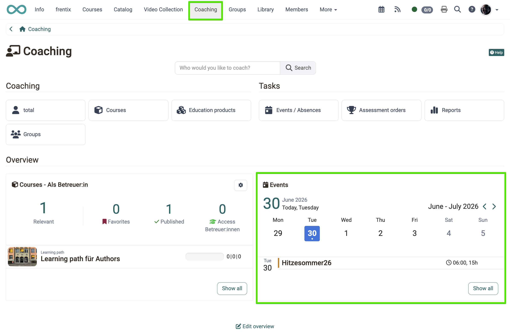

# Coaching - Overview

## What is the Coaching Tool for? {: #purpose}

The Coaching Tool is used for the **cross-course** organization and administration of courses, participants and groups, as well as the **cross-course** correction of assessment modules, the **cross-course** absence management and the external corrector flow of OpenOlat tests.

With the coaching tool, course owners, course coaches and group coaches have the possibility to see and manage all course or group participants assigned to them at a glance. They can then quickly go from these overviews to the assessment tool for individual participants in different ways.

---

## The tools [:octicons-tag-16:{ title="from Release 20.0 (OO-8374)" }](https://track.frentix.com/issue/OO-8374) {: #tools}

You can find access to the data of the persons under care and the tools under the buttons.

* Persons
* Courses
* Groups
* Events / Absences
* Evaluation tasks
* Reports
* Order management

{ class="shadow lightbox" }

!!! note "Note"

    The menu will rarely contain all the options shown here. Depending on the activated modules, a different composition is displayed. Here in the manual, the maximum selection is shown for explanation.

[To the top of the page ^](#coaching)

---

## When is the Coaching tool available? {: #availability}

The "Coaching" menu option is only displayed if coaching has been activated in the OpenOlat administration.

Whether the coaching tool is displayed in the main menu depends on other factors:

* **System roles**: Guests and external parties are not permitted to provide coaching.
* The **course role** must be a coach or owner. Participants cannot provide coaching. 
* The **course status** must be "Published", "Approved for instructors", or "Completed".
* Whether there are **participants** (at least 1 person) in a course or group.

[To the top of the page ^](#coaching)

---

## Who can use the Coaching tool?

The coaching tool is used by

* Coaches who supervise participants in multiple courses
* Education managers
* Line managers
* Individuals with person to person relations, e.g. Mentor - Mentee

Additionally administrative roles have access.

[To the top of the page ^](#coaching)

---

## The focus elements [:octicons-tag-16:{ title="from Release 20.0 (OO-8374)" }](https://track.frentix.com/issue/OO-8374) {: #focus_elements}

The coaching tool often displays a list of the people you are coaching.
If, for example, you are only a direct coach in one course but also an education manager, you can access all other participants based on this role.

You can select one of your roles using the focus elements above the list. This will give you a preselection. The list will then only contain people you are responsible for in this role.

{ class="shadow lightbox" }

[To the top of the page ^](#coaching)

---

## The Event widget [:octicons-tag-16:{ title="from Release 20.3 (OO-9113)" }](https://track.frentix.com/issue/OO-9113) {: #widget_events}

The **Event** widget appears as a tile on the Coaching overview and shows the upcoming events from today until the end of the current week at a glance.

### Header and day display

The widget header shows the current date with month, year and the label **Today, \<weekday\>**. Today's date is highlighted. The weekend is visually toned down.

### Week navigation

Use the `<` and `>` buttons to navigate through the events week by week. A week always runs from Monday to Sunday. Initially, the current week from today onwards is displayed.

### Event list

Each event shows the following information:

- Weekday and date
- Status indicator
- External reference and title
- Location (with location icon)
- Time and duration (with clock icon)

!!! note "Note"
    In the narrow (mobile) view, the location column is omitted. Only the time is shown.

{ class="shadow lightbox" }

### Empty state

If there are no events in the displayed week, the message **No events until the end of the week** appears. Use the **Previous event** and **Next event** buttons to jump to the nearest event in the past or future.

!!! note "Note"
    If this coach has no events at all, the widget is hidden completely.

### Full view

The **Show all events** link takes you to the **Events / Absences** tool.

!!! Tip "Important"
    The widget is a quick overview of the current week. The full **Events / Absences** tool additionally offers the Cockpit, Absences, Reports, Appeals and Person search tabs.

[To the top of the page ^](#coaching)

---

## Further information {: #further_information}

[Coaching: User search >](../area_modules/Coaching_User_Search.md)
[Coaching: People >](../area_modules/Coaching_People.md) 
[Coaching: Courses >](../area_modules/Coaching_Courses.md) 
[Coaching: Educational_Products >](../../manual_user/area_modules/Coaching_Educational_Products.md) 
[Coaching: Events / Absences >](../area_modules/Coaching_Events_Absences.md) 
[Coaching: Assessment orders >](../area_modules/Coaching_Assessment_Orders.md) 
[Coaching: Reports >](../area_modules/Coaching_Reports.md) 
[Coaching: Groups >](../area_modules/Coaching_Groups.md) 
[Coaching: Order management >](../area_modules/Coaching_Order_Management.md)

[To the top of the page ^](#coaching)
