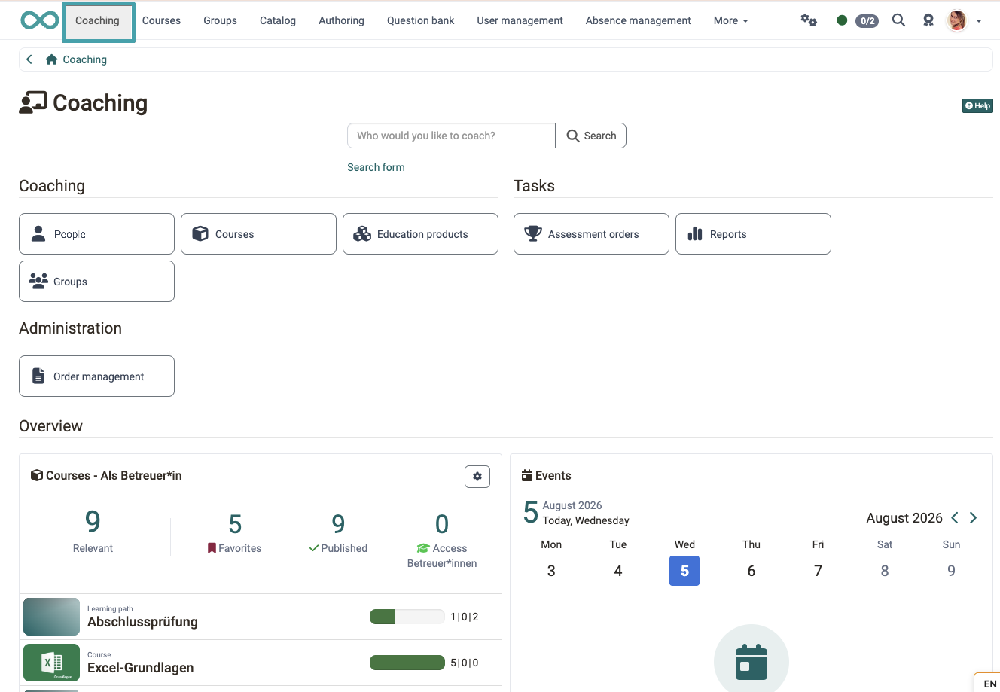
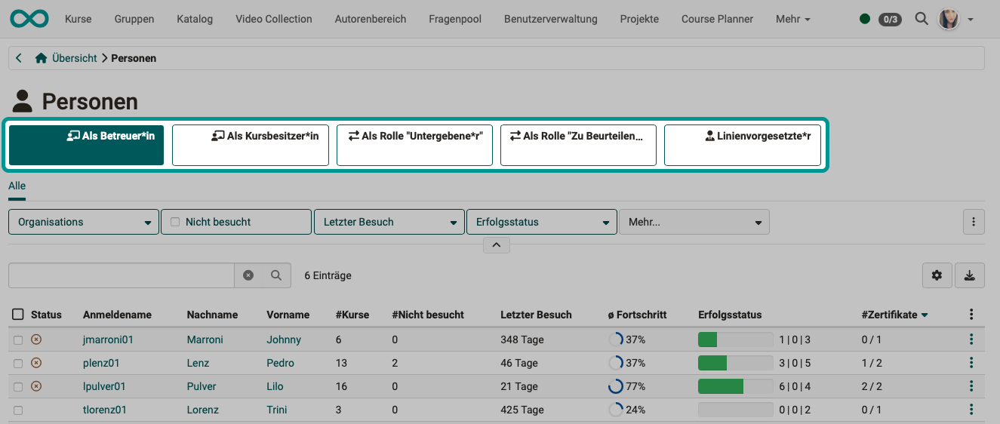
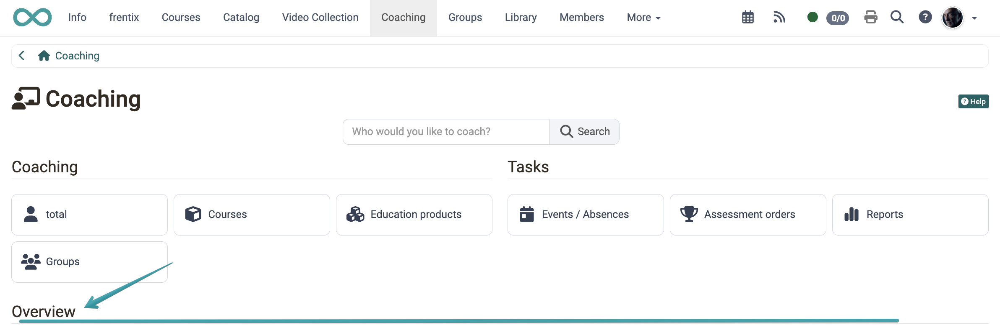
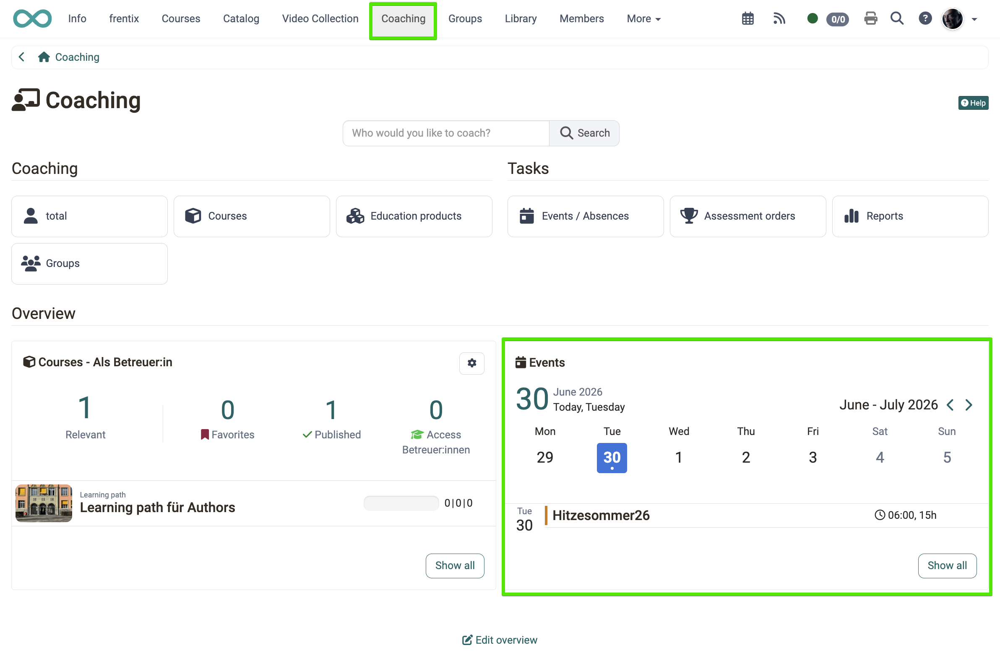
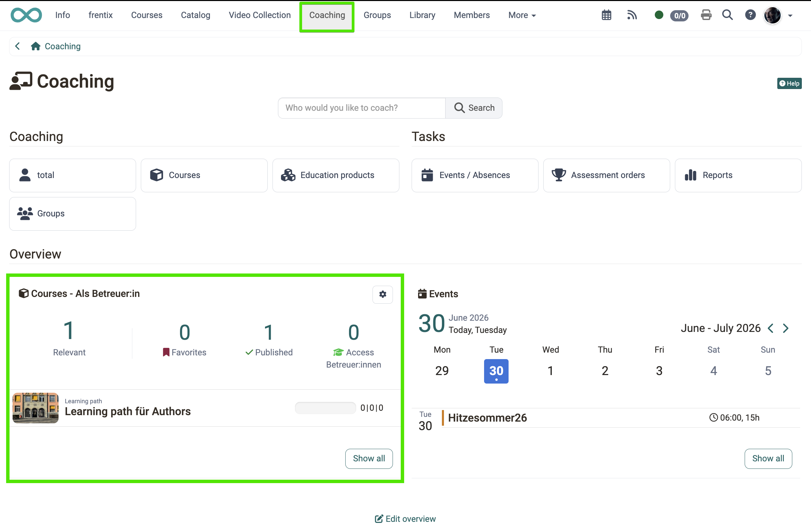
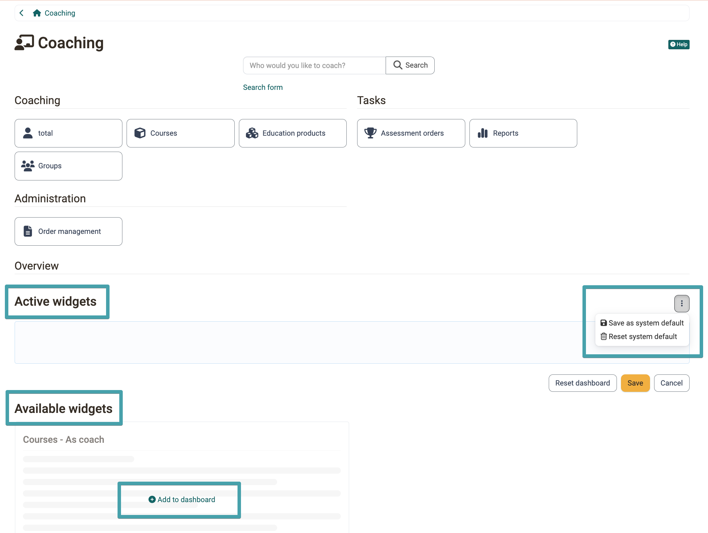

# Coaching - Overview {: #coaching}

## Profile

Name | Coaching Tool
---------|----------
Available since | Release 10.0 (2014)

## What is the Coaching Tool for? {: #purpose}

The Coaching Tool is used for the **cross-course** organization and administration of courses, participants and groups, as well as the correction of assessment modules, the absence management and the external corrector flow of OpenOlat tests.

With the coaching tool, course owners, course coaches and group coaches have the possibility to see and manage all course or group participants assigned to them at a glance. They can then quickly go from these overviews to the assessment tool for individual participants in different ways.
{ class="shadow lightbox" }

---

## The tools [:octicons-tag-16:{ title="from Release 20.0 (OO-8374)" }](https://track.frentix.com/issue/OO-8374) {: #tools}

You can find access to the data of the persons under care and the tools under the buttons.

* People
* Courses
* Groups
* Events / Absences
* Assessment orders
* Reports
* Order management

!!! note "Note"

    The menu will rarely contain all the options shown here. Depending on the activated modules, a different composition is displayed. Here in the manual, the maximum selection is shown for explanation.

[To the top of the page ^](#coaching)

---

## When is the Coaching tool available? [:octicons-tag-16:{ title="from Release 21.0.1 (OO-9661)" }](https://track.frentix.com/issue/OO-9661) {: #availability}

The Coaching tool is an integral part of OpenOlat and cannot be deactivated.

Whether the "Coaching" menu option is displayed in the main menu for you depends on the following factors:

* **System roles**: Guests and external parties are not permitted to provide coaching.
* The **course role** must be a coach or owner. Participants cannot provide coaching. 
* The **course status** must be "Published", "Access for coach", or "Completed".
* Whether there are **participants** (at least 1 person) in a course or group.

[To the top of the page ^](#coaching)

---

## Who typically uses the Coaching tool? {: #users}

The coaching tool is used by

* Coaches who supervise participants in multiple courses
* Education managers
* Line managers
* Individuals with person to person relations, e.g. Mentor - Mentee

Additionally administrative roles have access.

[To the top of the page ^](#coaching)

---

## The focus elements {: #focus_elements}

The coaching tool often displays a list of the people you are coaching.
If, for example, you are only a direct coach in one course but also an education manager, you can access all other participants based on this role.

You can select one of your roles using the focus elements above the list. This will give you a preselection. The list will then only contain people you are responsible for in this role.

{ class="shadow lightbox" }

[To the top of the page ^](#coaching)

---

## Widgets {: #widgets}

#### Overview [:octicons-tag-16:{ title="from Release 20.3 (OO-9305)" }](https://track.frentix.com/issue/OO-9305) {: #widget_overview}

A separator area labelled **"Overview"** visually separates the widget area described below from the buttons/launchers above it.
{ class="shadow lightbox" }

---

### The Event widget [:octicons-tag-16:{ title="from Release 20.3 (OO-8865)" }](https://track.frentix.com/issue/OO-8865) {: #widget_events}

The **Event** widget appears as a tile on the Coaching overview and shows the upcoming events from today until the end of the current week at a glance.

#### Header and day display

The widget header shows the current date with month, year and the label **Today, \<weekday\>**. Today's date is highlighted. The weekend is visually toned down.

#### Week navigation

Use the `<` and `>` buttons to navigate through the events week by week. A week always runs from Monday to Sunday. Initially, the current week from today onwards is displayed.

#### Event list

Each event shows the following information:

- Weekday and date
- Status indicator
- Reference and title
- Location (with location icon)
- Time and duration (with clock icon)

!!! note "Note"
    In the narrow (mobile) view, the location column is omitted. Only the time is shown.

{ class="shadow lightbox" }

#### Empty state

If there are no events in the displayed week, the message **No events until the end of the week** appears. Use the **Previous event** and **Next event** buttons to jump to the nearest event in the past or future.

!!! info "Important"
    If this coach has no events at all, the widget is hidden completely.

#### Full view

Use the **Show all** button [:octicons-tag-16:{ title="from Release 20.3 (OO-9244)" }](https://track.frentix.com/issue/OO-9244) to go to the **Events / Absences** tool.

!!! note "Note"
    The widget is a quick overview of the current week. The full **Events / Absences** tool additionally offers the Cockpit, Absences, Reports, Appeals and Person search tabs.

[To the top of the page ^](#coaching)

---

### The Course widget [:octicons-tag-16:{ title="from Release 20.2 (OO-8863)" }](https://track.frentix.com/issue/OO-8863) {: #widget_courses}

The **Courses - As coach** widget shows the courses you coach.

{ class="shadow lightbox" }

Use the defined filter **"Relevant"** (selected by default) or one of the other filter variants to get a corresponding preselection [:octicons-tag-16:{ title="from Release 20.3 (OO-9195)" }](https://track.frentix.com/issue/OO-9195):

* **Favourites** (selected by default)
* **All** (not selected by default)
* **Relevant** (selected by default, main key figure)
* **Published** (selected by default)
* **Access for coach** (selected by default)
* **Finished** (not selected by default)

Use the **Show all** button to go to the full course list in the **Courses** tool.

[To the top of the page ^](#coaching)

---

### Edit overview [:octicons-tag-16:{ title="from Release 20.3 (OO-9273)" }](https://track.frentix.com/issue/OO-9273) {: #overview_customize}

Below the widgets, the **"Edit overview"** button takes you to the edit mode.

The edit mode offers two areas:

* **Active widgets**: Here you rearrange the widgets via drag and drop (Move widget) or remove them.
* **Available widgets**: Here you find deactivated widgets, which you can activate again via the **"Add to dashboard"** link. Newly added widgets are inserted at the end of the active widgets.

{ class="shadow lightbox" }

Use **"Save"** to apply your arrangement and **"Cancel"** to discard the changes. **"Reset dashboard"** restores the default arrangement.

!!! tip "Note for system administrators"

    As a system administrator, the edit mode offers you the additional actions **"Save as system default"** and **"Reset system default"** to define the system default for all users without a personal configuration. This also allows you to hide a single widget, e.g. the Event widget, for all users without a personal arrangement.

[To the top of the page ^](#coaching)

---

## Further information {: #further_information}

[Coaching: User search >](../area_modules/Coaching_User_Search.md) 
[Coaching: People >](../area_modules/Coaching_People.md) 
[Coaching: Courses >](../area_modules/Coaching_Courses.md) 
[Coaching: Educational products (several courses or implementations as one offering) >](../../manual_user/area_modules/Coaching_Educational_Products.md) 
[Coaching: Events / Absences >](../area_modules/Coaching_Events_Absences.md) 
[Coaching: Assessment orders >](../area_modules/Coaching_Assessment_Orders.md) 
[Coaching: Reports >](../area_modules/Coaching_Reports.md) 
[Coaching: Groups >](../area_modules/Coaching_Groups.md) 
[Coaching: Order management >](../area_modules/Coaching_Order_Management.md)

[To the top of the page ^](#coaching)
