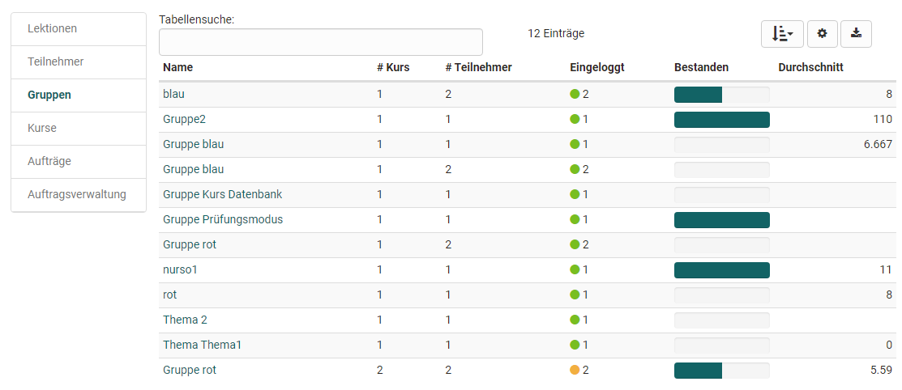

# Coaching

The Coaching tool is used for the cross-course organisation and administration of courses, participants and groups as well as for cross-course correction of tests and cross-course absence management.
und dem externen Korrektoren-Flow von OpenOlat Tests.

With the Coaching tool, group and course coaches have the possibility to see and manage all course or group participants assigned to them at a glance. 

Use the menu to view the learning statistics of individual users, groups or courses and to quickly access the assessment tool for individual participants in different ways. This allows coaches to quickly make assessments and get a complete overview.

**Wer sieht das Coaching Menü?**

Ob das Coaching Tool angezeigt wird hängt von mehreren Faktoren ab:
* Systemrolle
* Kursrolle
* Kursstatus
* Teilnehmende in Kurs bzw. Gruppe

!!! info "Hinweis"

    The tab "Coaching" only appears if this option has been activated by the administrator und mindestens aus jeder Anforderungsspalte der Tabelle eine Option zutrifft (grüne Markierung)

Im Folgenden werden die Menüs des Coaching Tools näher erläutert.

## Lectures

If the [absence management](../learningresources/Lectures_and_absences.md) of OpenOlat is used, the area "Lectures" also appears in the coaching module.

{ class="shadow lightbox" }

### Tab Cockpit

A specific day can be selected in the cockpit and the corresponding lectures and absences can be displayed in an overview. Via the displayed overview and by clicking on the respective course, the coach also has access to further information.

### Tab Lectures

Here you can select a time window and search for keywords. An overview of different lecture blocks is displayed. You can find more information about "[Lectures](../learningresources/Lectures_Teacher_view.md) here.

### Tab Absences

Hier kann nach Benutzern, Dozenten, Kurstiteln und Lektionenblöcken gesucht werden und die Absenzen bestimmter Personen für ein gewähltes Zeitfenster angezeigt werden. Eine Sortierung der Spalten kann je nach Bedarf z.B. nach Kursen, Datum, entschuldigt, Namen usw. erfolgen.

### Tab Notice Notices

Hier kann nach Benutzern, Dozenten, Kurstiteln, Lektionenblöcken und der Art der Meldung gesucht werden.

Similar to the Absences tab, notices of absences and dispensations can be displayed here according to certain criteria and new dispensations can also be entered.

### Tab Appeals (?)

Here you can search for rejected, accepted or pending status for a certain period of time.

### Tab User search

Overview of all users of the respective coach. You can search for individual persons as well as for persons of certain courses or for the curriculum.

## Members

The "Participants" area contains an overview, including the current status of all participants from all courses of the respective coach, which are displayed in the Coaching Tool. 

{ class="shadow lightbox" }

This table provides you with an overview of how many courses you are coaching a user is a member of (column "# Course"), how many of them they have already attended (column "Logged in") or passed. In the column "Logged in" a color coding as well as the number gives a quick overview if participants have already logged in to all their courses (=green) or if they have logged in to only a part of the courses (=orange) or not at all (=red) so far.

A click on the name leads to an overview of all courses of this participant. This gives the teacher access to the assessment areas of a person's course, including access to the respective credits, the course's assessment tool and the respective lessons.

## Groups

The menu item Groups opens a tabular overview of all the groups you have coached in the courses that are in the coaching tool. In contrast to the participant and course overview, only those OpenOlat users appear in the group overview who are linked to one of the coaching courses via the group system. You can see at a glance how many courses the respective group is involved in, whether all group members have already logged into the group at least once and how many participants the group has in total.

{ class="shadow lightbox

Furthermore you will get information about how many group members have already passed the corresponding course. A click on a group name opens the list of group members with further information about the score, certificate etc. Clicking on a username will again open the user-specific overview and you will get access to the person's assessment tool for the associated course and have access to the lessons and the respective certificate.

Ein Klick auf einen Gruppennamen öffnet die Liste der Gruppenmitglieder mit weiteren Informationen zum Punktestand, Zertifikat usw.. Wenn Sie dann auf einen Benutzernamen klicken, öffnet sich wiederum die benutzerspezifische Übersicht und Sie erhalten Zugriff auf das Bewertungswerkzeug der Person für den zugehörigen Kurs und haben Zugriff auf die Lektionen und den jeweiligen Leistungsnachweis, sofern aktiviert. Auf diesem Weg können sie also auch Gruppenmitglieder bewerten. 

## Courses

Im Menü Kurse sehen Sie eine tabellarische Übersicht aller von Ihnen betreuten Kurse, die veröffentlicht, beendet oder zumindest für Betreuer zugänglich sind und auch die weiteren oben in der Tabelle genannten Anforderungen erfüllen.

{ class="shadow lightbox" }

In this display you will also quickly get an overview of the number of participants of individual courses as well as the progress of the entire course participants. 

A green dot symbolizes that all course participants have logged in at least once. An orange dot indicates that some of the course participants have already accessed the course. A red dot indicates that no participants have logged into the course yet.

A further click on a course name shows the course participants you are coaching and their progress. Afterwards you can navigate back to the assessment tool of a course participant as well as display the performance overview or absence management.

## Orders

### Tab Open reviews

{ class="shadow lightbox" }

Hier haben Sie Zugriff auf alle Kursbausteine, die noch zu bewerten sind. Diese können entsprechend der Spalten sortiert und dann einzeln ausgewählt und bewertet werden. Mit Klick auf den Link "Bewerten" gelangt man in das entsprechende Bewertungsformular. 

### Tab open levels/gradings
Hier finden Sie alle Kursbausteine, die zwar schon bewertet wurden, bei denen aber  die manuelle Zuordnung zu einer Notenskala bzw. einem Bewertungssystem noch nicht abgeschlossen wurde. 

Der Tab ist nur relevant, wenn mindestens einem  Kursbaustein auch eine Bewertungsskala zur manuellen Freigabe zugewiesen wurde.

### Tab Reviews to release

Hier finden Sie alle Bewertungen, die noch nicht für den User sichtbar sind und noch freigegeben werden müssen. In diesem Tab ist es auch möglich alle Kursbausteine auszuwählen und dann alle auf einen Schlag freizugeben. 

### Tab Korrekturaufträge

Dieser Tab erscheint nur wenn man als Korrektor für einen Test eingetragen wurde. Man sieht eine Übersicht der zu Tests in den verschiedenen Kursen, die man noch manuell prüfen und korrigieren muss. Je nach Einstellung in der Lernressource Test erfolgt die Bewertung anonym oder nicht

{ class="shadow lightbox" }

Über den Link „Korrigieren“ gelangt der Korrektor direkt zum zu korrigierenden Test und kann hier manuelle Bewertungen vornehmen und auch automatische Bewertungen, wenn notwendig, überschreiben. Sinnvoll ist es auch einen entsprechenden Kommentar zu hinterlassen. 

## Orders management

Dieses Menü bezieht sich auf den Korrektur-Workflow für die manuelle Bewertung von OpenOlat Tests. In der Lernressource Test kann der Korrektur-Workflow aktiviert und einem Test Personen als Korrektoren zugeordnet werden. Sofern Sie mindestens Besitzer eines Tests sind bei dem diese Option aktiviert wurde, sehen Sie im Coaching Tool die Auftragsverwaltung und können die einzelnen Korrektoren und ihre Aktivtäten verwalten. 

### Tab Correctors

Here you get an overview of all persons who have been added to your own tests as graders. It is possible to filter the persons according to the respective tests or to get an overview of the assigned tests to be corrected for a person. Using the corresponding column selection, you can see how many tests a grader is supposed to evaluate in total, how many he/she has already completed, how many are open, which are overdue. The scheduled correction time and the actual correction time are also displayed. 

Test owners can also add further graders to their own tests at this point.

It is also possible to add graders directly at the respective [test learning resource](../learningresources/Test_settings.md).

### Tab Grading assignments

Here you can view the processing status of the grading assignments of the different graders of the tests you are the owner of and filter them according to various criteria.

{ class="shadow lightbox" }

## User relations

With the user-to-user relationship in OpenOlat, cross-course support functions can be set up in the administration or user management for mentors, learning guides and supervisors, for example. If this is the case, coaches can easily access the persons to be coached in the coaching tool and make evaluations.

For each user-to-user relationship, specific rights can be defined and thus access to explicitly approved content of the coaches can be granted, such as course list, calendar, absence overview, performance records and certificates. The role of "line manager" is mapped in the coaching tool in the same way. Here, defined contents can also be accessed by users of the own organizational unit.