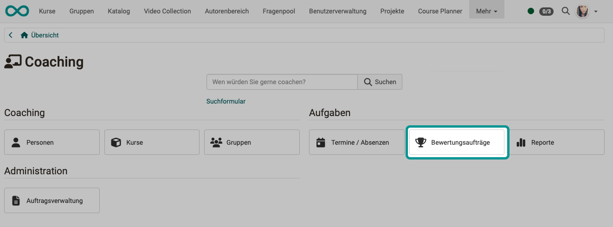
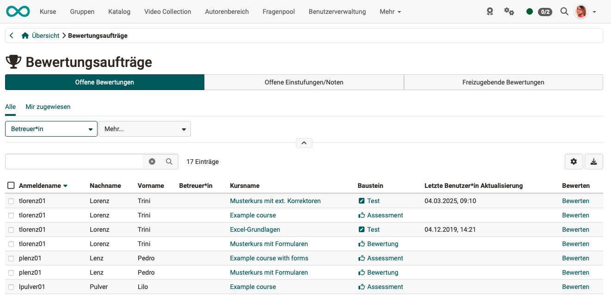

# Coaching - Bewertungsaufträge {: #assessment_orders}

{ class="shadow lightbox" }

Hier sehen Sie, an welchen Stellen noch konkrete Coaching Aktionen wie Bewertungen oder Einstufungen vorgenommen werden müssen, bzw. ob diese noch freigegeben werden müssen.

Je nach Rolle, sind neben Ihren eigenen Bewertungsaufträgen auch die übrigen angezeigt und Sie können sich einen Überblick verschaffen.

{ class="shadow lightbox" }

---

### Tab Offene Bewertungen {: #tab_open_assessments}

Hier haben Sie Zugriff auf alle Kursbausteine, die noch zu bewerten sind. Diese können entsprechend der Spalten sortiert und dann einzeln ausgewählt und bewertet werden. Mit Klick auf den Link "Bewerten" gelangt man in das entsprechende Bewertungsformular.

[Zum Seitenanfang ^](#assessment_orders)

---

### Tab Offene Einstufungen/Noten {: #tab_open_classifications_scores}

Hier finden Sie alle Kursbausteine, die zwar schon bewertet wurden, bei denen aber die manuelle Zuordnung zu einer Notenskala bzw. einem Bewertungssystem noch nicht abgeschlossen wurde.

Der Tab ist nur relevant, wenn mindestens einem  Kursbaustein auch eine Bewertungsskala zur manuellen Freigabe zugewiesen wurde.

[Zum Seitenanfang ^](#assessment_orders)

---

### Tab Freizugebende Bewertungen {: #tab_assessments_to_be_released}

Hier finden Sie alle Bewertungen, die noch nicht für die Teilnehmer:innnen sichtbar sind und noch freigegeben werden müssen. 

In diesem Tab ist es auch möglich, alle Kursbausteine auszuwählen und alle auf einmal freizugeben.

[Zum Seitenanfang ^](#assessment_orders)

---

## Weiterführende Informationen {: #further_information}

[Coaching: Personensuche >](../../manual_user/area_modules/Coaching_User_Search.de.md) 
[Coaching: Personen >](../../manual_user/area_modules/Coaching_People.de.md) 
[Coaching: Kurse >](../../manual_user/area_modules/Coaching_Courses.de.md) 
[Coaching: Bildungsprodukte >](../../manual_user/area_modules/Coaching_Educational_Products.de.md) 
[Coaching: Termine / Absenzen >](../../manual_user/area_modules/Coaching_Events_Absences.de.md) 
[Coaching: Reports >](../../manual_user/area_modules/Coaching_Reports.de.md) 
[Coaching: Gruppen >](../../manual_user/area_modules/Coaching_Groups.de.md) 
[Coaching: Auftragsverwaltung >](../../manual_user/area_modules/Coaching_Order_Management.de.md) 
[Rollen >](../../manual_user/basic_concepts/Roles.de.md) 
[Bewertungswerkzeug >](../../manual_user/learningresources/Assessment_tool_overview.de.md) 

[Zum Seitenanfang ^](#assessment_orders)