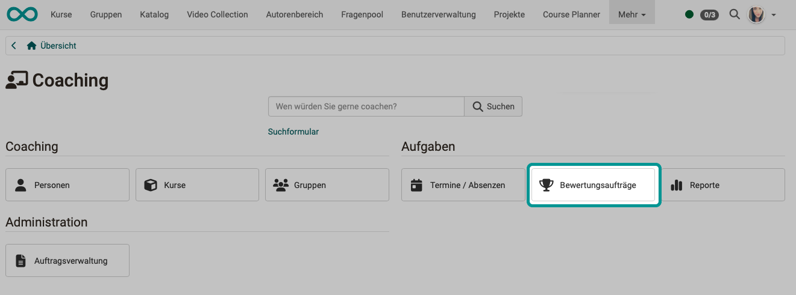
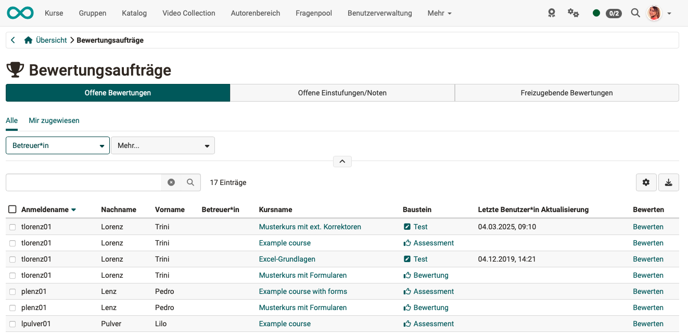
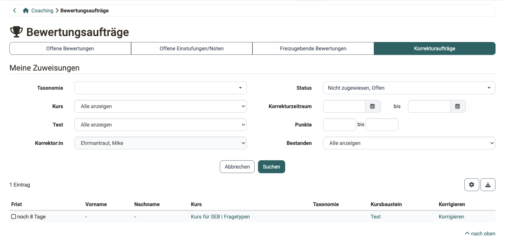

# Coaching - Bewertungsaufträge {: #assessment_orders}

{ class="shadow lightbox" }

Hier sehen Sie, an welchen Stellen noch konkrete Coaching Aktionen wie Bewertungen oder Einstufungen vorgenommen werden müssen, bzw. ob diese noch freigegeben werden müssen.

Je nach Rolle, sind neben Ihren eigenen Bewertungsaufträgen auch die übrigen angezeigt und Sie können sich einen Überblick verschaffen.

{ class="shadow lightbox" }

---

### Tab Offene Bewertungen {: #tab_open_assessments}

Hier haben Sie Zugriff auf alle Kursbausteine, die noch zu bewerten sind. Diese können entsprechend der Spalten sortiert und dann einzeln ausgewählt und bewertet werden. Mit Klick auf den Link "Bewerten" gelangt man in das entsprechende Bewertungsformular.

[Zum Seitenanfang ^](#assessment_orders)

---

### Tab Offene Einstufungen/Noten {: #tab_open_classifications_scores}

Hier finden Sie alle Kursbausteine, die zwar schon bewertet wurden, bei denen aber die manuelle Zuordnung zu einer Notenskala bzw. einem Bewertungssystem noch nicht abgeschlossen wurde.

Der Tab ist nur relevant, wenn mindestens einem  Kursbaustein auch eine Bewertungsskala zur manuellen Freigabe zugewiesen wurde.

[Zum Seitenanfang ^](#assessment_orders)

---

### Tab Freizugebende Bewertungen {: #tab_assessments_to_be_released}

Hier finden Sie alle Bewertungen, die noch nicht für die Teilnehmer:innnen sichtbar sind und noch freigegeben werden müssen. 

In diesem Tab ist es auch möglich, alle Kursbausteine auszuwählen und alle auf einmal freizugeben.

[Zum Seitenanfang ^](#assessment_orders)

---

### Tab Korrekturaufträge {: #tab_grading_assignments}

Dieser Tab erscheint nur, wenn Sie als Korrektor:in für einen Test eingetragen wurden. Sie sehen eine Übersicht der Tests in den verschiedenen Kursen, die Sie noch manuell prüfen und korrigieren müssen. Je nach Einstellung in der Lernressource "Test" erfolgt die Bewertung anonym oder nicht.

{ class="shadow lightbox" }

Im Beispiel ist die Korrektur anonym eingestellt. Deshalb zeigen die Spalten "Vorname" und "Nachname" nur einen Strich. Die Einstellung dazu treffen Sie in der Lernressource unter `Test > Administration > Korrektur-Workflow > Tab "Konfiguration"`.

Über den Link "Korrigieren" gelangen Sie direkt zum zu korrigierenden Test und nehmen dort manuelle Bewertungen vor. Automatische Bewertungen können Sie überschreiben. Hinterlassen Sie dazu einen Kommentar.

Bei Freitextfragen laden Sie die Antwort einer Person über den Button "Als PDF herunterladen" oben rechts als PDF herunter. Das PDF enthält im Kopfbereich Angaben zu Kurs, Kursbaustein und Test. Bei anonymer Korrektur erscheint anstelle der persönlichen Angaben die "Teilnehmendenkennung". Alle Antworten einer Frage auf einmal laden Sie im [Korrekturwerkzeug des Kurses](../learningresources/Assessing_tests.de.md) herunter.

!!! info "Voraussetzung"

    Der Download setzt voraus, dass in der Administration ein [PDF-Service](../../manual_admin/administration/External_Tools_-_Administration.de.md#pdf_generator) konfiguriert ist.

Die Verwaltung aller Korrektor:innen und ihrer Aufträge liegt dagegen in der [Auftragsverwaltung](Coaching_Order_Management.de.md).

[Zum Seitenanfang ^](#assessment_orders)

---

## Weiterführende Informationen {: #further_information}

[Coaching: Personensuche >](../../manual_user/area_modules/Coaching_User_Search.de.md) 
[Coaching: Personen >](../../manual_user/area_modules/Coaching_People.de.md) 
[Coaching: Kurse >](../../manual_user/area_modules/Coaching_Courses.de.md) 
[Coaching: Bildungsprodukte >](../../manual_user/area_modules/Coaching_Educational_Products.de.md) 
[Coaching: Termine / Absenzen >](../../manual_user/area_modules/Coaching_Events_Absences.de.md) 
[Coaching: Reports >](../../manual_user/area_modules/Coaching_Reports.de.md) 
[Coaching: Gruppen >](../../manual_user/area_modules/Coaching_Groups.de.md) 
[Coaching: Auftragsverwaltung >](../../manual_user/area_modules/Coaching_Order_Management.de.md) 
[Rollen >](../../manual_user/basic_concepts/Roles.de.md) 
[Bewertungswerkzeug >](../../manual_user/learningresources/Assessment_tool_overview.de.md) 
[Tests bewerten >](../../manual_user/learningresources/Assessing_tests.de.md) 

[Zum Seitenanfang ^](#assessment_orders)