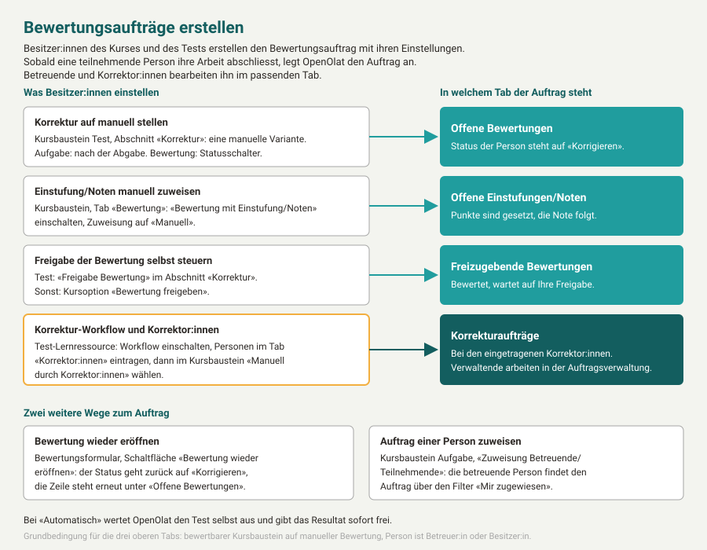
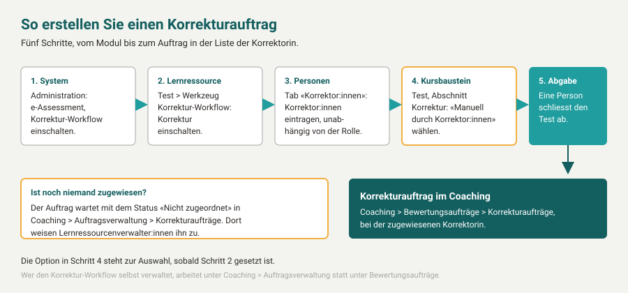

# Coaching - Bewertungsaufträge {: #assessment_orders}

{ class="shadow lightbox" }

Hier sehen Sie, an welchen Stellen noch konkrete Coaching-Aktionen wie Bewertungen oder Einstufungen vorgenommen werden müssen, bzw. ob diese noch freigegeben werden müssen.

Je nach Rolle sind neben Ihren eigenen Bewertungsaufträgen auch die übrigen angezeigt und Sie können sich einen Überblick verschaffen.

{ class="shadow lightbox" }

---

### Bewertung, Korrektur und Einstufung {: #assessment_terms}

Auf dieser Seite kommen drei Begriffe vor. Sie bezeichnen verschiedene Dinge:

* **Bewertung**: das Resultat einer Person an einem bewertbaren Kursbaustein, also Status, Punkte, "Bestanden" und gegebenenfalls die Note. Auch ein Test hat eine Bewertung. Sie bearbeiten sie im [Bewertungsformular](../learningresources/The_assessment_form.de.md) oder im [Bewertungswerkzeug](../learningresources/Assessment_tool_overview.de.md) des Kurses.
* **Korrektur**: das Durchsehen einer Abgabe von Hand, wo OpenOlat nicht selbst auswertet, etwa bei Freitextfragen in einem Test. Die Korrektur ist ein Schritt auf dem Weg zur Bewertung: In einem Test vergibt die korrigierende Person die Punkte, daraus entsteht die Bewertung. Betreuende korrigieren einen Test im [Korrekturwerkzeug](../learningresources/Assessing_tests.de.md), Korrektor:innen über "Korrigieren" in ihrem Korrekturauftrag.
* **Einstufung/Noten**: die Umrechnung der Punkte in eine Note nach einer Bewertungsskala. Ohne Einstufung besteht die Bewertung aus Punkten und gegebenenfalls "Bestanden". Mit [Einstufung/Noten](../learningresources/Assessment_translate_points_in_grades.de.md) kommt die Note dazu, und das Bewertungssystem bestimmt, ob die Punktzahl als bestanden gilt.

[Zum Seitenanfang ^](#assessment_orders)

---

### Bewertungsaufträge erstellen {: #create_assessment_orders}

Bewertungsaufträge erstellen Kursbesitzer:innen am Kursbaustein: Sie stellen ihn auf manuelle Bewertung. Sobald danach eine teilnehmende Person ihre Arbeit abschliesst, legt OpenOlat den Bewertungsauftrag an und zeigt ihn im passenden Tab. Betreuende und Korrektor:innen bearbeiten die offenen Aufträge aus allen ihren Kursen unter `Coaching > Bewertungsaufträge`.

Wer einen Auftrag bearbeitet, richtet diesen in der Regel nicht ein. Betreuende ohne Besitzrecht erreichen den Kurseditor nur, wenn ihnen im [Bereich "Rechte" der Mitgliederverwaltung](../learningresources/Members_management.de.md#section_rights) das Recht "Kurseditor" erteilt wurde. Den Korrektur-Workflow richten die Besitzer:innen des Tests ein, Korrektor:innen bearbeiten nur die Aufträge, die ihnen zugewiesen sind.

Die vier Tabs sind keine vier Arten von Aufträgen. Die ersten drei zeigen die Bewertung einer Person an verschiedenen Stellen ihres Ablaufs: zu bewerten, Note zuzuweisen, freizugeben. Der vierte Tab zeigt die Korrekturaufträge: Testabgaben, die eine im Korrektur-Workflow eingetragene Korrektor:in korrigiert. Den Korrektur-Workflow gibt es nur für Tests. Andere Kursbausteine, etwa eine Aufgabe, erzeugen deshalb keine Korrekturaufträge.

Die Tabs "Offene Bewertungen", "Offene Einstufungen/Noten" und "Freizugebende Bewertungen" sehen Kursbesitzer:innen für alle Teilnehmenden des Kurses, Betreuende für die Personen, die sie betreuen. Den Tab "Korrekturaufträge" sehen die Personen, die im Korrektur-Workflow als Korrektor:in eingetragen sind.

{ class="shadow lightbox" }

Die Seiten, auf denen Besitzer:innen die jeweilige Einstellung setzen:

* **Offene Bewertungen**: [Tests auf Kursebene](../learningresources/Tests_at_course_level.de.md#correction), [Kursbaustein Aufgabe](../learningresources/Course_Element_Task.de.md), [Kursbaustein Bewertung](../learningresources/Course_Element_Assessment.de.md)
* **Offene Einstufungen/Noten**: [Einstufung/Noten](../learningresources/Assessment_translate_points_in_grades.de.md)
* **Freizugebende Bewertungen**: [Tests auf Kursebene](../learningresources/Tests_at_course_level.de.md#correction), [Kurseinstellungen, Abschnitt Berechtigungen](../learningresources/Course_Settings_Assessment.de.md#section_assessment_rights)
* **Korrekturaufträge**: [Test Einstellungen](../learningresources/Test_settings.de.md#correction-workflow)

Der Kursbaustein muss dafür bewertbar und auf manuelle Bewertung gestellt sein, Punkte oder "Bestanden" werden also am Kursbaustein gesetzt. Steht die Korrektur eines Tests auf "Automatisch", wertet OpenOlat den Test selbst aus und gibt das Resultat sofort frei; das Gleiche gilt für die Zuweisung "Automatisch bei Punktänderungen" bei Einstufung und Noten.

Zwei weitere Wege führen zu einem Bewertungsauftrag:

* **Bewertung wieder eröffnen**: Mit der Schaltfläche "Bewertung wieder eröffnen" im [Bewertungsformular](../learningresources/The_assessment_form.de.md) geht der Status zurück auf "Korrigieren". Die Zeile steht danach erneut im Tab "Offene Bewertungen".
* **Zuweisung Betreuende/Teilnehmende**: Beim [Kursbaustein Aufgabe](../learningresources/Course_Element_Task.de.md#coach_assignment_table) ordnen Kursbesitzer:innen jeder teilnehmenden Person eine betreuende Person zu. Diese wird benachrichtigt und findet ihre Aufträge über den Filter "Mir zugewiesen".

[Zum Seitenanfang ^](#assessment_orders)

---

### Tab Offene Bewertungen [:octicons-tag-16:{ title="ab Release 16.1 (OO-5851)" }](https://track.frentix.com/issue/OO-5851) {: #tab_open_assessments}

Hier haben Sie Zugriff auf alle Kursbausteine, die noch zu bewerten sind. Diese können entsprechend der Spalten sortiert und dann einzeln ausgewählt und bewertet werden. Mit Klick auf den Link "Bewerten" gelangt man in das entsprechende Bewertungsformular.

Eine Zeile erscheint, sobald der Bewertungseintrag der teilnehmenden Person auf dem Status "Korrigieren" steht. Diesen Status erzeugen die manuelle Korrektur eines [Tests](../learningresources/Tests_at_course_level.de.md#correction), die Schritte "Feedback", "Korrektur", "Peer-Review" und "Bewertung" beim Kursbaustein [Aufgabe](../learningresources/Course_Element_Task.de.md) sowie der Schalter "Status Korrigieren setzen, wenn Zugriff gewährt" beim Kursbaustein [Bewertung](../learningresources/Course_Element_Assessment.de.md). Betreuende sehen diese Schritte in der Spalte "Schritt", wenn sie die Aufgabe im Kurs öffnen.

Über den Filter "Mir zugewiesen" schränken Sie die Liste auf die Aufträge ein, die Ihnen persönlich zugewiesen sind.

[Zum Seitenanfang ^](#assessment_orders)

---

### Tab Offene Einstufungen/Noten [:octicons-tag-16:{ title="ab Release 16.2 (OO-6009)" }](https://track.frentix.com/issue/OO-6009) {: #tab_open_classifications_scores}

Hier finden Sie alle Kursbausteine, die zwar schon bewertet wurden, bei denen aber die manuelle Zuordnung zu einer Notenskala bzw. einem Bewertungssystem noch nicht abgeschlossen wurde.

Eine Zeile erscheint, wenn am Kursbaustein "Bewertung mit Einstufung/Noten" eingeschaltet und die "Zuweisung" auf "Manuell" gestellt ist, die Punkte gesetzt sind und die Note noch aussteht. Kursbesitzer:innen setzen beides im Kurseditor am Kursbaustein, beim Test im Tab "Test-Konfiguration", sonst im Tab "Bewertung". Zusätzlich braucht es das Modul [Einstufung/Noten](../learningresources/Assessment_translate_points_in_grades.de.md) und eine hinterlegte Bewertungsskala.

Betreuende ohne Besitzrecht sehen die Zeile und weisen die Note zu, solange die Option "Einstufung/Noten zuweisen" eingeschaltet ist. Die Option ist standardmässig eingeschaltet. In Lernpfadkursen schalten Kursbesitzer:innen sie unter `Kurs > Administration > Einstellungen > Tab "Bewertung"` im [Abschnitt Berechtigungen](../learningresources/Course_Settings_Assessment.de.md#section_assessment_rights) aus oder ein. Herkömmliche Kurse haben diesen Abschnitt nicht, dort dürfen Betreuende immer zuweisen.

[Zum Seitenanfang ^](#assessment_orders)

---

### Tab Freizugebende Bewertungen {: #tab_assessments_to_be_released}

Hier finden Sie alle Bewertungen, die noch nicht für die Teilnehmer:innen sichtbar sind und noch freigegeben werden müssen.

In diesem Tab ist es auch möglich, alle Kursbausteine auszuwählen und alle auf einmal freizugeben.

Beim Test steuert das Feld "Freigabe Bewertung" im [Abschnitt Korrektur](../learningresources/Tests_at_course_level.de.md#correction), ob OpenOlat die Bewertung nach abgeschlossener Korrektur selbst freigibt. Bei den übrigen manuell bewerteten Kursbausteinen entscheidet die Kursoption "Bewertung freigeben". Dieselbe Option gibt Betreuenden ohne Besitzrecht den Zugriff auf diesen Tab. Sie ist standardmässig eingeschaltet. In Lernpfadkursen schalten Kursbesitzer:innen sie im [Abschnitt Berechtigungen](../learningresources/Course_Settings_Assessment.de.md#section_assessment_rights) aus oder ein, herkömmliche Kurse haben diesen Abschnitt nicht.

[Zum Seitenanfang ^](#assessment_orders)

---

### Tab Korrekturaufträge [:octicons-tag-16:{ title="ab Release 15.0 (OO-4442)" }](https://track.frentix.com/issue/OO-4442) {: #tab_grading_assignments}

Dieser Tab erscheint nur, wenn Sie als Korrektor:in für einen Test eingetragen wurden. Sie sehen eine Übersicht der Tests in den verschiedenen Kursen, die Sie noch manuell prüfen und korrigieren müssen. Je nach Einstellung in der Lernressource "Test" erfolgt die Bewertung anonym oder nicht.

Sind Sie weder Betreuer:in noch Besitzer:in einer Lernressource, fehlen die übrigen Tabs; die Überschrift "Meine Zuweisungen" mit Ihrer Liste steht dann direkt unter dem Titel "Bewertungsaufträge". Verwalten Sie den Korrektur-Workflow dagegen selbst, also als Besitzer:in einer Test-Lernressource mit Korrektur-Workflow, als Lernressourcenverwalter:in oder als Administrator:in, fehlt dieser Tab; Ihre Aufträge finden Sie dann unter `Coaching > Auftragsverwaltung` im Tab [Korrekturaufträge](Coaching_Order_Management.de.md#tab_grading_assignments).

{ class="shadow lightbox" }

Im Beispiel ist die Korrektur anonym eingestellt. Deshalb zeigen die Spalten "Vorname" und "Nachname" nur einen Strich. Die Einstellung dazu treffen die Besitzer:innen des Tests in der Lernressource unter `Test > Administration > Korrektur-Workflow > Tab "Konfiguration"`.

Über den Link "Korrigieren" gelangen Sie direkt zum zu korrigierenden Test und nehmen dort manuelle Bewertungen vor. Automatische Bewertungen können Sie überschreiben. Hinterlassen Sie dazu einen Kommentar.

#### Wer einen Korrekturauftrag einrichtet {: #create_grading_assignment}

Ein Korrekturauftrag entsteht in fünf Schritten. Drei Rollen richten ihn ein, die Abgabe einer teilnehmenden Person löst ihn aus. Er erreicht die Korrektor:in, sobald alle fünf Schritte erfolgt sind.

{ class="shadow lightbox" }

1. Administrator:innen schalten in der System-Administration den Korrektur-Workflow ein: `Administration > e-Assessment > Test`.
2. Besitzer:innen des Tests schalten in der Lernressource Test den Korrektur-Workflow ein: `Test > Administration > Korrektur-Workflow > Tab "Konfiguration"`.
3. Besitzer:innen des Tests tragen im Tab "Korrektor:innen" die korrigierenden Personen ein. Deren Rolle in OpenOlat spielt dabei keine Rolle.
4. Kursbesitzer:innen stellen am Kursbaustein Test die Korrektur auf "Manuell durch Korrektor:innen". Diese Option steht zur Auswahl, sobald Schritt 2 gesetzt ist. Mehr dazu auf der Seite [Tests auf Kursebene](../learningresources/Tests_at_course_level.de.md#correction).
5. Eine teilnehmende Person schliesst den Test ab.

Ist beim Abschluss keine Korrektor:in verfügbar, trägt der Auftrag den Status "Nicht zugeordnet" und wartet in der [Auftragsverwaltung](Coaching_Order_Management.de.md). Dort weisen ihn Besitzer:innen des Tests, Lernressourcenverwalter:innen oder Administrator:innen einer Person zu. Der Auftrag erscheint danach in der Liste dieser Person.

Bei Freitextfragen laden Sie die Antwort einer Person über den Button "Als PDF herunterladen" oben rechts als PDF herunter. Das PDF enthält im Kopfbereich Angaben zu Kurs, Kursbaustein und Test. Bei anonymer Korrektur erscheint anstelle der persönlichen Angaben die "Teilnehmendenkennung". Alle Antworten einer Frage auf einmal laden Sie im [Korrekturwerkzeug des Kurses](../learningresources/Assessing_tests.de.md) herunter.

!!! tip "Voraussetzung"

    Der Download setzt voraus, dass in der System-Administration ein [PDF-Service](../../manual_admin/administration/External_Tools_-_Administration.de.md#pdf_generator) konfiguriert ist.

Die Verwaltung aller Korrektor:innen und ihrer Aufträge liegt dagegen in der [Auftragsverwaltung](Coaching_Order_Management.de.md).

[Zum Seitenanfang ^](#assessment_orders)

---

## Weiterführende Informationen {: #further_information}

**Auf dieser Seite erwähnt** 
[Das Bewertungsformular >](../../manual_user/learningresources/The_assessment_form.de.md) 
[Bewertungswerkzeug - Übersicht >](../../manual_user/learningresources/Assessment_tool_overview.de.md) 
[Tests bewerten >](../../manual_user/learningresources/Assessing_tests.de.md) 
[Einstufung/Noten >](../../manual_user/learningresources/Assessment_translate_points_in_grades.de.md) 
[Tests auf Kursebene >](../../manual_user/learningresources/Tests_at_course_level.de.md) 
[Kursbaustein "Aufgabe" >](../../manual_user/learningresources/Course_Element_Task.de.md) 
[Kursbaustein "Bewertung" >](../../manual_user/learningresources/Course_Element_Assessment.de.md) 
[Kurseinstellungen - Tab Bewertung >](../../manual_user/learningresources/Course_Settings_Assessment.de.md) 
[Test Einstellungen - Administration >](../../manual_user/learningresources/Test_settings.de.md) 
[Coaching: Auftragsverwaltung >](../../manual_user/area_modules/Coaching_Order_Management.de.md) 
[Externe Werkzeuge: Übersicht >](../../manual_admin/administration/External_Tools_-_Administration.de.md)

**Weiterführend** 
[Coaching: Personensuche >](../../manual_user/area_modules/Coaching_User_Search.de.md) 
[Coaching: Personen >](../../manual_user/area_modules/Coaching_People.de.md) 
[Coaching: Kurse >](../../manual_user/area_modules/Coaching_Courses.de.md) 
[Coaching: Bildungsprodukte >](../../manual_user/area_modules/Coaching_Educational_Products.de.md) 
[Coaching: Termine / Absenzen >](../../manual_user/area_modules/Coaching_Events_Absences.de.md) 
[Coaching: Reports >](../../manual_user/area_modules/Coaching_Reports.de.md) 
[Coaching: Gruppen >](../../manual_user/area_modules/Coaching_Groups.de.md) 
[Rollen >](../../manual_user/basic_concepts/Roles.de.md)

[Zum Seitenanfang ^](#assessment_orders)
