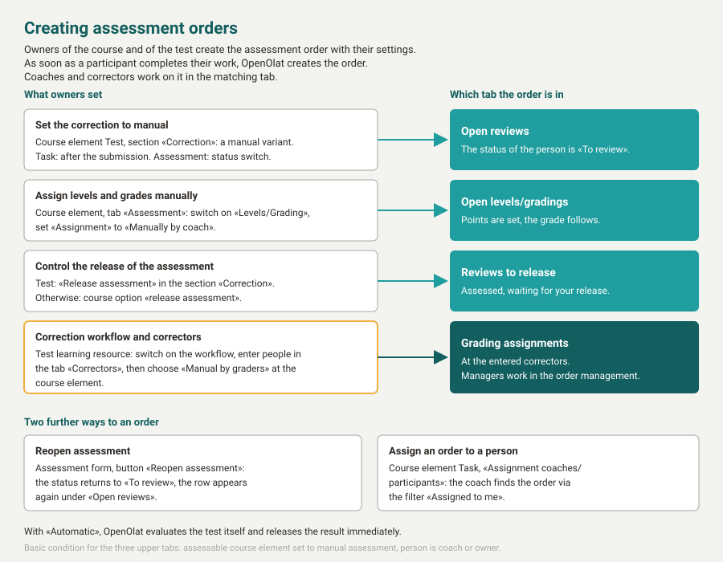
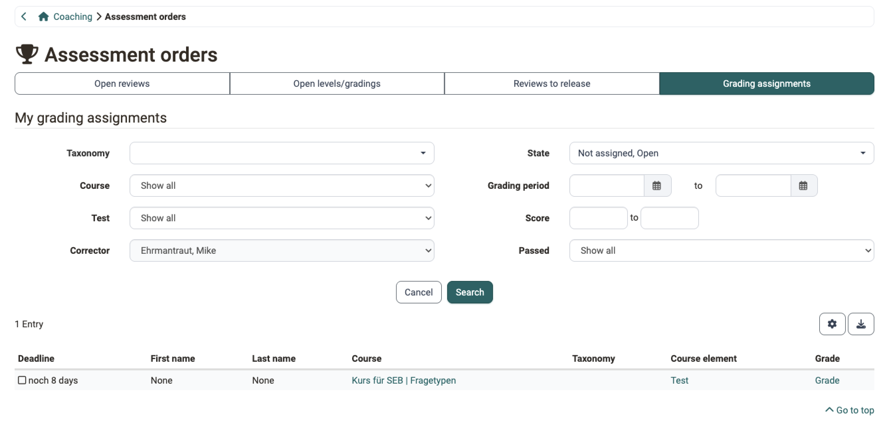
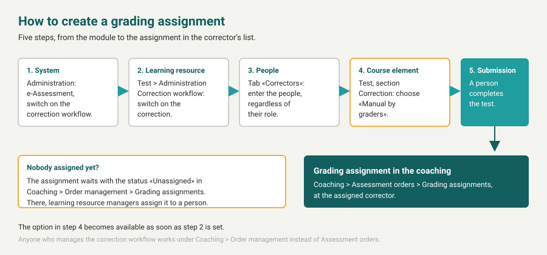

# Coaching - Assessment Orders {: #assessment_orders}

{ class="shadow lightbox" }

Here you can see where specific coaching actions such as assessments or gradings still need to be carried out, or whether they still need to be released.

Depending on your role, in addition to your own assessment orders, the others are also displayed and you can get an overview.

{ class="shadow lightbox" }

---

### Creating assessment orders {: #create_assessment_orders}

If you set a course element to manual assessment, you thereby create the assessment orders for the coaching: as soon as a participant completes their work, OpenOlat creates the order and shows it in the matching tab. Coaches then see in one place what is pending.

The tabs "Open reviews", "Open levels/gradings" and "Reviews to release" are seen by course owners for all participants of the course, and by coaches for the people they coach. The tab "Grading assignments" is seen by the people who are entered as correctors in the correction workflow.

{ class="shadow lightbox" }

The pages on which you make the respective setting:

* **Open reviews**: [Tests at course level](../learningresources/Tests_at_course_level.md#correction), [Course Element "Task"](../learningresources/Course_Element_Task.md), [Course Element "Assessment"](../learningresources/Course_Element_Assessment.md)
* **Open levels/gradings**: [Levels/Grading](../learningresources/Assessment_translate_points_in_grades.md)
* **Reviews to release**: [Tests at course level](../learningresources/Tests_at_course_level.md#correction), [Course settings, section Assessment rights](../learningresources/Course_Settings_Assessment.md#section_assessment_rights)
* **Grading assignments**: [Test settings](../learningresources/Test_settings.md#correction-workflow)

The course element must be assessable and set to manual assessment, which means points or "Passed" are set at the course element. If the correction of a test is set to "Automatic", OpenOlat evaluates the test itself and releases the result immediately; the same applies to the assignment "Automatically on score change" for levels and grading.

Two further ways lead to an assessment order:

* **Reopen assessment**: With the button "Reopen assessment" in the [assessment form](../learningresources/The_assessment_form.md) the status returns to "To review". The row then appears again in the tab "Open reviews".
* **Assignment coaches/participants**: In the [Course Element "Task"](../learningresources/Course_Element_Task.md#coach_assignment_table) course owners assign a coach to each participant. That person is notified and finds their orders via the filter "Assigned to me".

[To the top of the page ^](#assessment_orders)

---

### Tab Open reviews [:octicons-tag-16:{ title="from Release 16.1 (OO-5851)" }](https://track.frentix.com/issue/OO-5851) {: #tab_open_assessments}

Here you have access to all course elements that still need to be assessed. These can be sorted according to the columns and then selected and assessed individually. Clicking on the "Assess" link takes you to the corresponding assessment form.

A row appears as soon as the assessment entry of the participant is in the status "To review". This status is created by the manual correction of a [test](../learningresources/Tests_at_course_level.md#correction), by the correction step in the course element [Task](../learningresources/Course_Element_Task.md), and by the switch "Set status To review if accessible" in the course element [Assessment](../learningresources/Course_Element_Assessment.md).

With the filter "Assigned to me" you limit the list to the orders that are assigned to you personally.

[To the top of the page ^](#assessment_orders)

---

### Tab Open levels/gradings [:octicons-tag-16:{ title="from Release 16.2 (OO-6009)" }](https://track.frentix.com/issue/OO-6009) {: #tab_open_classifications_scores}

Here you find all course elements that have already been assessed but for which the manual assignment to a grading scale or grading system has not yet been completed.

A row appears if "Levels/Grading" is switched on at the course element and the "Assignment" is set to "Manually by coach", the points are set and the grade is still pending. You set both in the course editor at the course element, for a test in the tab "Test configuration", otherwise in the tab "Assessment". In addition, the module [Levels/Grading](../learningresources/Assessment_translate_points_in_grades.md) and a stored grading scale are required.

So that coaches without ownership also see the row and can assign the grade, course owners set the option "assign Levels/Grading" under `Course > Administration > Settings > Tab "Assessment"` in the [section Assessment rights](../learningresources/Course_Settings_Assessment.md#section_assessment_rights).

[To the top of the page ^](#assessment_orders)

---

### Tab Reviews to release {: #tab_assessments_to_be_released}

Here you find all assessments that are not yet visible to the participants and still need to be released.

In this tab, it is also possible to select all course elements and release them all at once.

For a test, the field "Release assessment" in the [section Correction](../learningresources/Tests_at_course_level.md#correction) controls whether OpenOlat releases the assessment itself once the correction is completed. For all other manually assessed course elements, the course option "release assessment" in the [section Assessment rights](../learningresources/Course_Settings_Assessment.md#section_assessment_rights) decides; the same option gives coaches without ownership access to this tab.

[To the top of the page ^](#assessment_orders)

---

### Tab Grading assignments [:octicons-tag-16:{ title="from Release 15.0 (OO-4442)" }](https://track.frentix.com/issue/OO-4442) {: #tab_grading_assignments}

This tab only appears if you have been entered as a corrector for a test. You see an overview of the tests in the different courses that you still have to check and correct manually. Depending on the setting in the learning resource "Test", the assessment is anonymous or not.

If you are neither coach nor owner of a learning resource, the other tabs are missing; the heading "My grading assignments" with your list then appears directly under the title "Assessment orders". If, on the other hand, you manage the correction workflow yourself, as owner of a test learning resource with correction workflow, as learning resource manager or as administrator, this tab is missing; you then find your assignments under `Coaching > Order management` in the tab [Grading assignments](Coaching_Order_Management.md#tab_grading_assignments).

{ class="shadow lightbox" }

In the example, the correction is set to anonymous. That is why the "First name" and "Last name" columns only show a dash. You make this setting in the learning resource under `Test > Administration > Correction workflow > Tab "Configuration"`.

The "Grade" link takes you directly to the test to be corrected, where you make the manual assessments. You can overwrite automatic assessments. Leave a comment when you do so.

#### How to create a grading assignment {: #create_grading_assignment}

A grading assignment is created in five steps. It reaches the corrector as soon as all five are set.

{ class="shadow lightbox" }

1. The correction workflow is switched on in the system administration: `Administration > e-Assessment > Test`.
2. The correction is switched on in the learning resource Test: `Test > Administration > Correction workflow > Tab "Configuration"`.
3. The correcting people are entered in the tab "Correctors". Their role in OpenOlat does not matter.
4. At the course element Test the correction is set to "Manual by graders". This option becomes available as soon as step 2 is set. More about this on the page [Tests at course level](../learningresources/Tests_at_course_level.md#correction).
5. A participant completes the test.

If no corrector is available at that moment, the assignment carries the status "Unassigned" and waits in the [Order management](Coaching_Order_Management.md). There, learning resource managers assign it to a person, and it appears in their list.

For essay questions, you download a person's answer as a PDF with the "Download as PDF" button at the top right. The PDF contains information about the course, course element and test in the header. With anonymous correction, the "Participant identifier" appears instead of the personal details. You download all answers to a question at once in the [correction tool of the course](../learningresources/Assessing_tests.md).

!!! tip "Prerequisite"

    The download requires a [PDF service](../../manual_admin/administration/External_Tools_-_Administration.md#pdf_generator) configured in the system administration.

The management of all correctors and their assignments, on the other hand, is done in the [Order management](Coaching_Order_Management.md).

[To the top of the page ^](#assessment_orders)

---

## Further information {: #further_information}

**Mentioned on this page** 
[Tests at course level >](../../manual_user/learningresources/Tests_at_course_level.md) 
[Course Element "Task" >](../../manual_user/learningresources/Course_Element_Task.md) 
[Course Element "Assessment" >](../../manual_user/learningresources/Course_Element_Assessment.md) 
[Levels/Grading >](../../manual_user/learningresources/Assessment_translate_points_in_grades.md) 
[Test settings - Administration >](../../manual_user/learningresources/Test_settings.md) 
[The assessment form >](../../manual_user/learningresources/The_assessment_form.md) 
[Course Settings - Tab Assessment >](../../manual_user/learningresources/Course_Settings_Assessment.md) 
[Assessing tests >](../../manual_user/learningresources/Assessing_tests.md) 
[External Tools: Overview >](../../manual_admin/administration/External_Tools_-_Administration.md) 
[Coaching: Order management >](../../manual_user/area_modules/Coaching_Order_Management.md)

**Further reading** 
[Coaching: User search >](../../manual_user/area_modules/Coaching_User_Search.md) 
[Coaching: People >](../../manual_user/area_modules/Coaching_People.md) 
[Coaching: Courses >](../../manual_user/area_modules/Coaching_Courses.md) 
[Coaching: Educational products >](../../manual_user/area_modules/Coaching_Educational_Products.md) 
[Coaching: Events / Absences >](../../manual_user/area_modules/Coaching_Events_Absences.md) 
[Coaching: Reports >](../../manual_user/area_modules/Coaching_Reports.md) 
[Coaching: Groups >](../../manual_user/area_modules/Coaching_Groups.md) 
[Roles >](../../manual_user/basic_concepts/Roles.md) 
[Assessment tool >](../../manual_user/learningresources/Assessment_tool_overview.md)

[To the top of the page ^](#assessment_orders)
