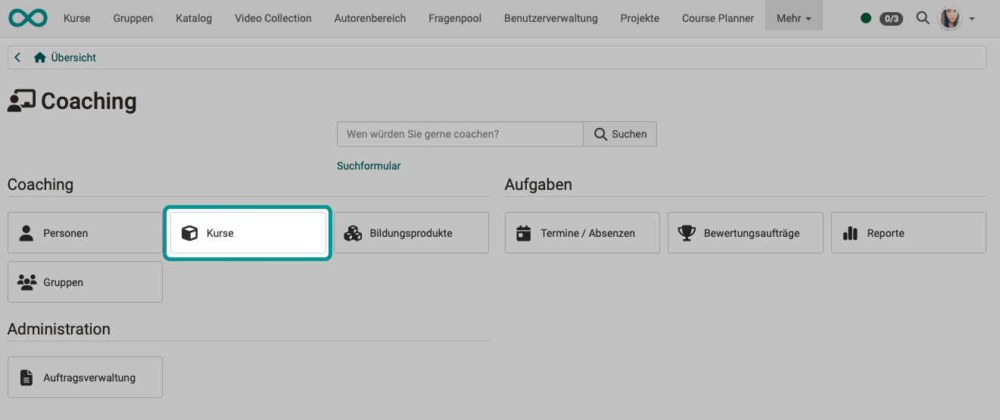
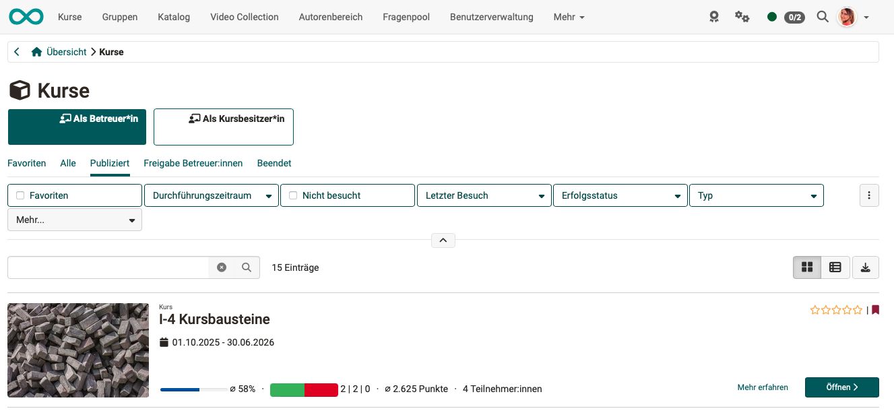
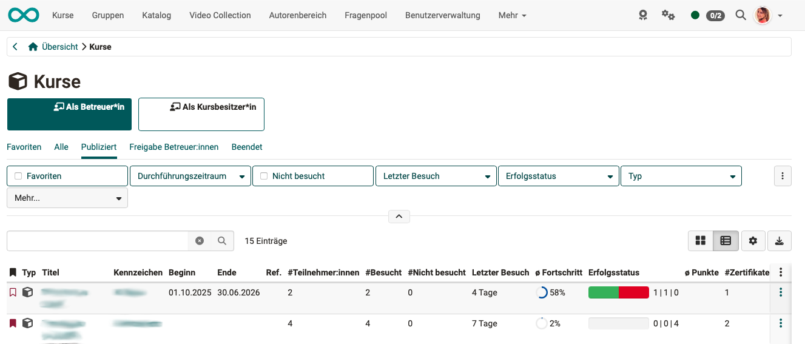

# Coaching - Kurse {: #courses}

{ class="shadow lightbox" }

{ class="shadow lightbox" }

### WELCHE Kurse zeigt die Liste? {: #courses_which}

Der Menüpunkt "Kurse" im Coaching Tool zeigt die Liste aller **Kurse**, in denen Sie **Betreuer:in** oder **Besitzer:in** sind.

* Es werden die Teilnehmenden aus **allen** von Ihnen betreuten Kursen angezeigt. (Im Unterschied zum [Bewertungswerkzeug](../learningresources/Assessment_tool_overview.de.md) des Kurses. Dort werden nur Teilnehmende des aktuellen Kurses angezeigt.)
* Jeder Coach (Betreuer:in) sieht nur die von ihr/ihm betreuten Teilnehmenden.
* Die betreuten Teilnehmenden sind **gruppiert und den Rollen zugeordnet**, die Sie als Betreuende:r gegenüber dieser Person haben.  
Im oben gezeigten Beispiel kann die betreuende Person vorsortierte Listen abrufen, die ihren beiden Rollen als Betreuer:in und als Kurtsbesitzer:in entsprechen.
* In der Liste für Betreuer:innen sehen Sie nur Kurse, die veröffentlicht, beendet oder zumindest für Betreuer:innen zugänglich sind.

[Zum Seitenanfang ^](#courses)

---

### WAS zeigt die Liste? {: #courses_what}

!!! tip "Tipp"

    Mit Klick auf die kleinen Buttons rechts oben über der Liste können Sie jederzeit zwischen der Listen- und der Kacheldarstellung wechseln.

{ class="shadow lightbox" }

Sie sehen auf einen Blick zum Beispiel

* in welchen Kursen (Lernressourcen) Sie Betreuer:in sind,
* wieviele Teilnehmende in diesen Kursen sind
* und wie weit die Bearbeitung dieser Kurse insgesamt fortgeschritten ist.

Von dieser Liste aus können Sie gezielt in einen Kurs und das dortige Bewertungswerkzeug wechseln.  
Ein Klick auf einen Kursnamen führt direkt zum Kurs. Dort können Sie weiter gezielt zu einzelnen Teilnehmenden navigieren und Leistungsübersichten oder das Absenzenmanagement anzeigen lassen.

Welche Spalten angezeigt werden, können Sie selbst festlegen, indem Sie rechts oben auf das Zahnrad-Icon klicken.

* **ID** (eindeutige Nummer)
* **Favorit**
* **Typ** (Würfel-Symbol für "Kurs", bei Stand-alone-Lernressourcen ein entsprechendes anderes Symbol)
* **Technischer Typ** (z.B. "Lernpfad" oder "Herkömmlicher Kurs")
* **Titel**
* **Ext. ID** (externe ID, die einer anderen Systematik folgen kann als die von OpenOlat automatisch vergebene ID)
* **Kennzzeichen**
* **Beginn** (Beginn des Durchführungszeitraums dieses Kurses)
* **Ende** (Ende des Durchführungszeitraums dieses Kurses) 
* **Referenzierungen** (Wo und wie oft wird dieser 
* **Status** ("in Review", "Veröffentlicht", "Beendet")
* **#Teilnehmer:innen** (Anzahl aller Teilnehmenden)
* **#Besucht** (Anzahl der Teilnehmenden, die diesen Kurs schon einmal besucht haben)
* **#Nicht besucht** (Anzahl der Teilnehmenden, die diesen Kurs noch nie besucht haben)
* **Letzter Besuch** (Wann wurde dieser Kurs zuletzt von einer/einem Teilnehmenden besucht)
* **durschnittlicher Fortschritt** (Durchschnitt aus den Fortschrittswerten aller Teilnehmenden, die den Kurs schon einmal besucht haben)
* **Erfolgsstatus** (grafisch und in Zahlen: "Bestanden" | "Nicht bestanden" | "Keine Angabe")
* **#Bestanden**
* **#Nicht bestanden**
* **#Keine Angabe**
* **durchschnittliche Punkte** (durchschnittliche Punktzahl aller Teilnehmenden, die diesen Kurs bereits bearbeitet haben)
* **#Zertifikate** (Anzahl der Zertifikate, die in diesem Kurs bereits ausgestellt wurden)
* **Bewertungswerkzeug** (anklickbares Symbol, das direkt zum Bewertungswerkzueg dieses Kurses führt)
* **Information Seite** (anklickbares Glühbirnen-Symbol, das direkt zu den Informationen führt, die im Kurs unter Administration > Einstellungen eingegeben wurden)

[Zum Seitenanfang ^](#courses)

---

## Weiterführende Informationen {: #further_information}

[Coaching: Personensuche >](../../manual_user/area_modules/Coaching_User_Search.de.md) 
[Coaching: Personen >](../../manual_user/area_modules/Coaching_People.de.md) 
[Coaching: Bildungsprodukte >](../../manual_user/area_modules/Coaching_Educational_Products.de.md) 
[Coaching: Termine / Absenzen >](../../manual_user/area_modules/Coaching_Events_Absences.de.md) 
[Coaching: Bewertungsaufträge >](../../manual_user/area_modules/Coaching_assessment_orders.de.md) 
[Coaching: Reports >](../../manual_user/area_modules/Coaching_Reports.de.md) 
[Coaching: Gruppen >](../../manual_user/area_modules/Coaching_Groups.de.md) 
[Coaching: Auftragsverwaltung >](../../manual_user/area_modules/Coaching_Order_Management.de.md) 
[Rollen >](../../manual_user/basic_concepts/Roles.de.md) 
[Bewertungswerkzeug >](../../manual_user/learningresources/Assessment_tool_overview.de.md) 

[Zum Seitenanfang ^](#courses)