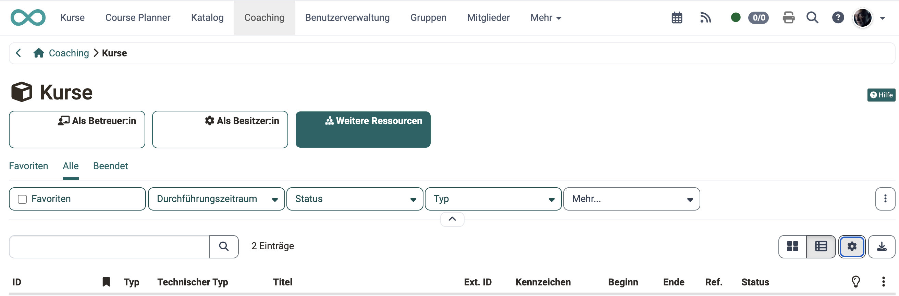
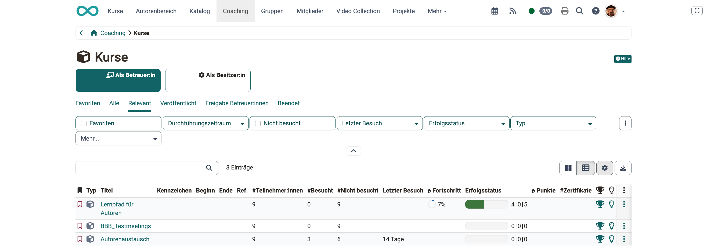

# Coaching - Kurse {: #courses}

{ class="shadow lightbox" }

### WELCHE Kurse zeigt die Liste? {: #courses_which}

Der Menüpunkt "Kurse" im Coaching Tool zeigt die Lernressourcen, für die Sie zuständig sind. Oberhalb der Liste wählen Sie mit dem **Fokus**, welche Ressourcen die Liste lädt:

* **Als Betreuer:in**: Kurse, in denen Sie Betreuer:in sind.
* **Als Besitzer:in**: Kurse mit dem Verwendungszweck "Eigenständig" oder "Verwendung im Course Planner", die Sie besitzen.
* **Weitere Ressourcen** [:octicons-tag-16:{ title="ab Release 20.1.5 (OO-8870)" }](https://track.frentix.com/issue/OO-8870){:target="_blank"}: Lernressourcen mit dem Verwendungszweck "Einbindung in Kurs" oder "Template", die Sie besitzen, zum Beispiel ein Test, ein Wiki oder eine Kursvorlage.

Ein Fokus erscheint nur, wenn Sie mindestens eine passende Lernressource im Status "Vorbereitung" bis "Beendet" besitzen. Die Fokus-Auswahl selbst wird sichtbar, sobald mehr als ein Fokus für Sie zutrifft. Im oben gezeigten Beispiel stehen alle drei Fokus-Einträge zur Verfügung, gewählt ist "Weitere Ressourcen".

* Es werden die Teilnehmenden aus **allen** von Ihnen betreuten Kursen angezeigt. (Im Unterschied zum [Bewertungswerkzeug](../learningresources/Assessment_tool_overview.de.md) des Kurses. Dort werden nur Teilnehmende des aktuellen Kurses angezeigt.)
* Betreuer:innen sehen nur die von ihnen betreuten Teilnehmenden.
* Die betreuten Teilnehmenden sind **gruppiert und den Rollen zugeordnet**, die Sie als Betreuer:in gegenüber dieser Person haben.
* In der Liste für Betreuer:innen sehen Sie nur Kurse, die veröffentlicht, beendet oder zumindest für Betreuer:innen zugänglich sind.

!!! tip "Hier finden Sie Ihre eingebundenen Ressourcen und Ihre Vorlagen"

    Der Fokus "Weitere Ressourcen" richtet sich an Personen ohne Autor:innenrechte. Sie sehen ihn, wenn Sie weder die Rolle Autor:in noch Lernressourcenverwalter:in noch Administrator:in besitzen. Mit einer dieser Rollen verwalten Sie dieselben Ressourcen im [Autorenbereich](Authoring.de.md); der Fokus wird Ihnen dann nicht angeboten. Für alle anderen Besitzer:innen ist er der einzige Weg zu einer Lernressource, die in einem fremden Kurs eingebunden ist.

[Zum Seitenanfang ^](#courses)

---

### Vordefinierte Filter-Tabs [:octicons-tag-16:{ title="ab Release 20.0.4 (OO-8677)" }](https://track.frentix.com/issue/OO-8677) {: #courses_filters}

Oberhalb der Liste stehen vordefinierte Filter-Tabs zur Verfügung. Sie schränken ein, welche Kurse angezeigt werden. In den Fokus-Einträgen "Als Betreuer:in" und "Als Besitzer:in" stehen sechs Tabs bereit:

* **Favoriten**: nur die von Ihnen als Favorit markierten Kurse.
* **Alle**: alle Kurse unabhängig vom Status.
* **Relevant** [:octicons-tag-16:{ title="ab Release 20.2.2 (OO-9167)" }](https://track.frentix.com/issue/OO-9167) (Standard beim Öffnen): Kurse im Status "Veröffentlicht" und "Freigabe Betreuer:innen", also die aktuell aktiven Kurse, bei denen Handlungsbedarf bestehen kann.
* **Veröffentlicht**: nur Kurse im Status "Veröffentlicht".
* **Freigabe Betreuer:innen**: nur Kurse im Status "Freigabe Betreuer:innen".
* **Beendet**: nur Kurse im Status "Beendet".

Im Fokus "Weitere Ressourcen" stehen nur die drei Tabs **Favoriten**, **Alle** und **Beendet** zur Verfügung. Standard beim Öffnen ist hier **Alle**. Die Tabs "Relevant", "Veröffentlicht" und "Freigabe Betreuer:innen" entfallen, weil OpenOlat für eingebundene Ressourcen und Vorlagen keine Kursstatistiken lädt. Aus demselben Grund fehlen die Filter zu Besuchen, Bewertungen, Teilnehmendenzahl und Zertifikaten. Verfügbar sind hier die Filter "Favoriten", "Durchführungszeitraum", "Status" und "Typ". Gehören Ihre Ressourcen zu Bildungsprodukten, kommt der Filter "Produkte" dazu.

Weitere Informationen zum allgemeinen Umgang mit Filtern und Filter-Tabs finden Sie unter [Mit Tabellen arbeiten](../basic_concepts/Table_Concept.de.md).

[Zum Seitenanfang ^](#courses)

---

### Kurse suchen {: #courses_search}

Mit dem Suchfeld oberhalb der Liste grenzen Sie die Kurse nach Titel, Kennzeichen oder externer ID ein. Die Suche unterscheidet nicht zwischen Gross- und Kleinschreibung. Ohne weitere Zeichen findet sie alle Kurse, die den Suchbegriff an beliebiger Stelle enthalten.

Kennen Sie die genaue Schreibweise nicht, setzen Sie den Stern `*` als Platzhalter ein. Er steht für beliebig viele beliebige Zeichen [:octicons-tag-16:{ title="ab Release 20.3.7 (OO-9630)" }](https://track.frentix.com/issue/OO-9630){:target="_blank"}:

* `Blog*` findet Kurse, deren Titel mit "Blog" beginnt.
* `*2026` findet Kurse, deren Titel auf "2026" endet.
* `ab*cd` findet Kurse, deren Titel mit "ab" beginnt und auf "cd" endet, unabhängig davon, was dazwischen steht.

Der Platzhalter verhält sich damit gleich wie im Bereich [Kurse](Courses.de.md).

[Zum Seitenanfang ^](#courses)

---

### WAS zeigt die Liste? [:octicons-tag-16:{ title="ab Release 20.1.1 (OO-8806)" }](https://track.frentix.com/issue/OO-8806) {: #courses_what}

!!! tip "Tipp"

    Mit Klick auf die kleinen Buttons rechts oben über der Liste können Sie jederzeit zwischen der Listen- und der Kacheldarstellung wechseln.

{ class="shadow lightbox" }

Sie sehen auf einen Blick zum Beispiel

* in welchen Kursen (Lernressourcen) Sie Betreuer:in sind,
* wie viele Teilnehmende in diesen Kursen sind
* und wie weit die Bearbeitung dieser Kurse insgesamt fortgeschritten ist.

Von dieser Liste aus können Sie gezielt in einen Kurs und das dortige Bewertungswerkzeug wechseln. 
Ein Klick auf einen Kursnamen führt direkt zum Kurs. Dort können Sie weiter gezielt zu einzelnen Teilnehmenden navigieren und Leistungsübersichten oder das Absenzenmanagement anzeigen lassen.

Welche Spalten angezeigt werden, können Sie selbst festlegen, indem Sie rechts oben auf das Zahnrad-Icon klicken.

* **ID** (eindeutige Nummer)
* **Favorit**
* **Typ** (Würfel-Symbol für "Kurs", bei Stand-alone-Lernressourcen ein entsprechendes anderes Symbol)
* **Technischer Typ** (z.B. "Lernpfad" oder "Herkömmlicher Kurs")
* **Titel**
* **Ext. ID** (externe ID, die einer anderen Systematik folgen kann als die von OpenOlat automatisch vergebene ID)
* **Kennzeichen**
* **Beginn** (Beginn des Durchführungszeitraums dieses Kurses)
* **Ende** (Ende des Durchführungszeitraums dieses Kurses)
* **Ref.** (Anzahl der Referenzierungen, nur bei aktivem Course Planner)
* **Status** ("in Review", "Veröffentlicht", "Beendet")
* **Teilnehmer:innen** (Anzahl aller Teilnehmenden)
* **Besucht** (Anzahl der Teilnehmenden, die diesen Kurs schon einmal besucht haben)
* **Nicht besucht** (Anzahl der Teilnehmenden, die diesen Kurs noch nie besucht haben)
* **Letzter Besuch** (Wann wurde dieser Kurs zuletzt von einer/einem Teilnehmenden besucht)
* **durchschnittlicher Fortschritt** (Durchschnitt aus den Fortschrittswerten aller Teilnehmenden, die den Kurs schon einmal besucht haben)
* **Erfolgsstatus** (grafisch und in Zahlen: "Bestanden" | "Nicht bestanden" | "Keine Angabe")
* **Bestanden**
* **Nicht bestanden**
* **Keine Angabe**
* **durchschnittliche Punkte** (durchschnittliche Punktzahl aller Teilnehmenden, die diesen Kurs bereits bearbeitet haben)
* **Zertifikate** (Anzahl der Zertifikate, die in diesem Kurs bereits ausgestellt wurden)
* **Bewertungswerkzeug** (anklickbares Symbol, das direkt zum Bewertungswerkzeug dieses Kurses führt)
* **Informationsseite** (anklickbares Glühbirnen-Symbol, das direkt zu den Informationen führt, die im Kurs unter `Kurs > Administration > Einstellungen` eingegeben wurden)

Am rechten Rand jeder Zeile öffnet das Drei-Punkte-Menü die Aktionen zu diesem Eintrag: **Bewertungswerkzeug**, **Informationsseite** und **In neuem Tab öffnen**. Den Eintrag "Bewertungswerkzeug" enthält das Menü nur bei Kursen und Tests.

Im Fokus "Weitere Ressourcen" zeigt die Liste keine Teilnehmenden-, Fortschritts- und Zertifikatsspalten und kein Bewertungswerkzeug, weder als Spalte noch im Drei-Punkte-Menü. Verfügbar sind hier die Spalten ID, Favorit, Typ, Technischer Typ, Titel, Ext. ID, Kennzeichen, Beginn, Ende, Ref., Status und Informationsseite.

!!! tip "Genaue Zahlen zum Erfolgsstatus"

    Fahren Sie mit der Maus über den grafischen Balken in der Spalte "Erfolgsstatus". Ein Tooltip zeigt die genauen Zahlen: "Bestanden: X / Nicht bestanden: Y / Keine Angabe: Z" [:octicons-tag-16:{ title="ab Release 20.3.0 (OO-9229)" }](https://track.frentix.com/issue/OO-9229){:target="_blank"}.

[Zum Seitenanfang ^](#courses)

---

## Weiterführende Informationen {: #further_information}

**Auf dieser Seite erwähnt** 
[Bewertungswerkzeug - Übersicht >](../learningresources/Assessment_tool_overview.de.md) 
[Autorenbereich - Übersicht >](Authoring.de.md) 
[Mit Tabellen arbeiten >](../basic_concepts/Table_Concept.de.md) 
[Kurse finden >](Courses.de.md)

**Weiterführend** 
[Coaching: Personensuche >](../../manual_user/area_modules/Coaching_User_Search.de.md) 
[Coaching: Personen >](../../manual_user/area_modules/Coaching_People.de.md) 
[Coaching: Bildungsprodukte >](../../manual_user/area_modules/Coaching_Educational_Products.de.md) 
[Coaching: Termine / Absenzen >](../../manual_user/area_modules/Coaching_Events_Absences.de.md) 
[Coaching: Bewertungsaufträge >](../area_modules/Coaching_Assessment_Orders.de.md) 
[Coaching: Reports >](../../manual_user/area_modules/Coaching_Reports.de.md) 
[Coaching: Gruppen >](../../manual_user/area_modules/Coaching_Groups.de.md) 
[Coaching: Auftragsverwaltung >](../../manual_user/area_modules/Coaching_Order_Management.de.md) 
[Rollen >](../../manual_user/basic_concepts/Roles.de.md)

[Zum Seitenanfang ^](#courses)
