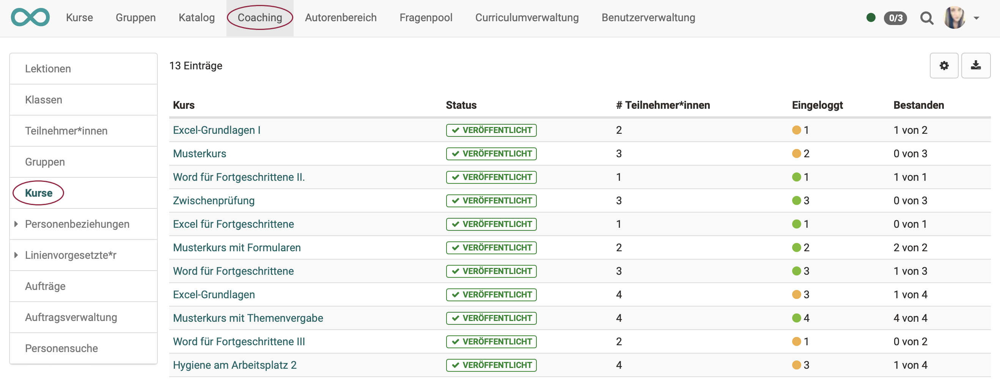
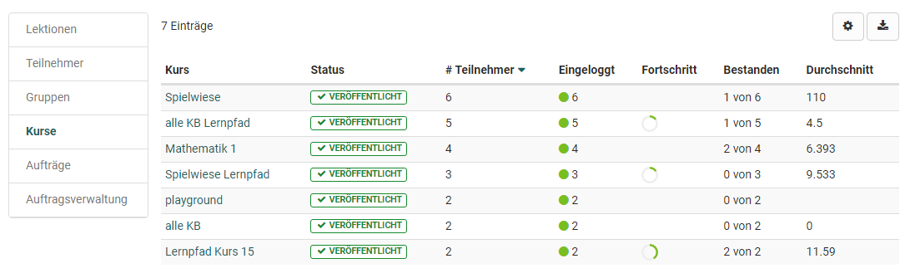

# Coaching - Kurse {: #courses}

!!! warning "Achtung"

    Dieser Artikel ist noch in Bearbeitung.

{ class="shadow lightbox" }

### 1. WELCHE Kurse zeigt die Liste?

Im Menü Kurse sehen Sie eine tabellarische Übersicht

* aller von Ihnen betreuten Kurse,
* die veröffentlicht, beendet oder zumindest für Betreuer zugänglich sind
* und auch die weiteren oben in der Tabelle genannten Anforderungen erfüllen.

### 2. WAS zeigt die Liste?

Sie sehen auf einen Blick,

* die Teilnehmerzahl der einzelnen Kurse,
* den Fortschritt der Kursteilnehmenden
* sowie das Ausmass des Logins der Kursteilnehmenden.
  * Ein grüner Punkt symbolisiert, dass sich alle Kursteilnehmer mindestens einmal eingeloggt haben.
  * Ein oranger Punkt zeigt an, dass ein Teil der Kursteilnehmenden den Kurs schon mal aufgerufen hat.
  * Ein roter Punkt zeigt an, dass sich bisher noch keine Teilnehmenden in den Kurs eingeloggt haben.

Ein weiterer Klick auf einen Kursnamen führt zu einer Übersicht der von Ihnen betreuten Kursteilnehmenden dieses Kurses und man erkennt rasch den Kursfortschritt der Teilnehmenden. Anschliessend kann wieder zum Bewertungswerkzeug eines Kursteilnehmers navigiert, sowie die Leistungsübersicht oder das Absenzenmanagement angezeigt werden.

Weitere Spalten können Sie selbst festlegen, indem Sie rechts oben auf das Zahnrad-Icon klicken.

---

Im Menü Kurse sehen Sie eine tabellarische Übersicht aller von Ihnen betreuten Kurse, die veröffentlicht, beendet oder zumindest für Betreuer zugänglich sind und auch die weiteren oben in der Tabelle genannten Anforderungen erfüllen.

{ class="shadow lightbox" }

In diesem Bereich erhält man auch schnell einen Überblick über die Teilnehmerzahl der einzelnen Kurse, den Fortschritt der gesamten Kursteilnehmenden sowie das Ausmass des Logins der Kursteilnehmenden.

