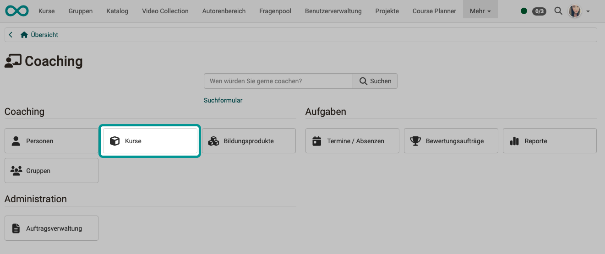
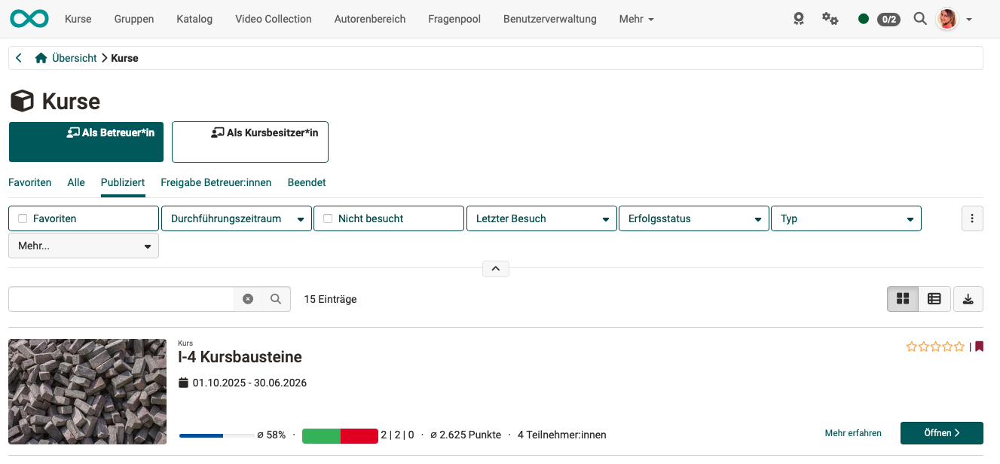
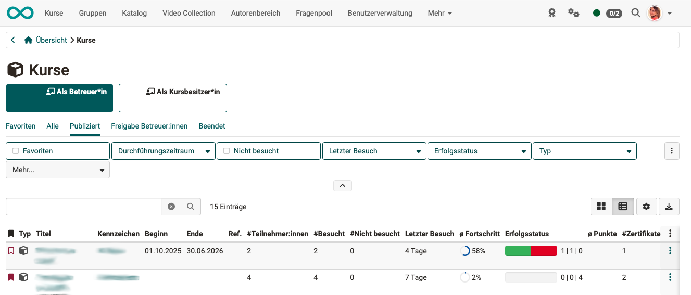

# Coaching - Courses {: #courses}

{ class="shadow lightbox" }

{ class="shadow lightbox" }

### WHICH courses does the list show? {: #courses_which}

The "Courses" menu item in the Coaching Tool shows a list of all **courses** in which you are a **coach** or **owner**.

* Participants from **all** courses you supervise are displayed. (This differs from the course's [assessment tool](../learningresources/Assessment_tool_overview.md), which only displays participants from the current course.)
* Each coach can only see the participants they are supervising.
* The participants you are supervising are **grouped and assigned roles** that you, as their coach, have in relation to them.  
In the example shown above, the caregiver can access pre-sorted lists that correspond to their two roles as caregiver and course owner.
* In the list for instructors, you will only see courses that have been published, completed, or are at least accessible to instructors.

[To the top of the page ^](#courses)

---

### Predefined filter tabs {: #courses_filters}

Predefined filter tabs are available above the list. They narrow down which courses are displayed:

* **Favourites**: only the courses you have marked as a favourite.
* **All**: all courses regardless of status.
* **Relevant** [:octicons-tag-16:{ title="from Release 20.2.2 (OO-9167)" }](https://track.frentix.com/issue/OO-9167) (selected by default when opening): courses with the status "Published" and "Access for coach", i.e. the currently active courses that may require action.
* **Published**: only courses with the status "Published".
* **Access for coach**: only courses with the status "Access for coach".
* **Finished**: only courses with the status "Finished".

For more information on working with filters and filter tabs in general, see [Working with tables](../basic_concepts/Table_Concept.md).

[To the top of the page ^](#courses)

---

### WHAT does the list show? [:octicons-tag-16:{ title="from Release 20.1.1 (OO-8806)" }](https://track.frentix.com/issue/OO-8806) {: #courses_what}

!!! tip "Tip"

    By clicking on the small buttons at the top right above the list, you can switch between list and tile view at any time.

{ class="shadow lightbox" }

You will see at a glance:

* Which courses (learning resources) you are a tutor for,
* How many participants are there in these courses?
* and how far the processing of these courses has progressed overall.

From this list, you can switch directly to a course and the assessment tool used there. 
Clicking on a course name takes you directly to the course. There, you can navigate further to individual participants and view performance overviews or absence management.

You can choose which columns are displayed by clicking on the gear icon in the top right corner.

* **ID** (unique number)
* **Favorite**
* **Type** (Cube icon for "course"; for stand-alone learning resources, a corresponding different icon)
* **Technical type** (e.g., "learning path" or "traditional course")
* **Title**
* **Ext. ID** (External ID, which may follow a different classification system than the ID automatically assigned by OpenOlat.)
* **Identifier**
* **Beginning** (Start of the implementation period for this course)
* **Ending** (End of the implementation period for this course) 
* **References**
* **Status** ("in Review", "Published", "Finished")
* **Participants** (Number of all participants)
* **Visited** (Number of all participants who have visited the course)
* **Not visited** (Number of participants who have never taken this course before)
* **Last visit** (When was this course last attended by a participant?)
* **Average progress** (Average of the progress scores of all participants who have already taken the course)
* **Success status** (graphically and in figures: "Passed" | "Not passed" | "Not specified") 

!!! info "Tooltip for success status"

    Hovering the mouse over the graphic bar shows a tooltip with the exact numbers: "Passed: X / Not passed: Y / Not specified: Z" [:octicons-tag-16:{ title="from Release 20.3.0 (OO-9229)" }](https://track.frentix.com/issue/OO-9229){:target="_blank"}.
* **Passed**
* **Not passed**
* **Not specified**
* **Average points** (average score of all participants who have already completed this course)
* **Certificate** (Number of certificates already issued for this course)
* **Assessment tool** (clickable icon that leads directly to the evaluation tool for this course)
* **Information site** (Clickable light bulb icon that leads directly to the information entered in the course under `Administration > Settings`)

[To the top of the page ^](#courses)

---

## Further information {: #further_information}

[Coaching: User search >](../area_modules/Coaching_User_Search.md) 
[Coaching: Courses >](../area_modules/Coaching_Courses.md) 
[Coaching: Educational Products >](../area_modules/Coaching_Educational_Products.md) 
[Coaching: Groups >](../area_modules/Coaching_Groups.md) 
[Coaching: Events / Absences >](../area_modules/Coaching_Events_Absences.md) 
[Coaching: Assessment orders >](../area_modules/Coaching_Assessment_Orders.md) 
[Coaching: Reports >](../area_modules/Coaching_Reports.md) 
[Coaching: Order management >](../area_modules/Coaching_Order_Management.md) 
[Roles >](../basic_concepts/Roles.md) 
[Assessment tool >](../learningresources/Assessment_tool_overview.md) 

[To the top of the page ^](#people)

