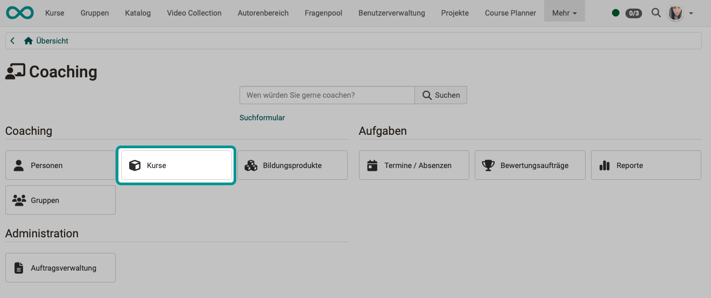
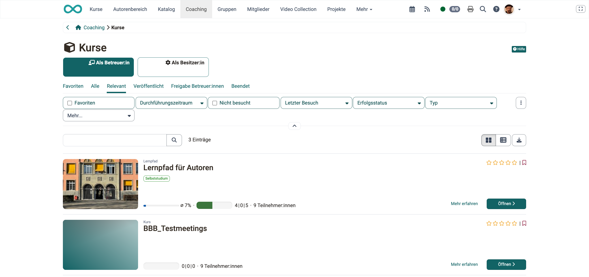

# Coaching - Courses {: #courses}

{ class="shadow lightbox" }

{ class="shadow lightbox" }

### WHICH courses does the list show? {: #courses_which}

The menu item "Courses" in the Coaching Tool shows the list of all **courses** in which you are **coach** or **owner**.

* The participants from **all** courses you coach are displayed. (In contrast to the [assessment tool](../learningresources/Assessment_tool_overview.md) of the course. There, only participants of the current course are displayed.)
* Coaches only see the participants they coach.
* The participants you coach are **grouped and assigned to the roles** you have as coach in relation to them. 
In the example shown above, the coach can access presorted lists that correspond to their two roles as coach and as owner.
* In the list for coaches, you only see courses that are published, finished or at least accessible for coaches.

[To the top of the page ^](#courses)

---

### Predefined filter tabs [:octicons-tag-16:{ title="from Release 20.0.4 (OO-8677)" }](https://track.frentix.com/issue/OO-8677) {: #courses_filters}

Predefined filter tabs are available above the list. They narrow down which courses are displayed:

* **Favourites**: only the courses you have marked as a favourite.
* **All**: all courses regardless of status.
* **Relevant** [:octicons-tag-16:{ title="from Release 20.2.2 (OO-9167)" }](https://track.frentix.com/issue/OO-9167) (selected by default when opening): courses with the status "Published" and "Access for coach", i.e. the currently active courses that may require action.
* **Published**: only courses with the status "Published".
* **Access for coach**: only courses with the status "Access for coach".
* **Finished**: only courses with the status "Finished".

For more information on working with filters and filter tabs in general, see [Working with tables](../basic_concepts/Table_Concept.md).

[To the top of the page ^](#courses)

---

### Course search {: #courses_search}

With the search field above the list, you narrow down the courses by title, reference or external ID. The search does not distinguish between upper and lower case. Without further characters, it finds all courses that contain the search term at any position.

If you do not know the exact spelling, use the asterisk `*` as a wildcard. It stands for any number of characters [:octicons-tag-16:{ title="from Release 20.3.7 (OO-9630)" }](https://track.frentix.com/issue/OO-9630){:target="_blank"}:

* `Blog*` finds courses whose title begins with "Blog".
* `*2026` finds courses whose title ends with "2026".
* `ab*cd` finds courses whose title begins with "ab" and ends with "cd", regardless of what lies in between.

The wildcard thus behaves in the same way as in the [Courses](Courses.md) area.

[To the top of the page ^](#courses)

---

### WHAT does the list show? [:octicons-tag-16:{ title="from Release 20.1.1 (OO-8806)" }](https://track.frentix.com/issue/OO-8806) {: #courses_what}

!!! tip "Tip"

    By clicking on the small buttons at the top right above the list, you can switch between list and tile view at any time.

{ class="shadow lightbox" }

You see at a glance, for example,

* in which courses (learning resources) you are coach,
* how many participants are in these courses
* and how far the processing of these courses has progressed overall.

From this list, you can switch directly to a course and its assessment tool. 
Clicking on a course name takes you directly to the course. There, you can navigate further to individual participants and view performance summaries or the absence management.

You can choose which columns are displayed by clicking on the gear icon at the top right.

* **ID** (unique number)
* **Favourite**
* **Type** (cube icon for "Course", a corresponding different icon for stand-alone learning resources)
* **Technical Type** (e.g. "Learning path" or "Conventional course")
* **Title**
* **Ext. ID** (external ID, which may follow a different system than the ID automatically assigned by OpenOlat)
* **Reference**
* **Begin** (begin of the implementation period of this course)
* **End** (end of the implementation period of this course)
* **Ref.**
* **Status** ("Review", "Published", "Finished")
* **Participants** (number of all participants)
* **Visited** (number of participants who have already visited this course)
* **Not visited** (number of participants who have never visited this course)
* **Last visit** (when this course was last visited by a participant)
* **Average progress** (average of the progress values of all participants who have already visited the course)
* **Success status** (graphically and in numbers: "Passed" | "Not passed" | "Not specified")
* **Passed**
* **Not passed**
* **Not specified**
* **Average points** (average score of all participants who have already worked on this course)
* **Certificates** (number of certificates already issued in this course)
* **Assessment tool** (clickable icon that leads directly to the assessment tool of this course)
* **Info page** (clickable light bulb icon that leads directly to the information entered in the course under `Course > Administration > Settings`)

!!! tip "Exact numbers for the success status"

    Hover the mouse over the graphic bar in the "Success status" column. A tooltip shows the exact numbers: "Passed: X / Not passed: Y / Not specified: Z" [:octicons-tag-16:{ title="from Release 20.3.0 (OO-9229)" }](https://track.frentix.com/issue/OO-9229){:target="_blank"}.

[To the top of the page ^](#courses)

---

## Further information {: #further_information}

**Mentioned on this page** 
[Assessment tool >](../../manual_user/learningresources/Assessment_tool_overview.md) 
[Working with tables >](../basic_concepts/Table_Concept.md) 
[Finding courses >](Courses.md)

**Further reading** 
[Coaching: User search >](../../manual_user/area_modules/Coaching_User_Search.md) 
[Coaching: People >](../../manual_user/area_modules/Coaching_People.md) 
[Coaching: Educational products >](../../manual_user/area_modules/Coaching_Educational_Products.md) 
[Coaching: Events / Absences >](../../manual_user/area_modules/Coaching_Events_Absences.md) 
[Coaching: Assessment orders >](../area_modules/Coaching_Assessment_Orders.md) 
[Coaching: Reports >](../../manual_user/area_modules/Coaching_Reports.md) 
[Coaching: Groups >](../../manual_user/area_modules/Coaching_Groups.md) 
[Coaching: Order management >](../../manual_user/area_modules/Coaching_Order_Management.md) 
[Roles >](../../manual_user/basic_concepts/Roles.md)

[To the top of the page ^](#courses)
