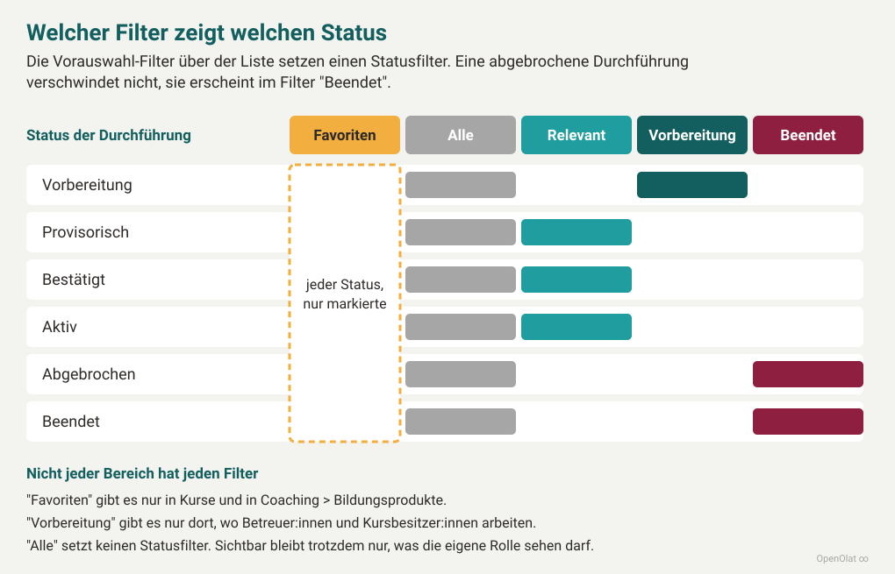
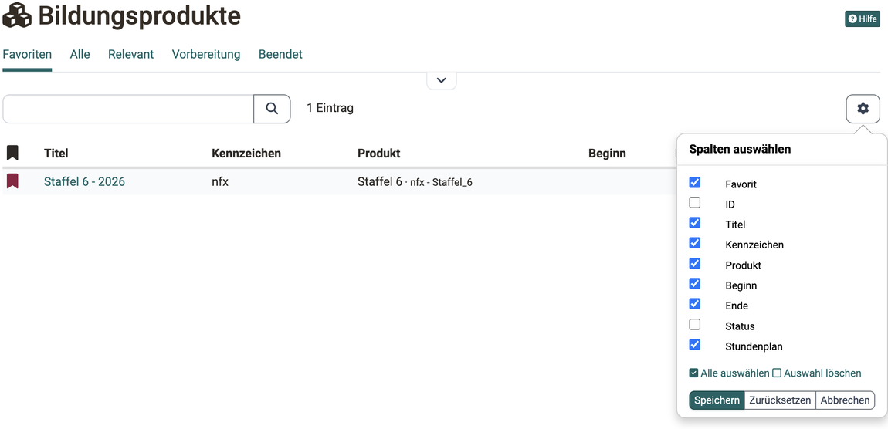
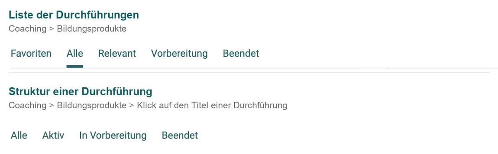

# Coaching - Bildungsprodukte {: #educational_products}

Ein Bildungsprodukt fasst mehrere Kurse und/oder Kursdurchführungen zu einem übergeordneten Angebot zusammen.

Als Betreuer:in können Sie auch für Bildungsprodukte zuständig sein, die aus mehreren Kursen und/oder aus mehreren Durchführungen bestehen. Eine Übersicht über alle Bildungsprodukte, in denen Sie Betreuer:in sind, erhalten Sie im Coaching Tool über den Button "Bildungsprodukte".

{ class="shadow lightbox" }

## Woher kommt ein Bildungsprodukt? {: #origin}

Bildungsprodukte entstehen im [Course Planner](../area_modules/Course_Planner.de.md), nicht im Coaching Tool. Kursplaner:innen legen zuerst das [Produkt](../area_modules/Course_Planner_Products.de.md#create_product) an unter: 
`Course Planner > Produkte`

Danach planen sie zu diesem Produkt eine oder mehrere [Durchführungen](../area_modules/Course_Planner_Implementations.de.md).

Der Course Planner nennt dasselbe Objekt "Produkt", das Coaching Tool nennt es "Bildungsprodukt". Gemeint ist beide Male das Angebot, zu dem die Kurse und die Durchführungen gehören.

Im Coaching Tool arbeiten Sie mit dem Ergebnis dieser Planung. Sie sehen die Durchführungen, in denen Sie Betreuer:in oder Besitzer:in sind. Die Struktur eines Produkts ändern Sie im Course Planner.

[Zum Seitenanfang ^](#educational_products)

---

## Wann erscheint der Button "Bildungsprodukte"? {: #availability}

Der Button erscheint, wenn beide Bedingungen erfüllt sind:

* Administrator:innen haben das [Modul Course Planner](../../manual_admin/administration/Modules_Course_Planner.de.md) aktiviert.
* Sie sind in mindestens einem Kurs Betreuer:in oder Besitzer:in.

Welche Bedingungen den Zugang zum Coaching Tool insgesamt steuern, zeigt der Abschnitt [Wann ist das Coaching Tool verfügbar?](../area_modules/Coaching.de.md#availability).

[Zum Seitenanfang ^](#educational_products)

---

## Was zeigt die Liste? [:octicons-tag-16:{ title="ab Release 20.1.7 (OO-8860)" }](https://track.frentix.com/issue/OO-8860){:target="_blank"} {: #list}

Die Liste zeigt Ihre Durchführungen. Die Spalte "Produkt" nennt zu jeder Durchführung das Bildungsprodukt, zu dem sie gehört. Wählen Sie im ersten Schritt eine Durchführung aus.

{ class="shadow lightbox" }

Als Betreuer:in oder Kursbesitzer:in begegnet Ihnen dieselbe Liste an einer zweiten Stelle: unter `Coaching > Personen > "Person" > Bildungsprodukte` sehen Sie die Durchführungen einer einzelnen Person. Diese Liste arbeitet mit derselben Filterlogik. Der Tab "Favoriten" fehlt dort, weil Sie eine Durchführung nur in Ihrer eigenen Liste markieren können.

Dieselbe Liste erscheint ausserdem für andere Rollen, unter `Kurse > Bildungsprodukte` für Teilnehmende und unter `Benutzerverwaltung > "Person" > Bildungsprodukte` für Benutzerverwalter:innen, Rollenverwalter:innen, Administrator:innen und Principals. Die Liste arbeitet dort gleich, Filter und Spalten sind je Bereich anders gesetzt.

### Die Liste filtern [:octicons-tag-16:{ title="ab Release 21.0 (OO-9374)" }](https://track.frentix.com/issue/OO-9374){:target="_blank"} {: #filter}

Sie finden die Filter-Tabs über der Liste unter: 
`Coaching > Bildungsprodukte`

Jeder Tab zeigt die Durchführungen in einem bestimmten Status:

* **Favoriten** Nur die Durchführungen, die Sie selbst mit der Flagge markiert haben, unabhängig vom Status. Sobald mindestens eine Markierung besteht, ist dieser Tab beim Öffnen vorausgewählt.
* **Alle** Alle Durchführungen ohne Einschränkung, auch die beendeten und die abgebrochenen. Nützlich, wenn Sie eine Durchführung suchen und ihren Status nicht kennen.
* **Relevant** Die Durchführungen mit dem Status "Provisorisch", "Bestätigt" oder "Aktiv". Das ist alles, was läuft oder verbindlich geplant ist, und damit die Ansicht für den Alltag. Haben Sie keine Favoriten markiert, ist dieser Tab vorausgewählt.
* **Vorbereitung** Durchführungen, die noch nicht freigegeben sind. Diesen Tab sehen nur Betreuer:innen und Kursbesitzer:innen. Teilnehmende sehen Durchführungen in Vorbereitung nicht.
* **Beendet** Die Durchführungen mit dem Status "Beendet" und die mit dem Status "Abgebrochen", gemeinsam in einem Tab. Eine abgebrochene Durchführung verschwindet also nicht, sie wandert hierher.

{ class="shadow lightbox" }

Mit dem Menü "Filter" grenzen Sie zusätzlich nach Produkt, Status und Durchführungszeitraum ein. Das Suchfeld über der Liste durchsucht Titel und Kennzeichen der Durchführung sowie Titel und Kennzeichen des Produkts. Wie Sie Filter kombinieren und eigene Filter speichern, zeigt [Mit Tabellen arbeiten](../basic_concepts/Table_Concept.de.md).

### Die Spalten der Liste [:octicons-tag-16:{ title="ab Release 21.0 (OO-9374)" }](https://track.frentix.com/issue/OO-9374){:target="_blank"} {: #columns}

Welche Spalten die Liste zeigt, bestimmen Sie über das Zahnrad-Icon rechts über der Liste. Ihre Auswahl bleibt für Ihr Konto gespeichert.

{ class="shadow lightbox" }

* **Favorit** Die Flagge, mit der Sie eine Durchführung markieren. Markierte Durchführungen erreichen Sie über den Tab "Favoriten".
* **ID** Die Nummer, unter der OpenOlat die Durchführung führt. Nützlich für Rückfragen an den Support. Diese Spalte ist zu Beginn ausgeblendet.
* **Titel** Der Name der Durchführung. Ein Klick darauf öffnet ihre Struktur.
* **Kennzeichen** Die Referenz aus Ihrer eigenen Systematik, zum Beispiel eine Kursnummer. Kursplaner:innen vergeben sie beim Anlegen der Durchführung.
* **Produkt** Das Bildungsprodukt, zu dem die Durchführung gehört, mit seinem Kennzeichen.
* **Beginn** und **Ende** Der geplante Zeitraum der Durchführung.
* **Status** Der Status der Durchführung, also "Vorbereitung", "Provisorisch", "Bestätigt", "Aktiv", "Abgebrochen" oder "Beendet". Diese Spalte ist zu Beginn ausgeblendet.
* **Stundenplan** Der Zugang zu den Terminen der Durchführung.

In den anderen Bereichen weicht die Spaltenwahl ab. Die Benutzerverwaltung zeigt zusätzlich die Spalte "Rollen". Die Bildungsprodukte unter "Kurse" und die Personenansicht im Coaching Tool zeigen zusätzlich die Spalte "Fortschritt".

[Zum Seitenanfang ^](#educational_products)

---

## Die Struktur einer Durchführung {: #structure}

Durch Klick auf einen Namen öffnen Sie die Baumstruktur dieser Durchführung.

{ class="shadow lightbox" }

Sie können nun durch Klick auf eines der Elemente im Produkt dieses **direkt öffnen** und von dort weiter navigieren. Der Link "Öffnen" startet den Kurs, der Link "Infoseite" zeigt die [Infoseite des Kurses](../learningresources/Info_page.de.md).

Mit dem **Button "Mehr erfahren"** gelangen Sie zur Infoseite der Durchführung. Sie zeigt die Beschreibung, die enthaltenen Kurse und die Termine.

### Die Struktur filtern [:octicons-tag-16:{ title="ab Release 21.0 (OO-9374)" }](https://track.frentix.com/issue/OO-9374){:target="_blank"} {: #structure_filter}

Öffnen Sie eine Durchführung mit einem Klick auf ihren Titel: 
`Coaching > Bildungsprodukte > "Titel der Durchführung"`

Die Struktur zeigt die Gliederung der Durchführung, zum Beispiel Semester und Module. Hängt an einer Zeile ein Kurs, nennt ihn die Spalte "Titel der Lernressource". Auch hier stehen Filter-Tabs über der Liste: "Alle", "Aktiv", "In Vorbereitung" und "Beendet".

Zwei der Tabs heissen fast gleich, beantworten aber verschiedene Fragen:

* **"Vorbereitung" in der Liste der Durchführungen** Was kommt auf mich zu? Sie sehen die Durchführungen, die noch nicht laufen, und können sie vorbereiten, bevor Teilnehmende dazukommen.
* **"In Vorbereitung" in der Struktur** Ist diese Durchführung startbereit? Sie sehen, welche Teile noch nicht freigegeben sind. Was hier erscheint, sehen Teilnehmende noch nicht.

{ class="shadow lightbox" }

Das Bild zeigt nur die beiden Filterleisten. Die vollständigen Ansichten finden Sie weiter oben: die Durchführungsliste im Abschnitt [Was zeigt die Liste?](#list), die geöffnete Durchführung im Abschnitt [Die Struktur einer Durchführung](#structure).

Wo ein Teil im Tab "In Vorbereitung" landet, hängt davon ab, was in der Zeile steht: Bei einer Zeile mit Kurs zählt der Status, den die Kursbesitzer:innen im Kurs setzen. Bei einer Zeile ohne Kurs zählt der Status des Gliederungselements aus dem Course Planner. Ein Modul kann deshalb im Tab "Aktiv" stehen, während der Kurs darin noch im Tab "In Vorbereitung" erscheint.

[Zum Seitenanfang ^](#educational_products)

---

## Weiterführende Informationen {: #further_information}

**Auf dieser Seite erwähnt** 
[Course Planner: Übersicht >](../../manual_user/area_modules/Course_Planner.de.md) 
[Course Planner: Produkte >](../../manual_user/area_modules/Course_Planner_Products.de.md) 
[Course Planner: Durchführungen >](../../manual_user/area_modules/Course_Planner_Implementations.de.md) 
[Modul Course Planner >](../../manual_admin/administration/Modules_Course_Planner.de.md) 
[Coaching: Übersicht >](../../manual_user/area_modules/Coaching.de.md) 
[Mit Tabellen arbeiten >](../basic_concepts/Table_Concept.de.md) 
[Toolbar: Infoseite >](../learningresources/Info_page.de.md)

**Weiterführend** 
[Coaching: Personensuche >](../../manual_user/area_modules/Coaching_User_Search.de.md) 
[Coaching: Personen >](../../manual_user/area_modules/Coaching_People.de.md) 
[Coaching: Kurse >](../../manual_user/area_modules/Coaching_Courses.de.md) 
[Coaching: Termine / Absenzen >](../../manual_user/area_modules/Coaching_Events_Absences.de.md) 
[Coaching: Bewertungsaufträge >](../../manual_user/area_modules/Coaching_Assessment_Orders.de.md) 
[Coaching: Reports >](../../manual_user/area_modules/Coaching_Reports.de.md) 
[Coaching: Gruppen >](../../manual_user/area_modules/Coaching_Groups.de.md) 
[Coaching: Auftragsverwaltung >](../../manual_user/area_modules/Coaching_Order_Management.de.md) 
[Rollen >](../../manual_user/basic_concepts/Roles.de.md)

[Zum Seitenanfang ^](#educational_products)
