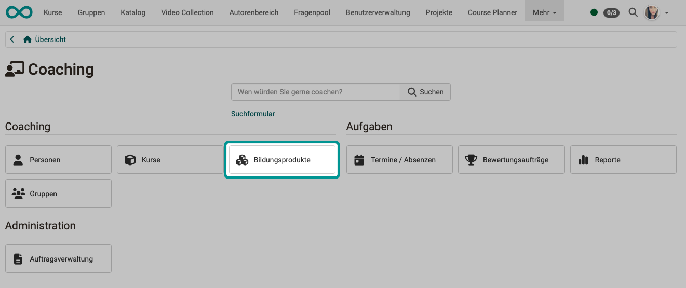
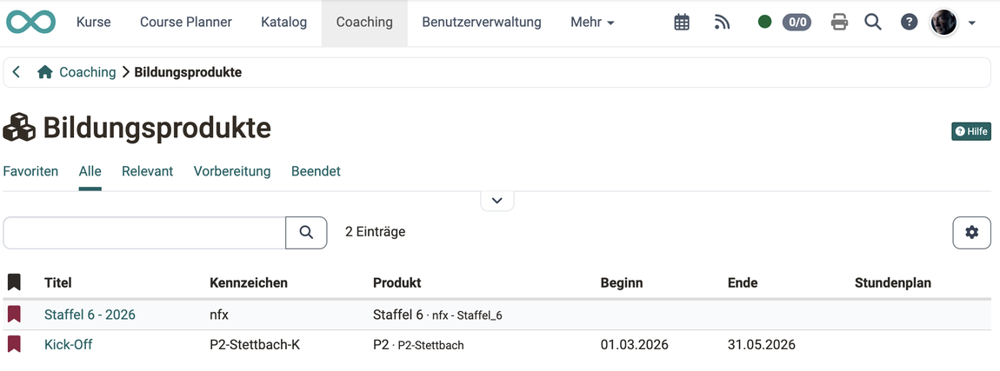
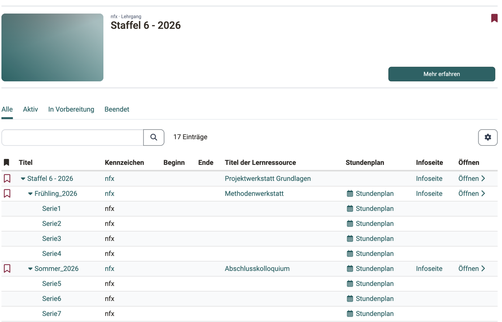

# Coaching - Bildungsprodukte {: #educational_products}

Ein Bildungsprodukt fasst mehrere Kurse und/oder Kursdurchführungen zu einem übergeordneten Angebot zusammen.

Als Betreuer:in können Sie auch für Bildungsprodukte zuständig sein, die aus mehreren Kursen und/oder aus mehreren Durchführungen bestehen. Eine Übersicht über alle Bildungsprodukte, in denen Sie Betreuer:in sind, erhalten Sie im Coaching Tool über den Button "Bildungsprodukte".

{ class="shadow lightbox" }

## Woher kommt ein Bildungsprodukt? {: #origin}

Bildungsprodukte entstehen im [Course Planner](../area_modules/Course_Planner.de.md), nicht im Coaching Tool. Kursplaner:innen legen zuerst das [Produkt](../area_modules/Course_Planner_Products.de.md#create_product) an unter: 
`Course Planner > Produkte`

Danach planen sie zu diesem Produkt eine oder mehrere [Durchführungen](../area_modules/Course_Planner_Implementations.de.md).

Der Course Planner nennt dasselbe Objekt "Produkt", das Coaching Tool nennt es "Bildungsprodukt". Gemeint ist beide Male das Angebot, zu dem die Kurse und die Durchführungen gehören.

Im Coaching Tool arbeiten Sie mit dem Ergebnis dieser Planung. Sie sehen die Durchführungen, in denen Sie Betreuer:in oder Besitzer:in sind. Die Struktur eines Produkts ändern Sie im Course Planner.

[Zum Seitenanfang ^](#educational_products)

---

## Wann erscheint der Button "Bildungsprodukte"? {: #availability}

Der Button erscheint, wenn beide Bedingungen erfüllt sind:

* Administrator:innen haben das [Modul Course Planner](../../manual_admin/administration/Modules_Course_Planner.de.md) aktiviert.
* Sie sind in mindestens einem Kurs Betreuer:in oder Besitzer:in.

Welche Bedingungen den Zugang zum Coaching Tool insgesamt steuern, zeigt der Abschnitt [Wann ist das Coaching Tool verfügbar?](../area_modules/Coaching.de.md#availability).

[Zum Seitenanfang ^](#educational_products)

---

## Was zeigt die Liste? [:octicons-tag-16:{ title="ab Release 20.1.7 (OO-8860)" }](https://track.frentix.com/issue/OO-8860){:target="_blank"} {: #list}

Die Liste zeigt Ihre Durchführungen. Die Spalte "Produkt" nennt zu jeder Durchführung das Bildungsprodukt, zu dem sie gehört. Wählen Sie im ersten Schritt eine Durchführung aus.

{ class="shadow lightbox" }

Die Filter-Tabs "Favoriten", "Alle", "Relevant", "In Vorbereitung" und "Beendet" schränken die Liste ein. Weitere Informationen zum allgemeinen Umgang mit Filtern und Filter-Tabs finden Sie unter [Mit Tabellen arbeiten](../basic_concepts/Table_Concept.de.md).

[Zum Seitenanfang ^](#educational_products)

---

## Die Struktur einer Durchführung {: #structure}

Durch Klick auf einen Namen öffnen Sie die Baumstruktur dieser Durchführung.

{ class="shadow lightbox" }

Sie können nun durch Klick auf eines der Elemente im Produkt dieses **direkt öffnen** und von dort weiter navigieren. Der Link "Öffnen" startet den Kurs, der Link "Infoseite" zeigt die [Infoseite des Kurses](../learningresources/Info_page.de.md).

Mit dem **Button "Mehr erfahren"** gelangen Sie zur Infoseite der Durchführung. Sie zeigt die Beschreibung, die enthaltenen Kurse und die Termine.

[Zum Seitenanfang ^](#educational_products)

---

## Weiterführende Informationen {: #further_information}

[Course Planner: Produkte (Produkt erstellen) >](../../manual_user/area_modules/Course_Planner_Products.de.md#create_product) 
[Course Planner: Durchführungen >](../../manual_user/area_modules/Course_Planner_Implementations.de.md) 
[Course Planner: Übersicht >](../../manual_user/area_modules/Course_Planner.de.md) 
[Coaching: Übersicht >](../../manual_user/area_modules/Coaching.de.md) 
[Coaching: Personensuche >](../../manual_user/area_modules/Coaching_User_Search.de.md) 
[Coaching: Personen >](../../manual_user/area_modules/Coaching_People.de.md) 
[Coaching: Kurse >](../../manual_user/area_modules/Coaching_Courses.de.md) 
[Coaching: Termine / Absenzen >](../../manual_user/area_modules/Coaching_Events_Absences.de.md) 
[Coaching: Bewertungsaufträge >](../../manual_user/area_modules/Coaching_Assessment_Orders.de.md) 
[Coaching: Reports >](../../manual_user/area_modules/Coaching_Reports.de.md) 
[Coaching: Gruppen >](../../manual_user/area_modules/Coaching_Groups.de.md) 
[Coaching: Auftragsverwaltung >](../../manual_user/area_modules/Coaching_Order_Management.de.md) 
[Rollen >](../../manual_user/basic_concepts/Roles.de.md)

[Zum Seitenanfang ^](#educational_products)
