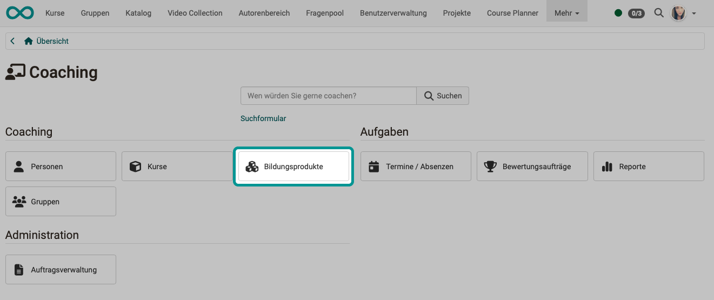
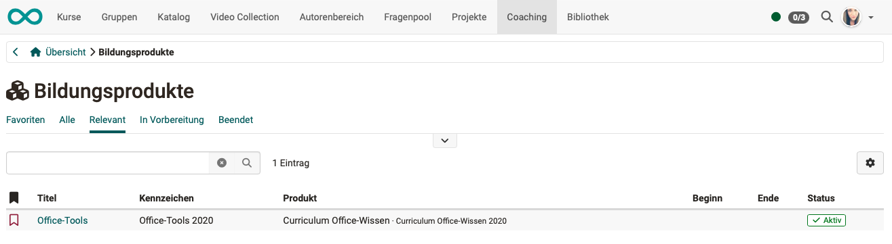
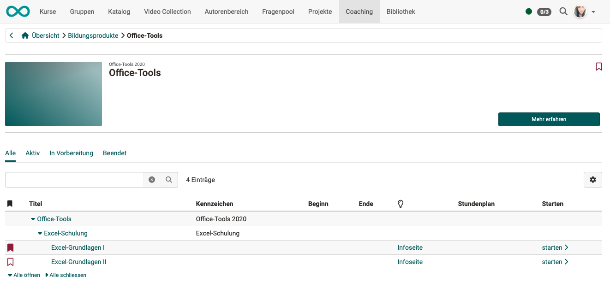

# Coaching - Educational products {: #educational_products}

As a coach, you may also be responsible for educational products that consist of several courses and/or several implementations. You can find an overview of all educational products for which you are a coach in the coaching tool under the "Educational products" tab.

{ class="shadow lightbox" }

In the first step, select an educational product.

{ class="shadow lightbox" }

Clicking on a name opens the tree structure for that product.

{ class="shadow lightbox" }

You can now **open it directly** by clicking on one of the items in the product and navigate further from there.

The **"Learn more" button** takes you to an overview page for the product, where all included courses and dates are displayed.

