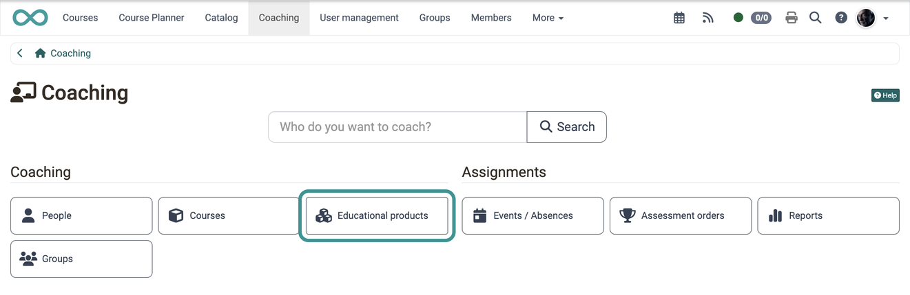
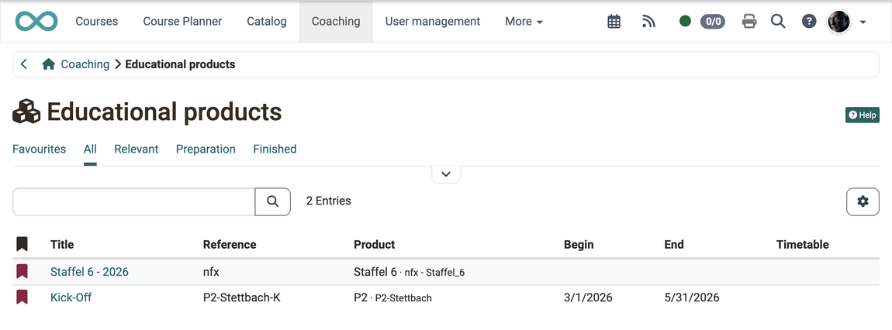
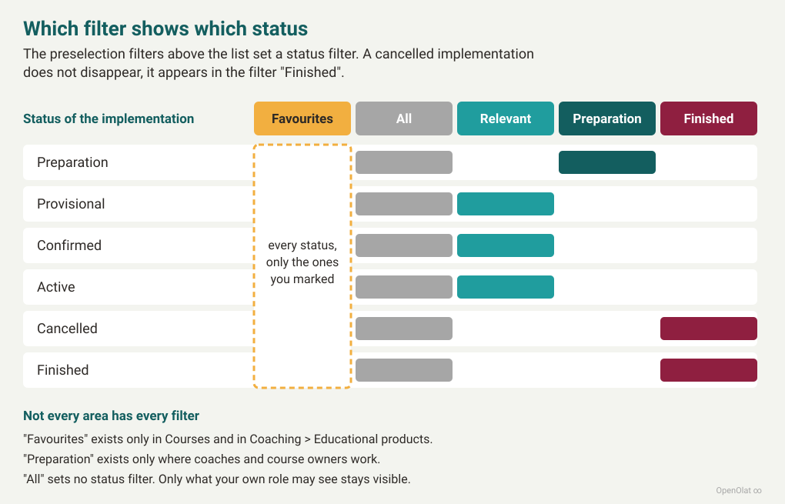
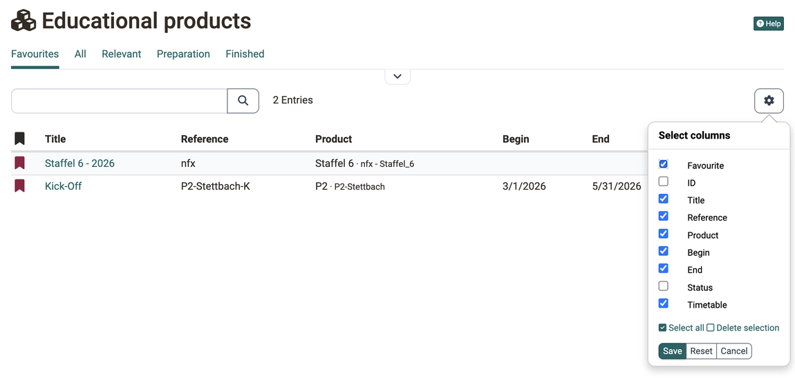
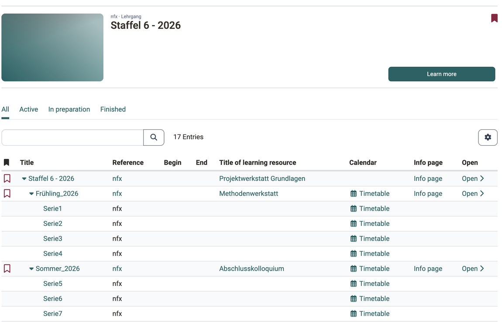
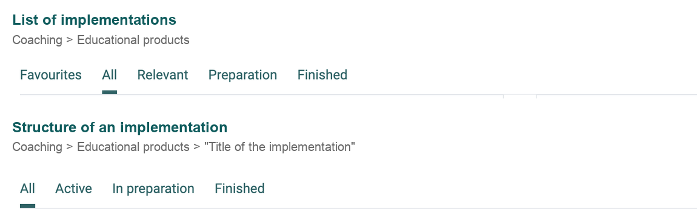

# Coaching - Educational products {: #educational_products}

An educational product groups several courses and/or course implementations into one overarching offering.

As a coach, you may also be responsible for educational products that consist of several courses and/or several implementations. You can find an overview of all educational products for which you are a coach in the Coaching Tool via the "Educational products" button.

{ class="shadow lightbox" }

## Where does an educational product come from? {: #origin}

Educational products are created in the [Course Planner](../area_modules/Course_Planner.md), not in the Coaching Tool. Course planners first create the [product](../area_modules/Course_Planner_Products.md#create_product) in: 
`Course Planner > Products`

They then plan one or more [implementations](../area_modules/Course_Planner_Implementations.md) for this product.

The Course Planner calls this object "product", the Coaching Tool calls it "educational product". Both refer to the offering to which the courses and the implementations belong.

In the Coaching Tool you work with the result of this planning. You see the implementations in which you are a coach or an owner. You change the structure of a product in the Course Planner.

[To the top of the page ^](#educational_products)

---

## When does the "Educational products" button appear? {: #availability}

The button appears when both conditions are met:

* Administrators have activated the [Course Planner module](../../manual_admin/administration/Modules_Course_Planner.md).
* You are a coach or an owner in at least one course.

The section [When is the Coaching Tool available?](../area_modules/Coaching.md#availability) shows which conditions govern access to the Coaching Tool as a whole.

[To the top of the page ^](#educational_products)

---

## What does the list show? [:octicons-tag-16:{ title="from Release 20.1.7 (OO-8860)" }](https://track.frentix.com/issue/OO-8860){:target="_blank"} {: #list}

The list shows your implementations. The "Product" column names the educational product each implementation belongs to. In the first step, select an implementation.

{ class="shadow lightbox" }

As a coach or a course owner, you meet the same list in a second place: under `Coaching > People > "Person" > Educational products` you see the implementations of a single person. This list works with the same filter logic. The tab "Favourites" is missing there, because you can only mark an implementation in your own list.

The same list also appears for other roles, under `Courses > Educational products` for participants and under `User management > "Person" > Educational products` for user managers and administrators. The list works in the same way there, the filters and the columns are set differently per area.

### Filtering the list [:octicons-tag-16:{ title="from Release 21.0 (OO-9374)" }](https://track.frentix.com/issue/OO-9374){:target="_blank"} {: #filter}

You find the filter tabs above the list under: 
`Coaching > Educational products`

Each tab shows the implementations in a certain status:

* **Favourites** Only the implementations that you marked with the flag yourself, regardless of the status. As soon as at least one mark exists, this tab is preselected when you open the list.
* **All** All implementations without restriction, including the finished and the cancelled ones. Useful when you look for an implementation and do not know its status.
* **Relevant** The implementations with the status "Provisional", "Confirmed" or "Active". That is everything that runs or is firmly planned, and therefore the view for everyday work. If you did not mark any favourites, this tab is preselected.
* **Preparation** Implementations that are not yet released. Only coaches and course owners see this tab. Participants do not see implementations in preparation.
* **Finished** The implementations with the status "Finished" and those with the status "Cancelled", together in one tab. A cancelled implementation therefore does not disappear, it moves here.

{ class="shadow lightbox" }

With the "Filter" menu you additionally narrow the list by product, status and execution period. The search field above the list searches the title and the reference of the implementation as well as the title and the reference of the product. How you combine filters and save your own filters is shown in [Working with tables](../basic_concepts/Table_Concept.md).

### The columns of the list [:octicons-tag-16:{ title="from Release 21.0 (OO-9374)" }](https://track.frentix.com/issue/OO-9374){:target="_blank"} {: #columns}

Which columns the list shows, you determine with the gear icon to the right above the list. Your selection is stored for your account.

{ class="shadow lightbox" }

* **Favourite** The flag with which you mark an implementation. You reach marked implementations through the tab "Favourites".
* **ID** The number under which OpenOlat keeps the implementation. Useful for enquiries to the support. This column is hidden at the start.
* **Title** The name of the implementation. A click on it opens its structure.
* **Reference** The reference from your own system of identifiers, for example a course number. Course planners assign it when they create the implementation.
* **Product** The educational product to which the implementation belongs, with its reference.
* **Begin** and **End** The planned period of the implementation.
* **Status** The status of the implementation, that is "Preparation", "Provisional", "Confirmed", "Active", "Cancelled" or "Finished". This column is hidden at the start.
* **Timetable** The access to the events of the implementation.

In the other areas the choice of columns differs. The user management additionally shows the column "Roles". The educational products under "Courses" and the person view in the Coaching Tool show the additional column "Learning progress".

[To the top of the page ^](#educational_products)

---

## The structure of an implementation {: #structure}

Clicking on a name opens the tree structure of that implementation.

{ class="shadow lightbox" }

You can now **open** an item in the product **directly** by clicking on it and navigate further from there. The "Open" link launches the course, the "Info page" link shows the [info page of the course](../learningresources/Info_page.md).

The **"Learn more" button** takes you to the info page of the implementation. It shows the description, the contained courses and the dates.

### Filtering the structure [:octicons-tag-16:{ title="from Release 21.0 (OO-9374)" }](https://track.frentix.com/issue/OO-9374){:target="_blank"} {: #structure_filter}

Open an implementation with a click on its title: 
`Coaching > Educational products > "Title of the implementation"`

The structure shows how the implementation is organised, for example into semesters and modules. If a course hangs on a row, the column "Title of learning resource" names it. Here too, filter tabs stand above the list: "All", "Active", "In preparation" and "Finished".

Two of the tabs have almost the same name, but they answer different questions:

* **"Preparation" in the list of implementations** What is coming up for me? You see the implementations that do not run yet, and you can prepare them before participants join.
* **"In preparation" in the structure** Is this implementation ready to start? You see which parts are not yet released. What appears here, participants do not see yet.

{ class="shadow lightbox" }

The picture shows only the two filter bars. You find the complete views further up: the list of implementations in the section [What does the list show?](#list), the opened implementation in the section [The structure of an implementation](#structure).

Where a part lands in the tab "In preparation" depends on what stands in the row: for a row with a course, the status counts that the course owners set in the course. For a row without a course, the status of the structure element from the Course Planner counts. A module can therefore stand in the tab "Active" while the course in it still appears in the tab "In preparation".

[To the top of the page ^](#educational_products)

---

## Further information {: #further_information}

**Mentioned on this page** 
[Course Planner: Overview >](../../manual_user/area_modules/Course_Planner.md) 
[Course Planner: Products >](../../manual_user/area_modules/Course_Planner_Products.md) 
[Course Planner: Implementations >](../../manual_user/area_modules/Course_Planner_Implementations.md) 
[Module Course Planner >](../../manual_admin/administration/Modules_Course_Planner.md) 
[Coaching: Overview >](../../manual_user/area_modules/Coaching.md) 
[Working with tables >](../basic_concepts/Table_Concept.md) 
[Info page >](../learningresources/Info_page.md)

**Further reading** 
[Coaching: User search >](../../manual_user/area_modules/Coaching_User_Search.md) 
[Coaching: People >](../../manual_user/area_modules/Coaching_People.md) 
[Coaching: Courses >](../../manual_user/area_modules/Coaching_Courses.md) 
[Coaching: Events / Absences >](../../manual_user/area_modules/Coaching_Events_Absences.md) 
[Coaching: Assessment orders >](../../manual_user/area_modules/Coaching_Assessment_Orders.md) 
[Coaching: Reports >](../../manual_user/area_modules/Coaching_Reports.md) 
[Coaching: Groups >](../../manual_user/area_modules/Coaching_Groups.md) 
[Coaching: Order management >](../../manual_user/area_modules/Coaching_Order_Management.md) 
[Roles >](../../manual_user/basic_concepts/Roles.md)

[To the top of the page ^](#educational_products)
