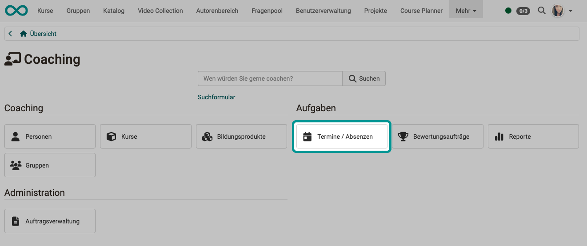
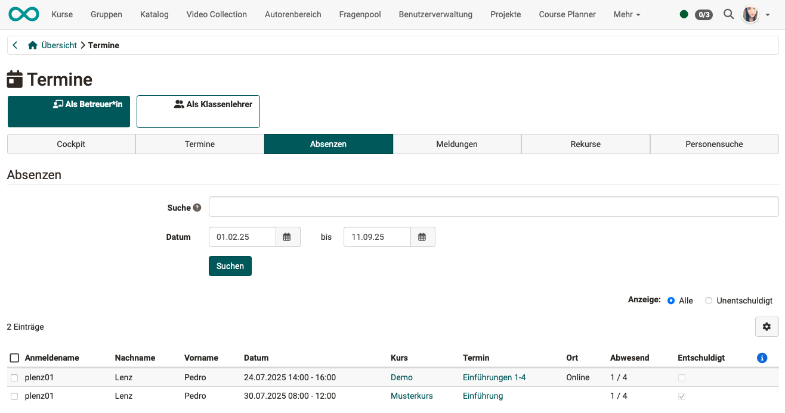
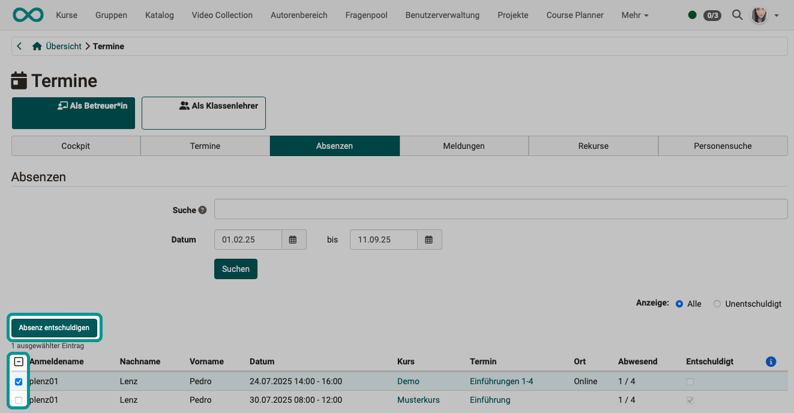

# Coaching - Termine und Absenzen {: #events}

!!! warning "Achtung"

    Dieser Artikel ist noch in Bearbeitung.

    
{ class="shadow lightbox" }

## Als Betreuer - Als Klassenlehrer {: #tabs_coach-master_coach}

tbd

[Zum Seitenanfang ^](#events)

---

## Tab Cockpit {: #tab_cockpit}

tbd

[Zum Seitenanfang ^](#events)

---

## Tab Termine {: #tab_events}

tbd

[Zum Seitenanfang ^](#events)

---

## Tab Absenzen {: #tab_absences}

* Im Suchfeld können Sie nach Benutzer:innen, Dozent:innen, Kurstiteln und Terminen suchen.
* Schränken Sie den Zeitraum ein, für den Absenzen gesucht werden sollen.
* In einer Vorauswahl können Sie alle oder nur die unentschuldigten Absenzen anzeigen lassen.

{ class="shadow lightbox" }

Um eine Absenz zu entschuldigen, markieren Sie die betreffende Person. Sobald mindestens eine Person markiert ist, erscheint der Button zum Erfassen einer Entschuldigung über der Liste.

{ class="shadow lightbox" }

[Zum Seitenanfang ^](#events)

---

## Tab Meldungen {: #tab_notices}

tbd

[Zum Seitenanfang ^](#events)

---

## Tab Rekurse {: #tab_appeals}

tbd

[Zum Seitenanfang ^](#events)

---

## Tab Personensuche {: #tab_user_search}

tbd

[Zum Seitenanfang ^](#events)

---

## Weitere Informationen {: #further_information}

tbd

[Zum Seitenanfang ^](#events)

---