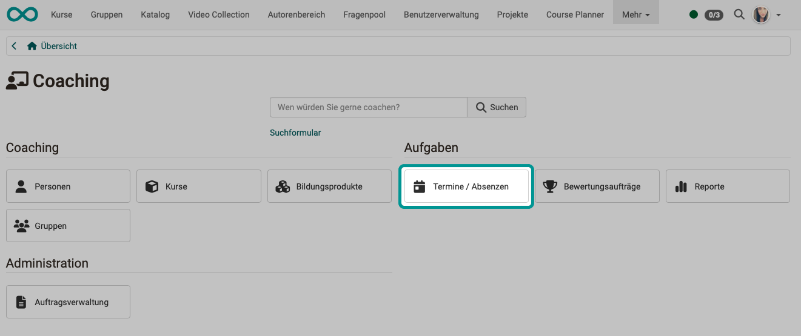
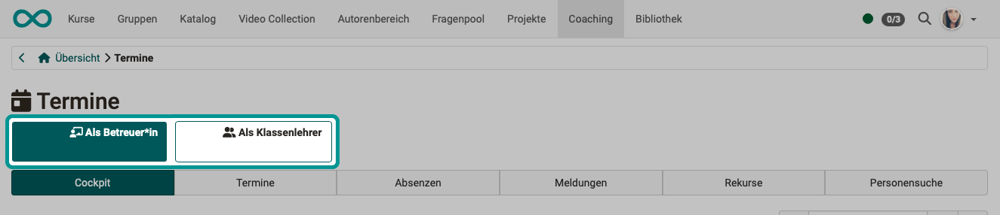
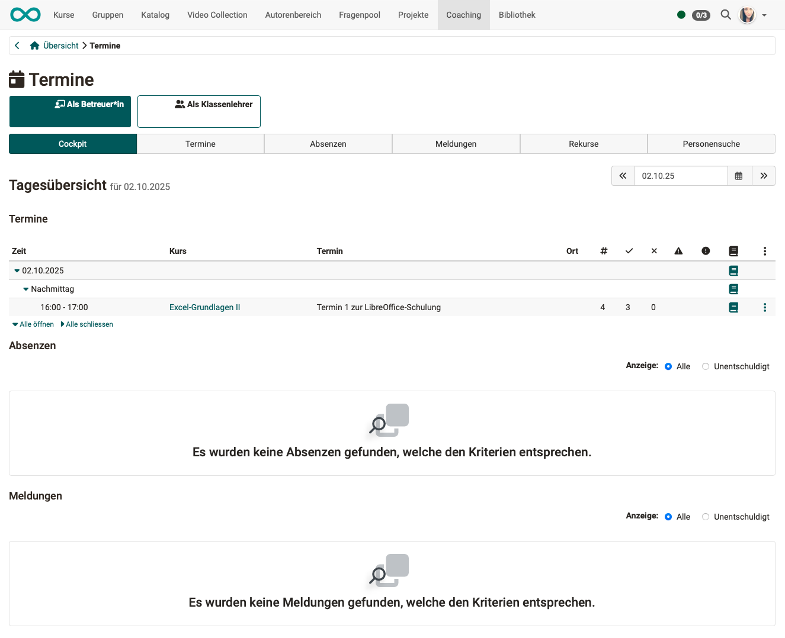
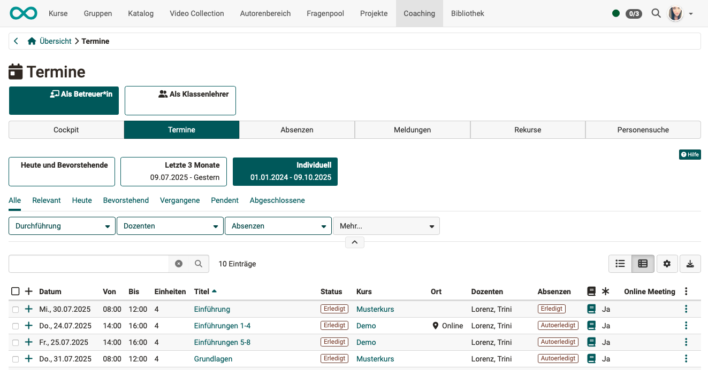
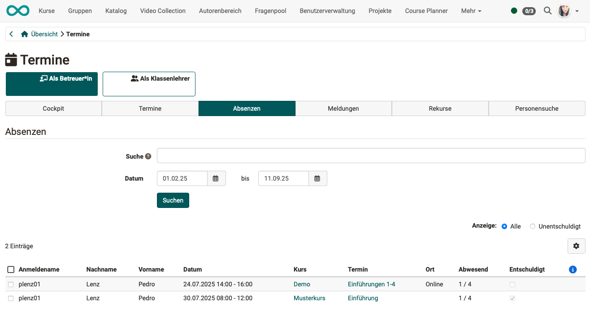
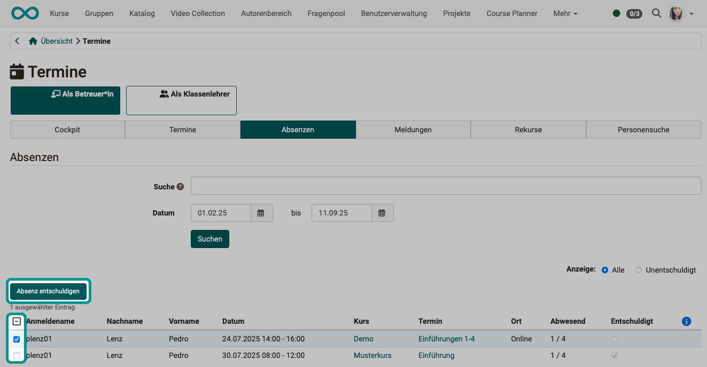
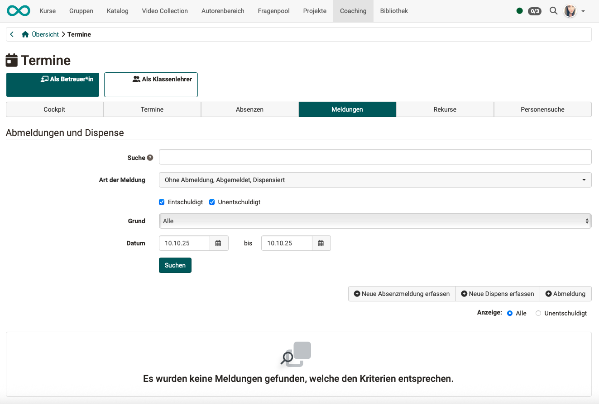
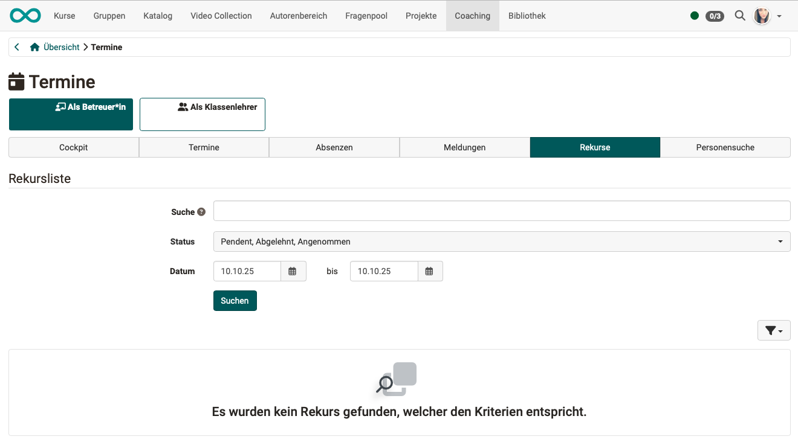
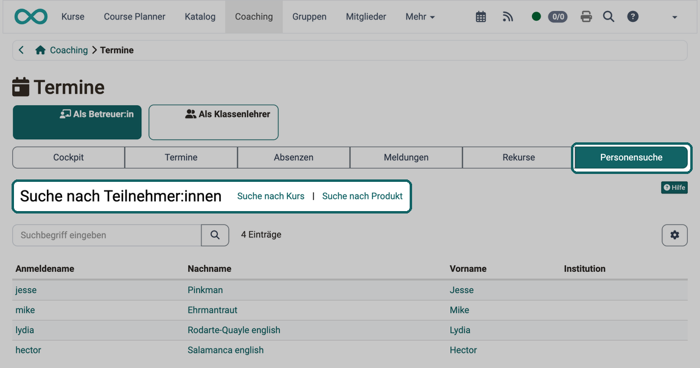

# Coaching - Termine und Absenzen {: #events}

{ class="shadow lightbox" title="Einstiegsseite Coaching" }

!!! info "Voraussetzungen"

    Dieses Werkzeug erscheint im Coaching, wenn Administrator:innen das [Modul Termine und Absenzen](../../manual_admin/administration/Modules_Events_and_Absences.de.md) aktiviert haben und in mindestens einem Kurs die [Termin- und Absenzenverwaltung eingeschaltet](../learningresources/Course_Settings_Execution.de.md#config_event_and_absence_management) ist.

Die anstehenden Termine der laufenden Woche sehen Sie schon auf der Einstiegsseite des Coachings im Widget "Termine". Über den Button "Termine / Absenzen" öffnen Sie die ganze Verwaltung mit den Tabs "Cockpit", "Termine", "Absenzen", "Meldungen", "Rekurse" und "Personensuche".

Hier sehen Sie die Termine und Absenzen über alle Kurse hinweg, für die Sie zuständig sind. Suchen Sie die Termine einer einzelnen Person, etwa als Linienvorgesetzte:r, finden Sie diese in der Detailansicht der Person im Tab [Termine & Abwesenheiten](Coaching_People.de.md#tab_lectures). Dort gelten eigene Voraussetzungen.

## Als Betreuer:in - Als Klassenlehrer [:octicons-tag-16:{ title="ab Release 14.1 (OO-4216)" }](https://track.frentix.com/issue/OO-4216) {: #tabs_coach-master_coach}

{ class="shadow lightbox" title="Werkzeug Termine des Coachings" }

Sind Sie Dozent:in von Terminen und zugleich Klassenlehrer:in einer Durchführung, wählen Sie über der Tab-Leiste, für welche Rolle Sie die Termine und Absenzen sehen:

* **Als Betreuer:in** zeigt die Termine, bei denen Sie als Dozent:in eingetragen sind.
* **Als Klassenlehrer** zeigt die Termine und Absenzen Ihrer Klassen, also der Durchführungen, in denen Sie Klassenlehrer:in sind.

Haben Sie nur eine der beiden Rollen, fehlen die Buttons, und Sie sehen direkt die Termine dieser Rolle. Wer Klassenlehrer:in ist, wird im [Course Planner](../../manual_user/area_modules/Course_Planner.de.md) für jede Durchführung einzeln festgelegt. Dafür muss das Modul Course Planner eingeschaltet sein.

[Zum Seitenanfang ^](#events)

---

## Tab Cockpit [:octicons-tag-16:{ title="ab Release 14.1 (OO-4215)" }](https://track.frentix.com/issue/OO-4215) {: #tab_cockpit}

Im Tab "Cockpit" sehen Sie die "Tagesübersicht" mit den Abschnitten "Termine", "Absenzen" und "Meldungen" für heute. Was darin steht, hängt davon ab, ob Sie oben "Als Betreuer:in" oder "Als Klassenlehrer" gewählt haben. Mit den Pfeilen und dem Datumsfeld rechts wechseln Sie zu einem anderen Tag.

{ class="shadow lightbox" title="Tab Cockpit im Werkzeug Termine des Coachings" }

Mit einem Klick auf das Buchsymbol in der Zeile eines Termins erfassen Sie die Absenzen.

Im 3-Punkte-Menü am Ende der Zeile exportieren Sie den Termin mit "Export" als Excel-Datei und laden die "Absenzenliste" und die "Präsenzliste" als PDF herunter.

Ein Klick auf den Kurstitel öffnet die Termine dieses Kurses. Dort schliessen Sie die Absenzenerfassung für einen Tag ab.

[Zum Seitenanfang ^](#events)

---

## Tab Termine {: #tab_events}

Im Tab "Termine" sehen Sie alle Termine, für die Sie zuständig sind. Mit den Buttons für den Zeitraum, den Tabs und den Filtern grenzen Sie die Liste ein.

{ class="shadow lightbox" title="Tab Termine im Werkzeug Termine des Coachings" }

Mit dem Zahnrad rechts über der Liste wählen Sie, welche Spalten die Liste zeigt. In der Zeile eines Termins finden Sie:

* **Buchsymbol**: öffnet die Erfassung der Absenzen, sofern für die Termine dieses Kurses die Absenzenerfassung eingeschaltet ist.
* **Stern-Symbol**: Die Spalte zeigt, ob die Anwesenheit beim Termin obligatorisch ist.
* **3-Punkte-Menü**: Hier laden Sie unter anderem den Termin mit "Export" als Excel-Datei sowie die "Absenzenliste" und die "Präsenzliste" als PDF herunter.

Mit einem Klick auf das + am Anfang der Zeile klappen Sie die Detailansicht des Termins auf.

[Zum Seitenanfang ^](#events)

---

## Tab Absenzen {: #tab_absences}

Absenzen erfassen Sie in den Tabs "Cockpit" oder "Termine" mit einem Klick auf das Buchsymbol in der Zeile eines Termins.

Im Tab "Absenzen" sehen Sie danach die erfassten Absenzen. Mit den Feldern über der Liste grenzen Sie sie ein:

* **Suche**: nach Benutzer:innen, Dozent:innen, Kurstiteln und Terminen.
* **Datum**: der Zeitraum, in dem die Absenzen liegen.
* **Anzeige**: "Alle" oder nur "Unentschuldigt".

{ class="shadow lightbox" title="Tab Absenzen im Werkzeug Termine des Coachings" }

Um eine Absenz zu entschuldigen, setzen Sie in der ersten Spalte ein Häkchen bei der Absenz. Über der Liste erscheint dann der Button "Absenz entschuldigen".

{ class="shadow lightbox" title="Tab Absenzen im Werkzeug Termine des Coachings" }

[Zum Seitenanfang ^](#events)

---

## Tab Meldungen {: #tab_notices}

Im Tab "Meldungen" stehen unter "Abmeldungen und Dispense" alle Meldungen zu Absenzen und Dispensen.

{ class="shadow lightbox" title="Tab Meldungen im Werkzeug Termine des Coachings" }

Mit den Feldern über der Liste grenzen Sie die Meldungen ein:

* **Suche**: nach Benutzer:innen, Dozent:innen, Kurstiteln und Terminen.
* **Art der Meldung**: "Ohne Abmeldung", "Abgemeldet" oder "Dispensiert", dazu ein Häkchen bei "Entschuldigt", "Unentschuldigt" oder beiden.
* **Grund**: die Absenzenbegründungen, die Administrator:innen vorgegeben haben, zum Beispiel Krankheit.
* **Datum**: der Zeitraum, in dem die Meldungen liegen.

Eine neue Meldung erfassen Sie mit den Buttons "Neue Absenzmeldung erfassen", "Neue Dispens erfassen" und "Abmeldung".

[Zum Seitenanfang ^](#events)

---

## Tab Rekurse {: #tab_appeals}

In diesem Tab sehen Sie die eingereichten Rekurse zu Ihren Terminen. Den Tab gibt es nur, wenn Administrator:innen die [Rekursmöglichkeit gewährt](../../manual_admin/administration/Modules_Events_and_Absences.de.md#appeal_enabled) haben und Ihre Rolle Rekurse einsehen darf: als Betreuer:in mit der Option ["Dozenten dürfen Rekurse einsehen"](../../manual_admin/administration/Modules_Events_and_Absences.de.md#teacher_see_appeal), als Klassenlehrer:in mit ["Klassenlehrer dürfen Rekurse einsehen"](../../manual_admin/administration/Modules_Events_and_Absences.de.md#mastercoach_see_appeal). In der Regel bearbeiten Absenzenverwalter:innen die Rekurse in der kursübergreifenden [Absenzenverwaltung](../area_modules/Absence_Management.de.md).

Mit den Feldern über der Liste grenzen Sie die Rekurse ein:

* **Suche**: nach Benutzer:innen, Dozent:innen und Terminen.
* **Status**: "Pendent", "Abgelehnt" oder "Angenommen", einzeln oder zusammen.
* **Datum**: der Zeitraum, in dem die Rekurse liegen.

{ class="shadow lightbox" title="Tab Rekurse im Werkzeug Termine des Coachings" }

[Zum Seitenanfang ^](#events)

---

## Tab Personensuche {: #tab_user_search}

In diesem Tab finden Sie die Teilnehmenden Ihrer Termine. Er beginnt mit der "Suche nach Teilnehmer:innen": Geben Sie einen Namen ein oder klicken Sie auf die Lupe, um alle Teilnehmenden zu sehen. Ein Klick auf eine Person öffnet ihre Übersicht mit "Tagesübersicht", "Termine und Absenzen", "Abmeldung / Dispense" und "Rekurse".

Sie können auch über einen Kurs oder ein Produkt zu den Personen gelangen. Dafür stehen neben dem grossen Titel zwei Links. Ein Klick auf einen Link wechselt die Suche; der grosse Titel zeigt danach, welche Suche gilt:

* **Suche nach Kurs** listet Ihre Kurse. Ein Klick auf einen Kurs zeigt seine Teilnehmenden.
* **Suche nach Produkt** listet die Elemente Ihrer Produkte, zum Beispiel Durchführungen. Ein Klick auf ein Element zeigt seine Teilnehmenden.

Mit dem Link "Suche nach Teilnehmer:innen" kehren Sie zur Personensuche zurück. In der Rolle "Als Klassenlehrer" steht zusätzlich "Suche nach Dozenten" zur Wahl.

{ class="shadow lightbox" title="Tab Personensuche im Werkzeug Termine des Coachings · 2026.10.08" }

[Zum Seitenanfang ^](#events)

---

## Weiterführende Informationen {: #further_information}

**Auf dieser Seite erwähnt** 
[Modul Termine und Absenzen >](../../manual_admin/administration/Modules_Events_and_Absences.de.md) 
[Kurseinstellungen - Tab Durchführung >](../learningresources/Course_Settings_Execution.de.md) 
[Coaching - Personen >](../../manual_user/area_modules/Coaching_People.de.md) 
[Course Planner: Übersicht >](../../manual_user/area_modules/Course_Planner.de.md) 
[Absenzenverwaltung >](../area_modules/Absence_Management.de.md)

**Weiterführend** 
[Termine und Absenzen (Kurs-Administration) >](../learningresources/Events_and_absences.de.md) 
[Coaching - Personensuche >](../../manual_user/area_modules/Coaching_User_Search.de.md) 
[Coaching - Kurse >](../../manual_user/area_modules/Coaching_Courses.de.md) 
[Coaching - Bildungsprodukte >](../../manual_user/area_modules/Coaching_Educational_Products.de.md) 
[Coaching - Bewertungsaufträge >](../area_modules/Coaching_Assessment_Orders.de.md) 
[Coaching - Reports >](../../manual_user/area_modules/Coaching_Reports.de.md) 
[Coaching - Gruppen >](../../manual_user/area_modules/Coaching_Groups.de.md) 
[Coaching - Auftragsverwaltung >](../../manual_user/area_modules/Coaching_Order_Management.de.md) 
[Rollen und Rechte: Welche Rollen gibt es? >](../../manual_user/basic_concepts/Roles.de.md) 
[Bewertungswerkzeug - Übersicht >](../../manual_user/learningresources/Assessment_tool_overview.de.md)

[Zum Seitenanfang ^](#events)
