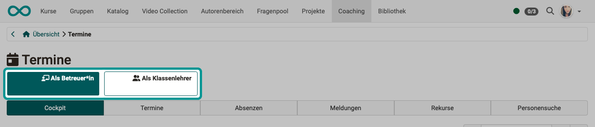
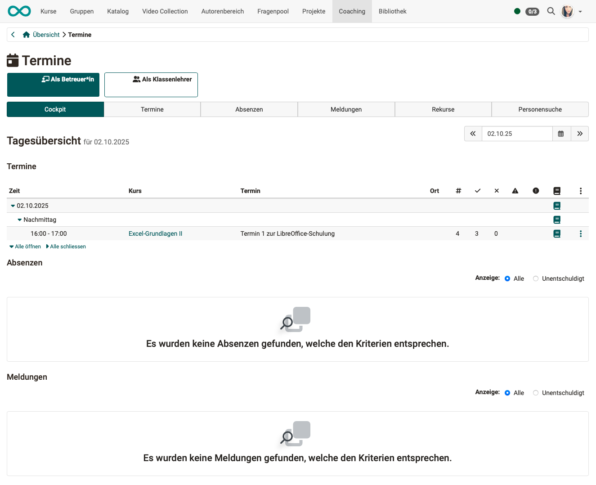
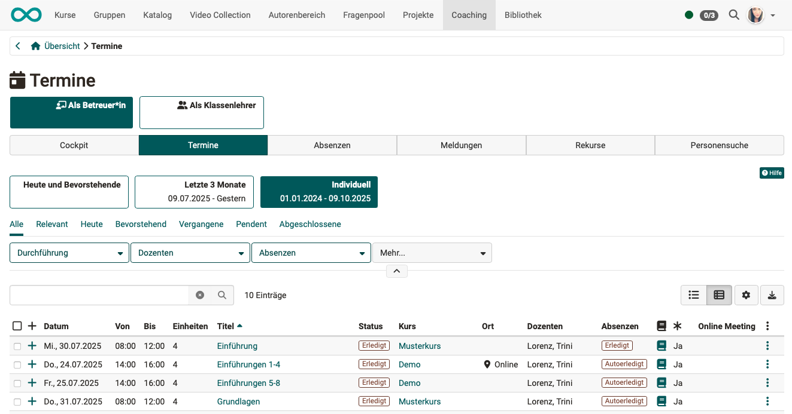
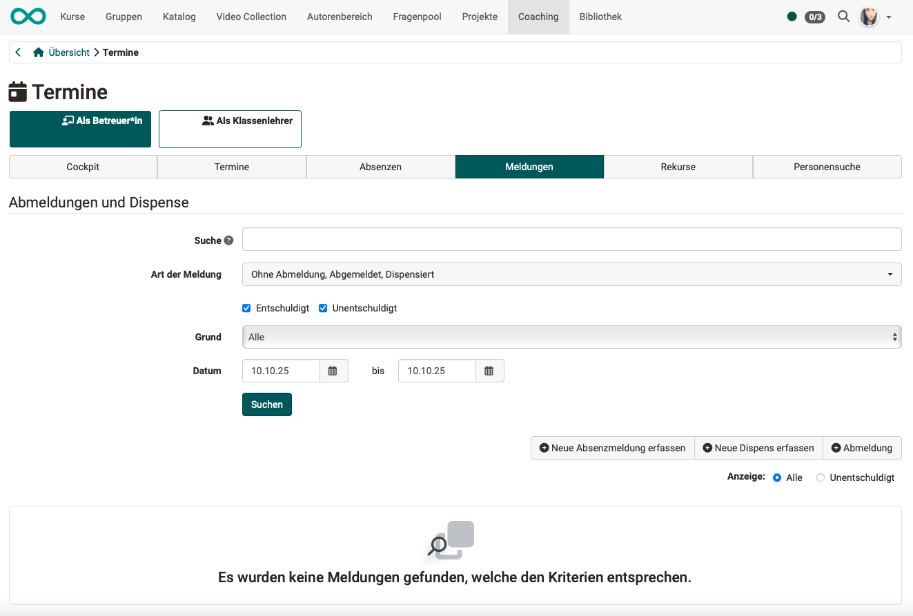
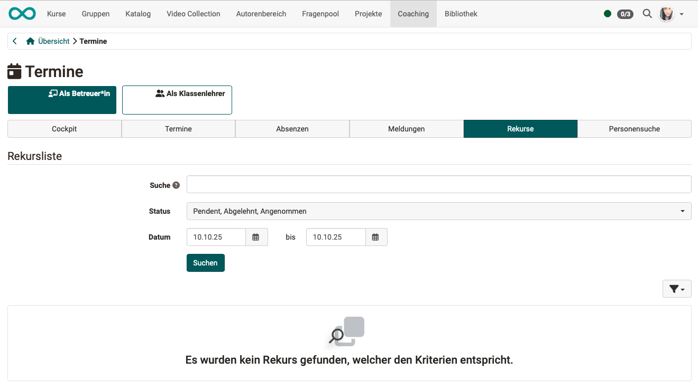
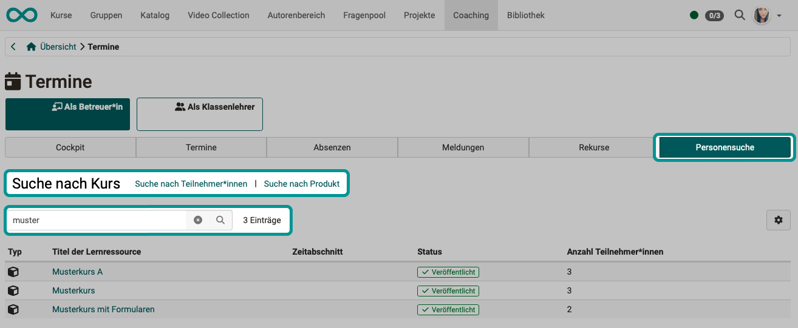

# Coaching - Events and Absences {: #events}

{ class="shadow lightbox" }

## As Coach - As Master Coach {: #tabs_coach-master_coach}

{ class="shadow lightbox" }

At the top level, you can focus the view of your appointments and absences on your role as a coach or, if applicable, as a class teacher.

In the [Course Planner](../../manual_user/area_modules/Course_Planner.md), it is possible to assign the role of homeroom teacher to a person. 
(Prerequisite: The Course Planner module has been activated by an administrator.)
This may be a different person for each session. In this case, the dates and absences of your classes will be displayed in the coaching tool. 

[To the top of the page ^](#events)

---

## Tab Cockpit {: #tab_cockpit}

In the Cockpit tab, you will find a daily overview with the following sections

* Events
* Absences
* Notices

(Depending on the focus you have previously set as a coach or class teacher.) 
Instead of the current day, you can also select another day.

{ class="shadow lightbox" }

Absences can be recorded by clicking on the **book icon** in the row of an event.

By clicking on the **icon with the 3 dots** in the row of an appointment, individual events can be exported as an Excel file, and an absence list and an attendance list can be downloaded in PDF format.

[To the top of the page ^](#events)

---

## Tab Events {: #tab_events}

Several filter functions are available to help you keep track of your many events.

{ class="shadow lightbox" }

At the top right above the list, you can select the desired columns using the gear icon. Customize the list view to suit your needs.

**Example:**

* Absences can be recorded by clicking on the **book icon** in the row of an event.

* The column with the **asterisk symbol** shows you whether attendance has been planned as mandatory or not.

* By clicking on the **icon with the 3 dots** in the row of an appointment, individual events can be exported as an Excel file, and an absence list and an attendance list can be downloaded in PDF format.

By clicking on the plus symbol at the beginning of the line, you can expand the details of this event.

[To the top of the page ^](#events)

---

## Tab Absences {: #tab_absences}

Absences can be recorded in the **Cockpit** or **Events** tabs by clicking on the **book icon** in the row of an event.

In the Events tab, you will then see an overview of the recorded absences. 

* In the search field, you can search for users, instructors, course titles, and dates.
* Limit the period for which absences are to be searched.
* In a preselection, you can display all absences or only unexcused absences.

{ class="shadow lightbox" }

To excuse an absence, select the person concerned. Once at least one person has been selected, the button for entering an excuse appears above the list.

{ class="shadow lightbox" }

[To the top of the page ^](#events)

---

## Tab Notices {: #tab_notices}

All notifications relating to absences and exemptions are collected in this tab and can be filtered according to your needs.

{ class="shadow lightbox" }

In the **search field**, you can search for users, instructors, course titles, and dates.

Filter by **type of notification** ("No notification," "Notified," "Exempt") or  by **excused** and/or **unexcused**.

The **"Reason"** filter option allows you to select from terms predefined by the administrator.

You will also find buttons here for

* Enter new absence notification
* Enter new exemption
* Logout

[To the top of the page ^](#events)

---

## Tab Appeals {: #tab_appeals}

This tab provides an overview for managing all appeals.

In the **search field**, you can search for users, coach, and events.

Filter the list, for example, by the **status** "pending," "rejected," or "accepted." (You can select one status, two statuses, or all statuses.)

{ class="shadow lightbox" }

[To the top of the page ^](#events)

---

## Tab User search {: #tab_user_search}

To search for people, use the search field and the option to switch the preselection (search by course, search by participant, search by product).

When you click on one of the courses or products found, you will be taken to the list of people assigned to it.

{ class="shadow lightbox" }

[To the top of the page ^](#events)

---

## Further information {: #further_information}

[Coaching: User search >](../../manual_user/area_modules/Coaching_User_Search.md) 
[Coaching: People >](../../manual_user/area_modules/Coaching_People.md) 
[Coaching: Courses >](../../manual_user/area_modules/Coaching_Courses.md) 
[Coaching: Educational products >](../../manual_user/area_modules/Coaching_Educational_Products.md) 
[Coaching: Assessment orders >](../area_modules/Coaching_Assessment_Orders.md) 
[Coaching: Reports >](../../manual_user/area_modules/Coaching_Reports.md) 
[Coaching: Groups >](../../manual_user/area_modules/Coaching_Groups.md) 
[Coaching: Order management >](../../manual_user/area_modules/Coaching_Order_Management.md) 
[Roles >](../../manual_user/basic_concepts/Roles.md) 
[Assessment tool >](../../manual_user/learningresources/Assessment_tool_overview.md) 

 [To the top of the page ^](#order_management)

[To the top of the page ^](#events)
