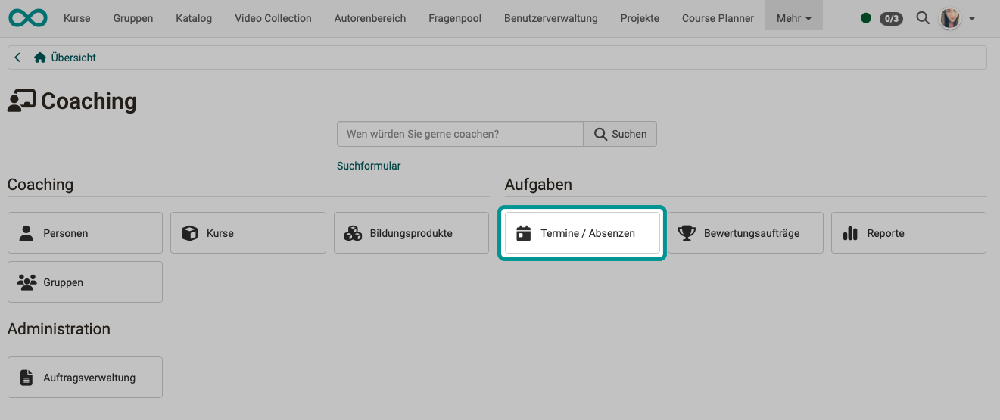
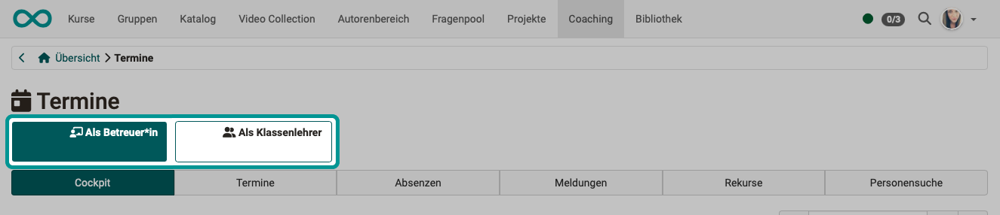
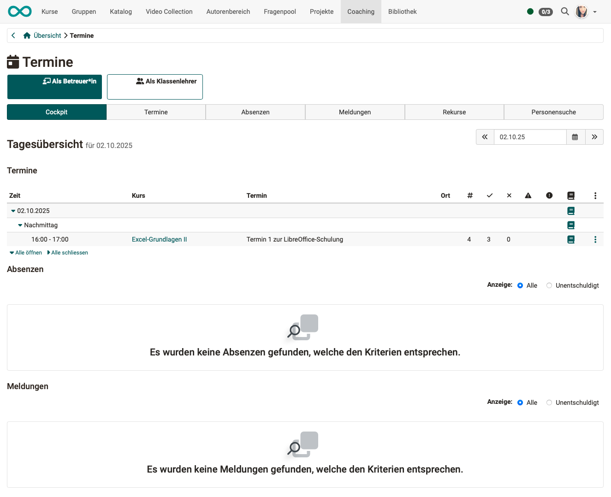
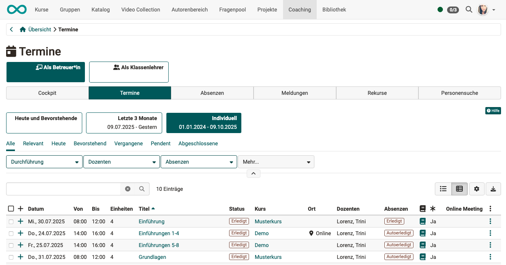
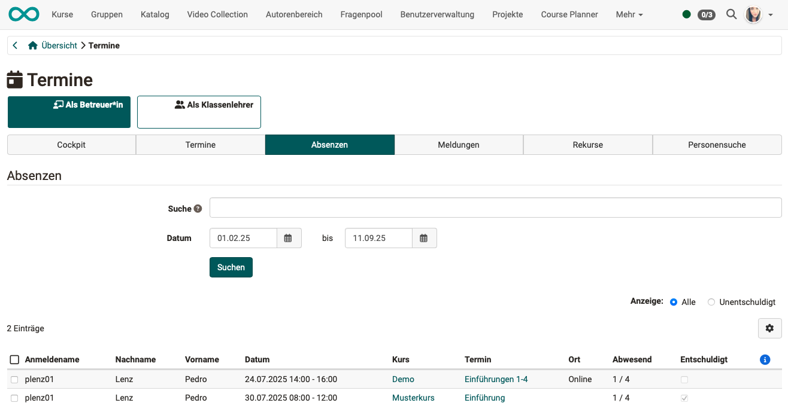
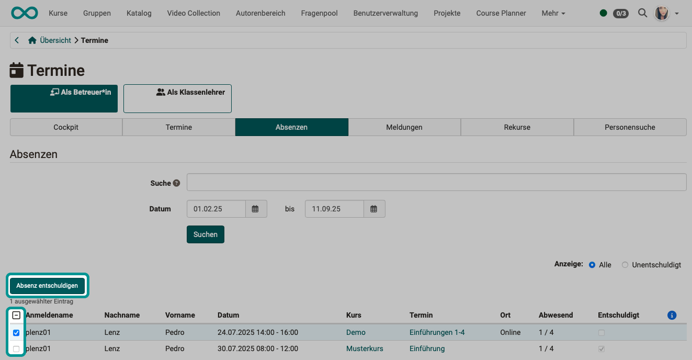
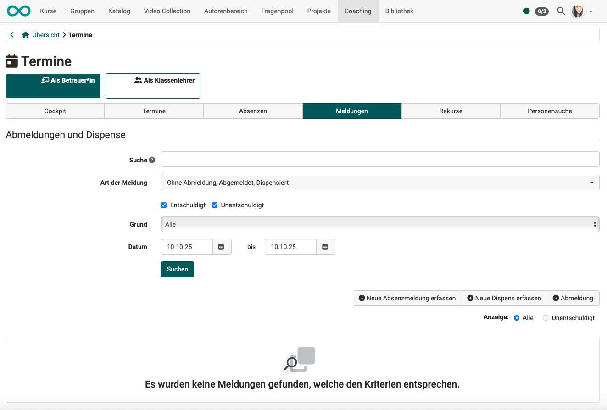
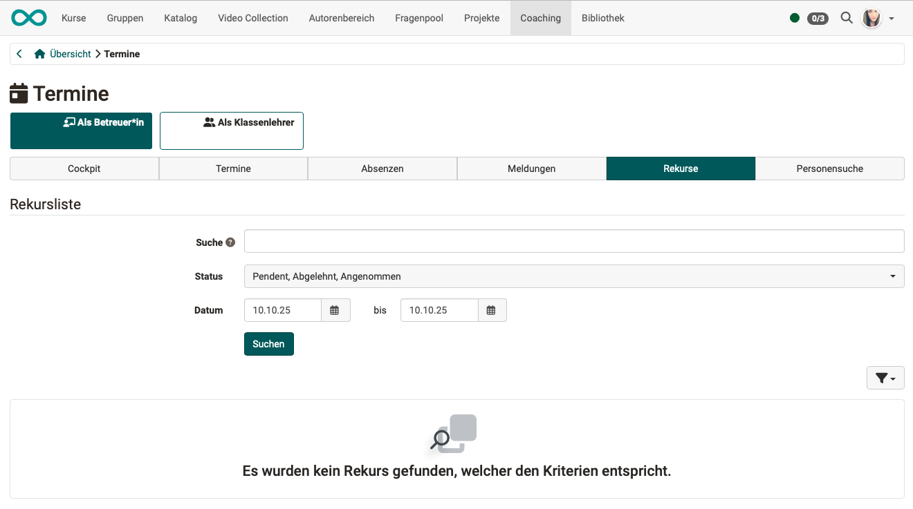
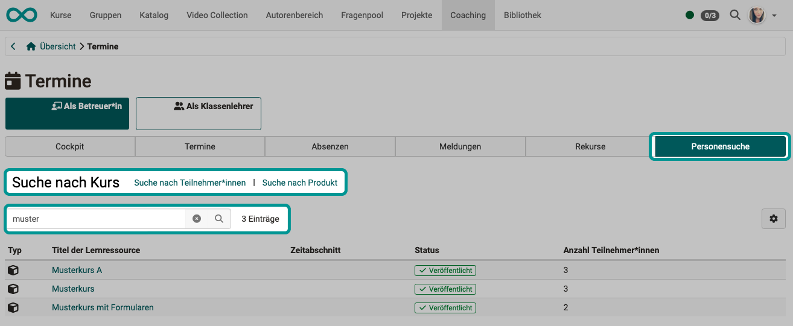

# Coaching - Events and Absences {: #events}

{ class="shadow lightbox" }

!!! info "Prerequisites"

    This tool appears in Coaching if administrators have activated the [Module Events and Absences](../../manual_admin/administration/Modules_Events_and_Absences.md) and if [event and absence management is switched on](../learningresources/Course_Settings_Execution.md#config_event_and_absence_management) in at least one course.

A quick overview of the upcoming events of the current week is already available on the Coaching overview in the **Events** widget. This tool provides the complete management with Cockpit, Absences, Notices, Appeals and User search.

## As coach - As master coach [:octicons-tag-16:{ title="from Release 14.1 (OO-4216)" }](https://track.frentix.com/issue/OO-4216) {: #tabs_coach-master_coach}

{ class="shadow lightbox" }

At the top level, you can focus the view of your events and absences on your role as coach or, if applicable, as master coach.

In the [Course Planner](../../manual_user/area_modules/Course_Planner.md), it is possible to assign the role master coach to a person.
(Prerequisite: Administrators have activated the Course Planner module.)
This may be a different person for each implementation. In this case, the events and absences of your classes are displayed in the Coaching Tool.

[To the top of the page ^](#events)

---

## Tab Cockpit {: #tab_cockpit}

In the tab Cockpit you find a daily overview with the sections

* Events
* Absences
* Notices

(Depending on the focus you have previously set as coach or as master coach.) 
Instead of the current day, you can also select another day.

{ class="shadow lightbox" }

Absences can be recorded by clicking on the **book icon** in the row of an event.

By clicking on the **icon with the 3 dots** in the row of an event, individual events can be exported as an Excel file, and an absence list and an attendance list can be downloaded in PDF format.

Via the course title in the overview, you reach the events of that course, where you can close the absence recording for a day.

[To the top of the page ^](#events)

---

## Tab Events {: #tab_events}

Several filter functions are available to help you keep track of many events.

{ class="shadow lightbox" }

At the top right above the list, you can select the desired columns using the gear icon. Customise the list view to suit your needs.

**Examples:**

* Absences can be recorded by clicking on the **book icon** in the row of an event, provided that absence recording has been activated for the events of that course.

* The column with the **asterisk symbol** shows you whether attendance has been planned as mandatory or not.

* By clicking on the **icon with the 3 dots** in the row of an event, individual events can be exported as an Excel file, and an absence list and an attendance list can be downloaded in PDF format.

By clicking on the plus symbol at the beginning of the row, you can expand the details of this event.

[To the top of the page ^](#events)

---

## Tab Absences {: #tab_absences}

Absences can be recorded in the tabs **Cockpit** or **Events** by clicking on the **book icon** in the row of an event.

In the tab Absences, you then get an overview of the recorded absences.

* In the search field, you can search for users, teachers, course titles and events.
* Limit the period for which absences are to be searched.
* In a preselection, you can display all absences or only the unexcused absences.

{ class="shadow lightbox" }

To excuse an absence, select the person concerned. As soon as at least one person is selected, the button for entering an excuse appears above the list.

{ class="shadow lightbox" }

[To the top of the page ^](#events)

---

## Tab Notices {: #tab_notices}

All notices relating to absence and dispensation are collected in this tab and can be filtered according to your needs.

{ class="shadow lightbox" }

In the **search field**, you can search for users, teachers, course titles and events.

Filter by **type of notice** ("Without notification", "Notice of absence", "Dispensation") or  by **excused** and/or **unexcused**.

The filter option **"Reason"** offers you the terms predefined by administrators.

You also find buttons here for

* Record new absence
* Record new dispensation
* Record new notice of absence

[To the top of the page ^](#events)

---

## Tab Appeals {: #tab_appeals}

In this tab you get an overview for the management of all appeals. The tab appears if you have the permission to organise appeals. As a rule, absence managers process the appeals in the cross-course [Absence management](../area_modules/Absence_Management.md). 

In the **search field**, you can search for users, coaches and events.

Filter the list, for example, by the **status** "Pending", "Rejected" or "Approved". (You can select one status, two of them or all.)

{ class="shadow lightbox" }

[To the top of the page ^](#events)

---

## Tab User search {: #tab_user_search}

For the user search, use the search field and the option to switch the preselection (search by course, search by participants, search by product).

When you click on one of the courses or a product found, you reach the list of the people assigned there.

{ class="shadow lightbox" }

[To the top of the page ^](#events)

---

## Further information {: #further_information}

**Mentioned on this page** 
[Module Events and Absences >](../../manual_admin/administration/Modules_Events_and_Absences.md) 
[Course Settings - Tab Execution >](../learningresources/Course_Settings_Execution.md) 
[Course Planner: Overview >](../../manual_user/area_modules/Course_Planner.md) 
[Absence management >](../area_modules/Absence_Management.md)

**Further reading** 
[Events and absences in the course >](../learningresources/Events_and_absences.md) 
[Coaching: User search >](../../manual_user/area_modules/Coaching_User_Search.md) 
[Coaching: People >](../../manual_user/area_modules/Coaching_People.md) 
[Coaching: Courses >](../../manual_user/area_modules/Coaching_Courses.md) 
[Coaching: Educational products >](../../manual_user/area_modules/Coaching_Educational_Products.md) 
[Coaching: Assessment orders >](../area_modules/Coaching_Assessment_Orders.md) 
[Coaching: Reports >](../../manual_user/area_modules/Coaching_Reports.md) 
[Coaching: Groups >](../../manual_user/area_modules/Coaching_Groups.md) 
[Coaching: Order management >](../../manual_user/area_modules/Coaching_Order_Management.md) 
[Roles >](../../manual_user/basic_concepts/Roles.md) 
[Assessment tool >](../../manual_user/learningresources/Assessment_tool_overview.md)

[To the top of the page ^](#events)
