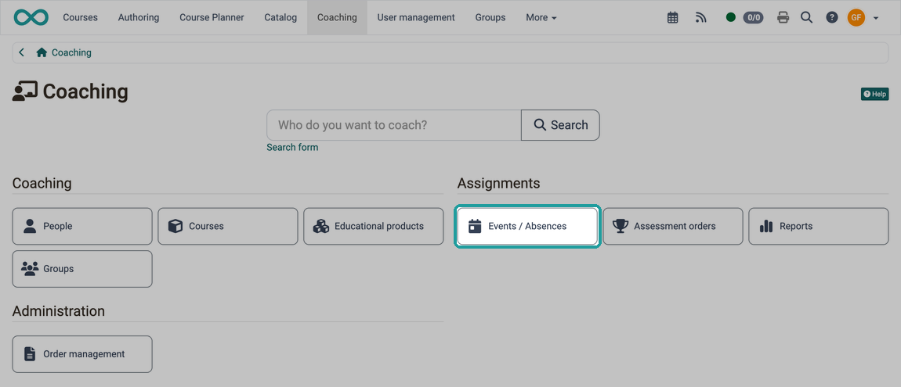
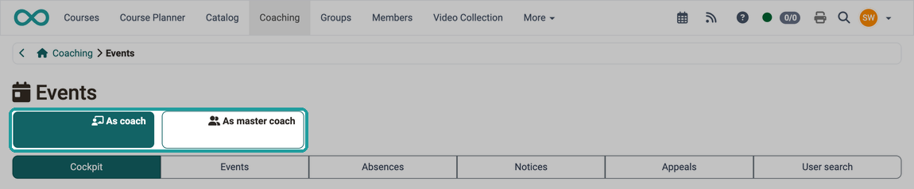
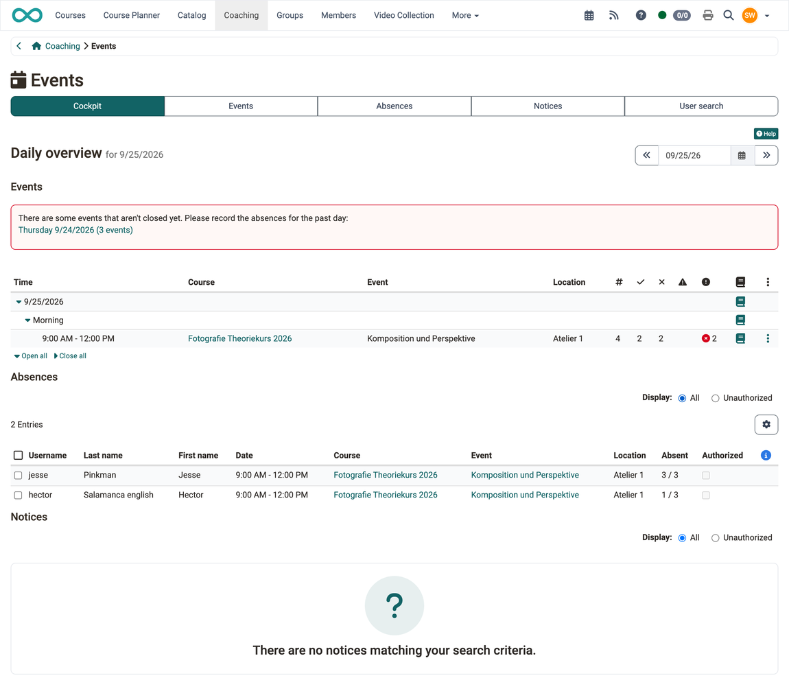
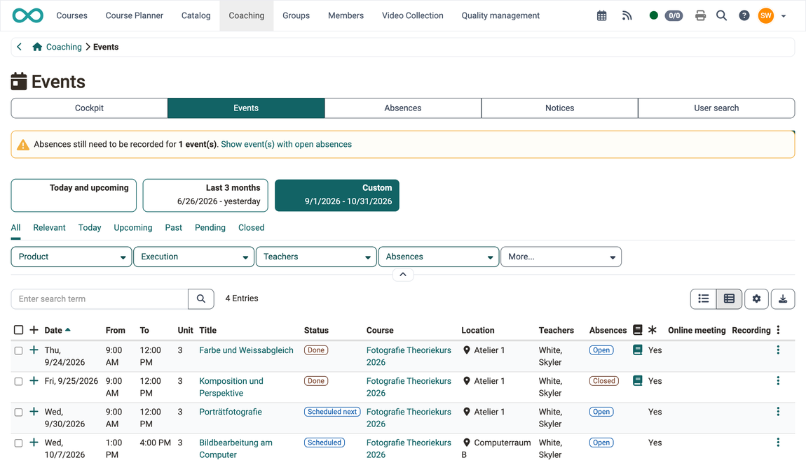
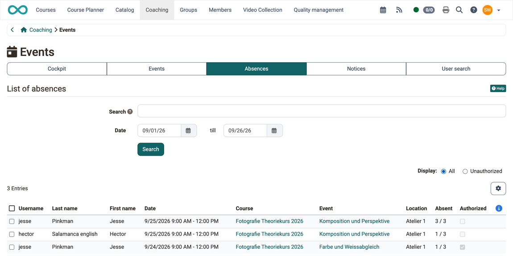
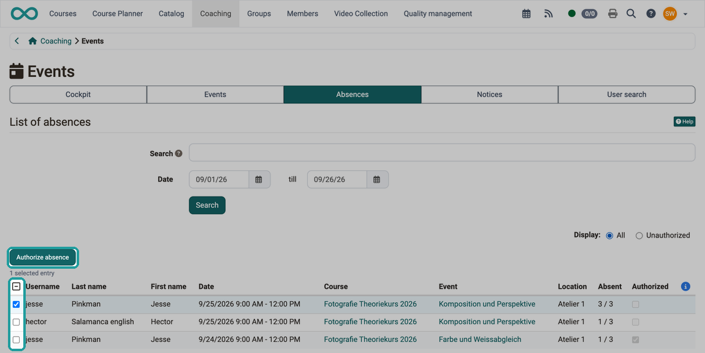
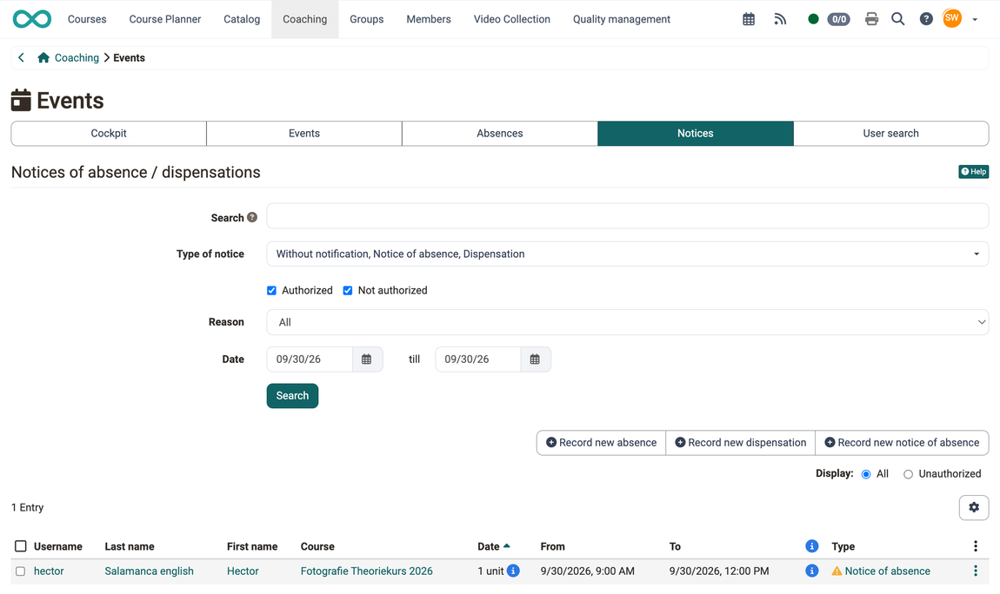
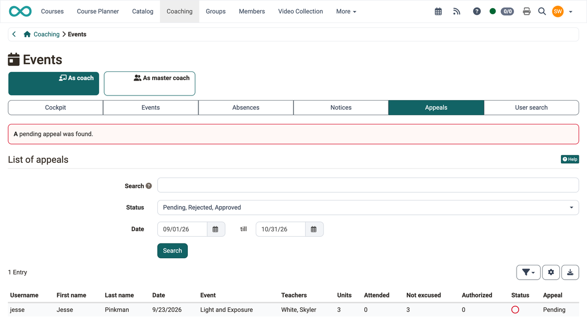
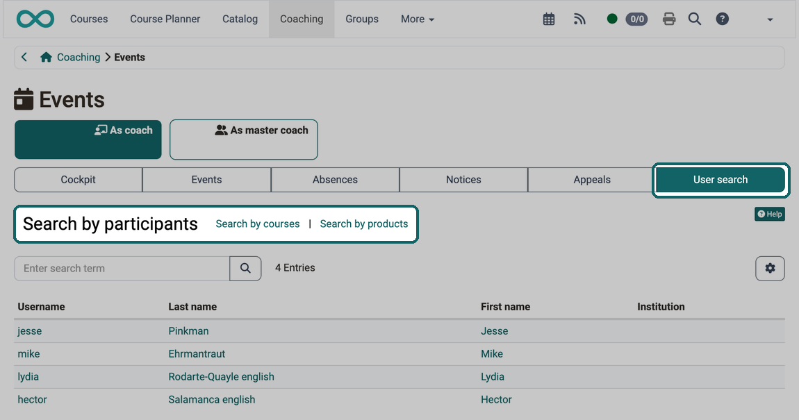

# Coaching - Events and Absences {: #events}

{ class="shadow lightbox" title="Coaching entry page" }

!!! info "Prerequisites"

    This tool appears in Coaching if administrators have activated the [Module Events and Absences](../../manual_admin/administration/Modules_Events_and_Absences.md) and if ["Event & absence management" is switched on](../learningresources/Course_Settings_Execution.md#config_event_and_absence_management) in at least one course.

You already see the upcoming events of the current week on the Coaching entry page in the "Events" widget. The "Events / Absences" button opens the complete management with the tabs "Cockpit", "Events", "Absences", "Notices", "Appeals" and "User search".

Here you see the events and absences across all courses you are responsible for. If you are looking for the events of a single person, for example as a line manager, you find them in the detail view of the person in the tab [Events & Absences](Coaching_People.md#tab_lectures). Separate prerequisites apply there.

## As coach - As master coach [:octicons-tag-16:{ title="from Release 14.1 (OO-4216)" }](https://track.frentix.com/issue/OO-4216) {: #tabs_coach-master_coach}

{ class="shadow lightbox" title="Events tool of Coaching" }

If you are a teacher of events and at the same time master coach of an implementation, you choose above the tab bar for which role you see the events and absences:

* **As coach** shows the events where you are entered as teacher.
* **As master coach** shows the events and absences of your classes, that is, of the implementations where you are master coach.

If you have only one of the two roles, the buttons are missing and you see the events of this role directly. Who is master coach is set in the [Course Planner](../../manual_user/area_modules/Course_Planner.md) for each implementation separately. This requires the Course Planner module to be switched on.

[To the top of the page ^](#events)

---

## Tab Cockpit [:octicons-tag-16:{ title="from Release 14.1 (OO-4215)" }](https://track.frentix.com/issue/OO-4215) {: #tab_cockpit}

In the "Cockpit" tab you see the "Daily overview" with the sections "Events", "Absences" and "Notices" for today. What they contain depends on whether you have chosen "As coach" or "As master coach" above. Use the arrows and the date field on the right to switch to another day.

{ class="shadow lightbox" title="Tab Cockpit in the Events tool of Coaching" }

A click on the book icon in the row of an event lets you record the absences.

In the 3-dot menu at the end of the row, you export the event as an Excel file with "Export" and download the "Absence list" and the "Attendance list" as PDF.

A click on the course title opens the events of this course. There you close the absence recording for a day.

[To the top of the page ^](#events)

---

## Tab Events {: #tab_events}

In the "Events" tab you see all events you are responsible for. Use the buttons for the period, the tabs and the filters to narrow down the list.

{ class="shadow lightbox" title="Tab Events in the Events tool of Coaching" }

With the gear icon at the top right above the list, you choose which columns the list shows. In the row of an event you find:

* **Book icon**: opens the recording of the absences, provided that absence recording is switched on for the events of this course.
* **Asterisk symbol**: The column shows whether attendance is compulsory for the event.
* **3-dot menu**: Among other things, you download the event as an Excel file with "Export" as well as the "Absence list" and the "Attendance list" as PDF here.

A click on the + at the beginning of the row expands the detail view of the event.

[To the top of the page ^](#events)

---

## Tab Absences {: #tab_absences}

You record absences in the tabs "Cockpit" or "Events" by clicking on the book icon in the row of an event.

In the "Absences" tab you then see the recorded absences. Use the fields above the list to narrow them down:

* **Search**: for users, teachers, course titles and events.
* **Date**: the period the absences fall in.
* **Display**: "All" or only "Unauthorized".

{ class="shadow lightbox" title="Tab Absences in the Events tool of Coaching" }

To excuse an absence, tick the absence in the first column. The "Authorize absence" button then appears above the list.

{ class="shadow lightbox" title="Tab Absences in the Events tool of Coaching" }

[To the top of the page ^](#events)

---

## Tab Notices {: #tab_notices}

In the "Notices" tab, all notices on absences and dispensations are listed under "Notices of absence / dispensations".

{ class="shadow lightbox" title="Tab Notices in the Events tool of Coaching" }

Use the fields above the list to narrow down the notices:

* **Search**: for users, teachers, course titles and events.
* **Type of notice**: "Without notification", "Notice of absence" or "Dispensation", plus a tick at "Authorized", "Not authorized" or both.
* **Reason**: the reasons of absence predefined by administrators, for example illness.
* **Date**: the period the notices fall in.

You record a new notice with the buttons "Record new absence", "Record new dispensation" and "Record new notice of absence".

[To the top of the page ^](#events)

---

## Tab Appeals {: #tab_appeals}

In this tab you see the appeals submitted for your events. The tab only exists if administrators have [enabled appeals](../../manual_admin/administration/Modules_Events_and_Absences.md#appeal_enabled) and your role may see appeals: as coach with the option ["Teachers can see appeals"](../../manual_admin/administration/Modules_Events_and_Absences.md#teacher_see_appeal), as master coach with ["Master coaches can see appeals"](../../manual_admin/administration/Modules_Events_and_Absences.md#mastercoach_see_appeal). As a rule, absence managers process the appeals in the cross-course [Absence management](../area_modules/Absence_Management.md).

Use the fields above the list to narrow down the appeals:

* **Search**: for users, coaches and events.
* **Status**: "Pending", "Rejected" or "Approved", one or several together.
* **Date**: the period the appeals fall in.

{ class="shadow lightbox" title="Tab Appeals in the Events tool of Coaching" }

[To the top of the page ^](#events)

---

## Tab User search {: #tab_user_search}

In this tab you find the participants of your events. It starts with "Search by participants": enter a name or click the magnifier to see all participants. A click on a person opens their overview with "Daily overview", "Events and Absences", "Notices / Dispensation" and "Appeals".

You can also reach the people via a course or a product. For this, two links stand next to the large title. A click on a link switches the search; the large title then shows which search applies:

* **Search by courses** lists your courses. A click on a course shows its participants.
* **Search by products** lists the elements of your products, for example implementations. A click on an element shows its participants.

With the link "Search by participants" you return to the person search. In the role "As master coach", "Search by teachers" is also available.

{ class="shadow lightbox" title="Tab User search in the Events tool of Coaching · 2026.10.08" }

[To the top of the page ^](#events)

---

## Further information {: #further_information}

**Mentioned on this page** 
[Module Events and Absences >](../../manual_admin/administration/Modules_Events_and_Absences.md) 
[Course Settings - Tab Execution >](../learningresources/Course_Settings_Execution.md) 
[Coaching - People >](../../manual_user/area_modules/Coaching_People.md) 
[Course Planner: Overview >](../../manual_user/area_modules/Course_Planner.md) 
[Absence management >](../area_modules/Absence_Management.md)

**Further reading** 
[Events and absences (course administration) >](../learningresources/Events_and_absences.md) 
[Coaching - User search >](../../manual_user/area_modules/Coaching_User_Search.md) 
[Coaching - Courses >](../../manual_user/area_modules/Coaching_Courses.md) 
[Coaching - Educational products >](../../manual_user/area_modules/Coaching_Educational_Products.md) 
[Coaching - Assessment Orders >](../area_modules/Coaching_Assessment_Orders.md) 
[Coaching - Reports >](../../manual_user/area_modules/Coaching_Reports.md) 
[Coaching - Groups >](../../manual_user/area_modules/Coaching_Groups.md) 
[Coaching - Order management >](../../manual_user/area_modules/Coaching_Order_Management.md) 
[Roles and Rights: Which roles are available? >](../../manual_user/basic_concepts/Roles.md) 
[Assessment tool - overview >](../../manual_user/learningresources/Assessment_tool_overview.md)

[To the top of the page ^](#events)
