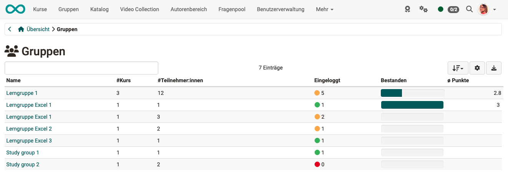

# Coaching - Gruppen {: #groups}

{ class="shadow lightbox" }

{ class="shadow lightbox" }

### WEN zeigt die Liste? {: #groups_who}

Der Menüpunkt "Gruppen" zeigt die Liste aller von Ihnen betreuten Gruppen, jedoch nur Gruppen aus Kursen, die sich im Coaching Tool befinden.

Im Unterschied zur Personen- und Kursübersicht erscheinen in der Gruppenübersicht nur die OpenOlat-Benutzer:innen, die in einer der kursbezogenen Gruppen eingetragen sind.

[Zum Seitenanfang ^](#groups)
 
---

### WAS zeigt die Liste?  {: #groups_what}

Sie sehen auf einen Blick,

* in wie vielen Kursen die jeweilige Gruppe eingebunden ist,
* ob sich alle Gruppenmitglieder schon mindestes einmal in die Gruppe eingeloggt haben,
* wie viele Teilnehmende die Gruppe insgesamt hat,
* und wie viele Gruppenmitglieder den dazugehörigen Kurs bereits bestanden haben. (Sofern ein Bestehen im Kurs konfiguriert wurde.)

Ein Klick auf einen Gruppennamen öffnet die Liste der Gruppenmitglieder mit weiteren Informationen zum Punktestand, Zertifikat usw. 

Wenn Sie dann auf einen Benutzernamen klicken, öffnet sich wiederum das Bewertungswerkzeug für diese Person und Sie können das Gruppenmitglied bewerten oder per Mail Kontakt mit ihm aufnehmen.
 

[Zum Seitenanfang ^](#groups)
 
---
 
 
## Weiterführende Informationen {: #further_information}
 
[Coaching: Personensuche >](../../manual_user/area_modules/Coaching_User_Search.de.md) 
[Coaching: Personen >](../../manual_user/area_modules/Coaching_People.de.md) 
[Coaching: Kurse >](../../manual_user/area_modules/Coaching_Courses.de.md) 
[Coaching: Bildungsprodukte >](../../manual_user/area_modules/Coaching_Educational_Products.de.md) 
[Coaching: Termine / Absenzen >](../../manual_user/area_modules/Coaching_Events_Absences.de.md) 
[Coaching: Bewertungsaufträge >](../../manual_user/area_modules/Coaching_assessment_orders.de.md) 
[Coaching: Reports >](../../manual_user/area_modules/Coaching_Reports.de.md) 
[Coaching: Auftragsverwaltung >](../../manual_user/area_modules/Coaching_Order_Management.de.md) 
[Rollen >](../../manual_user/basic_concepts/Roles.de.md) 
[Bewertungswerkzeug >](../../manual_user/learningresources/Assessment_tool_overview.de.md) 
 
[Zum Seitenanfang ^](#groups)