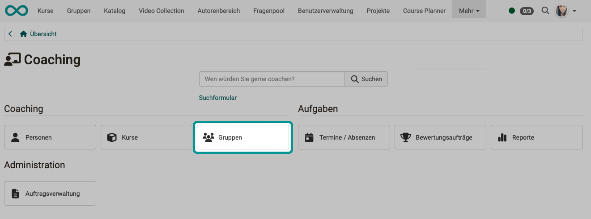
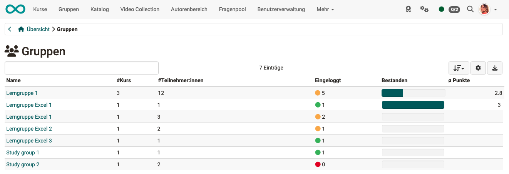

# Coaching - Groups {: #groups}

{ class="shadow lightbox" }

{ class="shadow lightbox" }

### WHOM does the list show? {: #groups_who}

The menu item "Groups" shows the list of all groups you coach, but only groups from courses that are in the Coaching Tool.

Unlike the people and course overview, the group overview only shows the OpenOlat users who are registered in one of the course-related groups.

[To the top of the page ^](#groups)

---

### WHAT does the list show? {: #groups_what}

You see at a glance,

* in how many courses the respective group is involved,
* whether all group members have already logged into the group at least once,
* how many participants the group has in total,
* how many group members have already passed the associated course (if passing has been configured in the course)
* and which average score the group members have achieved.

Clicking on a group name opens the list of group members with further information on the score, certificate etc.

When you then click on a username, the assessment tool for that person opens and you can assess the group member or contact them by e-mail.

[To the top of the page ^](#groups)

---

## Further information {: #further_information}

[Coaching: User search >](../area_modules/Coaching_User_Search.md) 
[Coaching: People >](../area_modules/Coaching_People.md) 
[Coaching: Courses >](../area_modules/Coaching_Courses.md) 
[Coaching: Educational products >](../area_modules/Coaching_Educational_Products.md) 
[Coaching: Events / Absences >](../area_modules/Coaching_Events_Absences.md) 
[Coaching: Assessment orders >](../area_modules/Coaching_Assessment_Orders.md) 
[Coaching: Reports >](../area_modules/Coaching_Reports.md) 
[Coaching: Order management >](../area_modules/Coaching_Order_Management.md) 
[Roles >](../basic_concepts/Roles.md) 
[Assessment tool >](../learningresources/Assessment_tool_overview.md)

[To the top of the page ^](#groups)
