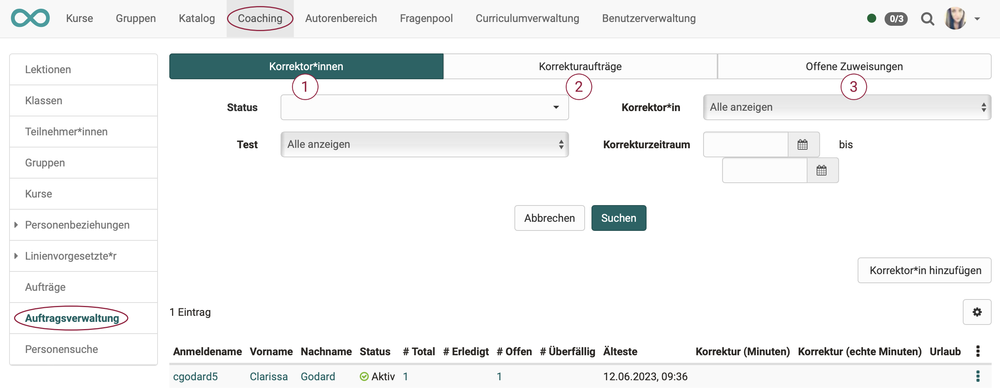

# Coaching - Auftragsverwaltung {: #order_management}

!!! warning "Achtung"

    Dieser Artikel ist noch in Bearbeitung.

 

{ class="shadow lightbox" }

Dieses Menü bezieht sich auf den Korrektur-Workflow für die manuelle Bewertung von OpenOlat Tests. In der Lernressource Test kann der [Korrektur-Workflow](../learningresources/Test_settings.de.md) aktiviert werden. Sie können dann Tests eine oder mehrere Personen als Korrektoren zuordnen. Sofern Sie mindestens Besitzer eines Tests sind, bei dem diese Option aktiviert wurde, sehen Sie im Coaching Tool die Auftragsverwaltung und können die einzelnen Korrektoren und ihre Aktivitäten verwalten.

### 1. Tab Korrektoren

Hier erhalten Sie einen Überblick über alle Ihre Korrektoren und deren Bewertungsstand und können die Korrektoren auch nach verschiedenen Kriterien z.B. für bestimmte Kurse, konkrete Tests oder noch offene Bewertungen filtern.

Über die entsprechende Spaltenauswahl kann man sich anzeigen lassen, wie viele Tests ein Korrektor insgesamt bewerten soll, wie viele er schon erledigt hat, wie viele offen sind und welche überfällig sind und welche Korrekturzeit vorgesehen ist. Ferner können auch weitere Korrektoren einem Test hinzugefügt oder bestehende Zuordnungen deaktiviert werden.

Ein Hinzufügen von Korrektoren ist ebenfalls direkt bei der jeweiligen [Test-Lernressource](../learningresources/Test_settings.de.md) möglich.

### 2. Tab Korrekturaufträge

Dieser Tab erscheint nur wenn man als Korrektor für einen Test eingetragen wurde. Man sieht eine Übersicht der Tests in den verschiedenen Kursen, die man noch manuell prüfen und korrigieren muss. Je nach Einstellung in der Lernressource "Test", erfolgt die Bewertung anonym oder nicht.

{ class="shadow lightbox" }

Über den Link "Korrigieren" gelangt der Korrektor direkt zum zu korrigierenden Test und kann hier manuelle Bewertungen vornehmen und auch automatische Bewertungen, wenn notwendig, überschreiben. Sinnvoll ist es auch einen entsprechenden Kommentar zu hinterlassen.

Lernressourcenverwalter oder Kursbesitzer erhalten im Menü "Korrekturaufträge" eine Übersicht mit allen Korrektoren und deren Korrekturaufträgen. Inklusive der Anzeige, wie viele Aufträge noch offen bzw. überfällig sind.

{ class="shadow lightbox" }

### 3. Tab Offene Zuweisungen

Hier werden die Kursbausteine (Tests und Aufgaben) mit den jeweiligen Personen angezeigt, die noch nicht einem Korrektor zugewiesen wurden. 
