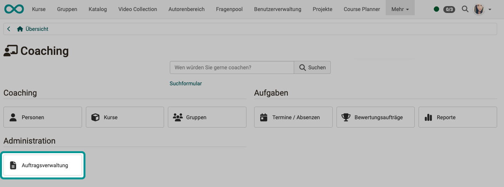
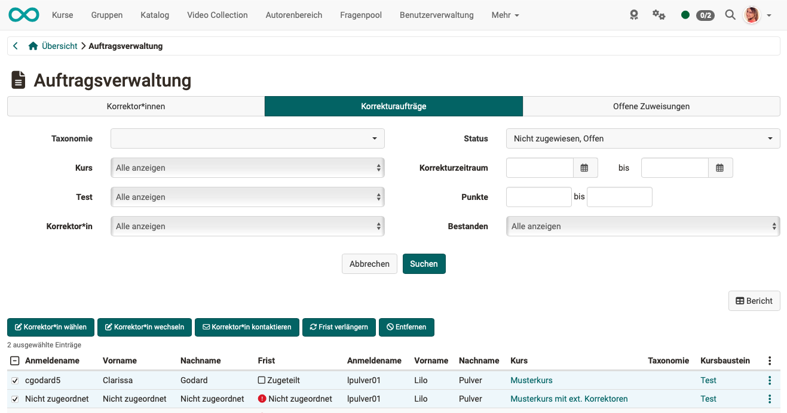

# Coaching - Auftragsverwaltung {: #order_management}

{ class="shadow lightbox" }

Dieses Menü bezieht sich auf den Korrektur-Workflow für die manuelle Bewertung von OpenOlat Tests. In der Lernressource Test kann der [Korrektur-Workflow](../learningresources/Test_settings.de.md) aktiviert werden. Sie können dann Tests zu einer oder mehreren Personen als Korrektor:innen zuordnen. Sofern Sie mindestens Besitzer:in eines Tests sind, bei dem diese Option aktiviert wurde, sehen Sie im Coaching Tool die Auftragsverwaltung und können die einzelnen Korrektor:innen und ihre Aktivitäten verwalten.

[Zum Seitenanfang ^](#order_management)

---

## Tab "Korrektoren" {: #tab_correctors}

{ class="shadow lightbox" }

Hier erhalten Sie einen Überblick über alle Ihre Korrektor:innen und deren Bewertungsstand. Sie können die Korrektor:innen nach verschiedenen Kriterien filtern, z.B. nach bestimmten Kursen, konkreten Tests oder noch offenen Bewertungen.

Über die entsprechende Spaltenauswahl können Sie sich anzeigen lassen,

* wie viele Tests ein:e Korrektor:in insgesamt bewerten soll, 
* wie viele er/sie schon erledigt hat, 
* wie viele offen sind und welche überfällig sind 
* und welche Korrekturzeit vorgesehen ist. 

Ferner können auch weitere Korrektor:innen einem Test hinzugefügt oder bestehende Zuordnungen deaktiviert werden.

Ein Hinzufügen von Korrektor:innen ist ebenfalls direkt bei der jeweiligen [Test-Lernressource](../learningresources/Test_settings.de.md) möglich.

[Zum Seitenanfang ^](#order_management)

---

## Tab "Korrekturaufträge" {: #tab_grading_assignments}

Lernressourcenverwalter:innen oder Kursbesitzer:innen erhalten im Tab "Korrekturaufträge" eine Übersicht mit allen Korrektor:innen und deren Korrekturaufträgen. Inklusive der Anzeige, wie viele Aufträge noch offen bzw. überfällig sind.

{ class="shadow lightbox" }

Dieser Tab erscheint nur, wenn man als Korrektor:in für einen Test eingetragen wurde. Man sieht eine Übersicht der Tests in den verschiedenen Kursen, die man noch manuell prüfen und korrigieren muss. Je nach Einstellung in der Lernressource "Test", erfolgt die Bewertung anonym oder nicht.

Über den Link "Korrigieren" gelangt der Korrektor direkt zum zu korrigierenden Test und kann hier manuelle Bewertungen vornehmen und auch automatische Bewertungen, wenn notwendig, überschreiben. Sinnvoll ist es auch einen entsprechenden Kommentar zu hinterlassen.

[Zum Seitenanfang ^](#order_management)

---

## Tab "Offene Zuweisungen" {: #tab_open_grading_assignments}

{ class="shadow lightbox" }

Hier werden die Kursbausteine (Tests und Aufgaben) mit den jeweiligen Personen angezeigt, die noch nicht einem Korrektor zugewiesen wurden. 

[Zum Seitenanfang ^](#order_management)

---
 
 
## Weiterführende Informationen {: #further_information}
 
[Coaching: Personensuche >](../../manual_user/area_modules/Coaching_User_Search.de.md) 
[Coaching: Personen >](../../manual_user/area_modules/Coaching_People.de.md) 
[Coaching: Kurse >](../../manual_user/area_modules/Coaching_Courses.de.md) 
[Coaching: Bildungsprodukte >](../../manual_user/area_modules/Coaching_Educational_Products.de.md) 
[Coaching: Termine / Absenzen >](../../manual_user/area_modules/Coaching_Events_Absences.de.md) 
[Coaching: Bewertungsaufträge >](../../manual_user/area_modules/Coaching_assessment_orders.de.md) 
[Coaching: Reports >](../../manual_user/area_modules/Coaching_Reports.de.md) 
[Coaching: Gruppen >](../../manual_user/area_modules/Coaching_Groups.de.md) 
[Rollen >](../../manual_user/basic_concepts/Roles.de.md) 
[Bewertungswerkzeug >](../../manual_user/learningresources/Assessment_tool_overview.de.md) 
 
[Zum Seitenanfang ^](#order_management)
