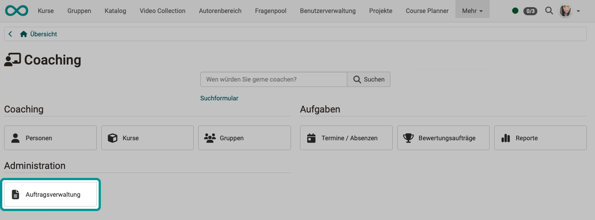
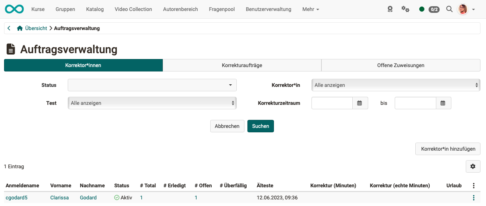
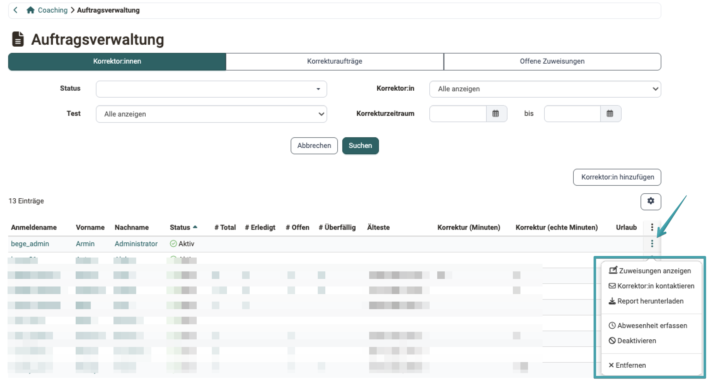
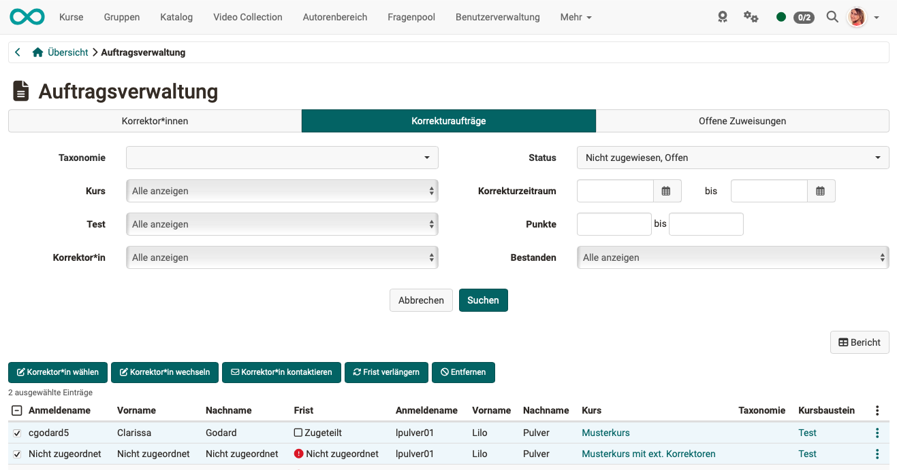
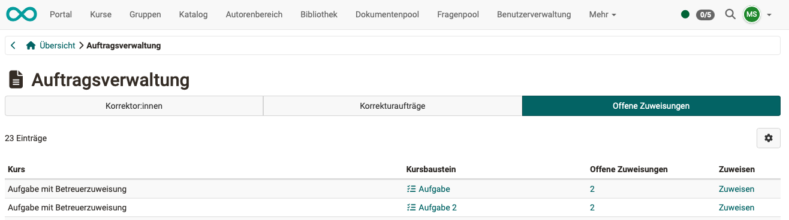

# Coaching - Auftragsverwaltung {: #order_management}

{ class="shadow lightbox" }

Dieses Menü bezieht sich auf den Korrektur-Workflow für die manuelle Bewertung von OpenOlat Tests. In der Lernressource Test kann der [Korrektur-Workflow](../learningresources/Test_settings.de.md) aktiviert werden. Sie können dann Tests zu einer oder mehreren Personen als Korrektor:innen zuordnen. Sofern Sie mindestens Besitzer:in eines Tests sind, bei dem diese Option aktiviert wurde, sehen Sie im Coaching Tool die Auftragsverwaltung und können die einzelnen Korrektor:innen und ihre Aktivitäten verwalten.

[Zum Seitenanfang ^](#order_management)

---

## Tab "Korrektor:innen" {: #tab_correctors}

{ class="shadow lightbox" }

Hier erhalten Sie einen Überblick über alle Ihre Korrektor:innen und deren Bewertungsstand. Sie können die Korrektor:innen nach verschiedenen Kriterien filtern, z.B. nach bestimmten Kursen, konkreten Tests oder noch offenen Bewertungen.

Über die entsprechende Spaltenauswahl können Sie sich anzeigen lassen,

* wie viele Tests ein:e Korrektor:in insgesamt bewerten soll,
* wie viele davon schon erledigt sind,
* wie viele offen sind und welche überfällig sind
* und welche Korrekturzeit vorgesehen ist.

Die Spalte "Korrektur (echte Minuten)" zeigt die tatsächlich erfasste Korrekturzeit. Welche Rollen sie sehen, legt die System-Administration unter `Administration > e-Assessment > Test` im Segment "Korrektur-Workflow" fest.

Über den Button "Korrektor:in hinzufügen" fügen Sie einem Test weitere Korrektor:innen hinzu. Bestehende Zuordnungen können Sie deaktivieren.

Ein Hinzufügen von Korrektor:innen ist ebenfalls direkt bei der jeweiligen [Test-Lernressource](../learningresources/Test_settings.de.md) möglich.

Im Zeilenmenü einer Korrektor:in öffnen Sie den Eintrag "Report herunterladen" und erzeugen so eine Excel-Datei mit dem Stand der Korrekturaufträge dieser Korrektor:in. Aufbau und Filter des Reports beschreibt der Abschnitt [Test-Einstellungen, Report / Excel-Export](../learningresources/Test_settings.de.md#correction-workflow). [:octicons-tag-16:{ title="ab Release 21.0 (OO-9569)" }](https://track.frentix.com/issue/OO-9569)

{ class="shadow lightbox" }

[Zum Seitenanfang ^](#order_management)

---

## Tab "Korrekturaufträge" {: #tab_grading_assignments}

Administrator:innen, Lernressourcenverwalter:innen und Besitzer:innen eines Tests mit aktiviertem Korrektur-Workflow erhalten im Tab "Korrekturaufträge" eine Übersicht mit allen Korrektor:innen und deren Korrekturaufträgen, inklusive der Anzeige, wie viele Aufträge noch offen bzw. überfällig sind.

Über den Button "Bericht" erzeugen Sie den Excel-Report über die angezeigten Korrekturaufträge.

{ class="shadow lightbox" }

Ihre eigenen Korrekturaufträge als Korrektor:in finden Sie nicht hier, sondern unter `Coaching > Bewertungsaufträge`: [Coaching: Bewertungsaufträge](Coaching_Assessment_Orders.de.md#tab_grading_assignments).

[Zum Seitenanfang ^](#order_management)

---

## Tab "Offene Zuweisungen" {: #tab_open_grading_assignments}

{ class="shadow lightbox" }

Hier werden die Kursbausteine (Tests und Aufgaben) mit den jeweiligen Personen angezeigt, die noch keiner Korrektor:in zugewiesen wurden.

[Zum Seitenanfang ^](#order_management)

---

## Weiterführende Informationen {: #further_information}

**Auf dieser Seite erwähnt** 
[Test Einstellungen - Administration >](../learningresources/Test_settings.de.md) 
[Coaching: Bewertungsaufträge >](../area_modules/Coaching_Assessment_Orders.de.md)

**Weiterführend** 
[Coaching: Personensuche >](../area_modules/Coaching_User_Search.de.md) 
[Coaching: Personen >](../area_modules/Coaching_People.de.md) 
[Coaching: Kurse >](../area_modules/Coaching_Courses.de.md) 
[Coaching: Bildungsprodukte >](../area_modules/Coaching_Educational_Products.de.md) 
[Coaching: Termine / Absenzen >](../area_modules/Coaching_Events_Absences.de.md) 
[Coaching: Reports >](../area_modules/Coaching_Reports.de.md) 
[Coaching: Gruppen >](../area_modules/Coaching_Groups.de.md) 
[Rollen >](../basic_concepts/Roles.de.md) 
[Bewertungswerkzeug >](../learningresources/Assessment_tool_overview.de.md)

[Zum Seitenanfang ^](#order_management)
