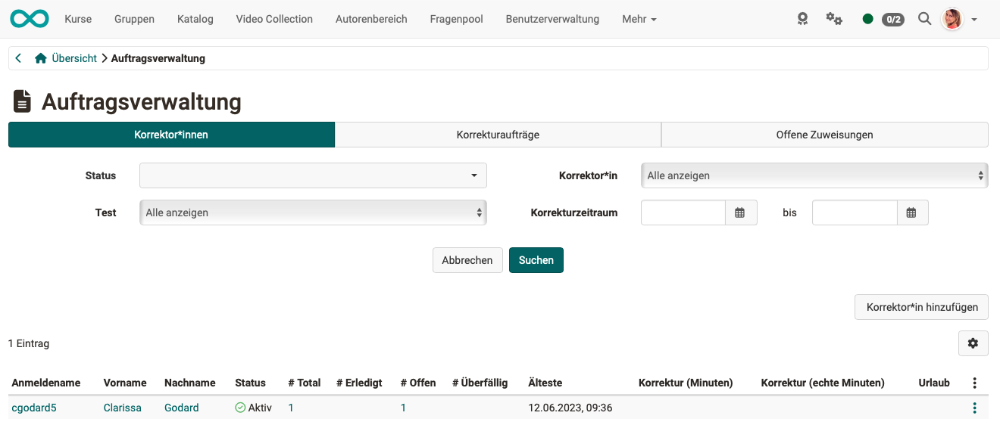
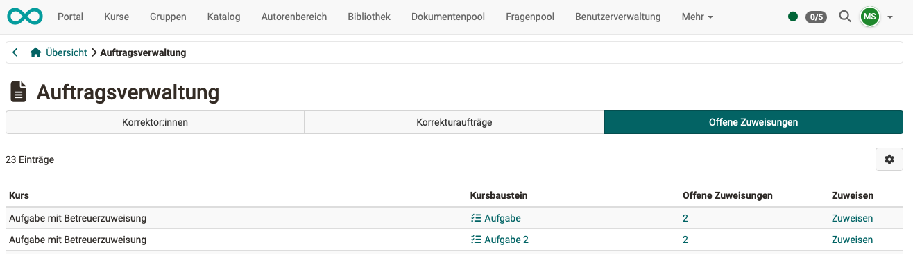

# Coaching - Order management {: #order_management}

{ class="shadow lightbox" }

This menu refers to the correction workflow for the manual assessment of OpenOlat tests. The [Correction workflow](../learningresources/Test_settings.md) can be activated in the learning resource "Test". You can then assign one or more people to tests as correctors. If you are at least the owner of a test for which this option has been activated, you will see the order management in the Coaching Tool and be able to manage the individual correctors and their activities.

[To the top of the page ^](#order_management)

---

## 1. Tab Correctors {: #tab_correctors}

{ class="shadow lightbox" }

Here you can see an overview of all your graders and their assessment status. You can filter the graders according to various criteria, e.g., specific courses, specific tests, or assessments that are still pending.

By selecting the appropriate column, you can display

* how many tests a proofreader should evaluate in total, 
* how many he/she has already completed, 
* how many are open and which ones are overdue 
* and what correction time is planned. 

Furthermore, additional proofreaders can be added to a test, or existing assignments can be deactivated.

It is also possible to add correctors directly to the respective [test learning resource](../learningresources/Test_settings.md).

[To the top of the page ^](#order_management)

---

## 2. Tab "Grading assignments"" {: #tab_grading_assignments}

This tab only appears if you have been entered as a corrector for a test. You see an overview of the tests in the different courses that you still have to check and correct manually. Depending on the setting in the learning resource "Test", the assessment is anonymous or not.

{ class="shadow lightbox" }

This tab only appears if you have been registered as a proofreader for a test. You will see an overview of the tests in the various courses that still need to be checked and corrected manually. Depending on the settings in the "Test" learning resource, the assessment may be anonymous or not.

Via the link "Correct", the corrector can directly access the test to be corrected and can make manual evaluations here and also overwrite automatic evaluations if necessary. It also makes sense to leave a corresponding comment.

[To the top of the page ^](#order_management)

---

## 3. Tab "Open grading assignments" {: #tab_open_grading_assignments}

{ class="shadow lightbox" }

The course elements (tests and tasks) with the respective persons, who have not yet been assigned to a corrector, are displayed here. 

[To the top of the page ^](#order_management)

---

## Further information {: #further_information}

[Coaching: User search >](../../manual_user/area_modules/Coaching_User_Search.md) 
[Coaching: People >](../../manual_user/area_modules/Coaching_People.md) 
[Coaching: Courses >](../../manual_user/area_modules/Coaching_Courses.md) 
[Coaching: Educational products >](../../manual_user/area_modules/Coaching_Educational_Products.md) 
[Coaching: Events / Absences >](../../manual_user/area_modules/Coaching_Events_Absences.md) 
[Coaching: Assessment orders >](../../manual_user/area_modules/Coaching_assessment_orders.md) 
[Coaching: Reports >](../../manual_user/area_modules/Coaching_Reports.md) 
[Coaching: Groups >](../../manual_user/area_modules/Coaching_Groups.md) 
[Roles >](../../manual_user/basic_concepts/Roles.md) 
[Assessment tool >](../../manual_user/learningresources/Assessment_tool_overview.md) 

 [To the top of the page ^](#order_management)

