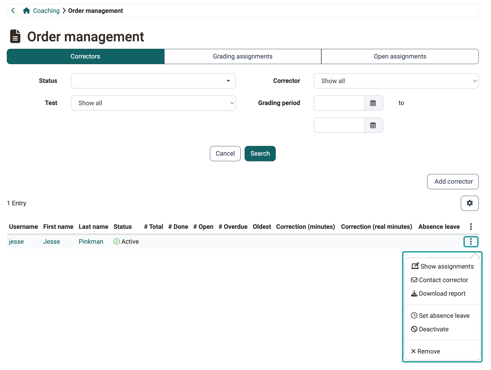

# Coaching - Order management {: #order_management}

{ class="shadow lightbox" }

If several people correct tests by hand, or if participants are distributed among coaches, the Order management keeps track of who still has what to do. The menu combines two areas: the correction workflow for the manual assessment of OpenOlat tests, and the open assignments of coaches to participants.

The [Correction workflow](../learningresources/Test_settings.md) can be activated in the learning resource Test. You can then assign tests to one or more people as correctors. The two tabs of the correction workflow are seen by administrators, learning resource managers and owners of a test for which this option has been activated. The tab "Open assignments" has its own requirements, they are described in its section.

[To the top of the page ^](#order_management)

---

## Tab "Correctors" [:octicons-tag-16:{ title="from Release 15.0 (OO-4446)" }](https://track.frentix.com/issue/OO-4446) {: #tab_correctors}

{ class="shadow lightbox" }

Here you get an overview of all your correctors and their assessment status. You can filter the correctors according to various criteria, e.g. specific courses, specific tests or assessments that are still open.

By selecting the appropriate columns, you can display

* how many tests a corrector should assess in total,
* how many of them are already done,
* how many are open and which ones are overdue,
* since when the oldest open assignment has been assigned (column "Oldest"),
* whether an absence is recorded (column "Absence leave")
* and what correction time is planned.

The column "Status" shows whether a corrector is activated or deactivated. The column "Correction (real minutes)" shows the correction time actually recorded. Which roles see it is defined by the system administration under `Administration > e-Assessment > Test` in the segment "Correction workflow".

Use the button "Add corrector" to add further correctors to a test. You can deactivate existing assignments.

It is also possible to add correctors directly to the respective [test learning resource](../learningresources/Test_settings.md).

In the row menu of a corrector, open the entry "Download report" to generate an Excel file with the state of the grading assignments of this corrector. The structure and filters of the report are described in the section [Test settings, Report / Excel export](../learningresources/Test_settings.md#correction-workflow). [:octicons-tag-16:{ title="from Release 21.0 (OO-9569)" }](https://track.frentix.com/issue/OO-9569)

The same row menu leads to the further actions: "Show assignments" switches to the tab "Grading assignments" with the assignments of this person, "Send e-mail" opens an e-mail, "Set absence leave" records an absence which then appears in the column "Absence leave", and "Remove" withdraws the person as a corrector and redistributes their assignments. If a corrector is deactivated, the entry "Activate" is available instead of "Deactivate".

{ class="shadow lightbox" }

[To the top of the page ^](#order_management)

---

## Tab "Grading assignments" {: #tab_grading_assignments}

If you want to know which test is currently with whom and what is overdue, you find here all grading assignments of your tests with the responsible corrector and their state.

Use the button "Report" to generate the Excel report about the displayed grading assignments. The structure and filters of the report are described in the section [Test settings, Report / Excel export](../learningresources/Test_settings.md#correction-workflow).

{ class="shadow lightbox" }

If you select individual grading assignments, the actions "Assign corrector", "Change corrector", "Send e-mail", "Extend deadline" and "Unassign" appear. "Unassign" only removes the link to the corrector, the grading assignment itself remains.

You do not find your own grading assignments as a corrector here, but under `Coaching > Assessment orders`: [Coaching: Assessment orders](Coaching_Assessment_Orders.md#tab_grading_assignments).

[To the top of the page ^](#order_management)

---

## Tab "Open assignments" [:octicons-tag-16:{ title="from Release 17.2.1 (OO-6698)" }](https://track.frentix.com/issue/OO-6698) {: #tab_open_grading_assignments}

{ class="shadow lightbox" }

If you distribute the participants of a task among several coaches, you see here across all your courses where this distribution is not yet complete. This tab therefore does not belong to the correction workflow, but to the assignment of coaches. It is seen by administrators, learning resource managers, principals and authors; listed are the courses in which you are owner or in which you hold one of these roles.

The tab displays the course elements "Task" for which the "Assignment coaches/participants" is switched on and participants are not yet assigned to a coach. The column "Open assignments" gives their number. Via the name of the course element or via the number you open it directly, via the link "Assign" you make the assignment.

[To the top of the page ^](#order_management)

---

## Further information {: #further_information}

**Mentioned on this page** 
[Test settings - Administration >](../learningresources/Test_settings.md) 
[Coaching: Assessment orders >](../area_modules/Coaching_Assessment_Orders.md)

**Further reading** 
[Coaching: User search >](../area_modules/Coaching_User_Search.md) 
[Coaching: People >](../area_modules/Coaching_People.md) 
[Coaching: Courses >](../area_modules/Coaching_Courses.md) 
[Coaching: Educational products >](../area_modules/Coaching_Educational_Products.md) 
[Coaching: Events / Absences >](../area_modules/Coaching_Events_Absences.md) 
[Coaching: Reports >](../area_modules/Coaching_Reports.md) 
[Coaching: Groups >](../area_modules/Coaching_Groups.md) 
[Roles >](../basic_concepts/Roles.md) 
[Assessment tool >](../learningresources/Assessment_tool_overview.md)

[To the top of the page ^](#order_management)
