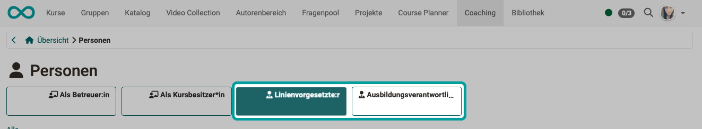
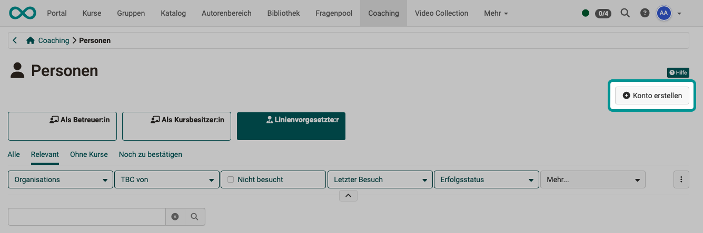
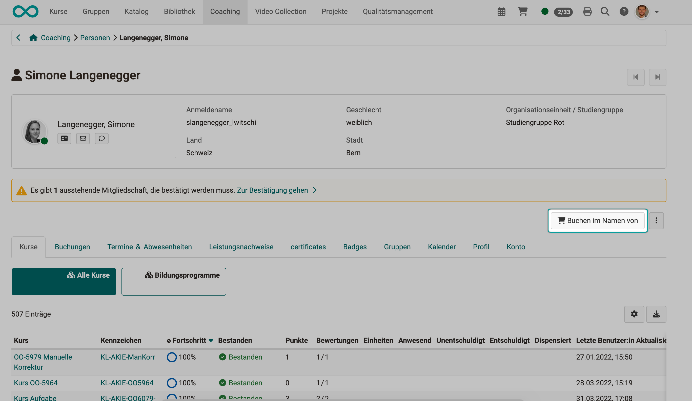
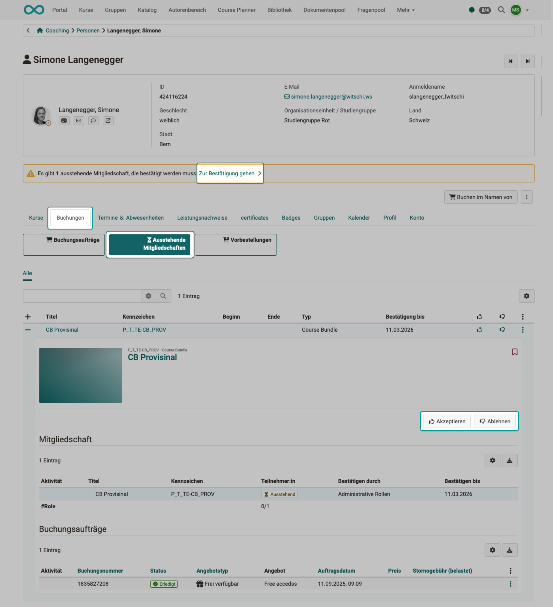
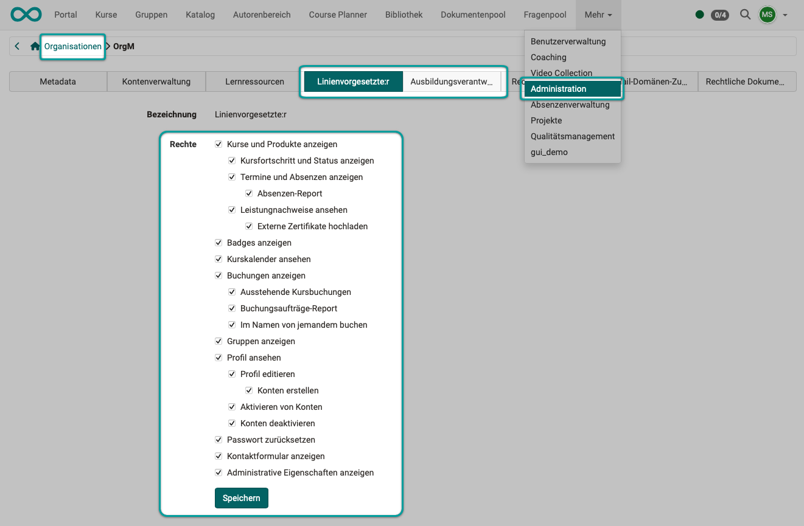

# Coaching - Personen {: #people}

{ class="shadow lightbox" }

{ class="shadow lightbox" }

## WEN zeigt die Liste? {: #people_who}

Der Menüpunkt "Personen" im Coaching Tool zeigt die Liste **aller von Ihnen betreuten** Teilnehmenden.

  * Es werden die Teilnehmenden aus **allen** betreuten Kursen angezeigt. (Im Unterschied zum [Bewertungswerkzeug](../learningresources/Assessment_tool_overview.de.md) des Kurses. Dort werden nur Teilnehmende des aktuellen Kurses angezeigt.)
  * Jeder Coach (Betreuer:in) sieht nur die von ihr/ihm betreuten Teilnehmenden.
  * Die betreuten Teilnehmenden sind **gruppiert und den Rollen zugeordnet**, die Sie als Betreuende:r gegenüber dieser Person haben.  
  Im oben gezeigten Beispiel kann die betreuende Person vorsortierte Listen abrufen, die ihren Rollen entsprechen:
    * als Betreuer:in
    * als Kursbesitzer:in
    * als Linienvorgesetzte:r
    * als Ausbildungsverantwortliche:r

!!! hint "Hinweis zu den Rollen Linienvorgesetzte:r und Ausbildungsverantwortliche:r"

    Diese Rollen werden im Coaching Tool nur angezeigt, wenn in der Administration das [Modul Organisation](../../manual_admin/administration/Modules_Organisations.de.md) aktiviert wurde. 
    

!!! hint "Hinweis zu weiteren Personenbeziehungen"

    Auch wenn Sie [eigene Rollen und Beziehungen](../../manual_user/basic_concepts/Assign_Roles.de.md#role_assignment_relations) definiert haben, werden Ihnen diese Rollen hier angezeigt, um eine vorgruppierte Liste anzeigen zu können.

[Zum Seitenanfang ^](#people)

---

## WAS zeigt die Liste?  {: #people_what}

Sie können die angezeigten Spalten selbst festlegen, indem Sie rechts oben über der Liste auf das Zahnrad-Icon klicken. Die verfügbaren Spalten können je nach gewählter Rolle variieren. 

* **Status**
* **Anmeldename**
* **Nachname, Vorname** Ein Klick auf den Anmeldenamen,Nachnamen oder Vornamen einer Person führt zur Übersicht aller Kurse dieses Teilnehmers. So erhält die/der Lehrende Zugriff auf die Assessmentbereiche eines Kurses der Person inklusive des Zugriffes auf den jeweiligen Leistungsnachweis, das Bewertungswerkzeug des Kurses sowie die jeweiligen Lektionen.
* **E-Mail**
* **Geschlecht**
* **Geburtsdatum**
* **Organisation** 
  Nur bei aktiviertem Modul Organisationseinheiten: Zu welcher Organisationseinheit gehört die Person? 
  (Diese Information ist besonders für Ausbildungsverantwortliche interessant.)
* **Kurse** 
    In wie vielen der von Ihnen betreuten Kurse ist ein/e Benutzer:in Mitglied?
* **Nicht besucht** 
    In wie vielen der von Ihnen betreuten Kurse ist ein/e Benutzer:in Mitglied, hat den Kurs aber noch nie besucht?
* **Letzter Besuch** 
    Vor wieviel Tage war der letzte Besuch in einem der von Ihnen betreuten Kurse?
* **durchschnittlicher Fortschritt** 
    Durchschnitt über alle Kurse von Ihnen betreuten Kurse
* **Erfolgsstatus** 
    * "Bestanden"/"Nicht bestanden"/"keine Angabe" in grafischer Darstellung
    * "Bestanden"/"Nicht bestanden"/"keine Angabe" in Zahlen
* **Zertifikate** 
  Anzahl der erhaltenen Zertifikate / Anzahl der möglichen Zertifikate
* **Weitere Aktionen** (Icon mit 3 Punkten) 
    * Kontaktieren (per E-Mail)

[Zum Seitenanfang ^](#people)

---

## Kontaktieren betreuter Personen {: #contact}

Um **einer bestimmten Person** eine Mail zu schreiben, klicken Sie einfach auf die 3 Punkte am Ende der betreffenden Zeile.

Um eine Mail an **mehrere Personen** zu schreiben, markieren Sie die betreffenden Personen in der ersten Spalte. Anschliessend erscheint über der Liste ein Button "Kontaktieren".

{ class="shadow lightbox" }

[Zum Seitenanfang ^](#people)

---

## Coaching-Aufgaben als Linienvorgesetzte / Ausbildungsverantwortliche {: #linemanager_educationmanager}

Linienvorgesetzte und Ausbildungsverantwortliche finden im Coachingtool unter Personen einen zusätzlichen Button, unter dem sie alle Personen finden, für die sie in ihrer Rolle zuständig sind.  

{ class="shadow lightbox" }

### Voraussetzungen {: #linemanager_educationmanager_conditions}

Damit ein zusätzlicher Button "Linienvorgesetzte:r" und/oder "Ausbildungsverantwortliche:r" angezeigt wird, müssen folgende Voraussetzungen erfüllt sein.

**Voraussetzung 1:**
Das Modul "Organisationseinheiten" muss aktiviert sein. 
(Administration > Module > Organisationen)

**Voraussetzung 2:**
Die betreffende Person muss die Rolle zugewiesen bekommen haben. 
(Benutzerverwaltung > Person auswählen > Tab Rollen)

**Voraussetzung 3:**
In der Administration müssen z.B. die Option "Ausstehende Kursbuchungen" oder weitere Rechte aktiviert sein. 
(Administration > Module > Organisationen > Tab Organisationsstruktur > eine Organisationseinheit (oberste Ebene) wählen > Button Linienvorgesetzte:r bzw. Ausbildungsverantwortliche:r > Option "Ausstehende Kursbuchungen" aktivieren)

---

### Konto für Mitarbeiter:innen anlegen {: #linemanager_educationmanager_create_account}

Im Coachingtool finden Sie als Linienvorgesetzte:r bzw. Ausbildungsverantwortliche:r rechts oben den **Button "Konto erstellen"**. Sie öffnen damit ein Formular zum Erfassen der notwendigen Angaben um bisher unregistrierte Personen in OpenOlat aufzunehmen.

(Ob dieser Button zur Verfügung steht, wird festgelegt in: Administration > Module > Organisationen > Tab Organisationsstruktur > eine Organisationseinheit (oberste Ebene) wählen > Button Linienvorgesetzte:r bzw. Ausbildungsverantwortliche:r > Option "Konten erstellen")

Ein durch Linienmanager:innen/Ausbildungsverantwortliche angelegtes Konto enthält automatisch eine Zuordnung der neu registrierten Person zur Organisationseinheit des/der Linienmanager:in/Ausbildungsverantwortlichen.

{ class="shadow lightbox" }

---

### Teilnehmer:innen im Auftrag einbuchen {: #linemanager_educationmanager_book_participants}

Möchten Sie als Linienvorgesetzte:r bzw. Ausbildungsverantwortliche:r eine bereits in OpenOlat registrierte Person in einen Kurs oder eine Durchführung einbuchen, wählen Sie die Person im Coachingtool und klicken auf den **Button "Buchen im Namen von"**. Dort können Sie dann den Kurs auswählen, in dem die Person teilnehmen soll. 

{ class="shadow lightbox" }

**Beispiel 1:** 
Eine neue Mitarbeiterin soll im nächsten Monat einige Einführungskurse absolvieren.

**Beispiel 2:**  
Ihre Mitarbeiter:innen sind verpflichtet, Sicherheitskurse oder Compliancekurse zu machen. Weil sie als Linienvorgesetzte:r oder Ausbildungsverantwortliche:r verantwortlich sind, buchen Sie alle Personen selbst ein.

---

### Ausstehende Mitgliedschaften genehmigen {: #linemanager_educationmanager_confirm_membership}

Oft entscheiden Linienvorgesetzte und Ausbildungsverantwortliche, ob Lernende an einer Bildungsmassnahme teilnehmen können. In OpenOlat kann ihnen die Möglichkeit eingerichtet werden, ausstehende Mitgliedschaften zu akzeptieren oder abzulehnen. 

Wählen Sie dazu im Coachingtool die betreffende Person und öffnen Sie die **Detailansicht** durch Klick auf das Plus-Symbol am Anfang der Zeile.

Rechts oben innerhalb der Detailansicht finden Sie die beiden **Buttons "Akzeptieren" und "Ablehnen"** mit denen Sie über eine Mitgliedschaft entscheiden.

Alternativ und einfacher können Sie auch den **Link innerhalb der Benachrichtigung** benutzen.

{ class="shadow lightbox" }

!!! info "Wie kommt es zu ausstehenden Mitgliedschaften?"

    Mitgliedschaften, die erst noch durch Linienvorgesetzte oder Ausbildungsverantwortliche genehmigt werden müssen, werden im Course Planner für Durchführungen eingerichtet.
    Mehr dazu [hier >](../../manual_user/area_modules/Course_Planner_Implementations.de.md#confirm_membership)
    
---

### Kontrollaufgaben {: #linemanager_educationmanager_observe}

Sind Sie Linienvorgesetzte:r oder Ausbildungsverantwortliche:r können Sie sich über die Lernfortschritte innerhalb ihrer Organisationseinheit jederzeit im Coachingtool informieren. Auch eine automatische Benachrichtigung über alle erhaltenen Zertifikate ist möglich.

Grundsätzlich werden Ihnen als Linienvorgesetzte:r oder Ausbildungsverantwortliche:r Leserechte gewährt, die Bearbeitung ist jedoch eingeschränkt und bleibt den Betreuenden und Kursbesitzer:innen vorbehalten.

**Beispiele:** 

* Sie sehen, wer welche Kurse besucht, können aber nicht auf Checklisten, Aufgaben usw. innerhalb der Kurse zugreifen, um die Eintragungen der Teilnehmenden zu sehen.
* Sie können sich erhaltene Badges und andere Leistungsdaten anzeigen lassen, aber selbst keine Badges vergeben.
* Sie können sich Absenzen anzeigen lassen, aber nicht selbst erfassen. Dies müssen die Kursbesitzer:innen/Betreuer:innen. Das Erstellen von Absenzenreports ist dagegen möglich.

Möchten Sie als Linienvorgesetzte:r oder Ausbildungsverantwortliche:r bestimmte Rechte, können Sie diese von Administrator:innen einrichten lassen. Der nachstehende Screen zeigt, welche Optionen von Administrator:innen konfiguriert werden können. (Für Ausbildungsverantwortliche bestehen die gleichen Optionen.)

{ class="shadow lightbox" }

[Zum Seitenanfang ^](#people)

---

## Weiterführende Informationen {: #further_information}

[Coaching: Personensuche >](../../manual_user/area_modules/Coaching_User_Search.de.md) 
[Coaching: Kurse >](../../manual_user/area_modules/Coaching_Courses.de.md) 
[Coaching: Bildungsprodukte >](../area_modules/Coaching_Educational_Products.de.md) 
[Coaching: Termine / Absenzen >](../area_modules/Coaching_Events_Absences.de.md) 
[Coaching: Bewertungsaufträge >](../area_modules/Coaching_Assessment_Orders.de.md) 
[Coaching: Reports >](../../manual_user/area_modules/Coaching_Reports.de.md) 
[Coaching: Gruppen >](../../manual_user/area_modules/Coaching_Groups.de.md) 
[Coaching: Auftragsverwaltung >](../../manual_user/area_modules/Coaching_Order_Management.de.md) 
[Rollen >](../../manual_user/basic_concepts/Roles.de.md) 
[Eigene Rollen und Beziehungen definieren >](../../manual_user/basic_concepts/Assign_Roles.de.md#role_assignment_relations) 
[Bewertungswerkzeug >](../../manual_user/learningresources/Assessment_tool_overview.de.md) 

[Zum Seitenanfang ^](#people)
