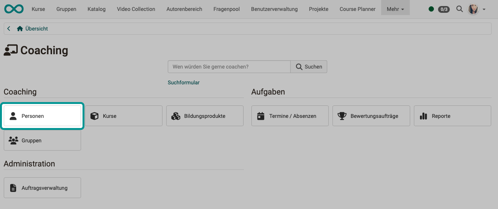
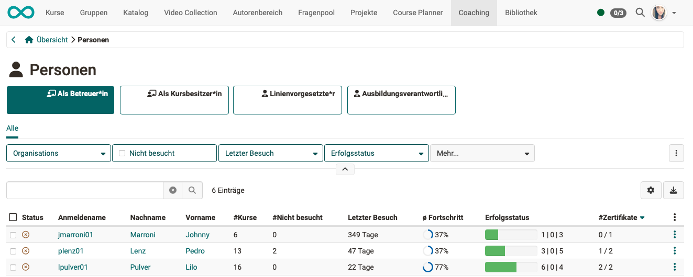
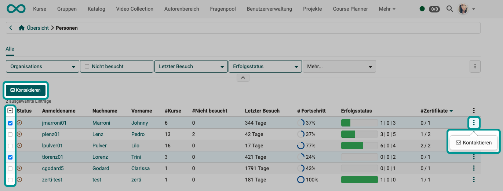

# Coaching - Personen {: #people}

{ class="shadow lightbox" }

## WEN zeigt die Liste? {: #people_who}

Der Menüpunkt "Personen" im Coaching Tool zeigt die Liste **aller von Ihnen betreuten** Teilnehmenden.

  * Es werden die Teilnehmenden aus **allen** betreuten Kursen angezeigt. (Im Unterschied zum [Bewertungswerkzeug](../learningresources/Assessment_tool_overview.de.md) des Kurses. Dort werden nur Teilnehmende des aktuellen Kurses angezeigt.)
  * Jeder Coach (Betreuer:in) sieht nur die von ihr/ihm betreuten Teilnehmenden.
  * Die betreuten Teilnehmenden sind **gruppiert und den Rollen zugeordnet**, die Sie als Betreuende:r gegenüber dieser Person haben.  
  Im nachstehend gezeigten Beispiel kann die betreuende Person vorsortierte Listen abrufen, die ihren 4 Rollen entsprechen:
    * als Betreuer:in
    * als Kursbesitzer:in
    * als Lininenvorgesetzte:r
    * als Ausbildungsverantwortliche:r

{ class="shadow lightbox" }

[Zum Seitenanfang ^](#people)

---

## WAS zeigt die Liste?  {: #people_what}

Sie können die angezeigten Spalten selbst festlegen, indem Sie rechts oben über der Liste auf das Zahnrad-Icon klicken. Die verfügbaren Spalten können je nach gewählter Rolle variieren. 

* **Status**
* **Anmeldename**
* **Nachname, Vorname** Ein Klick auf den Anmeldenamen,Nachnamen oder Vornamen einer Person führt zur Übersicht aller Kurse dieses Teilnehmers. So erhält die/der Lehrende Zugriff auf die Assessmentbereiche eines Kurses der Person inklusive des Zugriffes auf den jeweiligen Leistungsnachweis, das Bewertungswerkzeug des Kurses sowie die jeweiligen Lektionen.
* **E-Mail**
* **Geschlecht**
* **Geburtsdatum**
* **Organisation** 
  Nur bei aktiviertem Modul Organisationseinheiten: Zu welcher Organisationseinheit gehört die Person? 
  (Diese Information ist besonders für Ausbildungsverantwortliche interessant.)
* **Kurse** 
    In wie vielen der von Ihnen betreuten Kurse ist ein/e Benutzer:in Mitglied?
* **Nicht besucht** 
    In wie vielen der von Ihnen betreuten Kurse ist ein/e Benutzer:in Mitglied, hat den Kurs aber noch nie besucht?
* **Letzter Besuch** 
  Vor wieviel Tage war der letzte Besuch in einem der von Ihnen betreuten Kurse?
* **durchschnittlicher Fortschritt** 
    Durchschnitt über alle Kurse von Ihnen betreuten Kurse
* **Erfolgsstatus** 
    * "Bestanden"/"Nicht bestanden"/"keine Angabe" in grafischer Darstellung
    * "Bestanden"/"Nicht bestanden"/"keine Angabe" in Zahlen
* **Zertifikate** 
  Anzahl der erhaltenen Zertifikate / Anzahl der möglichen Zertifikate
* **Weitere Aktionen** (Icon mit 3 Punkten) 
    * Kontaktieren (per E-Mail)

[Zum Seitenanfang ^](#people)

---

## Kontaktieren betreuter Personen {: #contact}

Um **einer bestimmten Person** eine Mail zu schreiben, klicken Sie einfach auf die 3 Punkte am Ende der betreffenden Zeile.

Um eine Mail an **mehrere Personen** zu schreiben, markieren Sie die betreffenden Personen in der ersten Spalte. Anschliessend erscheint über der Liste ein Button "Kontaktieren".

{ class="shadow lightbox" }

[Zum Seitenanfang ^](#people)

---

## Weiterführende Informationen {: #further_information}

[Coaching: Personensuche >](../../manual_user/area_modules/Coaching_User_Search.de.md) 
[Coaching: Kurse >](../../manual_user/area_modules/Coaching_Courses.de.md) 
[Coaching: Gruppen >](../../manual_user/area_modules/Coaching_Groups.de.md) 
[Coaching: Termine / Absenzen >](../../manual_user/area_modules/Coaching_Events_Absences.de.md) 
[Coaching: Bewertungsaufträge >](../../manual_user/area_modules/Coaching_assessment_orders.de.md) 
[Coaching: Reports >](../../manual_user/area_modules/Coaching_Reports.de.md) 
[Coaching: Auftragsverwaltung >](../../manual_user/area_modules/Coaching_Order_Management.de.md) 
[Rollen >](../../manual_user/basic_concepts/Roles.de.md) 
[Bewertungswerkzeug >](../../manual_user/learningresources/Assessment_tool_overview.de.md) 

[Zum Seitenanfang ^](#people)
