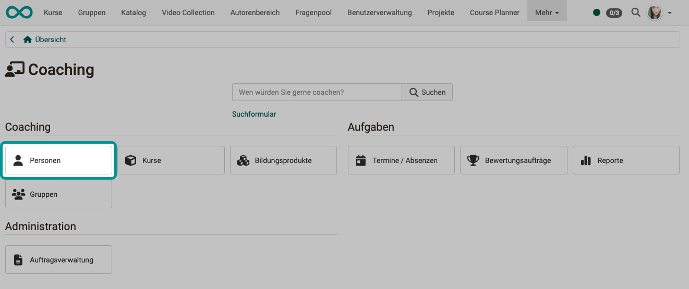
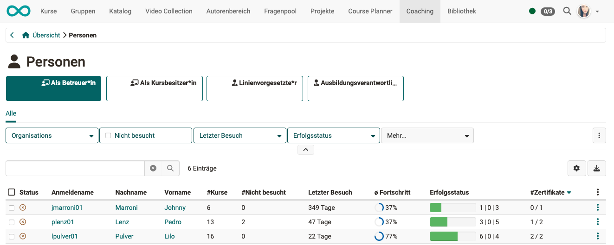
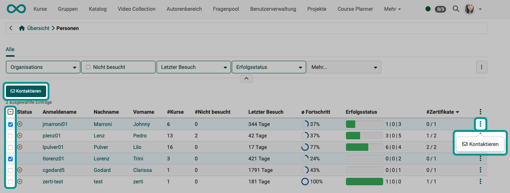
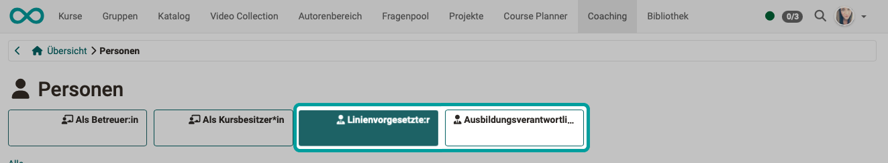
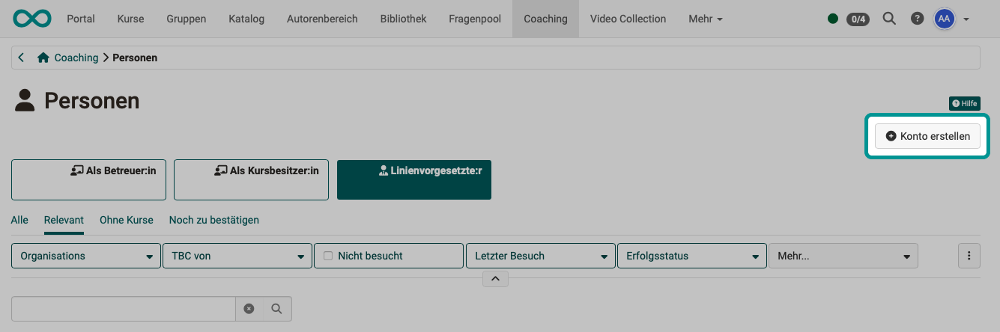
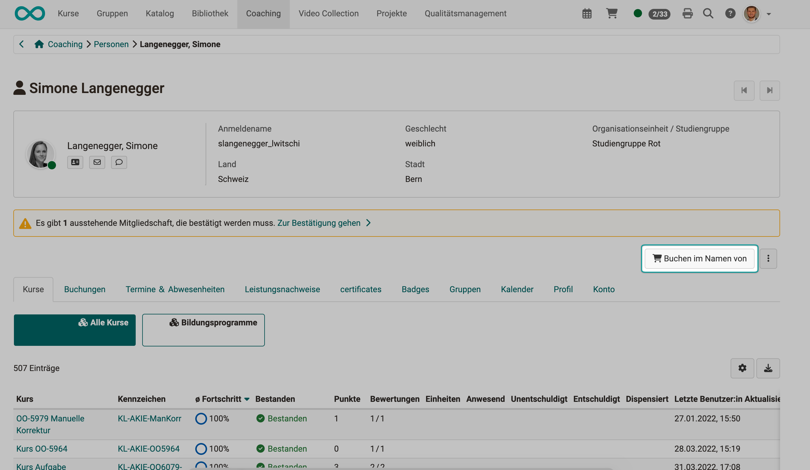
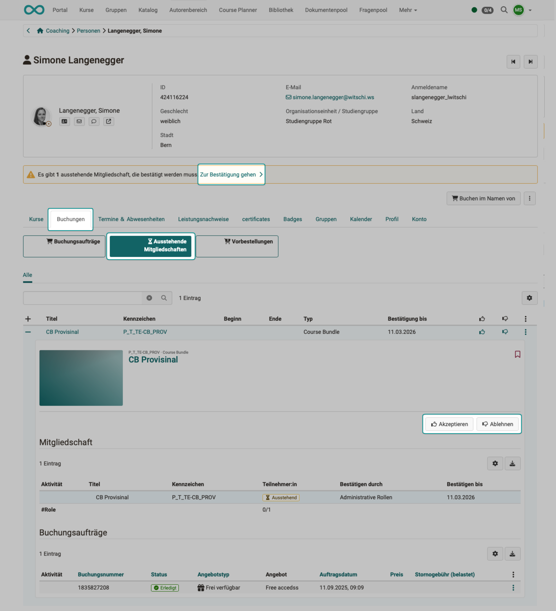
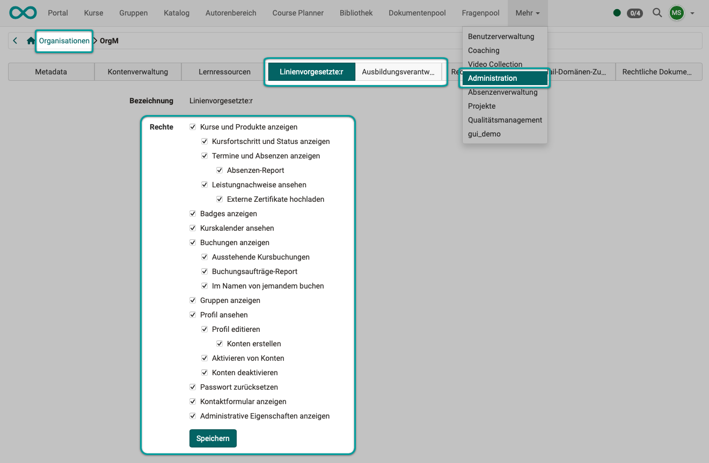

# Coaching - Personen {: #people}

{ class="shadow lightbox" }

{ class="shadow lightbox" }

## WEN zeigt die Liste? [:octicons-tag-16:{ title="ab Release 20.0.0 (OO-8374)" }](https://track.frentix.com/issue/OO-8374){:target="_blank"} {: #people_who}

Der Menüpunkt "Personen" im Coaching Tool zeigt die Liste **aller von Ihnen betreuten** Teilnehmenden.

  * Es werden die Teilnehmenden aus **allen** betreuten Kursen angezeigt. (Im Unterschied zum [Bewertungswerkzeug](../learningresources/Assessment_tool_overview.de.md) des Kurses. Dort werden nur Teilnehmende des aktuellen Kurses angezeigt.)
  * Jeder Coach (Betreuer:in) sieht nur die von ihr/ihm betreuten Teilnehmenden.
  * Die betreuten Teilnehmenden sind **gruppiert und den Rollen zugeordnet**, die Sie als Betreuende:r gegenüber dieser Person haben. 
  Im oben gezeigten Beispiel kann die betreuende Person vorsortierte Listen abrufen, die ihren Rollen entsprechen:
    * als Betreuer:in
    * als Kursbesitzer:in
    * als Linienvorgesetzte:r
    * als Ausbildungsverantwortliche:r

!!! info "Hinweis zu den Rollen Linienvorgesetzte:r und Ausbildungsverantwortliche:r"

    Diese Rollen werden im Coaching Tool nur angezeigt, wenn Administrator:innen in der System-Administration das [Modul Organisationen](../../manual_admin/administration/Modules_Organisations.de.md) aktiviert haben.

!!! info "Hinweis zu weiteren Personenbeziehungen"

    Haben Sie zusätzlich [eigene Rollen und Beziehungen](../../manual_user/basic_concepts/Assign_Roles.de.md#role_assignment_relations) definiert, erscheinen auch diese hier als eigene, vorgruppierte Liste.

[Zum Seitenanfang ^](#people)

---

## WAS zeigt die Liste? [:octicons-tag-16:{ title="ab Release 20.0.3 (OO-8591)" }](https://track.frentix.com/issue/OO-8591){:target="_blank"} {: #people_what}

Sie können die angezeigten Spalten selbst festlegen, indem Sie rechts oben über der Liste auf das Zahnrad-Icon klicken. Die verfügbaren Spalten können je nach gewählter Rolle variieren.

* **Status**
* **Anmeldename**
* **Nachname, Vorname** Ein Klick auf den Anmeldenamen, Nachnamen oder Vornamen einer Person führt zur Übersicht aller Kurse dieser Teilnehmer:in. So erhält die/der Lehrende Zugriff auf die Assessmentbereiche eines Kurses der Person inklusive des Zugriffes auf den jeweiligen Leistungsnachweis, das Bewertungswerkzeug des Kurses sowie die jeweiligen Lektionen.
* **E-Mail**
* **Geschlecht**
* **Geburtsdatum**
* **Organisation**  Nur bei aktiviertem Modul Organisationen: Zu welcher Organisationseinheit gehört die Person? _(Diese Information ist besonders für Ausbildungsverantwortliche interessant.)_
* **Kurse**  In wie vielen der von Ihnen betreuten Kurse ist ein:e Benutzer:in Mitglied?
* **Nicht besucht**  In wie vielen der von Ihnen betreuten Kurse ist ein:e Benutzer:in Mitglied, hat den Kurs aber noch nie besucht?
* **Letzter Besuch**  Vor wie vielen Tagen war der letzte Besuch in einem der von Ihnen betreuten Kurse?
* **durchschnittlicher Fortschritt**  Durchschnitt über alle von Ihnen betreuten Kurse
* **Erfolgsstatus**
    * "Bestanden"/"Nicht bestanden"/"keine Angabe" in grafischer Darstellung
    * "Bestanden"/"Nicht bestanden"/"keine Angabe" in Zahlen

!!! info "Wichtig"

    Fährt man mit der Maus über den grafischen Balken, zeigt ein Tooltip die genauen Zahlen: "Bestanden: X / Nicht bestanden: Y / Keine Angabe: Z" [:octicons-tag-16:{ title="ab Release 20.3.0 (OO-9229)" }](https://track.frentix.com/issue/OO-9229){:target="_blank"}.

* **Zertifikate**  Anzahl der erhaltenen Zertifikate / Anzahl der möglichen Zertifikate
* **Weitere Aktionen** _(Icon mit 3 Punkten)_ 
    * Kontaktieren (per E-Mail)

[Zum Seitenanfang ^](#people)

---

## Kontaktieren betreuter Personen [:octicons-tag-16:{ title="ab Release 20.0.3 (OO-8591)" }](https://track.frentix.com/issue/OO-8591){:target="_blank"} {: #contact}

Um **einer bestimmten Person** eine Mail zu schreiben, klicken Sie einfach auf die 3 Punkte am Ende der betreffenden Zeile.

Um eine Mail an **mehrere Personen** zu schreiben, markieren Sie die betreffenden Personen in der ersten Spalte. Anschliessend erscheint über der Liste ein Button "Kontaktieren".

{ class="shadow lightbox" }

[Zum Seitenanfang ^](#people)

---

## Coaching-Aufgaben als Linienvorgesetzte / Ausbildungsverantwortliche [:octicons-tag-16:{ title="ab Release 20.0.0 (OO-7839)" }](https://track.frentix.com/issue/OO-7839){:target="_blank"} {: #linemanager_educationmanager}

Linienvorgesetzte und Ausbildungsverantwortliche finden im Coaching Tool unter Personen einen zusätzlichen Button, unter dem sie alle Personen finden, für die sie in ihrer Rolle zuständig sind.

{ class="shadow lightbox" }

### Erweiterte Personensicht [:octicons-tag-16:{ title="ab Release 20.3.0 (OO-9168)" }](https://track.frentix.com/issue/OO-9168){:target="_blank"} {: #linemanager_educationmanager_extended_view}

In der Personenliste unter dem Fokus "Linienvorgesetzte:r" bzw. "Ausbildungsverantwortliche:r" werden alle Benutzer:innen der Organisation angezeigt, unabhängig von deren Rolle.

Hat eine Person zusätzliche Rollen (mehr als die Rolle Autor:in), erscheint in der Detailansicht ein Hinweis mit Icon: **"Aufgrund zusätzlicher organisatorischer Rollen ist die Verwaltung für diese Person eingeschränkt."** In diesem Fall gilt:

* Die Tabs **Profil** und **Konto** sind nur lesend zugänglich.
* Die Aktion **Passwort zurücksetzen** steht nicht zur Verfügung.

[Zum Seitenanfang ^](#people)

---

### Voraussetzungen {: #linemanager_educationmanager_conditions}

Damit ein zusätzlicher Button "Linienvorgesetzte:r" und/oder "Ausbildungsverantwortliche:r" angezeigt wird, müssen folgende Voraussetzungen erfüllt sein.

**Voraussetzung 1:**
Das Modul "Organisationen" muss in der System-Administration aktiviert sein.  `Administration > Module > Organisationen`

**Voraussetzung 2:**
Die betreffende Person muss die Rolle zugewiesen bekommen haben.  `Benutzerverwaltung > Person auswählen > Tab Rollen`

**Voraussetzung 3:**
In der System-Administration müssen z.B. die Option "Ausstehende Kursbuchungen" oder weitere Rechte **aktiviert sein**: 
`Administration > Module > Organisationen > Tab Organisationsstruktur > "Organisationseinheit (oberste Ebene)" > Tab Linienvorgesetzte:r bzw. Ausbildungsverantwortliche:r > Option "Ausstehende Kursbuchungen"`

---

### Konto für Mitarbeiter:innen anlegen [:octicons-tag-16:{ title="ab Release 20.0.1 (OO-8491)" }](https://track.frentix.com/issue/OO-8491){:target="_blank"} {: #linemanager_educationmanager_create_account}

Im Coaching Tool finden Sie als Linienvorgesetzte:r bzw. Ausbildungsverantwortliche:r rechts oben den **Button "Konto erstellen"**. Sie öffnen damit ein Formular zum Erfassen der notwendigen Angaben, um noch nicht registrierte Personen in OpenOlat aufzunehmen.

Ob dieser Button zur Verfügung steht, wird in der System-Administration festgelegt: 
`Administration > Module > Organisationen > Tab Organisationsstruktur > "Organisationseinheit (oberste Ebene)" > Tab Linienvorgesetzte:r bzw. Ausbildungsverantwortliche:r > Option "Konten erstellen"`

Ein durch Linienvorgesetzte oder Ausbildungsverantwortliche angelegtes Konto enthält automatisch eine Zuordnung der neu registrierten Person zur Organisationseinheit der Linienvorgesetzten bzw. Ausbildungsverantwortlichen.

{ class="shadow lightbox" }

---

### Teilnehmer:innen im Auftrag einbuchen {: #linemanager_educationmanager_book_participants}

Möchten Sie als Linienvorgesetzte:r bzw. Ausbildungsverantwortliche:r eine bereits in OpenOlat registrierte Person in einen Kurs oder eine Durchführung einbuchen, wählen Sie die Person im Coaching Tool und klicken auf den **Button "Buchen im Namen von"**. Dort können Sie dann den Kurs auswählen, in dem die Person teilnehmen soll.

{ class="shadow lightbox" }

**Beispiel 1:** 
Eine neue Mitarbeiterin soll im nächsten Monat einige Einführungskurse absolvieren.

**Beispiel 2:** 
Ihre Mitarbeiter:innen sind verpflichtet, Sicherheitskurse oder Compliancekurse zu machen. Weil sie als Linienvorgesetzte:r oder Ausbildungsverantwortliche:r verantwortlich sind, buchen Sie alle Personen selbst ein.

---

### Ausstehende Mitgliedschaften genehmigen {: #linemanager_educationmanager_confirm_membership}

Oft entscheiden Linienvorgesetzte und Ausbildungsverantwortliche, ob Lernende an einer Bildungsmassnahme teilnehmen können. In OpenOlat kann ihnen die Möglichkeit eingerichtet werden, ausstehende Mitgliedschaften zu akzeptieren oder abzulehnen.

Wählen Sie dazu im Coaching Tool die betreffende Person und öffnen Sie die **Detailansicht** durch Klick auf das Plus-Symbol am Anfang der Zeile.

Rechts oben innerhalb der Detailansicht finden Sie die beiden **Buttons "Akzeptieren" und "Ablehnen"** mit denen Sie über eine Mitgliedschaft entscheiden.

Alternativ und einfacher können Sie auch den **Link innerhalb der Benachrichtigung** benutzen.

{ class="shadow lightbox" }

!!! note "Wie kommt es zu ausstehenden Mitgliedschaften?"

    Mitgliedschaften, die erst noch durch Linienvorgesetzte oder Ausbildungsverantwortliche genehmigt werden müssen, werden im Course Planner für Durchführungen eingerichtet.
    Mehr dazu [hier >](../../manual_user/area_modules/Course_Planner_Implementations.de.md#confirm_membership)

---

### Kontrollaufgaben {: #linemanager_educationmanager_observe}

Sind Sie Linienvorgesetzte:r oder Ausbildungsverantwortliche:r können Sie sich über die Lernfortschritte innerhalb Ihrer Organisationseinheit jederzeit im Coaching Tool informieren. Auch eine automatische Benachrichtigung über alle erhaltenen Zertifikate ist möglich.

Grundsätzlich werden Ihnen als Linienvorgesetzte:r oder Ausbildungsverantwortliche:r Leserechte gewährt, die Bearbeitung ist jedoch eingeschränkt und bleibt den Betreuenden und Kursbesitzer:innen vorbehalten.

**Beispiele:** 

* Sie sehen, wer welche Kurse besucht, können aber nicht auf Checklisten, Aufgaben usw. innerhalb der Kurse zugreifen, um die Eintragungen der Teilnehmenden zu sehen.
* Sie können sich erhaltene Badges und andere Leistungsdaten anzeigen lassen, aber selbst keine Badges vergeben.
* Sie können sich Absenzen anzeigen lassen, aber nicht selbst erfassen. Dies müssen die Kursbesitzer:innen/Betreuer:innen. Das Erstellen von Absenzenreports ist dagegen möglich.

Möchten Sie als Linienvorgesetzte:r oder Ausbildungsverantwortliche:r bestimmte Rechte, können Sie diese von Administrator:innen einrichten lassen. Der nachstehende Screenshot zeigt, welche Optionen von Administrator:innen konfiguriert werden können. (Für Ausbildungsverantwortliche bestehen die gleichen Optionen.)

{ class="shadow lightbox" }

[Zum Seitenanfang ^](#people)

---

## Weiterführende Informationen {: #further_information}

**Auf dieser Seite erwähnt** 
[Bewertungswerkzeug >](../../manual_user/learningresources/Assessment_tool_overview.de.md) 
[Modul Organisationen >](../../manual_admin/administration/Modules_Organisations.de.md) 
[Eigene Rollen und Beziehungen definieren >](../../manual_user/basic_concepts/Assign_Roles.de.md) 
[Course Planner: Durchführungen >](../../manual_user/area_modules/Course_Planner_Implementations.de.md)

**Weiterführend** 
[Coaching: Personensuche >](../../manual_user/area_modules/Coaching_User_Search.de.md) 
[Coaching: Kurse >](../../manual_user/area_modules/Coaching_Courses.de.md) 
[Coaching: Bildungsprodukte >](../area_modules/Coaching_Educational_Products.de.md) 
[Coaching: Termine / Absenzen >](../area_modules/Coaching_Events_Absences.de.md) 
[Coaching: Bewertungsaufträge >](../area_modules/Coaching_Assessment_Orders.de.md) 
[Coaching: Reports >](../../manual_user/area_modules/Coaching_Reports.de.md) 
[Coaching: Gruppen >](../../manual_user/area_modules/Coaching_Groups.de.md) 
[Coaching: Auftragsverwaltung >](../../manual_user/area_modules/Coaching_Order_Management.de.md) 
[Rollen >](../../manual_user/basic_concepts/Roles.de.md)

[Zum Seitenanfang ^](#people)
