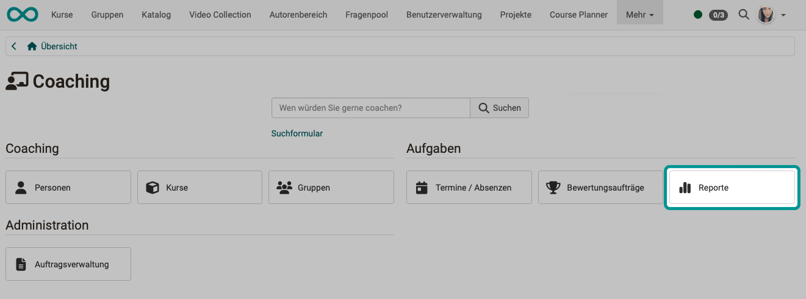
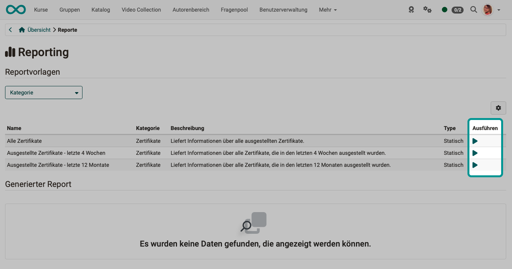
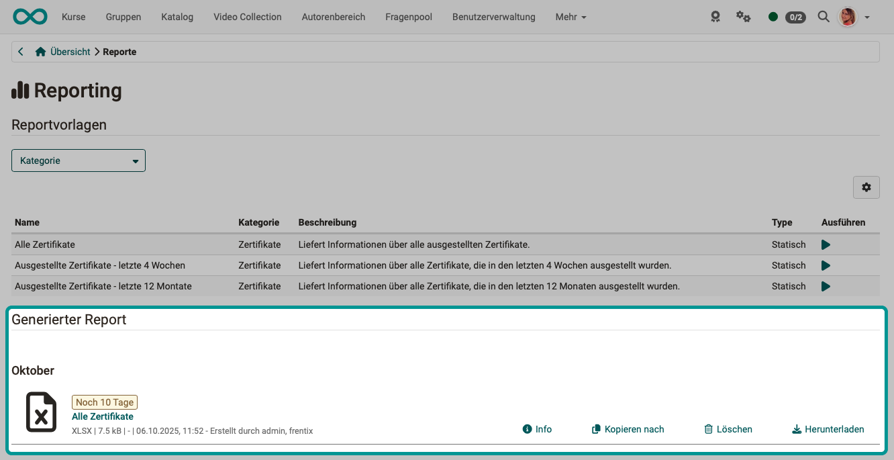

# Coaching - Reporte {: #reports}

Im Bereich **Reporting** des Coaching Tools erstellen Sie Excel-Reports über die von Ihnen betreuten Personen, zum Beispiel über ausgestellte Zertifikate. Die Reportvorlagen sind in Kategorien gegliedert (z. B. Zertifikate, Absenzen, Buchungsaufträge). Angezeigt werden nur die Vorlagen, für deren Ausführung Sie berechtigt sind.

## Wer kann Zertifikats-Reports ausführen? [:octicons-tag-16:{ title="ab Release 20.0 (OO-8371)" }](https://track.frentix.com/issue/OO-8371) {: #access}

Die Reportvorlagen der Kategorie "Zertifikate" stehen folgenden Rollen zur Verfügung:

* Betreuer:innen von Kursen
* Betreuer:innen von Bildungsprodukten, inkl. Klassenlehrer:innen
* Linienvorgesetzten
* Ausbildungsverantwortlichen

Der Report enthält jeweils die Zertifikatsdaten der Personen, für die Sie in dieser Rolle zuständig sind.

!!! note "Sie sehen den Button Reporte nicht?"
    Der Button **Reporte** wird nur angezeigt, wenn Sie eine der genannten Rollen innehaben und das Coaching Tool aktiviert ist. Wie Rollen vergeben werden, zeigt die Seite [Rollen zuweisen](../basic_concepts/Assign_Roles.de.md).

[Zum Seitenanfang ^](#reports)

---

## So erstellen Sie einen Excel-Report [:octicons-tag-16:{ title="ab Release 20.0 (OO-8368)" }](https://track.frentix.com/issue/OO-8368) {: #create_report}

1. Klicken Sie im Hauptmenü auf `Coaching` und wählen Sie den Button `Reporte`.
2. Klicken Sie im Abschnitt **Reportvorlagen** bei der gewünschten Vorlage auf das Symbol in der Spalte "Ausführen" (**Report generieren**).
3. Der Report wird als Excel-Datei (.xlsx) erzeugt und erscheint im Abschnitt **Generierter Report**.
4. Klicken Sie beim erzeugten Report auf **Herunterladen**.

{ class="shadow lightbox" }

[Zum Seitenanfang ^](#reports)

---

## Reportvorlagen [:octicons-tag-16:{ title="ab Release 20.0 (OO-8368)" }](https://track.frentix.com/issue/OO-8368) {: #templates}

Die Tabelle **Reportvorlagen** zeigt für jede Vorlage Name, Kategorie, Beschreibung und Typ ("Statisch" oder "Dynamisch") sowie die Spalte "Ausführen". Über den Filter "Kategorie" grenzen Sie die Liste ein.

{ class="shadow lightbox" }

### Vorlagen der Kategorie Zertifikate {: #certificate_templates}

| Name | Beschreibung |
|------|--------------|
| Alle Zertifikate | Liefert Informationen über alle ausgestellten Zertifikate. |
| Ausgestellte Zertifikate - letzte 4 Wochen | Liefert Informationen über alle Zertifikate, die in den letzten 4 Wochen ausgestellt wurden. |
| Ausgestellte Zertifikate - letzte 12 Monate | Liefert Informationen über alle Zertifikate, die in den letzten 12 Monaten ausgestellt wurden. |

Die erzeugte Excel-Datei enthält das Worksheet "Einzelkurse" und, falls das Modul Course Planner aktiv ist, zusätzlich das Worksheet "Produkte". Den Aufbau der Worksheets zeigt die Seite [Reports: Zertifikate](../area_modules/Reports_Certficates.de.md).

[Zum Seitenanfang ^](#reports)

---

## Generierter Report [:octicons-tag-16:{ title="ab Release 20.0 (OO-8368)" }](https://track.frentix.com/issue/OO-8368) {: #generated_reports}

Die erstellten Excel-Dateien werden im Abschnitt **Generierter Report** aufgelistet. Jede Datei steht nach der Erstellung 10 Tage zum Download bereit; die verbleibende Zeit wird angezeigt. Über die nebenstehenden Aktionen können Sie die Datei herunterladen, kopieren, löschen oder Detailinformationen anzeigen.

{ class="shadow lightbox" }

[Zum Seitenanfang ^](#reports)

---

## Weiterführende Informationen {: #further_information}

[Reports: Zertifikate >](../area_modules/Reports_Certficates.de.md) 
[Rollen zuweisen >](../basic_concepts/Assign_Roles.de.md) 
[Coaching: Personensuche >](../../manual_user/area_modules/Coaching_User_Search.de.md) 
[Coaching: Personen >](../../manual_user/area_modules/Coaching_People.de.md) 
[Coaching: Kurse >](../../manual_user/area_modules/Coaching_Courses.de.md) 
[Coaching: Bildungsprodukte >](../../manual_user/area_modules/Coaching_Educational_Products.de.md) 
[Coaching: Termine / Absenzen >](../../manual_user/area_modules/Coaching_Events_Absences.de.md) 
[Coaching: Bewertungsaufträge >](../area_modules/Coaching_Assessment_Orders.de.md) 
[Coaching: Gruppen >](../../manual_user/area_modules/Coaching_Groups.de.md) 
[Coaching: Auftragsverwaltung >](../../manual_user/area_modules/Coaching_Order_Management.de.md) 
[Bewertungswerkzeug >](../../manual_user/learningresources/Assessment_tool_overview.de.md) 

[Zum Seitenanfang ^](#reports)
