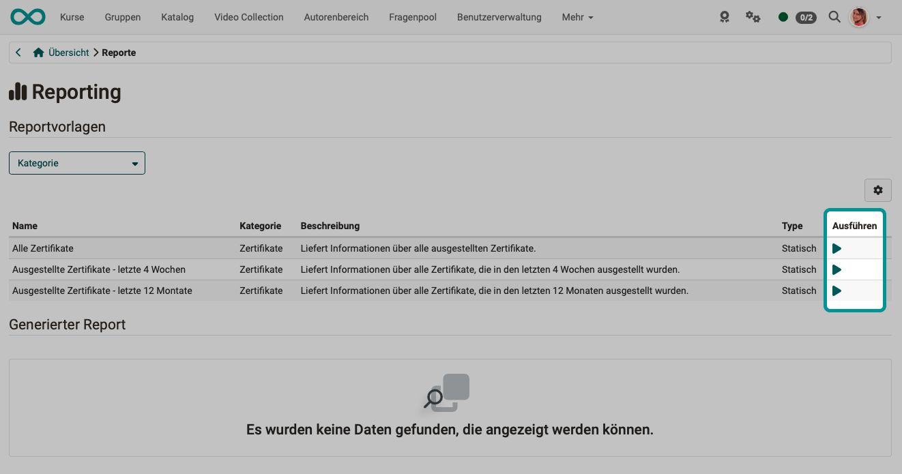
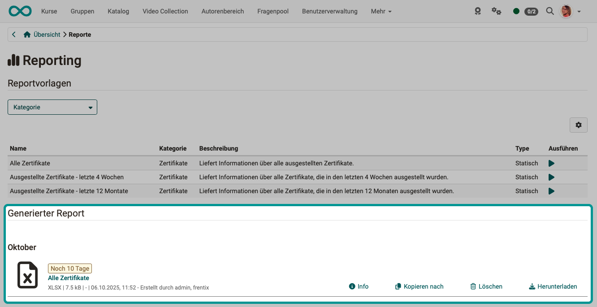

# Coaching - Reports {: #reports}

{ class="shadow lightbox" }

Various templates are available for creating reports, which you can use to obtain an overview of the certificates issued.

Clicking on the arrows in the "Execute" column generates Excel files with the current data based on these templates.

 { class="shadow lightbox" }

The Excel files created in this way are listed at the bottom of the screen. They can be copied and downloaded.

 { class="shadow lightbox" }

[To the top of the page ^](#assessment_reports)

---

 ## Further information {: #further_information}

[Coaching: User search >](../../manual_user/area_modules/Coaching_User_Search.md) 
[Coaching: People >](../../manual_user/area_modules/Coaching_People.md) 
[Coaching: Courses >](../../manual_user/area_modules/Coaching_Courses.md) 
[Coaching: Educational products >](../../manual_user/area_modules/Coaching_Educational_Products.md) 
[Coaching: Events / Absences >](../../manual_user/area_modules/Coaching_Events_Absences.md) 
[Coaching: Assessment orders >](../area_modules/Coaching_assessment_orders.md) 
[Coaching: Groups >](../../manual_user/area_modules/Coaching_Groups.md) 
[Roles >](../../manual_user/basic_concepts/Roles.md) 
[Assessment tool >](../../manual_user/learningresources/Assessment_tool_overview.md) 

[To the top of the page ^](#order_management)

