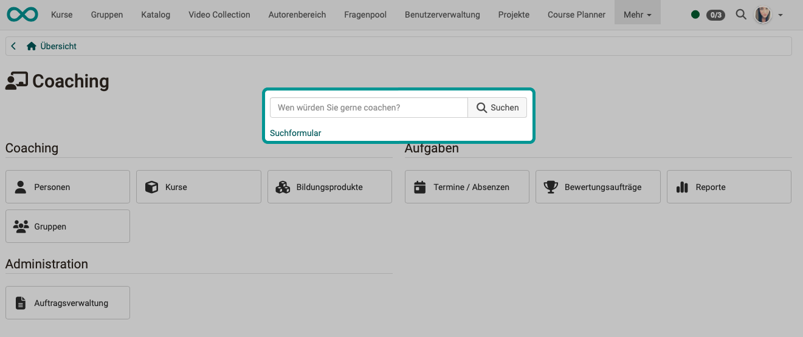
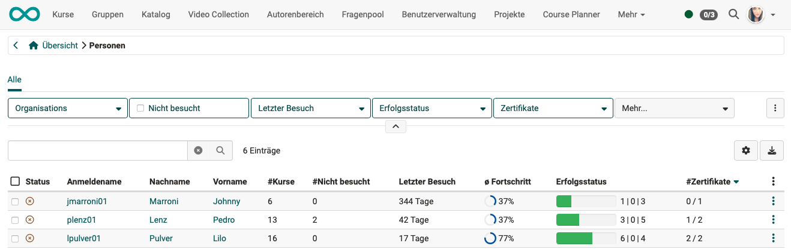
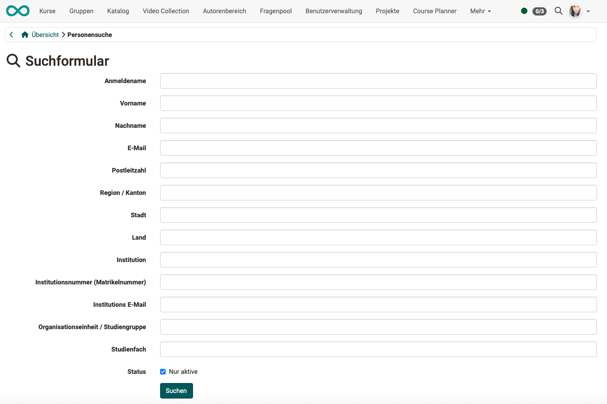

# Coaching - Personensuche {: #user_search}

{ class="shadow lightbox" }

!!! tip "Tipp"

    Wenn Sie das Lupensymbol ohne Eingabe eines Namens klicken, erhalten Sie die Gesamtliste der von Ihnen betreuten Personen. Sie finden hier viele Filtermöglichkeiten.

{ class="shadow lightbox" }

 
Über das Suchformular suchen Sie nach vielen Einzelmerkmalen.

{ class="shadow lightbox" }
