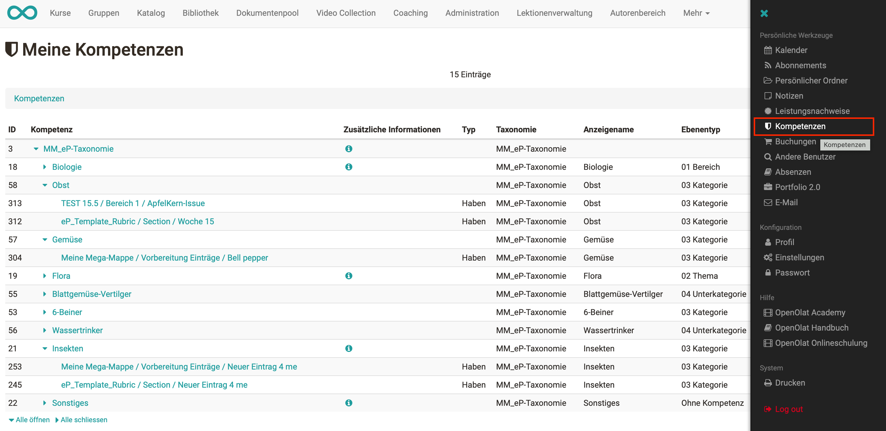

# Kompetenzen verschlagworten {: #competences_tags}

Mithilfe von Taxonomien können Kompetenzstrukturen aufgebaut werden, die zur Verschlagwortung von ePortfolio-Einträgen genutzt werden können. Lernende können selbstständig verschiedene Kompetenzen aus diesen vorgegebenen Taxonomiestrukturen ihren Portfolioeinträgen zuordnen und dadurch ihre erreichten Kompetenzen während der Ausbildung aufzeigen.

!!! info "Wichtig"

    Damit die Taxonomie(n) im ePortfolio verfügbar sind, müssen diese von der OpenOlat [Administrator:in aktiviert](../../manual_admin/administration/eAssessment_ePortfolio.de.md) werden.

In einem Portfolioeintrag stehen den Lernenden die aktivierten Taxonomien als Kompetenzen zur Verfügung und können über eine Vorschlagsliste ausgewählt werden.

{ class="shadow lightbox" }

Eine Übersicht über alle vergebenen Kompetenzen erhalten Lernende im persönlichen Menü unter `Persönliche Werkzeuge > Kompetenzen`.

{ class="shadow lightbox" }

## Weiterführende Informationen {: #further_information}

[e-Assessment Administration: ePortfolio >](../../manual_admin/administration/eAssessment_ePortfolio.de.md)

[Zum Seitenanfang ^](#competences_tags)
