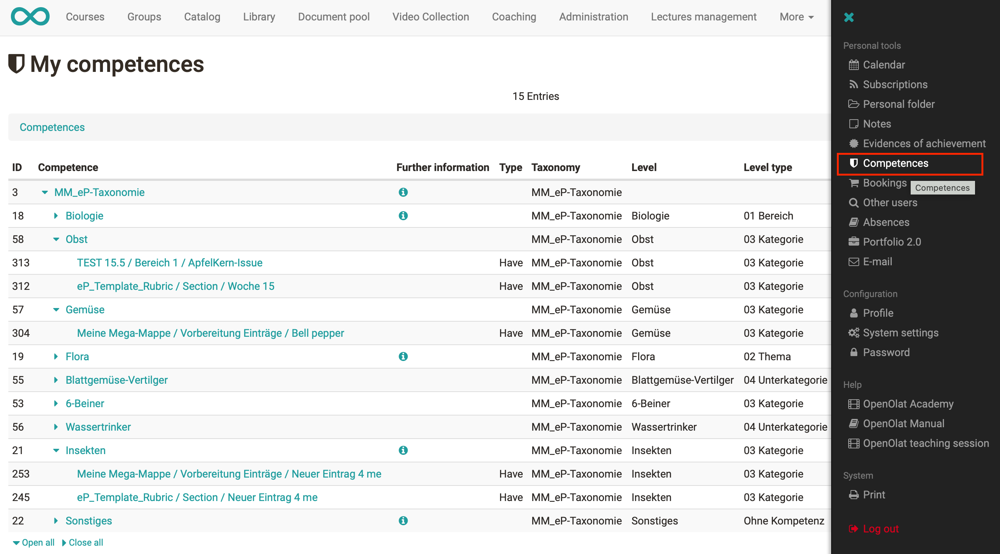

# Competences tags

With the help of taxonomies, competence structures can be built up which can be used to keyword ePortfolio entries. Learners can independently assign different competences from these predefined taxonomy structures to their portfolio pages and thus demonstrate the competences they have achieved during their training.

!!! info "Info"

    In order for the taxonomy(s) to be available in the ePortfolio, they must be activated for this purpose.

  

In a portfolio entry, the activated taxonomies are available to learners as competences and can be selected via a suggestion list.

  

Learners can get an overview of all assigned competences via "Personal tools" → "Competences".

  

  

  

