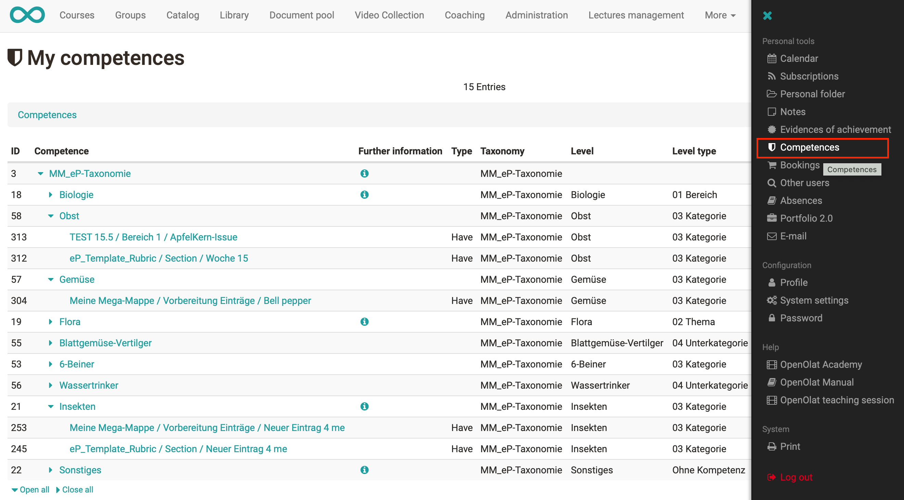

# Competences tags {: #competences_tags}

With the help of taxonomies, competence structures can be built up which can be used to tag ePortfolio entries. Learners can independently assign different competences from these predefined taxonomy structures to their portfolio entries and thus demonstrate the competences they have achieved during their training.

!!! info "Important"

    In order for the taxonomies to be available in the ePortfolio, they must be [activated by the OpenOlat administrator](../../manual_admin/administration/eAssessment_ePortfolio.md).

In a portfolio entry, the activated taxonomies are available to learners as competences and can be selected via a suggestion list.

{ class="shadow lightbox" }

Learners get an overview of all assigned competences in the personal menu under `Personal tools > Competences`.

{ class="shadow lightbox" }

## Further information {: #further_information}

[e-Assessment Administration: ePortfolio >](../../manual_admin/administration/eAssessment_ePortfolio.md)

[To the top of the page ^](#competences_tags)
