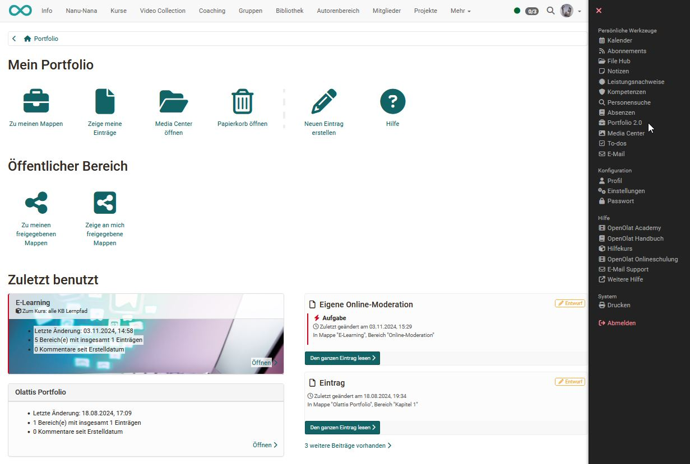

# Bestandteile des Portfolios

Jede OpenOlat Benutzer:in hat über das persönliche Menü rechts oben Zugriff auf den eigenen Portfoliobereich: `Persönliche Werkzeuge > Portfolio 2.0`. In der folgenden Grafik sehen Sie die Übersichtsseite des Portfolio 2.0.

{ class="shadow lightbox" }

Die Links der Übersichtsseite führen zu weiteren Portfoliobereichen.

Link | Nutzen
---|---
[Zu meinen Mappen](My_portfolio_binders.de.md) | Hier werden alle persönlichen Mappen angezeigt und Benutzer:innen können neue Mappen erstellen.
[Zeige meine Einträge](My_entries.de.md) | Hier werden alle persönlich erstellten Einträge angezeigt und es können neue Einträge erstellt werden.
[Media Center öffnen](../personal_menu/Media_Center.de.md) | Hier finden Sie Ihre Artefakte und können neue Artefakte anlegen bzw. importieren. Ein Artefakt kann z.B. ein Dokument, eine Mediendatei oder ein Text sein. Weitere generelle Informationen zum Media Center finden Sie auch [hier](../basic_concepts/Media_Center_Concept.de.md).
[Zu meinen freigegebenen Mappen](Shared_by_me.de.md) | Hier werden die eigenen Mappen angezeigt, die für weitere Personen freigegeben wurden.
[Zeige an mich freigegebene Mappen](Shared_with_me.de.md) | Hier werden alle Mappen angezeigt, die von anderen Personen erstellt und für die jeweilige Benutzer:in freigegeben wurden. Zum Beispiel sehen hier Lehrende die von Studierenden für sie freigegebenen Mappen.

Darüber hinaus besteht Zugriff auf den Papierkorb des Portfolios, Zugang zur Hilfe, die Möglichkeit, direkt neue Einträge zu erstellen, sowie die Anzeige der zuletzt benutzten Portfolioelemente.
