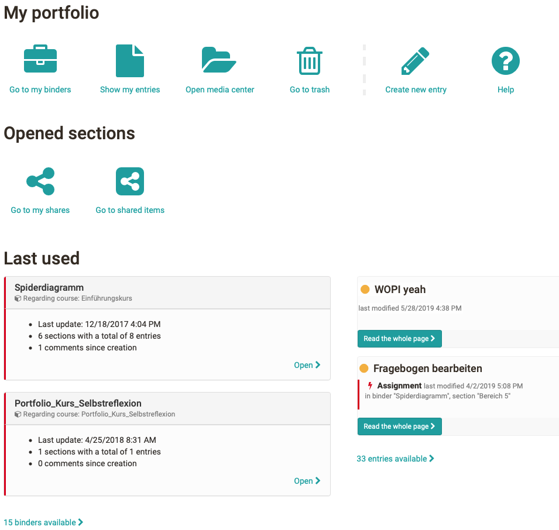

# Components of the portfolio

Every OpenOlat user has access to their own portfolio area via the personal menu at the top right: `Personal tools > Portfolio 2.0`. The following image shows the overview page of the Portfolio 2.0.

{ class="shadow lightbox" }

The links on the overview page lead to further portfolio areas.

Link | Use
---|---
[Go to my binders](My_portfolio_binders.md) | All personal binders are displayed here and users can create new binders.
[Show my entries](My_entries.md) | All personally created entries are displayed here and new entries can be created.
[Open media center](../personal_menu/Media_Center.md) | Here you can find your artifacts and create or import new artifacts. An artifact can be, for example, a document, a media file or a text. Further general information on the Media Center can also be found [here](../basic_concepts/Media_Center_Concept.md).
[Go to my shares](Shared_by_me.md) | The own binders that have been shared with other persons are shown here.
[Go to shared items](Shared_with_me.md) | All binders created by other persons and shared with the respective user are shown here. For example, teachers see the binders that students have shared with them.

In addition, there is access to the trash of the portfolio, access to the help, the possibility to create new entries directly and the display of the last used portfolio elements.
